## Solution

---

### Overview

We are given an `m x n` matrix `grid` and an array of queries, `queries`. For each query, we attempt to collect as many points as possible while following specific movement rules that dictate how far we can traverse the grid.

For each $\text{queries}[i]$, we begin at the top-left corner of the grid. We are allowed to move in four directions: up, down, left, and right. The primary condition governing movement is the comparison between $\text{queries}[i]$ and the value of the current cell:

1. If $\text{queries}[i]$ is strictly greater than the value of the current cell, then:
   - If this is the first time visiting the cell, we earn one point.
   - We can then move to any of the adjacent cells (if they exist).

2. If $\text{queries}[i]$ is less than or equal to the value of the current cell, then:
   - We cannot proceed further from this cell.
   - The process for this query terminates immediately.

The final result for $\text{queries}[i]$ is the number of unique cells we were able to collect points from.

> Note: Each query starts independently, meaning that the traversal for one query does not affect the traversal for another.

Another difficult but extremely practical way to phrase this problem is to imagine you're at a buffet, where you can only eat dishes that are under a certain calorie count. Each dish represents a number in the grid, and your queries are your calorie limits. You want to know how many dishes you can indulge in without exceeding your limit. The algorithm helps you quickly determine how many dishes fit your criteria, allowing you to make the most of your buffet experience! Sometimes, the representation of data is more important than the data itself.

To solve this problem, we need a solid understanding of BFS, priority queues, and disjoint union. While we will explain the application of these concepts, we will not go in-depth into their theoretical aspects and their basic structure.

For a deeper understanding of the theory or to learn how the general conceptual implementation works, please check out the following explore cards:
- [BFS and Priority Queue](https://leetcode.com/explore/featured/card/graph/620/breadth-first-search-in-graph/)
- [Union Find](https://leetcode.com/explore/learn/card/graph/618/disjoint-set/)
- [Binary Search](https://leetcode.com/explore/learn/card/binary-search/)

---

### Approach 1: Brute Force (TLE)

#### Intuition

For each query value, we need to determine how many cells in the grid have a value strictly less than the query while ensuring we only move to adjacent cells. This naturally forms a graph traversal problem where each cell is treated as a node connected to its adjacent cells. Since we are interested in finding all reachable nodes that satisfy a condition, Breadth-First Search (BFS) is a suitable choice. BFS explores all nodes at the current level before moving to the next, ensuring we do not miss any reachable cells that meet the criteria.

For each query, we begin at the `(0,0)` cell and initialize a queue for BFS traversal. We also maintain a `visited` boolean matrix to ensure we do not revisit cells. The traversal continues as long as there are unprocessed cells in the queue. At each step, we check if the current cell’s value is greater than or equal to the query value. If it is, we cannot proceed further from this cell. Otherwise, we count the cell as visited, increment our result, and attempt to move to its four adjacent cells (up, down, left, and right). Any adjacent cell that has not been visited and has a value strictly less than the query is added to the queue.

Since each query is independent, we repeat this process for each of them. The final result for each query is the total number of unique cells that we were able to visit while following the movement constraints.

#### Algorithm

- Get the number of rows (`rowCount`) and columns (`colCount`) in `grid`.
- Initialize `result` array to store the number of points for each query.
- Define `DIRECTIONS` array to facilitate movement in four directions.

- Iterate over each query:
  - Extract `queryValue` from `queries`.
  - Initialize a BFS queue starting from `(0,0)`.
  - Create a `visited` matrix to track visited cells and mark `(0,0)` as visited.
  - Initialize `points` to count valid cells.

  - Perform BFS:
- Get the current queue size to process all elements at this level.
- Iterate over the queue:
      - Extract `currentRow` and `currentCol` from the front.
      - If $\text{grid}[currentRow][currentCol] \ge queryValue$, skip processing.
      - Otherwise, increment `points`.
      - Explore four possible directions:
- Compute `newRow` and `newCol` as the adjacent cell.
- If within bounds, not visited, and value is `< queryValue`, mark `(newRow, newCol)` as visited and add it to the queue.

  - Store `points` in `result` at the corresponding query index.

- Return `result`, containing the count of valid points for each query.

#### Implementation

```python
class Solution:
    def maxPoints(self, grid: List[List[int]], queries: List[int]) -> List[int]:
        row_count, col_count = len(grid), len(grid[0])
        result = [0] * len(queries)
        # Directions for moving in 4 directions (right, down, left, up)
        DIRECTIONS = [(0, 1), (1, 0), (0, -1), (-1, 0)]

        # Iterate through each query value
        for queryIndex, queryValue in enumerate(queries):
            bfs_queue = deque([(0, 0)])
            visited = [[0] * col_count for _ in range(row_count)]
            # Mark the starting cell as visited
            visited[0][0] = 1
            points = 0

            # BFS traversal
            while bfs_queue:
                queue_size = len(bfs_queue)
                for _ in range(queue_size):
                    current_row, current_col = bfs_queue.popleft()

                    # If the current cell's value is greater than or equal to
                    # queryValue, stop expanding from here
                    if grid[current_row][current_col] >= queryValue:
                        continue

                    # Count the valid cell
                    points += 1

                    # Explore all four possible directions
                    for row_offset, col_offset in DIRECTIONS:
                        new_row = current_row + row_offset
                        new_col = current_col + col_offset

                        # Ensure the new position is within bounds and has not
                        # been visited
                        if (
                            0 <= new_row < row_count
                            and 0 <= new_col < col_count
                            and not visited[new_row][new_col]
                            and grid[new_row][new_col] < queryValue
                        ):
                            bfs_queue.append((new_row, new_col))
                            # Mark the new cell as visited
                            visited[new_row][new_col] = 1
                # Store the result for the current query
                result[queryIndex] = points
        return result
```

#### Complexity Analysis

Let $n$ and $m$ be the number of rows and columns in the grid, respectively, and $k$ be the number of queries.

> $n \cdot m$ is basically the total number of cells in the grid.

- Time complexity: $O(k \cdot n \cdot m)$

    The outer loop runs $k$ times, once for each query. In each iteration, a BFS is performed on the grid. In the worst case, the BFS will visit every cell in the grid, which is $n \cdot m$ cells. Therefore, the time complexity for each query is $O(n \cdot m)$, and for all queries, it becomes $O(k \cdot n \cdot m)$.

    > Note: The exploration of 4 directions for each cell contributes a constant factor, which does not change the overall time complexity.

- Space complexity: $O(n \cdot m)$

    The space complexity is dominated by the `visited` matrix, which is of size $n \cdot m$. This matrix is used to keep track of visited cells during the BFS traversal.

    The BFS queue can also hold up to $n \cdot m$ cells in the worst case (e.g., when all cells are part of the BFS traversal). Therefore, the overall space complexity is $O(n \cdot m)$.

    The `DIRECTIONS` array and other variables use constant space and do not significantly impact the overall space complexity.

---

### Approach 2: Sorting Queries + Min-Heap Expansion

#### Intuition

In the brute force approach, we restart the search from the top-left corner for every query, treating each query as an independent problem. This results in a significant amount of redundant work because many queries share overlapping information. If a smaller query has already determined that certain cells are accessible, then a larger query should be able to reuse that information instead of starting from scratch. This suggests that instead of treating each query separately, we can process them in an order that allows us to build on previously discovered results, avoiding unnecessary recomputation.

A natural way to achieve this is to **sort the queries in increasing order** while keeping track of their original indices. By doing this, we ensure that when we process a query, all smaller queries have already been resolved. This allows us to maintain a growing region of accessible cells rather than restarting the search for each query.

To efficiently manage this expanding region, we use a **min-heap (priority queue)**. The heap allows us to always expand from the lowest-value cell first, ensuring that we process cells in the correct order. We begin by inserting the top-left cell $(\text{grid}[0][0], (0,0))$ into the heap.

As long as the smallest cell in the heap has a value less than the current query, we remove it from the heap, mark it as visited, and attempt to expand outward by pushing all its unvisited neighbors into the heap. Since the heap maintains the smallest-value cell at the top, this ensures that we always expand the lowest-value region before moving to higher values. If the smallest cell's value is greater than or equal to the current query's value, we store the current count of reachable cells in the answer array and continue expanding with the next query's value as the new threshold.

By the time we process a query, all the cells that could have been visited with smaller query values have already been handled. This allows us to directly store the number of reachable cells without restarting the traversal. Instead of performing redundant BFS searches for each query, we maintain a continuous expansion process, ensuring that each cell is processed only once.

#### Algorithm

- Get the number of rows (`rowCount`) and columns (`colCount`) in `grid`.
- Initialize `result` array to store the number of points for each query.
- Define `DIRECTIONS` array to facilitate movement in four directions.
- Create a `sortedQueries` array to store queries along with their original indices.
- Sort `sortedQueries` by query values in ascending order.

- Initialize a min-heap (`minHeap`) to expand cells in increasing order of `grid` values.
- Create a `visited` matrix to track processed cells and mark `(0,0)` as visited.
- Push ${\text{grid}[0][0], {0, 0}}$ into `minHeap` to start expansion.
- Initialize `totalPoints` to count valid cells.

- Iterate over sorted queries:
  - Extract `queryValue` and `queryIndex`.
  - Expand cells while `minHeap` contains values `< queryValue`:
- Pop the smallest `cellValue` and its position.
- Increment `totalPoints`.
- Explore four possible directions:
      - Compute `newRow` and `newCol` as the adjacent cell.
      - If within bounds and not visited, push ${\text{grid}[newRow][newCol], {newRow, newCol}}$ into `minHeap` and mark the cell as visited.
  - Store `totalPoints` in `result` at the corresponding query index.

- Return `result`, containing the count of valid points for each query.

#### Implementation

```python
from queue import PriorityQueue

class Solution:
    def maxPoints(self, grid: List[List[int]], queries: List[int]) -> List[int]:
        row_count, col_count = len(grid), len(grid[0])
        result = [0] * len(queries)
        # Directions for movement (right, down, left, up)
        DIRECTIONS = [(0, 1), (1, 0), (0, -1), (-1, 0)]

        # Store queries along with their original indices to restore order
        # later
        sorted_queries = sorted([(val, idx) for idx, val in enumerate(queries)])

        # Min-heap (priority queue) to process cells in increasing order of
        # value
        min_heap = PriorityQueue()
        visited = [[False] * col_count for _ in range(row_count)]
        # Keeps track of the number of cells processed
        total_points = 0
        # Start from the top-left cell
        min_heap.put((grid[0][0], 0, 0))
        visited[0][0] = True

        # Process queries in sorted order
        for query_value, query_index in sorted_queries:
            # Expand the cells that are smaller than the current query value
            while not min_heap.empty() and min_heap.queue[0][0] < query_value:
                cellValue, current_row, current_col = min_heap.get()

                # Increment count of valid cells
                total_points += 1

                # Explore all four possible directions
                for row_offset, col_offset in DIRECTIONS:
                    new_row, new_col = (
                        current_row + row_offset,
                        current_col + col_offset,
                    )

                    # Check if the new cell is within bounds and not visited
                    if (
                        new_row >= 0
                        and new_col >= 0
                        and new_row < row_count
                        and new_col < col_count
                        and not visited[new_row][new_col]
                    ):
                        min_heap.put((grid[new_row][new_col], new_row, new_col))
                        # Mark as visited
                        visited[new_row][new_col] = True
            # Store the result for this query
            result[query_index] = total_points

        return result
```

#### Complexity Analysis

Let $n$ and $m$ be the number of rows and columns in the grid, respectively, and $k$ be the number of queries.

> $n \cdot m$ is basically the total number of cells in the grid.

- Time complexity: $O(k \log k + n \cdot m \log (n \cdot m))$

    The algorithm first sorts the `k` queries, which takes $O(k \log k)$ time. Then, for each query, it processes cells using a min-heap. In the worst case, all $n \cdot m$ cells are processed and pushed into the heap. Each heap operation (push or pop) takes $O(\log (n \cdot m))$ time. Therefore, processing all cells takes $O(n \cdot m \log (n \cdot m))$.

    Combining these, the overall time complexity is $O(k \log k + n \cdot m \log (n \cdot m))$.

    > Note: The exploration of 4 directions for each cell contributes a constant factor which does not change the overall time complexity.

- Space complexity: $O(n \cdot m + k)$

    The space complexity is dominated by:
1. The `visited` matrix, which is of size $n \cdot m$.
2. The min-heap, which can hold up to $n \cdot m$ cells in the worst case.
3. The `sortedQueries` vector, which stores `k` pairs of values and indices.

    Therefore, the overall space complexity is $O(n \cdot m + k)$.

    The `DIRECTIONS` array and other variables use constant space and do not significantly impact the overall space complexity.

---

### Approach 3: Using Priority Queue with Binary Search

#### Intuition

In the previous approach, we processed queries sequentially and used a min-heap to expand the reachable region in increasing order, allowing us to efficiently determine the number of points collected for each query. In this approach, we will separate the precomputation step from the answer calculation to improve algorithmic clarity.

To implement this, we can preprocess the grid **once** and store the results in a structured way so that queries can be answered in constant or logarithmic time. The key insight is that every cell in the grid has a **minimum value threshold** that must be met in order for it to be reached. If we can determine the smallest query value required to reach each number of points, we can use **binary search** to efficiently answer all queries.

So we will begin by treating this as a shortest-path problem where we want to determine the minimum "effort" required to reach each cell. We can use **Dijkstra’s algorithm** with a min-heap to explore the grid in order of increasing cost. Each cell `(i, j)` is processed in order of its minimum required value, and we update its neighbors with the maximum value seen along the way. This ensures that we always determine the optimal way to reach a cell.

Thus, our approach will be divided into three key steps:
1. Reformulating the Problem as a Shortest-Path Search
2. Running Dijkstra’s Algorithm
3. Answering Queries Using Binary Search

##### **Step 1: Reformulating the Problem as a Shortest-Path Search**

Instead of handling each query separately, we treat the grid as a **weighted graph** where each cell `(i, j)` has a weight equal to $\text{grid}[i][j]$. The goal is to expand outwards from `(0,0)`, adding cells in increasing order of their values. We need to determine **the minimum effort required to reach each cell**, which means that a Dijkstra-like algorithm is appropriate.

We use a min-heap (priority queue) to always expand the cell with the lowest current value. Each time we expand to a new cell, we record the maximum value encountered along that path. This ensures that we always determine the optimal way to reach a cell before processing its neighbors.

To keep track of how many points can be collected for any given query threshold, we maintain an array `thresholdForMaxPoints`, where $\text{thresholdForMaxPoints}[k]$ stores the **smallest query value** required to collect `k` points.

##### **Step 2: Running Dijkstra’s Algorithm**

We begin by initializing a min-heap with the starting cell `(0,0)`, assigning it a value equal to $\text{grid}[0][0]$. This heap will allow us to always expand towards the next reachable cell with the smallest value, ensuring that we process cells in the correct order.

As we expand outward, we repeatedly extract the smallest value from the heap, which represents the next cell to be processed. From there, we attempt to move to the neighboring cells, as long as they are not already visited— this guarantees that we always find the optimal path to reach it.

For each newly reached cell `(i, j)`, we compute the minimum threshold required to access it. This is determined by taking the maximum value encountered along the path leading to that cell. In other words, we track the largest value that must be surpassed in order to reach `(i, j)`.

As we continue expanding, we maintain an array `thresholdForMaxPoints`, where each entry records the smallest query value required to collect a given number of points. Each time we reach a new cell, we store its threshold in this array, associating it with the number of cells we have accessed so far.

By the end of this process, $\text{thresholdForMaxPoints}[k]$ holds the **minimum query value** needed to collect exactly `k` points.

##### **Step 3: Answering Queries Using Binary Search**

Once we have preprocessed the grid, answering a query reduces to a simple binary search on `thresholdForMaxPoints`. Since we stored thresholds in increasing order, binary search allows us to determine in **logarithmic time** how many points can be collected for a given query.

For a query `threshold`, we search for the **largest index `k`** such that $\text{thresholdForMaxPoints}[k] < threshold$. The answer to the query is simply `k`, the number of points that can be collected.

The algorithm is visualized below:

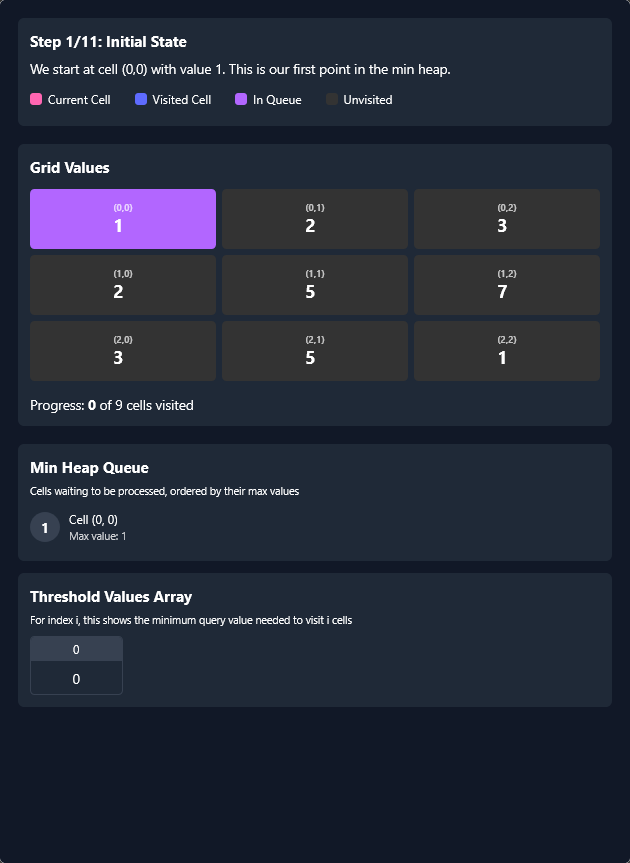

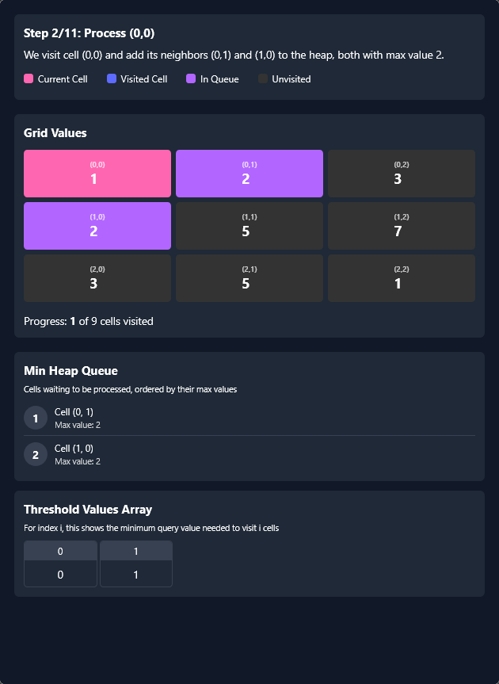

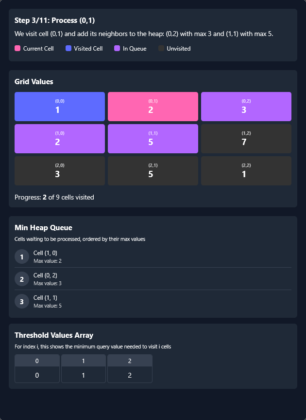

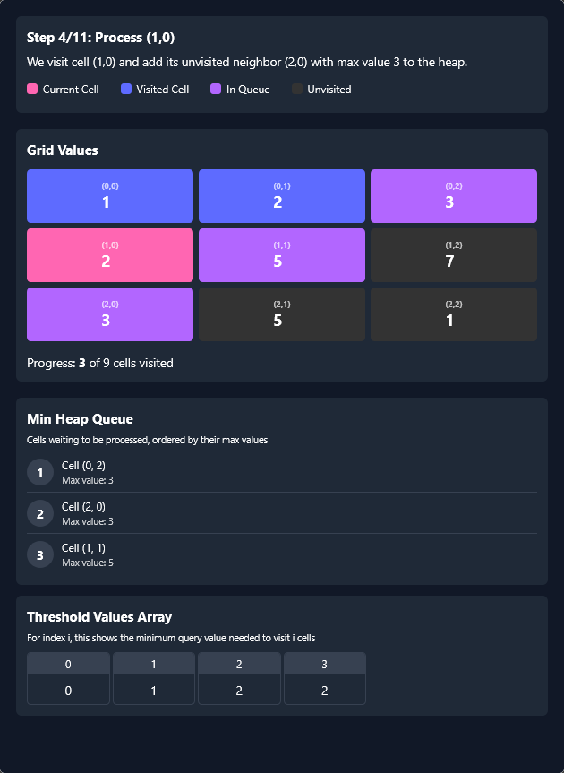

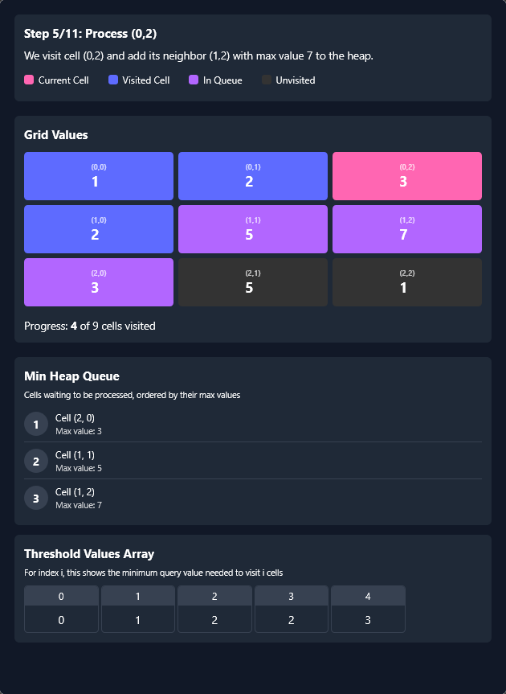

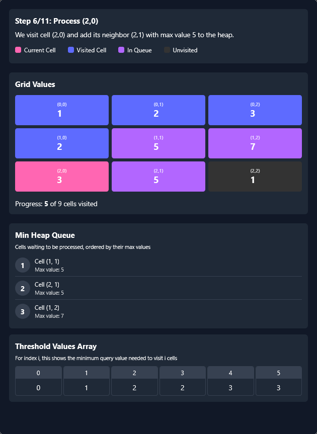

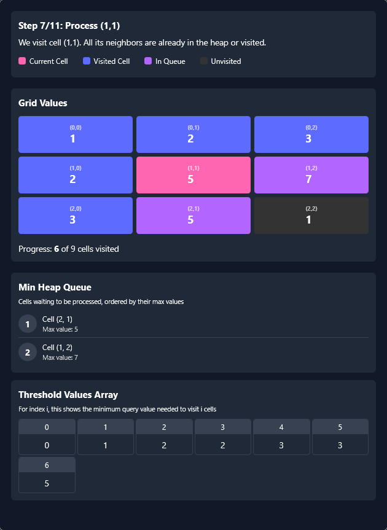

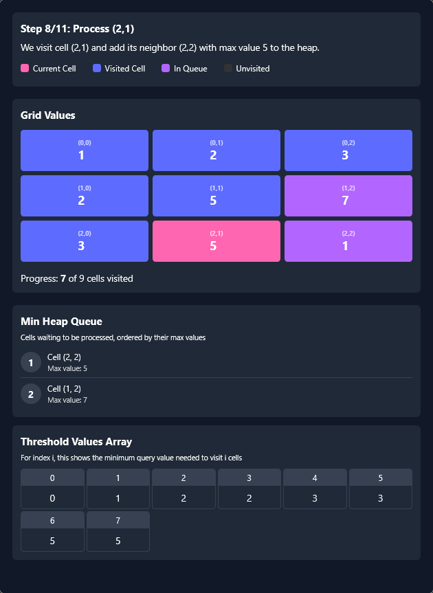

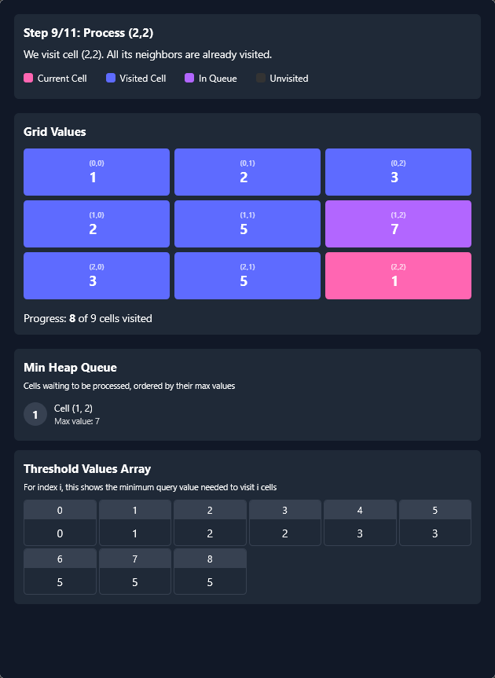

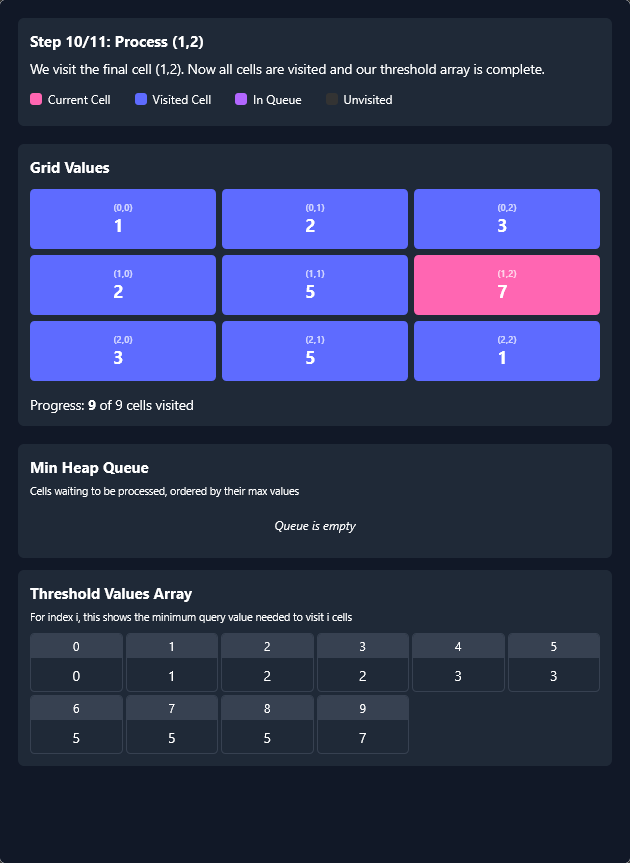

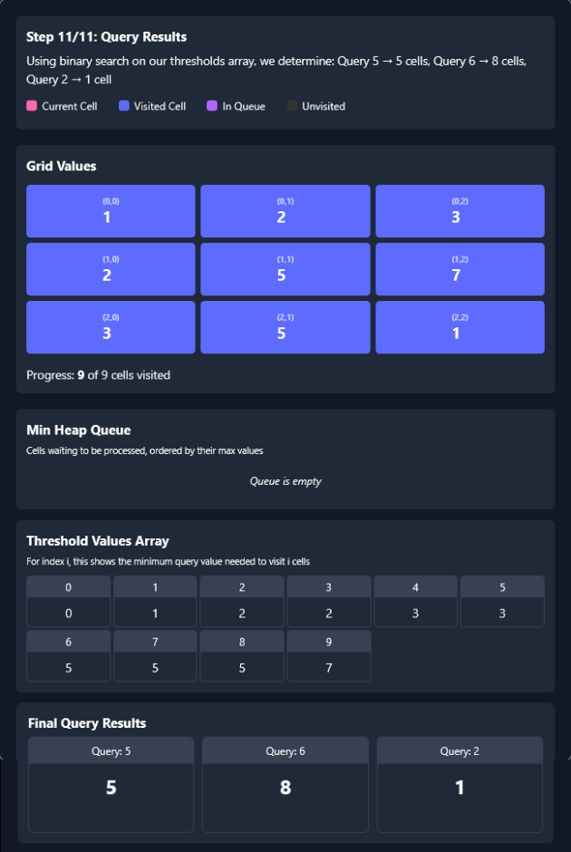

#### Algorithm

- Define `DIRECTIONS` to facilitate movement in four directions.
- Initialize `result` array to store the number of points for each query.
- Get `rowCount` and `colCount` from `grid`, compute $totalCells = rowCount * colCount$.
- Create `thresholdForMaxPoints`, where index `i` stores the minimum query value required to reach `i` cells.
- Create `minValueToReach`, where $\text{minValueToReach}[i][j]$ holds the maximum value encountered to reach `(i, j)`, initialized to $\text{MAX}_{VALUE}$.

- Run Dijkstra’s algorithm:
  - Use `minHeap` (min-priority queue) to explore cells in increasing order of encountered values.
  - Start from `(0,0)`, setting $\text{minValueToReach}[0][0] = \text{grid}[0][0]$ and pushing it into `minHeap`.
  - While `minHeap` is not empty:
- Extract the cell with the smallest encountered value.
- Store the encountered value in `thresholdForMaxPoints[++visitedCells]`.
- Explore four possible directions:
      - If the adjacent cell `(newRow, newCol)` is within bounds and unvisited:
          - Update its `minValueToReach` as the maximum of the value to reach the current cell and  $\text{grid}[newRow][newCol]$.
          - Push it into `minHeap`.

- Process queries using binary search:
  - For each $\text{queries}[i]$, find the rightmost `mid` where $\text{thresholdForMaxPoints}[mid] < threshold$.
  - Initialize $left = 0$, $right = totalCells$.
  - Perform binary search:
- Compute $mid = (left + right + 1) / 2$.
- If $\text{thresholdForMaxPoints}[mid] < threshold$, move $left = mid$.
- Otherwise, adjust $right = mid - 1$.
  - Store `left` in $\text{result}[i]$.

- Return `result`, containing the number of points collected for each query.

#### Implementation

```python
from queue import PriorityQueue

class Solution:

    DIRECTIONS = [[1, 0], [-1, 0], [0, 1], [0, -1]]

    def maxPoints(self, grid, queries):
        query_count = len(queries)
        result = [0] * query_count
        row_count = len(grid)
        col_count = len(grid[0])
        total_cells = row_count * col_count

        threshold_for_max_points = [0] * (total_cells + 1)
        min_value_to_reach = [
            [float("inf")] * col_count for _ in range(row_count)
        ]

        min_value_to_reach[0][0] = grid[0][0]

        # Min-heap for processing cells in increasing order of their maximum
        # encountered value.
        min_heap = PriorityQueue()
        min_heap.put((grid[0][0], 0, 0))
        visited_cells = 0

        # Dijkstra's algorithm to compute minValueToReach for each cell
        while not min_heap.empty():
            current = min_heap.get()

            # Store the value required to reach `visitedCells` points.
            threshold_for_max_points[visited_cells + 1] = current[0]
            visited_cells += 1

            # Explore all possible directions.
            for direction in self.DIRECTIONS:
                new_row, new_col = (
                    current[1] + direction[0],
                    current[2] + direction[1],
                )

                # Check if the new position is within bounds and not visited
                # before.
                if (
                    0 <= new_row < row_count
                    and 0 <= new_col < col_count
                    and min_value_to_reach[new_row][new_col] == float("inf")
                ):
                    # The max value encountered on the path to this cell.
                    min_value_to_reach[new_row][new_col] = max(
                        current[0], grid[new_row][new_col]
                    )

                    # Add the cell to the heap for further exploration.
                    min_heap.put(
                        (min_value_to_reach[new_row][new_col], new_row, new_col)
                    )

        # Use binary search to determine the maximum number of points that can
        # be collected for each query.
        for i in range(query_count):
            threshold = queries[i]
            left, right = 0, total_cells

            # Find the rightmost number of points we can collect before
            # exceeding the query threshold.
            while left < right:
                mid = left + (right - left + 1) // 2

                if threshold_for_max_points[mid] < threshold:
                    left = mid
                else:
                    right = mid - 1

            # Return `left`.
            result[i] = left

        return result
```

#### Complexity Analysis

Let $n$ and $m$ be the number of rows and columns in the grid, respectively, and $k$ be the number of queries.

> $n \cdot m$ is basically the total number of cells in the grid.

- Time complexity: $O(n \cdot m \log (n \cdot m) + k \log (n \cdot m))$

    The algorithm uses a min-heap to perform a modified Dijkstra's traversal. In the worst case, all $n \cdot m$ cells are processed, and each heap operation (insertion or extraction) takes $O(\log (n \cdot m))$ time. Therefore, the time complexity for this part is $O(n \cdot m \log (n \cdot m))$.

    For each of the `k` queries, a binary search is performed on the `thresholdForMaxPoints` array, which has a size of $(n \cdot m) + 1$. Each binary search operation takes $O(\log (n \cdot m))$ time. Therefore, the time complexity for this part is $O(k \log (n \cdot m))$.

    Combining these, the overall time complexity is $O(n \cdot m \log (n \cdot m) + k \log (n \cdot m))$.

- Space complexity: $O(n \cdot m)$

    The space complexity is dominated by:
- The `minHeap`, which can hold up to $n \cdot m$ cells.
- The `minValueToReach` matrix, which is of size $n \cdot m$.
- The `thresholdForMaxPoints` array, which is of size $(n \cdot m) + 1$.

    Therefore, the overall space complexity is $O(n \cdot m)$.

---

### Approach 4: Disjoint Set Union (Union-Find)

#### Intuition

Instead of handling queries one by one, we can take a different approach where we process all grid cells first and answer queries afterward. This allows us to efficiently determine the number of reachable points for each query without having to traverse the grid multiple times.

To better understand this approach, let's reiterate our previous observation in a slightly different way. Think about what each query is asking. A query provides a threshold value and asks how many cells in the grid can be reached from the top-left corner `(0,0)`, while ensuring that all visited cells have values strictly less than this threshold. Instead of iterating over the grid every time a query is given, we can reverse the problem: first process the grid in increasing order of cell values, then efficiently answer all queries using this precomputed information.

To do this, we first extract all the grid cells and sort them in ascending order based on their values. By processing these cells in this order, we can simulate how the reachable area grows as the threshold increases. We maintain a **disjoint set union (Union-Find) data structure** to dynamically merge connected components as we encounter new cells with increasing values.

As we iterate through the sorted grid cells, we add each cell to our Union-Find structure. Whenever we add a cell, we also check its four adjacent neighbors (up, down, left, and right). If a neighbor has already been processed, we merge the current cell with its neighboring cell in the Union-Find structure. This ensures that, at any given moment, all connected components represent regions of the grid where all cells have values strictly less than the current threshold.

At the same time, we also sort the queries in ascending order based on their values. As we process each query, we continue adding cells to our Union-Find structure until the current cell values reach or exceed the query threshold. Once we finish adding all the relevant cells for a query, we determine how many of these cells are reachable from `(0,0)`. Since the Union-Find structure keeps track of the size of connected components, we can efficiently find the number of reachable cells by checking the size of the component that contains `(0,0)`.

If the query value is greater than $\text{grid}[0][0]$, then the number of reachable cells is simply the size of the connected component containing `(0,0)`. Otherwise, no additional cells are reachable, and the answer for this query is `0`.

#### Algorithm

- Define `Cell(row, col, value)` to represent grid cells and `Query(index, value)` to store queries with their original indices.
- Initialize $\text{ROW}_{DIRECTIONS}$ and $\text{COL}_{DIRECTIONS}$ for moving in four directions.
- Extract `rowCount` and `colCount`, compute $totalCells = rowCount * colCount$.

- Sort queries:
  - Store each query as a `Query` object in `sortedQueries`.
  - Sort `sortedQueries` based on `value` in ascending order.

- Sort grid cells:
  - Store each cell as a `Cell` object in `sortedCells`.
  - Sort `sortedCells` based on `value` in ascending order.

- Initialize `UnionFind` data structure for dynamic connectivity.

- Process queries:
  - Iterate over `sortedQueries`, maintaining an index `cellIndex` to track which cells have been processed.
  - While $\text{sortedCells}[cellIndex].value < \text{query.value}$, mark the cell as processed and merge it with already processed adjacent cells using `UnionFind.union()`.
  - Compute the size of the connected component containing `(0,0)`, storing the result for `query.index`.

- Return `result`, containing the number of points collected for each query.

##### **`UnionFind` Class:**

- Define `UnionFind` class for disjoint set operations.
- Declare `parent` array to track the representative of each set.
- Declare `size` array to store the size of each set.

- Constructor (`UnionFind(int n)`):
  - Initialize `parent` with `-1`, indicating each element is its own set.
  - Initialize `size` to `1`, as each set initially has one element.

- `find(int node)`: Implements path compression to optimize lookup.
  - If $\text{parent}[node]$ is `-1`, it is the root and returned.
  - Otherwise, recursively find the root and apply path compression ($\text{parent}[node] = find(\text{parent}[node])$).

- `union(int nodeA, int nodeB)`:
  - Find roots of `nodeA` and `nodeB`.
  - If both nodes share the same root, they are already in the same set, return `false`.
  - Otherwise, perform union by size:
- Attach the smaller tree to the larger tree.
- Update `size` accordingly.
  - Return `true` to indicate a successful union.

- `getSize(int node)`:
  - Find the root of `node` and return the size of its set.

#### Implementation

```python
class Cell:
    def __init__(self, row, col, value):
        self.row = row
        self.col = col
        self.value = value

class Query:
    def __init__(self, index, value):
        self.index = index
        self.value = value

class UnionFind:
    def __init__(self, n):
        self.parent = [-1] * n
        self.size = [1] * n

    def find(self, node):
        if self.parent[node] < 0:
            return node
        return self.find(self.parent[node])

    def union(self, nodeA, nodeB):
        rootA = self.find(nodeA)
        rootB = self.find(nodeB)
        if rootA == rootB:
            return False

        if self.size[rootA] > self.size[rootB]:
            self.parent[rootB] = rootA
            self.size[rootA] += self.size[rootB]
        else:
            self.parent[rootA] = rootB
            self.size[rootB] += self.size[rootA]
        return True

    def get_size(self, node):
        return self.size[self.find(node)]

class Solution:
    ROW_DIRECTIONS = [0, 0, 1, -1]  # Right, Left, Down, Up
    COL_DIRECTIONS = [1, -1, 0, 0]  # Corresponding column moves

    def maxPoints(self, grid, queries):
        row_count, col_count = len(grid), len(grid[0])
        total_cells = row_count * col_count

        sorted_queries = [
            Query(i, val) for i, val in enumerate(queries)
        ]  # Store queries with their original indices to maintain result order
        sorted_queries.sort(
            key=lambda x: x.value
        )  # Sort queries in ascending order

        sorted_cells = [
            Cell(row, col, grid[row][col])
            for row in range(row_count)
            for col in range(col_count)
        ]  # Store all grid cells and sort them by value
        sorted_cells.sort(key=lambda x: x.value)  # Sort cells by value

        uf = UnionFind(total_cells)
        result = [0] * len(queries)

        cell_index = 0
        for query in sorted_queries:  # Process queries in sorted order
            while (
                cell_index < total_cells
                and sorted_cells[cell_index].value < query.value
            ):  # Process cells whose values are smaller than the current query value
                row = sorted_cells[cell_index].row
                col = sorted_cells[cell_index].col
                cell_id = (
                    row * col_count + col
                )  # Convert 2D position to 1D index

                for direction in range(
                    4
                ):  # Merge the current cell with its adjacent cells that have already been processed
                    new_row = row + Solution.ROW_DIRECTIONS[direction]
                    new_col = col + Solution.COL_DIRECTIONS[direction]
                    if (
                        0 <= new_row < row_count
                        and 0 <= new_col < col_count
                        and grid[new_row][new_col] < query.value
                    ):
                        uf.union(cell_id, new_row * col_count + new_col)

                cell_index += 1

            result[query.index] = (
                uf.get_size(0) if query.value > grid[0][0] else 0
            )  # Get the size of the component containing the top-left cell (0,0)

        return result
```

#### Complexity Analysis

Let $n$ and $m$ be the number of rows and columns in the grid, respectively, and $k$ be the number of queries.

> $n \cdot m$ is basically the total number of cells in the grid.

- Time complexity: $O(k \log k + (n \cdot m) \log (n \cdot m) + k \cdot \alpha(n \cdot m))$

    The time complexity arises from several steps. First, sorting the `queries` array takes $O(k \log k)$. Second, sorting the `sortedCells` array takes $O((n \cdot m) \log (n \cdot m))$. Finally, processing each query involves iterating through the cells and performing union-find operations.

    The union-find operations, with path compression and union by size, have an amortized time complexity of $O(\alpha(n \cdot m))$, where $\alpha$ is the inverse Ackermann function (practically constant).

    Since we process up to `totalCells` cells for each query, the total time for all queries is $O(k \cdot \alpha(n \cdot m))$. Combining these, the overall time complexity is $O(k \log k + (n \cdot m) \log (n \cdot m) + k \cdot \alpha(n \cdot m))$.

- Space complexity: $O((n \cdot m) + k)$

    The space complexity is dominated by the `sortedQueries` array, which takes $O(k)$ space, the `sortedCells` array, which takes $O(n \cdot m)$ space, and the `UnionFind` data structure, which uses $O(n \cdot m)$ space for the `parent` and `size` arrays. Therefore, the overall space complexity is $O((n \cdot m) + k)$.

---