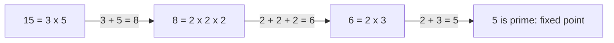

# Guided Example: Smallest Value After Replacing With Sum of Prime Factors

## 1. The replacement rule and the question being asked

We are handed a single positive integer `n`. One *replacement* throws the number
away and puts in its place the sum of its **prime factors**, counted with
multiplicity. Repeating that replacement produces a chain of values

$$
v_0 = n,\qquad v_{k+1} = \sigma(v_k),
$$

where $\sigma$ denotes the sum-of-prime-factors function (the sum of the members
of the multiset of primes whose product is the argument). The task is to report
the smallest value the chain ever visits.

"Smallest value" is not an extra search: it is simply where the chain comes to
rest. The answer is the terminal value of the process, and finding it means
understanding *when* the process is allowed to stop.

## 2. The one detail that decides everything: multiplicity

The statement's only subtle clause is that a prime factor dividing the value
several times is added several times. Writing the factorization as

$$
n = p_1^{a_1} p_2^{a_2} \cdots p_r^{a_r},\qquad
\sigma(n) = \sum_{j=1}^{r} a_j \, p_j,
$$

makes the rule mechanical: exponents act as repetition counts, not as
exponents. So $8 = 2 \cdot 2 \cdot 2$ contributes $2+2+2 = 6$, not $2$, and
$100000 = 2^5 \cdot 5^5$ contributes $5 \cdot 2 + 5 \cdot 5 = 35$.

Two consequences follow immediately and both matter later. First, a prime $p$ is
its own factor list, so $\sigma(p) = p$: primes never move. Second, a composite
usually produces a value *smaller* than itself, which is what makes the chain
descend.

## 3. Worked trace of the official instance `n = 15`

Take the statement's first example, `n = 15`. Factor, sum, repeat, and record the
whole chain.

| Round $k$ | Current value $v_k$ | Prime factorization | Factors with multiplicity | $\sigma(v_k)$ | Continues? |
|:---:|:---:|:---|:---|:---:|:---|
| 0 | 15 | $3 \times 5$ | 3, 5 | 8 | yes, $8 \neq 15$ |
| 1 | 8 | $2^{3}$ | 2, 2, 2 | 6 | yes, $6 \neq 8$ |
| 2 | 6 | $2 \times 3$ | 2, 3 | 5 | yes, $5 \neq 6$ |
| 3 | 5 | prime | 5 | 5 | no, $5 = 5$: stop |

The chain is $15 \to 8 \to 6 \to 5$, every step strictly decreasing until the
value lands on the prime 5. Because the value at round 3 is unchanged by the
replacement, the process has reached its fixed point and reports `5`, matching
the authored expectation for this input.

The reduction chain, drawn as a flow rather than a table:

The diagram makes the shape evident: the process is a single path, not a search
tree, because each value determines exactly one successor.

## 4. The divisor walk inside a single replacement

Knowing *what* one replacement produces is not the same as knowing how to obtain
it without factoring by intuition. The practical method is trial division: walk a
candidate divisor $d$ upward from 2, and whenever $d$ divides the working
remainder $r$, divide it out as often as possible and add $d$ to the running sum
once per division. The walk has to continue only while $d \le \lfloor r/d
\rfloor$, that is while $d^2 \le r$; once $d$ exceeds the square root of what
remains, that remainder must itself be prime (or 1), so it is added as a final
term.

Watch that walk perform the replacement $15 \to 8$:

| Trial divisor $d$ | Guard $d \le \lfloor r/d \rfloor$ | `15 % d == 0` on the working remainder | Action | Working remainder $r$ | Partial sum $s$ |
|:---:|:---|:---|:---|:---:|:---:|
| 2 | $2 \le 7$, true | no | divisor rejected | 15 | 0 |
| 3 | $3 \le 5$, true | yes | divide once, add 3 | 5 | 3 |
| 3, retested | $3 \le 1$, false | not reached | guard ends the loop | 5 | 3 |
| tail | — | $r = 5 > 1$ | add the remaining prime | 1 | 8 |

The guard is what keeps the cost honest. Because $r$ shrinks as factors are
divided out, the bound $\lfloor r/d \rfloor$ falls with it, so the loop exits
after three tests instead of scanning all fourteen values below 15. At exit the
leftover 5 is prime and is added exactly once.

## 5. Fixed points: which values stop the process

The process halts when a replacement reproduces its own input, $\sigma(v) = v$.
Classifying the small values shows that this happens for more than just primes.

| Value $v$ | Factorization | $\sigma(v)$ | Relation | Terminal? |
|:---:|:---|:---:|:---|:---|
| 2 | prime | 2 | $\sigma(v) = v$ | yes |
| 3 | prime | 3 | $\sigma(v) = v$ | yes |
| 4 | $2 \times 2$ | 4 | $\sigma(v) = v$ | yes: the only composite fixed point |
| 6 | $2 \times 3$ | 5 | $\sigma(v) < v$ | no |
| 8 | $2^{3}$ | 6 | $\sigma(v) < v$ | no |
| 9 | $3^{2}$ | 6 | $\sigma(v) < v$ | no |
| 15 | $3 \times 5$ | 8 | $\sigma(v) < v$ | no |
| 997 | prime | 997 | $\sigma(v) = v$ | yes |

The row for $v = 4$ is the material trap of this problem. Every prime halts
because its factor multiset is itself, but $4$ is composite and still halts,
because $2 + 2 = 4$. An implementation that equates "halting" with "the value is
prime" returns a wrong answer for `n = 4`; the correct stopping test compares the
new sum against the previous value, not the primality of anything.

## 6. A longer chain: `n = 100000`

A single-composite instance would not show that the process can require several
rounds after large reductions. The maximum permitted input supplies that.

| Round $k$ | Value $v_k$ | Prime factorization | $\sigma(v_k)$ | Next action |
|:---:|:---:|:---|:---|:---|
| 0 | 100000 | $2^{5} \times 5^{5}$ | $5 \cdot 2 + 5 \cdot 5 = 35$ | replace with 35 |
| 1 | 35 | $5 \times 7$ | $5 + 7 = 12$ | replace with 12 |
| 2 | 12 | $2^{2} \times 3$ | $2 + 2 + 3 = 7$ | replace with 7 |
| 3 | 7 | prime | 7 | stop: answer 7 |

Five factors of 2 and five factors of 5 collapse a six-digit value straight to
35. Multiplicity is not a rounding detail here: adding the distinct primes once
each would have produced $2 + 5 = 7$ in one step and accidentally the right
answer, which is precisely why `n = 8` — where the distinct-prime shortcut gives
2 instead of 6 — is the more honest test of the rule.

## 7. Correctness: the descent invariant and why the process terminates

The reasoning rests on one invariant, stated over a whole round:

> **Descent invariant.** For every composite value $v \ge 6$,
> $\sigma(v) \le \tfrac{v}{2} + 2 < v$.

Why the bound holds: a composite $v$ has a smallest prime factor $p \le \sqrt v$,
so $v = p \cdot m$ with $m \ge p$. Splitting off the single factor $p$ leaves the
remainder $m$, and the sum of *its* prime factors is at most $m$ itself (a prime
factor of $m$ never exceeds $m$; a single prime attains $m$). Hence

$$
\sigma(v) = p + \sigma(m) \le p + m = p + \frac{v}{p}.
$$

The expression $p + v/p$ is largest when $p$ is smallest, and for $v \ge 6$ the
bound $p + v/p \le v/2 + 2$ follows from $p \ge 2$ together with $v \ge 6$;
that last quantity is strictly below $v$ once $v > 4$. So every non-terminal
composite at least six obeys $\sigma(v) < v$.

Three facts now combine into correctness:

1. **Progress.** From $v \ge 6$, a non-terminal composite strictly decreases, so
   the chain cannot revisit a value and cannot cycle. Since values are positive
   integers, it must reach a terminal value: the process always halts.
2. **No skipped answer.** Each round *is* the definition of the replacement, so
   the chain visited by the method is exactly the chain the problem describes.
   Reading off the final value therefore returns the smallest value the chain
   takes on, because the chain is non-increasing up to that point.
3. **Exact stopping.** The method stops only when $\sigma(v) = v$, which is the
   definition of a fixed point. It never stops early on "looks small enough" and
   never continues past the fixed point, because a fixed point reproduces
   itself forever.

The only values the descent invariant excludes are $2, 3, 4, 5$: of these, $4$
satisfies $\sigma(v) = v$ and the rest are primes, so they are terminal and are
handled by the same equality test rather than a special case.

## 8. Boundary and edge cases

The authored cases for this package stress exactly the boundaries the invariant
above identifies.

| Instance | Input | Expected | What it teaches |
|:---|:---:|:---:|:---|
| smallest prime | `n = 2` | 2 | a prime is already a fixed point at round 0 |
| composite fixed point | `n = 4` | 4 | $\sigma(4) = 2 + 2 = 4$: composite yet immobile |
| prime power | `n = 8` | 5 | multiplicity: $2+2+2 = 6$, then $2+3 = 5$ |
| perfect square | `n = 9` | 5 | $3 + 3 = 6$, then $2 + 3 = 5$ |
| medium composite | `n = 12` | 7 | one replacement lands directly on a prime |
| maximum value | `n = 100000` | 7 | the long chain $100000 \to 35 \to 12 \to 7$ |
| large prime | `n = 997` | 997 | the $\lfloor r/d \rfloor$ guard proves primality |
| degenerate probe | `n = 1` | 0 | an empty factor multiset sums to 0; outside the stated $2 \le n$ range |

The `n = 1` row deserves a comment. The stated constraint is $2 \le n \le
10^{5}$, so 1 is not required, but the package's authored cases probe it. Under
the definition the factorization of 1 is empty, an empty sum is 0, and 0 is
itself a fixed point, so the chain $1 \to 0$ terminates at `0`. A method that
skips the final "add the leftover remainder if it exceeds 1" step and treats 1 as
prime would return 1 here and diverge from the authored expectation.

## 9. Alternatives and their failure modes

| Approach | How it works | Time | Auxiliary space | Failure mode |
|:---|:---|:---|:---|:---|
| Trial division per round | test $d$ from 2 to $\lfloor \sqrt v \rfloor$, dividing out repeats | $O(\sqrt n)$ overall | $O(1)$ | none; this is the method traced above |
| Smallest-prime-factor sieve | precompute each value's least prime factor, then factor by repeated lookup | $O(n \log \log n)$ build, then $O(\log v)$ per value | $O(n)$ | unnecessary for one input; wins only for many independent queries |
| Sum of distinct primes | add each prime once, ignoring exponent | $O(\sqrt n)$ | $O(1)$ | wrong on 8 (yields 2, not 6) and on 9 (yields 3, not 6) |
| Sum of proper divisors | add 1 and every divisor below $v$ | $O(\sqrt n)$ | $O(1)$ | wrong on 15 (yields 9, not 8); includes composite divisors |
| Recursive whole-chain evaluation | recompute the sum while unwinding the call stack | $O(\sqrt n)$ | $O(\log n)$ stack frames | same result as iteration, so the recursion buys nothing |
| Stopping on primality | halt as soon as the value is prime | $O(\sqrt n)$ | $O(1)$ | agrees with the authored cases by luck, but it is not the rule; the rule is a fixed-point test |

The last row is worth internalizing: several plausible shortcuts happen to agree
with the samples, which is why deriving the stopping condition from
$\sigma(v) = v$ rather than pattern-matching the examples is the safer choice.

## 10. Complexity: time and auxiliary space

Let the chain be $v_0 = n > v_1 > \cdots > v_T$, where $T$ is the number of
replacements before the fixed point. One replacement of a value $v$ performs
trial division only for $d \le \lfloor \sqrt v \rfloor$, so it costs $O(\sqrt v)$
divisibility tests, each $O(1)$.

**Time.** The total is the sum over the chain,

$$
O\!\left(\sum_{k=0}^{T} \sqrt{v_k}\right),
$$

and by the descent invariant $v_{k+1} \le v_k/2 + 2$, so each term is smaller
than its predecessor by roughly a factor $\sqrt 2$. The geometric series is
dominated by its first term, giving $O(\sqrt n)$ divisibility tests in total —
about 316 tests for the largest permitted input, `n = 100000`. The number of
rounds is itself $O(\log n)$, since the value at least halves per round, so the
round bookkeeping never becomes the bottleneck.

**Auxiliary space.** The method stores only the current value, the running sum,
and the trial divisor; the multiset of prime factors never has to be materialized
because each factor is added at the moment it is divided out. Auxiliary space is
therefore $O(1)$, independent of $n$ and of the chain length. That constant-space
property is the practical advantage over the sieve alternative, which pays
$O(n)$ memory to avoid work that this instance does not need.