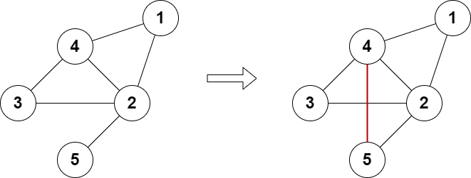
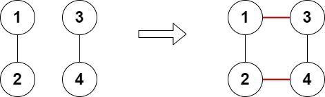
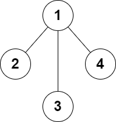

### 1. Description

There is an **undirected** graph consisting of `n` nodes numbered from `1` to `n`. You are given the integer `n` and a **2D** array `edges` where $\text{edges}[i] = [a_{i}, b_{i}]$ indicates that there is an edge between nodes $a_{i}$ and $b_{i}$. The graph can be disconnected.

You can add **at most** two additional edges (possibly none) to this graph so that there are no repeated edges and no self-loops.

Return `true`* if it is possible to make the degree of each node in the graph even, otherwise return *`false`*.*

The degree of a node is the number of edges connected to it.

### 2. Function Contract

**Inputs**

- `n`: Input parameter (`int`).
- `edges`: Input parameter (`List[List[int]]`).

**Return value**

- Returns `bool`.

### 3. Examples

#### Example 1

- **Input:** $n = 5, edges = [[1,2],[2,3],[3,4],[4,2],[1,4],[2,5]]$
- **Output:** `true`
- **Explanation:** The above diagram shows a valid way of adding an edge.
Every node in the resulting graph is connected to an even number of edges.

#### Example 2

- **Input:** $n = 4, edges = [[1,2],[3,4]]$
- **Output:** `true`
- **Explanation:** The above diagram shows a valid way of adding two edges.

#### Example 3

- **Input:** $n = 4, edges = [[1,2],[1,3],[1,4]]$
- **Output:** `false`
- **Explanation:** It is not possible to obtain a valid graph with adding at most 2 edges.

### 4. Constraints

- $3 \le n \le 10^{5}$

- $2 \le \text{edges.length} \le 10^{5}$

- $\text{edges}[i].length = 2$

- $1 \le a_{i}, b_{i} \le n$

- $a_{i} \neq b_{i}$

- There are no repeated edges.
