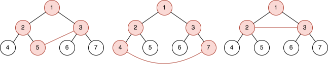
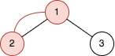

### 1. Description

You are given an integer `n`. There is a **complete binary tree** with $2^n - 1$ nodes. The root of that tree is the node with the value `1`, and every node with a value `val` in the range $[1, 2^n - 1 - 1]$ has two children where:

- The left node has the value $2 * val$, and

- The right node has the value $2 * val + 1$.

You are also given a 2D integer array `queries` of length `m`, where $\text{queries}[i] = [a_{i}, b_{i}]$. For each query, solve the following problem:

- Add an edge between the nodes with values $a_{i}$ and $b_{i}$.

- Find the length of the cycle in the graph.

- Remove the added edge between nodes with values $a_{i}$ and $b_{i}$.

### 2. Function Contract

**Inputs**

- `n`: Input parameter (`int`).
- `queries`: Input parameter (`List[List[int]]`).

**Return value**

- Returns `List[int]`.

### 3. Note

that:

- A **cycle** is a path that starts and ends at the same node, and each edge in the path is visited only once.

- The length of a cycle is the number of edges visited in the cycle.

- There could be multiple edges between two nodes in the tree after adding the edge of the query.

Return *an array *`answer`* of length *`m`* where* $\text{answer}[i]$ *is the answer to the* $$i^{\text{th}}$$ *query.*

### 4. Examples

#### Example 1

- **Input:** $n = 3, queries = [[5,3],[4,7],[2,3]]$
- **Output:** `[4,5,3]`
- **Explanation:** The diagrams above show the tree of $2^{3}$ - 1 nodes. Nodes colored in red describe the nodes in the cycle after adding the edge.
- After adding the edge between nodes 3 and 5, the graph contains a cycle of nodes [5,2,1,3]. Thus answer to the first query is 4. We delete the added edge and process the next query.
- After adding the edge between nodes 4 and 7, the graph contains a cycle of nodes [4,2,1,3,7]. Thus answer to the second query is 5. We delete the added edge and process the next query.
- After adding the edge between nodes 2 and 3, the graph contains a cycle of nodes [2,1,3]. Thus answer to the third query is 3. We delete the added edge.

#### Example 2

- **Input:** $n = 2, queries = [[1,2]]$
- **Output:** `[2]`
- **Explanation:** The diagram above shows the tree of $2^{2}$ - 1 nodes. Nodes colored in red describe the nodes in the cycle after adding the edge.
- After adding the edge between nodes 1 and 2, the graph contains a cycle of nodes [2,1]. Thus answer for the first query is 2. We delete the added edge.

### 5. Constraints

- $2 \le n \le 30$

- $m = \text{queries.length}$

- $1 \le m \le 10^{5}$

- $\text{queries}[i].length = 2$

- $1 \le a_{i}, b_{i} \le 2^n - 1$

- $a_{i} \neq b_{i}$
