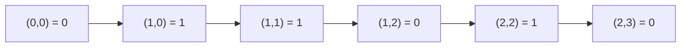

# Guided Example: Check if There is a Path With Equal Number of 0's And 1's

## 1. The one thing every path has in common

Movement is restricted to $(i+1, j)$ and $(i, j+1)$, so a route from `(0, 0)` to
`(m-1, n-1)` consists of exactly $m-1$ downward steps and $n-1$ rightward steps.
The number of visited cells is therefore fixed:

$$
s = (m-1) + (n-1) + 1 = m + n - 1,
$$

independent of which route is taken. That single constant decides two things. If
$s$ is odd, no route can ever split its cells evenly, because an integer cannot
equal $s/2$; the answer is immediately `false`. If $s$ is even, every candidate
route must be examined for exactly

$$
k^\star = \frac{s}{2}
$$

ones among its $s$ cells, with the remaining $s/2$ cells holding zeros.

Grids are at most $100 \times 100$, so $s \le 199$ and the number of monotone
routes is $\binom{m+n-2}{m-1}$, which for a large square grid is astronomically
large. Enumerating routes is therefore out of the question, and the parity gate
is the first thing to check.

## 2. The state that must be tracked

Walking the grid, the only information the future needs about the past is *how
many ones have been collected so far*. Two different routes that reach the same
cell with the same ones-count are interchangeable: whatever the remaining
suffix can achieve from that cell depends only on $(i, j, k)$, never on the route
taken. That is precisely the condition under which a DP is valid.

So the state is a triple $(i, j, k)$ where $k$ counts ones among the cells of the
prefix path including `(i, j)`. The number of zeros collected on the same prefix
is determined rather than independent:

$$
\text{zeros}(i,j) = (i + j + 1) - k,
$$

because a prefix ending at `(i, j)` has visited exactly $i + j + 1$ cells.

A state records that the path stands on `(i, j)` with an ones-count of $k$ over
its cells so far. Stepping to a neighbour simply adds that neighbour's own value
to $k$, so the recurrence is a disjunction: the destination is reachable balanced
if it is reachable through the cell below, or through the cell to the right,

$$
T(i,j,k) = T\!\left(i+1,\, j,\, k + \texttt{grid[i+1][j]}\right)
\;\lor\;
T\!\left(i,\, j+1,\, k + \texttt{grid[i][j+1]}\right),
$$

with the base case that the destination succeeds exactly when $k = k^\star$. A
state is a dead end whenever $k > k^\star$ (too many ones to ever come back) or
$(i+j+1) - k > k^\star$ (too many zeros). Those two tests
prune most of the state space, and both are derived, not guessed: once a count
exceeds half of $s$, the remaining cells cannot reduce it.

## 3. Worked trace of the official `3 x 4` instance

Take the statement's first example:

$$
\texttt{grid} = \begin{bmatrix} 0 & 1 & 0 & 0 \\ 0 & 1 & 0 & 0 \\ 1 & 0 & 1 & 0 \end{bmatrix}.
$$

Here $m = 3$, $n = 4$, $s = 6$ is even, and the target is $k^\star = 3$ ones out
of 6 cells. The table records, for each cell in row-major order, which
predecessors can reach it and which ones-counts survive the pruning bounds
$k \le 3$ and $\text{zeros} \le 3$.

| Cell | `grid[i][j]` | Reachable from | Ones-counts $k$ reaching this cell | Notes |
|:---:|:---:|:---|:---|:---|
| `(0,0)` | 0 | start | $\{0\}$ | prefix has 1 cell, 0 ones |
| `(0,1)` | 1 | `(0,0)` | $\{1\}$ | one cell added, one one added |
| `(0,2)` | 0 | `(0,1)` | $\{1\}$ | zero keeps the count |
| `(0,3)` | 0 | `(0,2)` | $\{1\}$ | top row carries a single one |
| `(1,0)` | 0 | `(0,0)` | $\{0\}$ | left column still has no one |
| `(1,1)` | 1 | `(0,1)`, `(1,0)` | $\{1,2\}$ | two different routes, two counts |
| `(1,2)` | 0 | `(0,2)`, `(1,1)` | $\{1,2\}$ | counts merge; no new one here |
| `(1,3)` | 0 | `(0,3)`, `(1,2)` | $\{1,2\}$ | right column keeps both counts |
| `(2,0)` | 1 | `(1,0)` | $\{1\}$ | forced cell, one one |
| `(2,1)` | 0 | `(1,1)`, `(2,0)` | $\{1,2\}$ | still below the bound |
| `(2,2)` | 1 | `(1,2)`, `(2,1)` | $\{2,3\}$ | both counts stay $\le 3$ |
| `(2,3)` | 0 | `(1,3)`, `(2,2)` | $\{1,2,3\}$ | target cell: $k = 3$ is present |

The last row is the verdict: $k^\star = 3$ belongs to the reachable set at `(2,3)`,
so a balanced route exists and the answer is `true`, as the official example
expects. One witness route reaching $k = 3$ is
`(0,0)`, `(0,1)`, `(1,1)`, `(1,2)`, `(2,2)`, `(2,3)`, whose six values are
`0, 1, 1, 0, 1, 0` — three ones and three zeros. Note how the set at `(2,3)`
also contains $k = 1$ and $k = 2$: other routes do reach the destination, they
merely fail the balance requirement, which is why the answer is a membership test
rather than an extremal one.

## 4. Pruning states that cannot finish balanced

The two bounds remove states aggressively, and it is worth seeing exactly which
ones. Write $z = (i+j+1) - k$ for zeros on the prefix.

| Pruned condition | Meaning | Concrete state in the official instance | Why it cannot recover |
|:---|:---|:---|:---|
| $k > k^\star$ | too many ones already | $k = 4$ at any cell | remaining cells only add ones; the count never decreases |
| $z > k^\star$ | too many zeros already | $k = 1$ at `(1,3)` | same argument for zeros: $(i+j+1)$ only grows |
| $i = m$ or $j = n$ | stepped off the grid | any move past row 2 or column 3 | no cells remain, so no path continues |
| $k = k^\star$ mid-path with zeros exceeding it | both counts now fixed | $k = 3$ at `(2,2)` forces $z = 2$ | if $z$ later exceeds 3 the state was already doomed |

The first two rows are the load-bearing ones: they explain why the reachable sets
in the trace never exceed three ones. Row three is the boundary check that keeps
the recursion inside the matrix, and row four shows that a mid-path count equal
to $k^\star$ is not automatically good news — the zeros still have to stay in
budget until the destination. In the official instance the route reaching
`(2,2)` with $k = 3$ has $z = 2$ and one cell left, so it survives and lands on
$(k, z) = (3, 3)$.

## 5. The parity gate and the failing official instance

The statement's second example is

$$
\texttt{grid} = \begin{bmatrix} 1 & 1 & 0 \\ 0 & 0 & 1 \\ 1 & 0 & 0 \end{bmatrix},
$$

with $m = n = 3$ and therefore $s = 5$. Because $s$ is odd, $k^\star = 5/2$ is
not an integer and the answer is `false` before any cell is inspected. The
underlying count structure confirms it; here are the reachable ones-counts:

| Cell | `grid[i][j]` | Ones-counts $k$ | Cells visited | Zeros $z$ |
|:---:|:---:|:---|:---:|:---:|
| `(0,0)` | 1 | $\{1\}$ | 1 | 0 |
| `(1,1)` | 0 | $\{1,2\}$ | 3 | 2 or 1 |
| `(1,2)` | 1 | $\{2,3\}$ | 4 | 2 or 1 |
| `(2,1)` | 0 | $\{1,2\}$ | 4 | 3 or 2 |
| `(2,2)` | 0 | $\{1,2,3\}$ | 5 | 4, 3 or 2 |

At the destination the possible counts are $\{1,2,3\}$, and a balanced arrival
would need $k = 2.5$ with $z = 2.5$. Both are unreachable because they are not
integers at all. This is the reason the parity check is not an optimization but a
correctness-preserving shortcut: it recognizes an entire class of inputs for
which no route can ever qualify.

The same gate settles several authored boundary cases at once.

| Instance | Grid shape | $s = m+n-1$ | Parity of $s$ | Required $k^\star$ | Verdict |
|:---|:---:|:---:|:---:|:---:|:---|
| `trial-odd-path-length` | $2 \times 2$ | 3 | odd | — | `false`, gate |
| `trial-all-zeros` | $3 \times 3$ | 5 | odd | — | `false`, gate |
| official example 2 | $3 \times 3$ | 5 | odd | — | `false`, gate |
| official example 1 | $3 \times 4$ | 6 | even | 3 | `true`, DP finds 3 |
| `trial-small-balanced` | $2 \times 3$ | 4 | even | 2 | `true`, DP finds 2 |
| `trial-all-ones` | $2 \times 3$ | 4 | even | 2 | `false`, every path has 4 ones |
| `trial-narrow-grid` | $2 \times 5$ | 6 | even | 3 | `true`, lower row supplies 3 |

The all-ones row is instructive: parity passes, yet every route collects four
ones and zero zeros, so the DP rejects every state on the very first bound
$k > k^\star$. Passing the gate is necessary, never sufficient.

## 6. Why the route choice matters

The authored case `trial-only-balanced-route` has

$$
\texttt{grid} = \begin{bmatrix} 0 & 0 & 0 & 1 \\ 1 & 1 & 0 & 1 \\ 1 & 1 & 1 & 0 \end{bmatrix},
$$

so $s = 6$ and $k^\star = 3$. Two natural routes give opposite answers:

| Candidate route | Cells visited | Ones | Zeros | Balanced? |
|:---|:---:|:---:|:---:|:---|
| right three times, then down twice | `0,0,0,1,1,0` | 2 | 4 | no |
| down once, right three times, down once | `0,1,1,0,1,0` | 3 | 3 | yes |
| right once, down twice, right twice | `0,0,1,1,1,0` | 3 | 3 | yes |
| down twice, then right three times | `0,1,1,1,1,0` | 4 | 2 | no |

Of the ten monotone routes in this grid, three are balanced; the two listed as
"no" fail in opposite directions, one short of ones and one over. The witness
drawn below descends first, crosses the middle of row 1, then descends at column
2 and finishes along row 2.

Three ones and three zeros. The lesson is that no local rule — take the cheapest
immediate cell, avoid the top row, prefer zeros early — reproduces this choice,
and the reason is that the requirement is a global equality, not a monotone
objective. That is exactly why the DP must carry the ones-count as part of the
state instead of greedy-choosing a route.

## 7. Boundary and edge cases

| Instance | Input condition | Expected | Deciding reason |
|:---|:---|:---:|:---|
| minimal grid | $2 \times 2$, alternating | `false` | $s = 3$ is odd, so the split is fractional |
| all zeros | $3 \times 3$ of zeros | `false` | $s = 5$ odd; also $k$ can never reach $2.5$ |
| all ones | $2 \times 3$ of ones | `false` | parity passes but $k = 4 > k^\star = 2$ prunes immediately |
| single balanced route | $3 \times 4$ route-choice case | `true` | the witness exists even though greedy routes fail |
| narrow grid | $2 \times 5$ alternating | `true` | $s = 6$, $k^\star = 3$, and one route reaches exactly 3 |
| maximum grid | $100 \times 100$ | — | $s = 199$ odd, so `false` by the gate alone; the DP bound is $199/2$ for the general case |
| start cell alone | any grid | — | the start cell is counted in $k$ and in $z$; excluding it shifts every count by one |

The last row is the classic off-by-one hazard: the start cell is part of the
path. A path of $s$ cells includes `(0, 0)`, so a prefix ending at `(i, j)` has
visited $i + j + 1$ cells, and the zeros count is $(i+j+1) - k$. Treating the
destination as "the path" while omitting the start changes $s$ to $m+n-2$, whose
parity is opposite to $m+n-1$; every verdict on the odd-shaped grids would flip.

## 8. Correctness: the reachability invariant

The method is correct because of one structural property of the movement rules:

> **Prefix-state invariant.** All routes from `(0, 0)` to a fixed cell `(i, j)`
> visit exactly $i + j + 1$ cells. Therefore the pair (ones, zeros) on a prefix is
> fully determined by its ones-count $k$, and the achievable future from `(i, j)`
> depends on the prefix only through $k$.

Soundness (no false positive): the recursion returns success only along a chain
of moves that each stay inside the grid, and only when the count at the
destination equals $k^\star$ exactly. Since the moves it concatenates are legal
moves and the final count is balanced, it exhibits a genuine balanced route.

Completeness (no false negative): suppose a balanced route exists. Induct along
its cells; at each cell the route's own ones-count is one of the values the DP
records, because either the DP already holds it from an earlier discovery or the
predecessor's recorded value generates it. The pruning bounds never delete such a
value: a route that is balanced at the end has $k \le k^\star$ and $z \le
k^\star$ at *every* prefix, since counts only increase. So the destination is
reached with $k = k^\star$ and the answer is `true`.

Termination and state sharing: the state graph is a DAG under $(i, j, k)$ with
strictly increasing $i + j$, so memoizing the triple removes the exponential
route enumeration without changing any verdict. That merge is what makes the
method tractable: the trace in section 3 shows two distinct prefixes at `(1,1)`
collapsing into a two-element set of counts instead of two separate searches.

## 9. Alternatives and their failure modes

| Approach | How it works | Time | Auxiliary space | Failure mode |
|:---|:---|:---|:---|:---|
| Parity gate plus memoized $(i,j,k)$ search | prune on both count bounds, memoize each triple | $O(mn(m+n))$ | $O(mn(m+n))$ | none; this is the method traced above |
| Enumerate all monotone routes | walk every down/right sequence and count ones | $O\!\left(\binom{m+n-2}{m-1}(m+n)\right)$ | $O(m+n)$ | exponential; unusable at $100 \times 100$ |
| Reachable-count sets per cell, bottom-up | fill a table of achievable counts row by row | $O(mn(m+n))$ | $O(mn(m+n))$ | correct and iterative, but touches every cell even when the gate already fails |
| Greedy route preference | always step toward the cell that balances the running counts | $O(m+n)$ | $O(1)$ | no exchange argument exists; the route-choice case breaks it |
| Min/max ones tracking only | store just the smallest and largest achievable counts per cell | $O(mn)$ | $O(mn)$ | wrong: reachable counts are not contiguous, so a gap can hide the single valid $k$ |
| Counting total grid ones | compare zeros and ones over the whole grid | $O(mn)$ | $O(1)$ | wrong: the balance is required along one route, not over the matrix |

## 10. Complexity: time and auxiliary space

Let $m$ and $n$ be the grid dimensions and $s = m + n - 1$ the fixed path
length, so $k^\star = s/2$ when $s$ is even.

**Time.** A state $(i, j, k)$ is memoized, so it is expanded at most once, and
each expansion performs two constant-time transitions. The number of reachable
states is bounded by $m \cdot n \cdot (k^\star + 1)$, giving

$$
O\!\left(mn \cdot \frac{m+n}{2}\right) = O(mn(m+n))
$$

expected time for the search, plus $O(mn)$ to read the grid and $O(1)$ for the
parity gate. At the maximum $100 \times 100$ grid this is about $10^{6}$ state
expansions, comfortably within limits — the parity gate usually answers first,
since $m + n - 1$ is odd for exactly half of all grid shapes.

**Auxiliary space.** The memo table stores one entry per distinct triple, so
$O(mn(m+n))$; the recursion stack adds $O(m+n)$ frames because a path grows by
one cell per call. No additional grid copy, set of routes, or per-cell list is
required, and the reachable-count sets shown in the trace are an explanation
device rather than stored data — the memoized triples encode the same
information.
