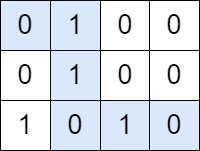
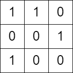

### 1. Description

You are given a **0-indexed** `m x n` **binary** matrix `grid`. You can move from a cell `(row, col)` to any of the cells $(row + 1, col)$ or $(row, col + 1)$.

Return `true`* if there is a path from *`(0, 0)`* to *$(m - 1, n - 1)$* that visits an **equal** number of *`0`*'s and *`1`*'s*. Otherwise return `false`.

### 2. Function Contract

**Inputs**

- `grid`: An $r \times c$ matrix ($2 \le r, c \le 100$) whose elements are `0` or `1`.

**Return value**

Return `True` if there exists at least one path from `(0, 0)` to $(r - 1, c - 1)$ with equal numbers of `0`s and `1`s; otherwise return `False`.

### 3. Examples

#### Example 1

- **Input:** `grid = [[0,1,0,0],[0,1,0,0],[1,0,1,0]]`
- **Output:** `true`
- **Explanation:** The path colored in blue in the above diagram is a valid path because we have 3 cells with a value of 1 and 3 with a value of 0. Since there is a valid path, we return true.
#### Example 2

- **Input:** `grid = [[1,1,0],[0,0,1],[1,0,0]]`
- **Output:** `false`
- **Explanation:** There is no path in this grid with an equal number of 0's and 1's.

### 4. Constraints

- $m = \text{grid.length}$

- $n = \text{grid}[i].length$

- $2 \le m, n \le 100$

- $\text{grid}[i][j]$ is either `0` or `1`.