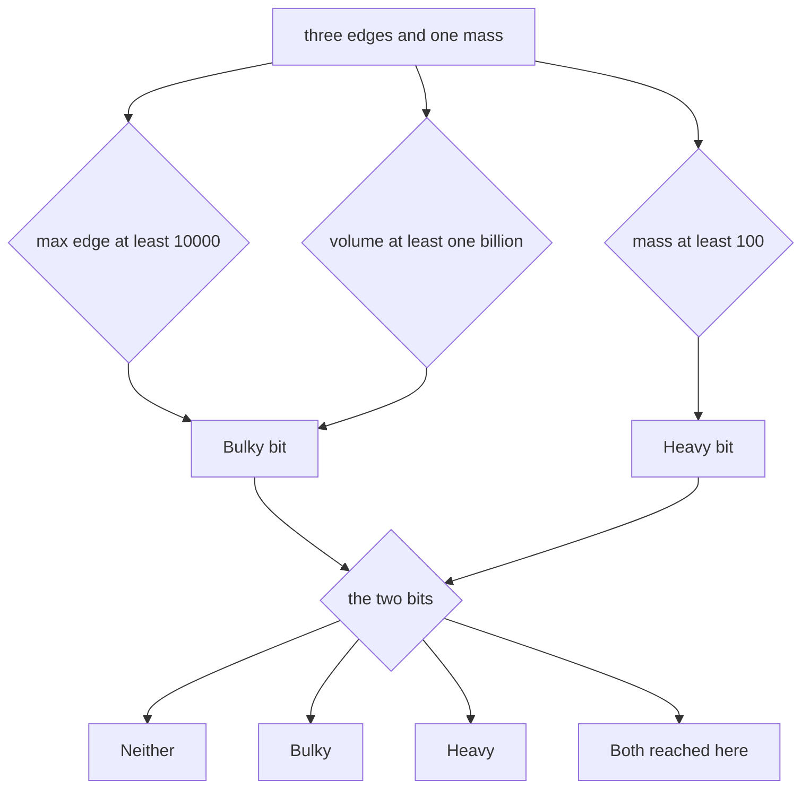

# Guided Example: Categorize Box According to Criteria

## 1. The decision is two independent yes/no questions

Four integers arrive — `length`, `width`, `height`, `mass` — and one of four category strings must go back out. The decisive structural observation is that the statement only ever asks **two** independent questions, and each of the four strings is one of the four possible pairs of answers.

| Predicate | Symbol | Fires when | Limit | Comparison used |
|---|---|---|---|---|
| Bulky | $B$ | at least one dimension reaches the dimension limit, or the volume reaches the volume limit | $10^{4}$ per dimension, $10^{9}$ for the volume | "greater or equal" |
| Heavy | $H$ | the mass reaches the mass limit | $100$ | "greater or equal" |

Everything else in the problem is naming: `"Both"` is the pair $(B, H) = (\text{true}, \text{true})$, `"Bulky"` is $(\text{true}, \text{false})$, `"Heavy"` is $(\text{false}, \text{true})$, and `"Neither"` is $(\text{false}, \text{false})$. No magnitude beyond the two limits ever reaches the output, which is why this is a classification problem rather than a measurement problem.

## 2. The box chosen for this walkthrough

The instance traced below is `length = 2000`, `width = 1000`, `height = 500`, `mass = 100`, whose required category is `"Both"`. It is chosen because it is bulky **through the volume route only** — every edge is far below the dimension limit — and simultaneously heavy **exactly at** the mass limit. It therefore exercises both bulky routes, the inclusive boundary, and the combination step in a single instance.

| Quantity | Role in the decision | Supplied value |
|---|---|---|
| `length` | one of the three candidates for the dimension test | 2000 |
| `width` | one of the three candidates for the dimension test | 1000 |
| `height` | one of the three candidates for the dimension test | 500 |
| `mass` | sole input of the Heavy predicate | 100 |

## 3. Collapsing the dimension clause into one comparison

"**Any** of the dimensions of the box is greater or equal to $10^{4}$" is an existential quantifier over three values, and an existential over a finite set is decided by its largest member:

$$
\exists\, d \in \{\texttt{length}, \texttt{width}, \texttt{height}\} : d \ge 10^{4}
\quad\Longleftrightarrow\quad
D \ge 10^{4},
\qquad
D = \max(\texttt{length}, \texttt{width}, \texttt{height}).
$$

For this box $D = \max(2000, 1000, 500) = 2000$, so each individual comparison is:

| Dimension | Value | Comparison | Satisfies $d \ge 10^{4}$? |
|:---|:---:|:---:|:---:|
| `length` | 2000 | $2000 < 10000$ | no |
| `width` | 1000 | $1000 < 10000$ | no |
| `height` | 500 | $500 < 10000$ | no |

The dimension route is closed. It is important to be precise about *why*: the criterion is per-edge, never an aggregate. A box measuring $3000 \times 3000 \times 3000$ has edges summing to $9000$, well under $10^{4}$, yet it is bulky through the volume route; conversely, no sum, average, or perimeter of the edges can decide this clause. Only the maximum can, because only the maximum witnesses or refutes an existential.

## 4. The volume route: a second, independent way to be bulky

The volume clause is a *disjunction* with the dimension clause, so bulky can still fire after the dimension route has failed. The volume is the triple product

$$
V = \texttt{length} \times \texttt{width} \times \texttt{height}.
$$

Evaluating it for this box, in the order the arithmetic is naturally performed:

| Step | Computation | Running value |
|:---|:---|:---:|
| multiply the first two edges | `2000 * 1000` | 2000000 |
| multiply by the third edge | `2000000 * 500` | 1000000000 |

The resulting $V = 10^{9}$ sits exactly on the volume limit. Collecting both routes:

| Bulky route | Test actually evaluated | Outcome |
|:---|:---|:---:|
| dimension route | $D \ge 10^{4}$, that is $2000 \ge 10000$ | false |
| volume route | $V \ge 10^{9}$, that is $1000000000 \ge 1000000000$ | **true** |
| disjunction | dimension route **or** volume route | $B = \text{true}$ |

So the box is bulky although no edge is even one fifth of the dimension limit. This is the single most informative fact about the instance: a disjunction of two tests is satisfied by one test, and the two tests look at completely different quantities.

## 5. Heavy is one inclusive comparison

The Heavy clause touches only `mass`:

$$
H = (\texttt{mass} \ge 100) = (100 \ge 100) = \text{true}.
$$

| Comparison | Substituted value | Holds? |
|:---|:---:|:---:|
| $\texttt{mass} \ge 100$ | `100 >= 100` | yes |

The phrase "greater or equal" is load-bearing rather than decorative: a box of mass exactly 100 is heavy, so a reading that sharpens this into a strict $>$ comparison loses the boundary case. This package pins the behaviour separately with a unit-sized box of mass 100 whose category is `"Heavy"`, and with a box of mass 99 that is `"Neither"`.

## 6. Combining the two truth values

Because the category is a function of the ordered pair $(B, H)$ alone, the whole output space is the four-row table below. The row reached by the traced box is the last one.

| $B$ (Bulky) | $H$ (Heavy) | Category returned | Reached by this box? |
|:---:|:---:|:---|:---:|
| false | false | `"Neither"` | no |
| true | false | `"Bulky"` | no |
| false | true | `"Heavy"` | no |
| true | true | `"Both"` | **yes** |

The order in which the two predicates are evaluated is irrelevant to the answer; only the pair matters. That independence is what makes the four strings a partition of the answer space rather than an ordered list of rules.

## 7. The invariant and why the classification is correct

The invariant maintained throughout the reasoning is:

> After the two predicates have been evaluated, the returned string is the unique label attached to the pair $(B, H)$, and no further information about the box is consulted.

Two properties make this invariant sufficient for correctness.

1. **Exhaustiveness.** $B$ and $H$ are each two-valued, so the pair ranges over exactly four assignments, and the four categories named in the statement enumerate exactly those four assignments. Every possible box therefore lands in a row.
2. **Mutual exclusivity.** The clauses are not four competing rules but one rule per pair: "both bulky and heavy" describes $(T,T)$, "bulky but not heavy" describes $(T,F)$, "heavy but not bulky" describes $(F,T)$, and "neither" describes $(F,F)$. No box can satisfy two of the descriptions, because a fixed pair of truth values cannot equal two different pairs.

Correctness of the answer then follows immediately: this box has $B = \text{true}$ from the volume route (section 4) and $H = \text{true}$ from the inclusive mass comparison (section 5). The only description matching $(T,T)$ is "both bulky and heavy", whose label is `"Both"`.

A useful way to see the structure is as a graded ladder under the two independent bits: flipping one predicate from false to true can only move the label upward, from `"Neither"` to `"Bulky"` or `"Heavy"`, and from either of those to `"Both"`. The label is monotone in the pair, which is exactly why answering on one predicate before evaluating the other is unsafe.

## 8. Boundary ladder: where equality decides the label

The limits in this problem are compared with "greater or equal", so every equality point is a genuine case rather than a formality. The table below walks the two limits from one unit below to the equality point, using inputs of the same shape as this package's authored cases.

| `length` | `width` | `height` | `mass` | Bulky route that fires | Category | Boundary lesson |
|:---:|:---:|:---:|:---:|:---|:---|:---|
| 9999 | 1 | 1 | 99 | none: $D = 9999 < 10^{4}$ and $V = 9999 < 10^{9}$ | `"Neither"` | one unit below the dimension limit is not bulky |
| 10000 | 1 | 1 | 99 | dimension: $D = 10^{4}$ exactly | `"Bulky"` | equality at the dimension limit counts |
| 1000 | 1000 | 999 | 99 | none: $V = 999000000 < 10^{9}$ | `"Neither"` | a million short of the volume limit is still short, and no edge is large |
| 1000 | 1000 | 1000 | 99 | volume: $V = 10^{9}$ exactly | `"Bulky"` | equality at the volume limit counts, with no large edge at all |
| 9999 | 10000 | 1 | 100 | dimension: $D = 10^{4}$ and mass equality | `"Both"` | the volume $99990000$ is irrelevant once a route has fired |
| 2000 | 1000 | 500 | 100 | volume: $V = 10^{9}$ and mass equality | `"Both"` | the box traced above |
| 1 | 1 | 1 | 99 | none | `"Neither"` | the smallest legal box is neither |
| 1 | 1 | 1 | 100 | none from shape, mass equality only | `"Heavy"` | heavy does not require bulk |

Reading the ladder from top to bottom shows that the two limits behave identically — inclusive at the equality point — and that bulky and heavy never interact except in the final selection of the label.

## 9. Rival readings eliminated by this instance

Each row of the next table names an interpretation that sounds plausible in prose and the instance that refutes it. All of the refuting inputs are legal under the stated constraints.

| Rival reading | Why it fails | Refuting box |
|:---|:---|:---|
| bulge is decided by the volume alone | the dimension clause is a separate route, so a long, thin box with a tiny volume would be missed | `(10000, 1, 1, 99)` |
| bulge is decided by the largest edge alone | a cube of side 1000 has no long edge yet reaches the volume limit exactly | `(1000, 1000, 1000, 99)` |
| the dimension test uses a strict $>$ | boxes sitting exactly on the limit would be downgraded | `(10000, 1, 1, 99)` |
| the mass test uses a strict $>$ | a mass of exactly 100 would be downgraded | `(1, 1, 1, 100)` |
| one aggregate of the edges decides bulge | $3000 + 3000 + 3000 = 9000 < 10^{4}$, yet the criterion is per edge | `(3000, 3000, 3000, 99)` |
| the label is fixed as soon as one predicate is known | this box is both, so an early heavy-only answer would be wrong | `(2000, 1000, 500, 100)` |
| the volume is computed in narrow fixed-width arithmetic | $10^{5} \times 10^{5} \times 10^{5} = 10^{15}$ exceeds a signed 32-bit range, and a wrapped product can fall below $10^{9}$ | `(100000, 100000, 100000, 99)` |

Two further details are worth stating because they are easy to get subtly wrong. First, the volume test is insensitive to the order of the three edges, since integer multiplication is commutative and associative, so no canonical ordering needs to be established. Second, the largest legal box has volume $10^{15}$, which is a constant number of machine words under a 64-bit integer model but not under a 32-bit one — the arithmetic width is part of the algorithm, not an implementation detail.

## 10. Time and auxiliary space

**Time.** The work consists of a fixed sequence of operations: three comparisons to obtain $D$, two multiplications to obtain $V$, one comparison against the dimension limit, one against the volume limit, one disjunction, one comparison against the mass limit, and a four-way selection of a constant string. That is a constant number of elementary operations regardless of how large the four inputs are, so the running time is

$$
\Theta(1).
$$

The inputs are bounded by the constraints $1 \le \texttt{length}, \texttt{width}, \texttt{height} \le 10^{5}$ and $1 \le \texttt{mass} \le 10^{3}$, and the arithmetic is on values of constant width, so no input-size term appears at all.

**Auxiliary space.** The reasoning stores exactly two boolean facts — whether the box is bulky and whether it is heavy — plus the constant four-entry label table. No collection grows with the input, so auxiliary space is

$$
\Theta(1).
$$

There is no need to sort, search, or enumerate anything: the two predicates are direct comparisons, and the classification is a two-bit lookup.
