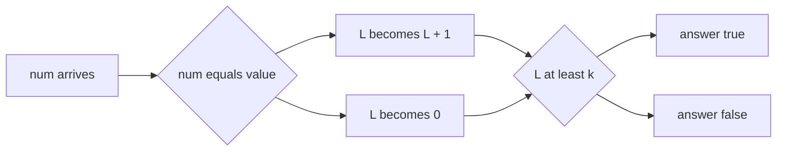

# Guided Example: Find Consecutive Integers from a Data Stream

## 1. What the stream object is really being asked

The object is created with a target `value` and a window length $k$. After that it sees one integer at a time, and after each arrival it must answer a single yes/no question: are the last $k$ integers seen — counting the integer that has just arrived — all equal to `value`?

Two facts about that question determine the whole design.

- The question is about a **window of fixed length $k$ anchored at the present**, so it is a suffix property, not a global property. Nothing before position $t - k$ can influence the answer at time $t$.
- The question asks whether **every** position in that window holds `value`, which is a conjunction of $k$ equality tests. A conjunction fails as soon as one test fails, and no amount of later matching can repair a failure that is still inside the window.

| Symbol | Meaning in this lesson |
|:---|:---|
| $a_1, a_2, \dots, a_t$ | the integers that have arrived so far, in arrival order |
| $t$ | how many integers have arrived, so the current window is positions $\max(1, t-k+1) \dots t$ |
| `value`, $k$ | the two constants fixed at construction |
| $L_t$ | the length of the longest suffix of $a_1 \dots a_t$ whose entries all equal `value` |

$L_t$ is the only state that matters, and the rest of this lesson derives why, then replays a stream through it.

## 2. The traced stream

The instance used below is `value = 4`, `k = 3`, with the arrival sequence $4, 4, 4, 3, 4, 4, 4$. Its first four arrivals are exactly the official sample, and its full length additionally demonstrates what a single mismatch does to the accumulated state and whether the object can recover afterwards.

| Call index $t$ | Method invoked | `num` | Required result |
|:---:|:---|:---:|:---:|
| 0 | constructor with `value = 4`, `k = 3` | — | `null` (returns nothing) |
| 1 | `consec` | 4 | `false` |
| 2 | `consec` | 4 | `false` |
| 3 | `consec` | 4 | `true` |
| 4 | `consec` | 3 | `false` |
| 5 | `consec` | 4 | `false` |
| 6 | `consec` | 4 | `false` |
| 7 | `consec` | 4 | `true` |

The required results are the ones this package records for the same command and argument sequence, so the arithmetic below can be checked against them line by line.

## 3. What a memorised window would cost, and what replaces it

The direct reading of the statement is: keep the last $k$ arrivals, and after each arrival compare all of them with `value`. That works, but it stores $k$ items and re-examines $k$ of them per call, which is $\Theta(k)$ work per arrival. The structure of the question allows something much smaller.

For the traced stream, the literal window at each step looks like this:

| $t$ | Window of last $k = 3$ positions | Every position equals 4? | Naive per-call comparisons |
|:---:|:---|:---:|:---:|
| 1 | `[4]` (fewer than $k$ positions) | no, the window is not even full | 1 |
| 2 | `[4, 4]` (fewer than $k$ positions) | no, the window is not even full | 2 |
| 3 | `[4, 4, 4]` | yes | 3 |
| 4 | `[4, 4, 3]` | no, position 4 holds 3 | 3 |
| 5 | `[4, 3, 4]` | no, position 4 holds 3 | 3 |
| 6 | `[3, 4, 4]` | no, position 4 holds 3 | 3 |
| 7 | `[4, 4, 4]` | yes | 3 |

Notice what changes between consecutive rows. Moving from $t$ to $t+1$ adds one position at the right and drops at most one at the left; the interior is untouched. So the all-equal test over the new window is the all-equal test over the old window *restricted*, unless the arrival was itself unequal to `value`. That is the observation that collapses the $\Theta(k)$ scan into a constant number of operations, and the compact state that captures it is the suffix length $L_t$ rather than the window itself.

## 4. The state invariant and its transition

The definition of the maintained state is

$$
L_t = \max \{\, \ell \ge 0 \;:\; a_{t-\ell+1} = a_{t-\ell+2} = \dots = a_t = \texttt{value} \,\},
$$

that is, the number of trailing arrivals that are all equal to `value`. The transition on arrival $a_{t+1}$ follows from that definition alone:

$$
L_{t+1} =
\begin{cases}
L_t + 1, & a_{t+1} = \texttt{value},\\[2pt]
0, & a_{t+1} \ne \texttt{value}.
\end{cases}
$$

The second branch is the interesting one. When a non-matching integer arrives, it enters the window and becomes the newest element of every suffix that contains it, so the longest all-`value` suffix is the empty one and the length is exactly $0$ — the entire previous run is discarded, not merely shortened by one.

## 5. Replaying the traced stream

With `value = 4` and $k = 3$, the state evolves as follows. The "before" column is the counter carried into the call and the "after" column is the counter once the arrival has been absorbed.

| $t$ | `num` | `num == value`? | $L$ before | $L$ after | $L \ge k$? | Returned |
|:---:|:---:|:---:|:---:|:---:|:---:|:---:|
| 1 | 4 | yes | 0 | 1 | $1 \ge 3$ false | `false` |
| 2 | 4 | yes | 1 | 2 | $2 \ge 3$ false | `false` |
| 3 | 4 | yes | 2 | 3 | $3 \ge 3$ true | `true` |
| 4 | 3 | no | 3 | 0 | $0 \ge 3$ false | `false` |
| 5 | 4 | yes | 0 | 1 | $1 \ge 3$ false | `false` |
| 6 | 4 | yes | 1 | 2 | $2 \ge 3$ false | `false` |
| 7 | 4 | yes | 2 | 3 | $3 \ge 3$ true | `true` |

Three features of this trace are worth isolating.

- At $t = 3$ the counter reaches $k$ for the first time and the answer flips to `true`. Positions 1, 2, 3 are the whole stream, and they are all 4.
- At $t = 4$ the single arrival of 3 destroys the accumulated run: $L$ goes from 3 to 0 in one step. The counter is not a count of matching integers ever seen; it is the length of a suffix, and a suffix ending in 3 cannot consist of 4s.
- The answer at $t = 5$ is `false` even though 4 has now arrived four times in total. The window at $t = 5$ is positions 3, 4, 5, namely $4, 3, 4$, and position 4 breaks the conjunction. Only after two more matching arrivals, at $t = 7$, is the window $4, 4, 4$ again and the answer `true`.

## 6. Why $L_t \ge k$ is exactly the required predicate

The claim to prove is that the returned boolean is `true` if and only if the last $k$ integers parsed are all equal to `value`. Two implications, both read directly off the definition of $L_t$.

| Direction | Assumption | Consequence |
|:---|:---|:---|
| soundness | $L_t \ge k$ | by definition of $L_t$, positions $t - L_t + 1$ through $t$ all hold `value`; the last $k$ positions $t-k+1 \dots t$ lie inside that suffix because $t - k + 1 \ge t - L_t + 1$; every one of them therefore holds `value`, so the answer is `true` |
| completeness | $L_t < k$ | if $t \ge k$ then position $t - L_t$ exists, lies within the last $k$ positions, and by maximality of $L_t$ does not hold `value`, so the conjunction fails; if $t < k$ the window is not full, and the problem states the condition does not hold, so the answer is `false` |

The second row is where the "fewer than $k$ integers" rule comes from, and it needs no special branch in the state machine: since a suffix is at most as long as the stream, $L_t \le t$, so $t < k$ already forces $L_t < k$ and the comparison in section 4 reports `false` on its own. This is an example of a boundary condition that is *implied* by the invariant rather than handled separately.

The state machine is correct by construction as well. After the transition, $L_{t+1}$ equals the length of the longest all-`value` suffix of $a_1 \dots a_{t+1}$: appending a matching value extends the previous longest suffix by one, and appending anything else leaves only the empty suffix. The counter is therefore an exact representation of the property defined in section 4 at every point in the stream.

## 7. Alternative states that were rejected

Several plausible designs satisfy the interface but either cost more or compute the wrong predicate. The table contrasts them with the suffix counter.

| Design | Space | Cost per call | Why it is rejected |
|:---|:---|:---|:---|
| queue of the last $k$ arrivals, scanned per call | $\Theta(k)$ | $\Theta(k)$ | correct but pays $k$ comparisons per arrival for information the suffix length already encodes |
| sliding count of matches inside the window | $\Theta(k)$ for the window, $\Theta(1)$ count arithmetic | $\Theta(1)$ amortised | still buffers $k$ integers and must evict the element leaving the window |
| total count of arrivals equal to `value` since the beginning | $\Theta(1)$ | $\Theta(1)$ | wrong predicate: on $4, 3, 4, 4$ with $k = 3$ the total is 3, yet the last three are $4, 4, 3$ and the answer must be `false` |
| total count that is incremented on every call | $\Theta(1)$ | $\Theta(1)$ | also wrong: it ignores $k$ entirely and would answer `true` forever after the first match |
| index of the most recent arrival unequal to `value` | $\Theta(1)$ | $\Theta(1)$ | correct and equivalent, since $L_t = t - m_t$ where $m_t$ is that index (or $0$ when none exists), but it stores an absolute index where a small bounded counter suffices |
| store the whole stream and re-scan the tail | $\Theta(t)$ | $\Theta(k)$ per call | unbounded memory; the stream may reach $10^{5}$ arrivals |

The last correct row and the suffix counter are two encodings of the same invariant, related by the identity $L_t = t - m_t$. The suffix counter additionally stays bounded by $k$ for the purpose of the comparison, because the returned boolean only depends on whether the counter has reached $k$.

## 8. Boundary behaviour exposed by the authored cases

Every row of this table is an input recorded in this package together with its required results, and each one isolates a different edge of the contract.

| `value` | $k$ | Arrival sequence | Required results | The boundary it isolates |
|:---:|:---:|:---|:---|:---|
| 4 | 3 | 4, 4, 4, 3 | `false, false, true, false` | the official sample: the window fills, succeeds, then fails on the first mismatch |
| 4 | 3 | 4, 4, 4, 3, 4, 4, 4 | `false, false, true, false, false, false, true` | recovery after a reset; the run must be rebuilt from zero, not resumed |
| 7 | 1 | 7, 6, 7 | `true, false, true` | $k = 1$: the answer is simply whether the newly parsed integer equals `value`, including on the very first call |
| 2 | 2 | 2, 2, 2, 2, 1 | `false, true, true, true, false` | a long run keeps answering `true` past the threshold, and one mismatch ends it |
| 9 | 3 | 9, 8, 9, 8, 9, 8 | `false` six times | isolated matches never accumulate: the counter is reset before it can ever reach 3 |
| 1000000000 | 3 | 1000000000, 1000000000, 999999999, 1000000000, 1000000000 | `false` five times | the largest legal value behaves like any other; only equality is tested, so values near $10^{9}$ need no arithmetic at all |

Two further consequences follow from the invariant rather than from a case.

- **The first $k-1$ calls must answer `false`.** The window cannot be full before $k$ arrivals have happened, and $L_t \le t \le k-1 < k$.
- **The answer is not monotone across calls.** It can be `true` at one call and `false` at the next, as the traced stream shows at $t = 3$ and $t = 4$. Any implementation that latches a `true` result, or that treats the counter as never decreasing, will fail the fourth call of the sample.

## 9. Time and auxiliary space

**Time per call.** One equality test between `num` and `value`, one conditional update of the counter (either reset to `0` or increment by one), and one comparison of the counter with $k$. That is a fixed number of elementary operations, independent of $k$, of the stream length, and of the magnitude of the values, so each call costs

$$
\Theta(1).
$$

Over a session of $n$ calls the total is $\Theta(n)$, which for the stated limit of at most $10^{5}$ calls is linear in the input size — the best possible, since every call must at least read its argument. The naive window design would instead cost $\Theta(nk)$ overall, with $k$ up to $10^{5}$.

**Auxiliary space.** The object stores exactly three things: the target `value`, the threshold $k$, and the counter $L$. The values are stored once at construction and the counter is a single non-negative integer that never exceeds the current stream length and is only ever compared against $k$. Nothing grows with the number of arrivals, so auxiliary space is

$$
\Theta(1),
$$

independent of both $n$ and $k$.