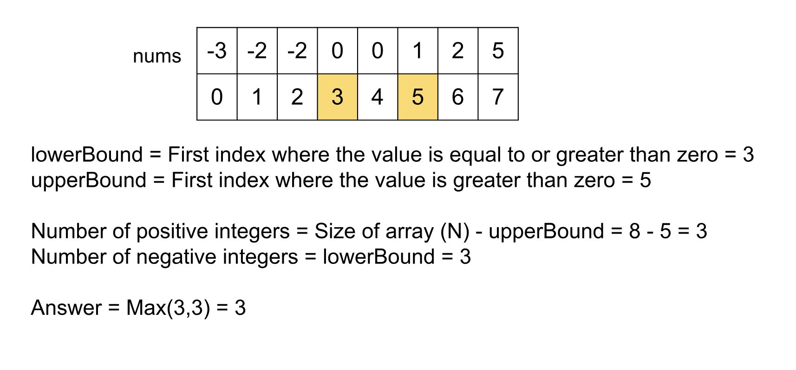

## Solution

---

### Overview

We are given an array of $N$ integers, which may contain positive, negative, or zero values. The array is sorted in non-decreasing order. The task is to count the number of positive and negative integers, and then return the greater of the two counts. Note that zero is considered neither a positive nor a negative integer.

---

### Approach 1: Brute Force

#### Intuition

This is the brute-force approach, where we count the number of positive and negative integers by iterating through each element of the array. During the iteration, we increment `positiveCount` for each integer greater than zero and `negativeCount` for each integer less than zero.

Finally, we return the greater of the two variables, `positiveCount` and `negativeCount`.

#### Algorithm

1. Initialize the variables `positiveCount` and `negativeCount` to `0`.
2. Iterate over the array `nums` and for each integer `num` do the following:

- Increment the variable `positiveCount` if `num` is greater than `0`.
- Increment the variable `negativeCount` if `num` is less than `0`.

3. Return the max of the two variables `positiveCount` and `negativeCount`.

#### Implementation

```python
class Solution:
    def maximumCount(self, nums):
        positive_count = 0
        negative_count = 0

        for num in nums:
            if num > 0:
                positive_count += 1
            elif num < 0:
                negative_count += 1

        return max(positive_count, negative_count)
```

#### Complexity Analysis

Here, $N$ is the number of integers in the array `nums`.

- Time complexity: $O(N)$

  We need to iterate over each integer in the array `nums` and hence the time complexity is equal to $O(N)$.

- Space complexity: $O(1)$

  No extra space is required apart from the two variables, `positiveCount` and `negativeCount`, and hence the total space complexity is constant.

---

### Approach 2: Binary Search

#### Intuition

In the previous approach, we did not utilize an important property of the problem: the array is sorted in non-decreasing order. One of the typical algorithms that leverages a sorted array is binary search. Let's explore how we can apply binary search to solve this problem.

The array contains negative, positive, and zero integers, and because it is ordered, the zeros will be positioned in the middle, separating the negative and positive integers. To count the number of negative and positive integers, observe that all the integers before the first zero are negative, and all the integers after the last zero are positive. This observation is key: if we can find the indices of the first and last zeros in the array, we can easily determine the counts of positive and negative integers.

If the first zero is located at index `x`, then there are `x` negative integers (from index `0` to $x - 1$). Similarly, if the last zero is at index `y`, there are $N - y - 1$ positive integers (from index $y + 1$ to $N - 1$).

In languages like C++, we have built-in functions such as $\text{lower}_{bound}()$ and $\text{upper}_{bound}()$ that can be used to find these indices directly. To improve readability, we will implement these functions ourselves. The `lowerBound()` function will return the first index in the array where the value is greater than or equal to zero, and the `upperBound()` function will return the first index where the value is strictly greater than zero.

The number of positive integers, `positiveCount,` will be equal to $N - upperBound()$, since `upperBound()` returns the first index where the value is greater than zero. Similarly, the number of negative integers, `negativeCount`, will be equal to `lowerBound()`, as `lowerBound()` returns the first index where the value is greater than or equal to zero.

The implementations of `lowerBound(nums)` and `upperBound(nums)` are similar. For `lowerBound(nums)`, we perform a binary search with $start = 0$ and $end = \text{nums.size} - 1$. In each iteration, we calculate the `mid` index as $(start + end) / 2$:
-    If $\text{nums}[mid]$ is less than `0`, the first non-negative value must be to the right, so we update `start` to $mid + 1$ to search the higher range.
-    If $\text{nums}[mid]$ is greater than or equal to `0`, `mid` could be the index we are looking for, so we store it as a candidate answer in `index`. Then, we continue searching to the left by updating `end` to $mid - 1$ to check whether there is another non-negative value before $\text{nums}[mid]$.

This process continues until the search space is exhausted. If you want to learn more details, please read the [Binary Search Explore Card](https://leetcode.com/explore/learn/card/binary-search/).

Once we have determined the counts of positive and negative integers using binary search, we can return the greater of the two counts, as we did in the previous approach.



#### Algorithm

1. Define `lowerBound(nums)` function to find the first index where the value is equal to or greater than zero.

- Initialize $start = 0$, $end = \text{nums.size} - 1,$ and $index = \text{nums.size}$.
- Perform a binary search:
- If the middle element ($\text{nums}[mid]$) is negative, move `start `to $mid + 1$ to search for non-negative integers in the higher range.
- Otherwise, the middle element ($\text{nums}[mid]$) is non-negative:
-    Move `end` to $mid - 1$ to search for the **first** non-negative element in the lower range.
-    Update `index` to `mid`.
- Return `index`, which represents the first index where a non-negative value appears.

2. Define `upperBound(nums)` function to find the first index where the value is strictly greater than zero.
- Initialize $start = 0$, $end = \text{nums.size} - 1$, and $index = \text{nums.size}$.
- Perform a binary search:
- If the middle element ($\text{nums}[mid]$) is less than or equal to zero, move `start` to $mid + 1$ to search for positive values in the higher range.
- Otherwise, the middle element ($\text{nums}[mid]$) is greater than zero:
- Move `end` to $mid - 1$, to search for the **first** positive value in the lower range.
- Update `index` to `mid`.
- Return `index`, which represents the first index where a positive value appears.

3. Subtract the result of `upperBound(nums)` from the total array size to get the number of positive integers (`positiveCount`).
4. Call `lowerBound(nums)`, which directly gives the count of negative integers (`negativeCount`).
5. Return the maximum of `positiveCount` and `negativeCount`.

#### Implementation

```python
class Solution:
    # Return the first index where the value is equal to or greater than zero.
    def lower_bound(self, nums):
        start, end = 0, len(nums) - 1
        index = len(nums)

        while start <= end:
            mid = (start + end) // 2

            if nums[mid] < 0:
                start = mid + 1
            else:
                end = mid - 1
                index = mid

        return index

    # Return the first index where the value is greater than zero.
    def upper_bound(self, nums):
        start, end = 0, len(nums) - 1
        index = len(nums)

        while start <= end:
            mid = (start + end) // 2

            if nums[mid] <= 0:
                start = mid + 1
            else:
                end = mid - 1
                index = mid

        return index

    def maximumCount(self, nums):
        # All integers from the first non-zero to last will be positive
        # integers.
        positiveCount = len(nums) - self.upper_bound(nums)
        # All integers from the index 0 to index before the first zero index
        # will be negative.
        negativeCount = self.lower_bound(nums)

        return max(positiveCount, negativeCount)
```

#### Complexity Analysis

Here, $N$ is the number of integers in the array `nums`.

- Time complexity: $O(\log N)$

  We perform binary search twice to find the lower and upper bounds for `0`. At each step of the binary search, we discard half of the array, narrowing down the search range for the index we are looking for. Hence, the total time complexity is  $O(\log N)$.

- Space complexity: $O(1)$

  No extra space is required apart from a few variables and hence the total space complexity is constant.

---