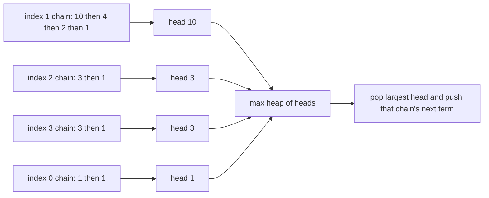

# Guided Example: Maximal Score After Applying K Operations

## 1. What one operation does, and what a strategy really chooses

Each operation names an index $i$, adds $\text{nums}[i]$ to the score, and then replaces that entry by $\lceil \text{nums}[i]/3 \rceil$, the least integer greater than or equal to one third of it. Exactly $k$ operations must be applied, and the total must be as large as possible.

A first, decisive observation is that the *order* of the chosen indices is irrelevant. The value an entry holds the $r$-th time it is chosen depends only on how many times it has already been chosen, never on when those choices happened relative to other indices being chosen. So a strategy is nothing more than a multiplicity vector $(m_1, \dots, m_n)$ with

$$
m_1 + m_2 + \dots + m_n = k,
\qquad m_i \ge 0,
$$

where $m_i$ counts how often index $i$ is chosen. The score of that strategy is fully determined by the vector, so the problem is a *selection* problem: decide how many times each index is used.

The instance traced below is `nums = [1, 10, 3, 3, 3]` with $k = 3$, whose required score is 17. It is chosen because the best strategy uses one index twice — so a plan that consumes every index at most once is already refuted — and because the ceiling is strict on the first replacement ($10$ becomes $4$, not $3$).

| Index $i$ | `nums[i]` | Reaches the ceiling strictly? |
|:---:|:---:|:---|
| 0 | 1 | no: $\lceil 1/3 \rceil = 1$, a fixed point |
| 1 | 10 | yes: $\lceil 10/3 \rceil = 4$ while $10/3 = 3.33\ldots$ |
| 2 | 3 | no: $\lceil 3/3 \rceil = 1$ exactly |
| 3 | 3 | no: $\lceil 3/3 \rceil = 1$ exactly |
| 4 | 3 | no: $\lceil 3/3 \rceil = 1$ exactly |

## 2. Each index generates a non-increasing chain

Repeated ceiling division composes exactly. For positive integers $x$, $a$, and $b$,

$$
\left\lceil \frac{\lceil x/a \rceil}{b} \right\rceil = \left\lceil \frac{x}{ab} \right\rceil ,
$$

because both sides equal the least integer $t$ with $x \le abt$: the condition $\lceil x/a \rceil \le bt$ is equivalent to $x \le a \cdot bt$ precisely when $bt$ is an integer. Applying this identity $r-1$ times shows that the value collected the $r$-th time index $i$ is chosen is

$$
c_{i,r} = \left\lceil \frac{\text{nums}[i]}{3^{\,r-1}} \right\rceil ,
$$

independently of the rest of the schedule. Each index therefore contributes an infinite non-increasing chain $c_{i,1} \ge c_{i,2} \ge c_{i,3} \ge \dots$, and because $\lceil 1/3 \rceil = 1$, every chain eventually reaches the fixed point $1$ and stays there.

| Chain | Values $c_{i,1}, c_{i,2}, c_{i,3}, \dots$ | Behaviour |
|:---|:---|:---|
| index 0 (`nums[0] = 1`) | 1, 1, 1, $\dots$ | constant at the fixed point from the very first term |
| index 1 (`nums[1] = 10`) | 10, 4, 2, 1, 1, $\dots$ | three strict decreases, then constant |
| index 2 (`nums[2] = 3`) | 3, 1, 1, $\dots$ | one decrease, then constant |
| index 3 (`nums[3] = 3`) | 3, 1, 1, $\dots$ | one decrease, then constant |
| index 4 (`nums[4] = 3`) | 3, 1, 1, $\dots$ | one decrease, then constant |

The score of a multiplicity vector is then the sum of a *prefix* of each chain:

$$
\text{score}(m_1, \dots, m_n) = \sum_{i=1}^{n} \sum_{r=1}^{m_i} c_{i,r}.
$$

Choosing index $i$ for the $r$-th time without having chosen it $r-1$ times before is impossible, so the selected terms always form a prefix of every chain they touch. The task has become: pick exactly $k$ terms from the union of the chains, respecting prefix closure, with the largest possible total.

## 3. The largest remaining term sits at a chain head

A chain is non-increasing, so for every index the largest term that has not yet been selected is its *head*: the first unselected term. This gives the structural lemma the algorithm depends on.

> At every moment, the largest unselected term among all chains is the largest of the current heads.

Consequently a max-priority queue holding one head per index can enumerate the terms of the union in non-increasing order: pop the largest head, record it, then insert the next term of that same chain, which is at most the term just removed. The heap never needs to look deeper into a chain, because a deeper term is dominated by the head of its own chain.

## 4. Replaying the instance

The heap starts with every $c_{i,1}$, which is simply the whole array. Each operation removes the largest head, adds it to the score, and inserts the next term of the same chain. Only two entries change per operation: the one popped and the one inserted.

| Operation | Heap multiset before the pop | Popped value | Inserted next term | Score after | Terms taken so far |
|:---:|:---|:---:|:---:|:---:|:---|
| 1 | $\{10, 3, 3, 3, 1\}$ | 10 | $\lceil 10/3 \rceil = 4$ | 10 | 10 |
| 2 | $\{4, 3, 3, 3, 1\}$ | 4 | $\lceil 10/9 \rceil = 2$ | 14 | 10, 4 |
| 3 | $\{3, 3, 3, 2, 1\}$ | 3 | $\lceil 3/3 \rceil = 1$ | 17 | 10, 4, 3 |
| — | $\{3, 3, 2, 1, 1\}$ after the last insertion | — | — | **17** | final state |

The sequence of collected values is $10, 4, 3$, and the corresponding multiplicity vector is $(m_0, m_1, m_2, m_3, m_4) = (0, 2, 1, 0, 0)$: index 1 is used twice, index 2 once. The collected sequence is non-increasing, which is the visible signature of the lemma in section 3.

Note where the third operation goes. After two operations the heap holds $\{4, 3, 3, 3, 1\}$, and $4 > 3$, so the greedy takes the twice-reduced chain again rather than starting a fresh $3$. That is why the score is 17 instead of $10 + 3 + 3 = 16$, and why taking the three largest initial values is not enough.

## 5. The invariant and the correctness argument

The invariant maintained by the method is:

> Before each operation, the heap contains exactly one entry per index — the head of that chain — so the multiset of heap values is the multiset of largest unselected terms of the chains.

This is preserved by the update: popping a head leaves that chain represented by its next term, which is the new largest unselected term of that chain, while every other chain is untouched.

**Upper bound.** Any feasible strategy selects $k$ terms respecting prefix closure. Its total is at most the sum of the $k$ largest terms of the union of all chains, since a feasible selection is a selection of $k$ terms, and no selection of $k$ terms can beat the $k$ largest.

**Achievability.** The heap enumerates the terms of the union in non-increasing order, by the lemma of section 3 applied inductively: each pop returns the largest unselected term overall. The first $k$ pops are therefore exactly the $k$ largest terms, and they are automatically prefix-closed, because within a chain a term can only appear after every larger term of the same chain has already been popped. Hence the greedy total equals the upper bound and no other strategy can exceed it, which proves optimality.

Two consequences of the argument are worth stating explicitly. First, ties never need a special rule: equal heads may be popped in any order, and the multiset of the first $k$ terms is unaffected. Second, the greedy is not "locally optimal only" — the bound is global, because the terms it selects are precisely the top $k$ of a fixed multiset.

## 6. Boundary instances and the traps they expose

Every row below is an authored case of this package with its required score; each isolates one way the reasoning can fail.

| `nums` | $k$ | Required score | Best multiplicity vector | The trap it exposes |
|:---|:---:|:---:|:---|:---|
| `[10, 10, 10, 10, 10]` | 5 | 50 | $(1,1,1,1,1)$ | ties: the cheapest plan spends one operation per index and never reduces anything; chains are $10, 4, 2, 1, 1$ |
| `[1, 10, 3, 3, 3]` | 3 | 17 | $(0,2,1,0,0)$ | reuse: the best plan returns to index 1, and a static sort of the input gives only 16 |
| `[1]` | 5 | 5 | $(5)$ | the fixed point: after the first operation the entry is already 1 and every later operation still yields 1 |
| `[10]` | 3 | 16 | $(3)$ | a single chain under ceiling: $10 + 4 + 2$, where truncating division would give $10 + 3 + 1 = 14$ |
| `[8, 1, 1]` | 2 | 11 | $(1,1,0)$ | the replacement 3 from the chain of 8 still outranks the untouched 1s |
| `[9, 9, 1]` | 3 | 21 | $(2,1,0)$ | competing chains: the best plan takes 9, 9 from the two large chains, then 3 from one of them |
| `[1000000000]` | 2 | 1333333334 | $(2)$ | the ceiling near the upper bound: $\lceil 10^{9}/3 \rceil = 333333334$ |
| `[2, 2]` | 5 | 7 | $(3,2)$ | $k$ larger than the number of indices: operations continue on chains that have already reached 1 |

Reading the column of multiplicity vectors shows the shape of the answer: large values are drained first, and once all chains have collapsed to 1 the remaining operations are worth exactly 1 each.

## 7. Rejected alternatives

| Alternative | Cost | Why it fails or is not used |
|:---|:---|:---|
| sort once, take the $k$ largest initial values | $\Theta(n \log n)$ | ignores the replacement: on `[1, 10, 3, 3, 3]` with $k = 3$ it returns 16 instead of 17 |
| truncating division instead of the ceiling | $\Theta(n \log n)$ with a heap | the value after a pick is too small: on `[10]` with $k = 3$ it returns 14 instead of 16 |
| ceiling computed through floating point | same order | exact for the stated bound, but the integer identity $\lceil x/3 \rceil = \lfloor (x+2)/3 \rfloor$ is exact for every non-negative integer and removes the rounding question entirely |
| scan the array for the maximum on every operation | $\Theta(nk)$ | up to $10^{10}$ comparisons at the stated limits |
| keep a sorted list and re-sort after each replacement | $\Theta(k n \log n)$ | the replacement moves one entry; a heap restores the order in one logarithmic step |
| always re-pick the index just reduced | $\Theta(k)$ | wrong whenever another entry is larger: on the traced instance the third operation must take a 3 from another index once the chain of 10 has fallen to 2 |
| stop early once all entries are 1 and add $k - t$ | $\Theta(n + k)$ in the worst case | correct in value, but it is a special case of the heap method rather than a simplification; the heap already yields 1 per remaining operation |

## 8. Time and auxiliary space

**Time.** Building the heap from the $n$ initial heads costs $\Theta(n)$ with a bottom-up heap construction, and each of the $k$ operations performs one pop and one push, each $\Theta(\log n)$. The total is

$$
\Theta(n + k \log n),
$$

which for $n, k \le 10^{5}$ is comfortably fast; a linear scan per operation would instead cost $\Theta(nk)$ and is the reason a priority queue is the natural structure here. The chain terms themselves are never precomputed: only one term per chain exists in the structure at any time.

**Auxiliary space.** The heap holds exactly $n$ entries, one per index, throughout the process, together with the constant-size score accumulator. No chain is materialised beyond its head, and no history of operations is stored, so the auxiliary space is

$$
\Theta(n),
$$

which is the size of the input array itself and cannot be avoided, since every index must remain a candidate for future operations. The score is a sum of at most $k$ values each below $10^{9}$, so it needs a 64-bit integer rather than a 32-bit one.
