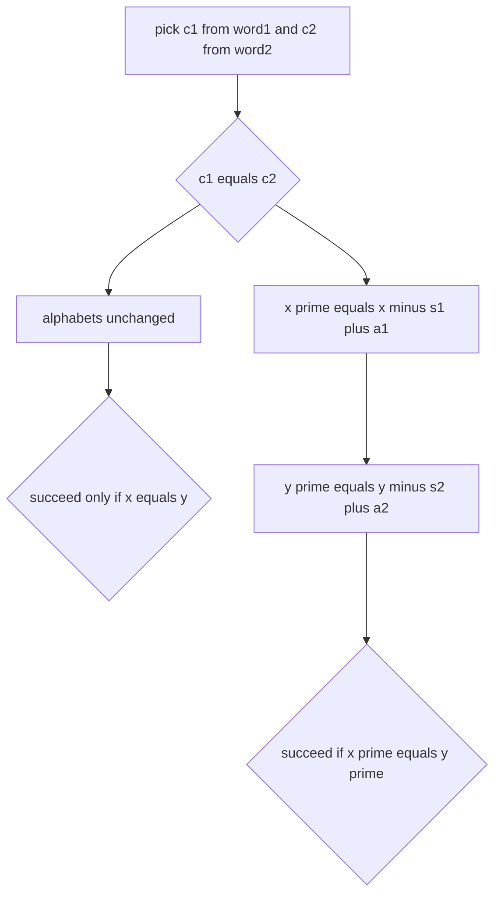

# Guided Example: Make Number of Distinct Characters Equal

## 1. Index identity versus value identity

A move chooses one index $i$ in `word1` and one index $j$ in `word2` and exchanges the two characters found there. What the answer depends on, however, is not the *positions* chosen but the *values* exchanged: swapping the characters `a` and `c` into each other's string has the same effect no matter which occurrence of `a` and which occurrence of `c` were picked. This is the first simplification of the problem.

Write $\Sigma_1$ and $\Sigma_2$ for the sets of characters appearing in the two strings (their *alphabets*, as sets of values), and let

$$
x = \lvert \Sigma_1 \rvert, \qquad y = \lvert \Sigma_2 \rvert .
$$

A move is then described by a pair of values $(c_1, c_2)$ with $c_1 \in \Sigma_1$ and $c_2 \in \Sigma_2$: `word1` loses one occurrence of $c_1$ and gains one occurrence of $c_2$, while `word2` loses one occurrence of $c_2$ and gains one occurrence of $c_1$. The characters $c_1$ and $c_2$ need not be different, and that degenerate case behaves unlike every other one.

The instance traced below is `word1 = "abcc"` and `word2 = "aab"`, whose required answer is `true`. It is the most informative of the small cases, because the successful move is discovered only after several tempting pairs are eliminated, and because one of the two successful pairs is the one the statement's own example uses.

| Character | Count in `word1` | In $\Sigma_1$? | Count in `word2` | In $\Sigma_2$? |
|:---:|:---:|:---:|:---:|:---:|
| `a` | 1 | yes | 2 | yes |
| `b` | 1 | yes | 1 | yes |
| `c` | 2 | yes | 0 | no |

So $x = 3$ and $y = 2$: the two strings differ by exactly one distinct character before any move.

## 2. The four facts that decide a move

Only presence and singleton status matter, because removing one occurrence of a character changes the alphabet only when that character occurred exactly once, and adding one occurrence changes the alphabet only when the character was absent. For a pair $(c_1, c_2)$ with $c_1 \ne c_2$, define

| Symbol | Meaning | Value |
|:---:|:---|:---|
| $s_1$ | does $c_1$ occur exactly once in `word1`? | $1$ if yes, else $0$ |
| $a_1$ | is $c_2$ absent from `word1`? | $1$ if yes, else $0$ |
| $s_2$ | does $c_2$ occur exactly once in `word2`? | $1$ if yes, else $0$ |
| $a_2$ | is $c_1$ absent from `word2`? | $1$ if yes, else $0$ |

The new distinct counts are then

$$
x' = x - s_1 + a_1, \qquad y' = y - s_2 + a_2,
$$

and the move succeeds exactly when $x' = y'$. Writing $\delta_1 = a_1 - s_1$ and $\delta_2 = a_2 - s_2$ for the two changes, that test is the single equation

$$
\delta_2 - \delta_1 = x - y .
$$

Each of $s_1, a_1, s_2, a_2$ is a Boolean fact about the two multiplicities `cnt1[c1]`, `cnt1[c2]`, `cnt2[c2]`, `cnt2[c1]`; no other information about the strings is ever needed.

Because $a_1 - s_1$ and $a_2 - s_2$ each lie in $\{-1, 0, 1\}$, a necessary condition for any distinct-character move is

$$
\lvert x - y \rvert \le 2 ,
$$

which already rules out strings whose distinct counts differ by three or more, whatever their characters are.

## 3. The same-character move is a different rule

If $c_1 = c_2 = c$, then `word1` loses one `c` and immediately regains one `c`, and the same happens in `word2`. Both multiplicities, both alphabets, and therefore both distinct counts are untouched:

| Chosen pair | What changes in `word1` | What changes in `word2` | Distinct counts afterwards |
|:---|:---|:---|:---|
| $(c, c)$ with $c$ in both alphabets | count of `c` unchanged, alphabet unchanged | count of `c` unchanged, alphabet unchanged | $x$ and $y$, exactly as before |

So the same-character move is available precisely when the two strings share at least one character, and it succeeds precisely when $x = y$ already. It is never a way to *change* a count; it is only a way to satisfy "exactly one move" without disturbing a tie that already exists. An analysis that feeds this case through the formulas of section 2 would subtract $s_1$ and $s_2$ for a character that is instantly restored, and would sometimes claim an equality that no real move can produce.

## 4. Enumerating the candidate moves

The alphabet is fixed at 26 lowercase letters, so at most $26 \times 26$ character pairs need consideration — an exhaustive enumeration that costs nothing.

**Same-character pairs available here.** The two strings share `a` and `b`, so the pairs $(a,a)$ and $(b,b)$ are legal.

| Pair | Counts before | Counts after | Equal? |
|:---:|:---:|:---:|:---:|
| $(a, a)$ | $x = 3$, $y = 2$ | $x' = 3$, $y' = 2$ | no |
| $(b, b)$ | $x = 3$, $y = 2$ | $x' = 3$, $y' = 2$ | no |

Since $x \ne y$, no same-character move can work here.

**Distinct-character pairs.** For each legal pair with $c_1 \ne c_2$ the four facts of section 2 give the two new counts directly.

| $c_1$ | $c_2$ | $s_1$ | $a_1$ | $x' = x - s_1 + a_1$ | $s_2$ | $a_2$ | $y' = y - s_2 + a_2$ | Equal? |
|:---:|:---:|:---:|:---:|:---:|:---:|:---:|:---:|:---:|
| `a` | `b` | 1 | 0 | $3 - 1 + 0 = 2$ | 1 | 0 | $2 - 1 + 0 = 1$ | no |
| `b` | `a` | 1 | 0 | $3 - 1 + 0 = 2$ | 0 | 0 | $2 - 0 + 0 = 2$ | **yes** |
| `c` | `a` | 0 | 0 | $3 - 0 + 0 = 3$ | 0 | 1 | $2 - 0 + 1 = 3$ | **yes** |
| `c` | `b` | 0 | 0 | $3 - 0 + 0 = 3$ | 1 | 1 | $2 - 1 + 1 = 2$ | no |

Every column can be checked against the frequency table of section 1. Taking $c_1 = $ `b` and $c_2 = $ `a`, for example: `b` occurs once in `word1`, so it disappears from $\Sigma_1$ when it leaves ($s_1 = 1$), while `a` is already present in `word1`, so nothing is added ($a_1 = 0$), giving $x' = 2$. In `word2`, `a` occurs twice, so removing one occurrence keeps it in the alphabet ($s_2 = 0$), and `b` is already present, so nothing is added ($a_2 = 0$), giving $y' = 2$. The counts meet at 2.

The pair $c_1 = $ `c`, $c_2 = $ `a` is the move used by the problem's own example. Reading it through the same four facts: `c` occurs twice in `word1`, so its departure does not remove it from $\Sigma_1$ ($s_1 = 0$), and `a` is already in $\Sigma_1$, so its arrival adds nothing there ($a_1 = 0$), leaving $x' = 3$. In `word2`, `a` occurs twice, so one removal keeps it in the alphabet ($s_2 = 0$), while the incoming `c` is absent from `word2` and therefore joins $\Sigma_2$ ($a_2 = 1$), raising $y'$ from 2 to 3. A non-singleton leaving one string and a genuine newcomer entering the other is exactly the combination that closes a gap of one.

## 5. The winning move executed

Taking $c_1 = $ `c` and $c_2 = $ `a` means swapping one occurrence of `c` in `word1` with one occurrence of `a` in `word2`. Choosing the occurrence of `c` at index 2 of `word1` and the occurrence of `a` at index 0 of `word2` produces `word1 = "abac"` and `word2 = "cab"`.

| Character | Count in `word1` before | Count in `word1` after | Count in `word2` before | Count in `word2` after |
|:---:|:---:|:---:|:---:|:---:|
| `a` | 1 | 2 | 2 | 1 |
| `b` | 1 | 1 | 1 | 1 |
| `c` | 2 | 1 | 0 | 1 |
| distinct total | 3 | 3 | 2 | 3 |

Both strings end with three distinct characters, so the required answer for this instance is `true`, and the pair enumeration of section 4 explains why alternatives such as $(a, b)$ and $(c, b)$ fail: in each of those the loss in one string is unmatched by the gain in the other.

## 6. Why the enumeration is exhaustive and the formulas exact

Three claims together make the method complete.

1. **Every move is a character pair.** Given any indices $i$ and $j$, the values exchanged are $c_1 = \texttt{word1}[i]$ and $c_2 = \texttt{word2}[j]$, both present in their own alphabets by construction. Conversely every pair of present characters can be realised by choosing the corresponding indices. Positions within one character are interchangeable, so no move is missed and none is invented.
2. **Presence and singleton status decide the alphabets.** For `word1`, the character $c_1$ stays in $\Sigma_1$ exactly when it occurs at least twice; the character $c_2$ joins $\Sigma_1$ exactly when it was absent. These are the only two membership changes possible, because a single occurrence moves, not a whole character class. The same reasoning applies to `word2`, giving the formulas of section 2 and the separate rule of section 3 for $c_1 = c_2$.
3. **The comparison is exact.** $x'$ and $y'$ are computed independently of each other, so checking $x' = y'$ for every legal pair is exactly the required test, and returning `false` after all pairs fail is justified because the enumeration covers every possible move.

The invariant behind the whole lesson is that *only multiplicities matter, and only through their zero, one, and many-than-one status*. Two strings with the same support pattern over the 26 letters give the same answer, however long they are.

## 7. Boundary instances and their lessons

Each row below states an input and its required answer. All of them are authored cases of this package except `"a"` with `"a"`, which is the minimal instance of the same-character rule and is included because that rule is otherwise easy to overlook.

| `word1` | `word2` | $x$, $y$ | Required answer | The boundary it isolates |
|:---|:---|:---:|:---:|:---|
| `"a"` | `"b"` | 1, 1 | `true` | minimum length: each string loses its only character and gains the other's, so both stay at 1 |
| `"a"` | `"a"` | 1, 1 | `true` | equal counts with a shared character: only the same-character move exists, and it works because $x = y$ |
| `"ab"` | `"ac"` | 2, 2 | `true` | a shared character makes the same-character move legal, and the distinct pair $(b, c)$ also works |
| `"aa"` | `"bb"` | 1, 1 | `true` | no shared character at all: both outgoing characters are non-singletons and both incoming characters are absent, so both counts become 2 |
| `"a"` | `"bc"` | 1, 2 | `false` | with $x = 1$ the outgoing character is necessarily a singleton, so $x' = 1$ is forced while $y'$ stays at 2 |
| `"ac"` | `"b"` | 2, 1 | `false` | the gap survives every pair: each string loses a singleton and gains a character that was absent, so $\delta_1 = \delta_2 = 0$ and the counts stay at 2 and 1 |
| `"abc"` | `"a"` | 3, 1 | `false` | closing a gap of 2 needs $\delta_2 - \delta_1 = 2$, but the only character `word2` can give is `a`, a singleton there, so $\delta_2 = 0$ and $\delta_1 = -2$ would be required, which no Boolean fact can produce |
| `"abcc"` | `"aab"` | 3, 2 | `true` | the traced instance, where the gap of 1 is closed because a non-singleton leaves one string while a new character enters it |

Two facts run through the table. First, a move can change $x$ by at most one in each direction, so a gap larger than 2 is hopeless immediately. Second, the direction of the change is controlled by multiplicities, not by lengths: `"aa"` and `"a"` have the same alphabet, but only `"aa"` can lose a character without losing membership.

## 8. Rejected approaches

| Approach | Cost | Why it fails or is not used |
|:---|:---|:---|
| try every pair of indices and recompute both distinct counts | $\Theta(nm)$ pairs with $\Theta(n + m)$ per evaluation at worst | up to $10^{10}$ character inspections; the distinct counts depend only on the 26 multiplicities, not on which of two equal characters is moved |
| compare the string lengths or the total number of characters | $\Theta(1)$ | distinct counts are unrelated to length: `"aabb"` and `"ab"` have identical alphabets |
| count characters that occur exactly once | $\Theta(n + m)$ | that is a different statistic; the answer depends on distinct totals, and singleton status only matters for the specific characters being swapped |
| require the two swapped characters to differ | $\Theta(1)$ per pair | misses the case where $x = y$ and a shared character exists, and then no distinct-character pair need work at all |
| run the distinct-character formulas on a same-character pair | $\Theta(1)$ | the outgoing character is restored immediately, so no count changes; for `word1 = "ab"` and `word2 = "aa"` this mistake computes $2 - 1 = 1$ against $1 - 0 = 1$ and reports `true`, while the correct answer is `false` |
| enumerate the 26 by 26 character pairs with the four Boolean facts | $\Theta(n + m + 676)$ | this is the method: the pair loop is a constant-size exhaustive search over the only choices that matter |

## 9. Time and auxiliary space

**Time.** Building the two frequency tables costs $\Theta(n + m)$ for string lengths $n$ and $m$, since each character is counted once. The decision then inspects at most $26 \times 26 = 676$ character pairs, each with a constant number of arithmetic and comparison steps, and that bound does not grow with the input. The total is therefore

$$
\Theta(n + m),
$$

which is linear and optimal, as every character must be read at least once to know the multiplicities. Attempting the move at the level of indices would cost $\Theta(nm)$ and is infeasible at lengths up to $10^{5}$.

**Auxiliary space.** The method stores two count tables indexed by the 26 lowercase letters, plus a constant number of Boolean facts per candidate pair. Nothing proportional to the string lengths is retained, so the auxiliary space is

$$
\Theta(1)
$$

with respect to the input size, or more precisely $\Theta(\lvert \Sigma \rvert)$ in the size of the alphabet, which the constraints fix at 26.
