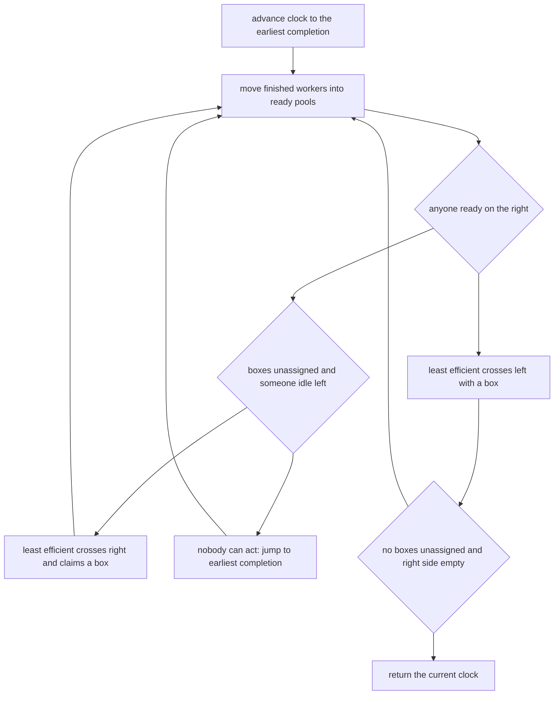

# Guided Example: Time to Cross a Bridge

## 1. The physical model

There are $k$ workers and $n$ boxes. Every worker starts on the left bank, every box starts on the right bank, and the bridge admits one worker at a time. Worker $i$ is described by four durations,

$$
\text{time}[i] = [\text{right}_i,\ \text{pick}_i,\ \text{left}_i,\ \text{put}_i],
$$

meaning: cross to the right bank in $\text{right}_i$ minutes, pick up one box there in $\text{pick}_i$ minutes, carry it back across in $\text{left}_i$ minutes, and put it down on the left bank in $\text{put}_i$ minutes. The quantity asked for is the elapsed time at which the **last box reaches the left side of the bridge**, so the final put-down is not part of the answer.

The bridge discipline is prescribed rather than chosen, which is what makes the problem a simulation instead of an optimization: at every moment when the bridge becomes free, the rules say exactly which worker may use it next.

The instance traced below is $n = 3$, $k = 2$ with
`time = [[1, 5, 1, 8], [10, 10, 10, 10]]`,
whose required answer is 37. It is chosen because the two workers have very different bridge costs, because one worker must be dispatched twice while the other is still busy, and because the final put-down of the last worker must be excluded from the returned value.

| Worker | $\text{right}_i$ | $\text{pick}_i$ | $\text{left}_i$ | $\text{put}_i$ | Bridge cost $\text{right}_i + \text{left}_i$ |
|:---:|:---:|:---:|:---:|:---:|:---:|
| 0 | 1 | 5 | 1 | 8 | 2 |
| 1 | 10 | 10 | 10 | 10 | 20 |

## 2. Efficiency is a fixed total order

Worker $i$ is *less efficient* than worker $j$ when

$$
\text{left}_i + \text{right}_i > \text{left}_j + \text{right}_j,
$$

or when the two sums are equal and $i > j$. Only the time spent on the bridge enters this comparison; picking and putting are irrelevant to rank. The ordering is computed once, from the static input, and never changes during the simulation — it is the dispatch priority, not a measurement of current progress.

| Worker | Bridge cost | Comparison | Rank | Dispatch priority |
|:---:|:---:|:---|:---:|:---|
| 0 | 2 | the smaller bridge cost | more efficient | sent second |
| 1 | 20 | the larger bridge cost | less efficient | sent first |

Ties are broken toward the larger index by the second clause of the definition, so when several workers share a bridge cost the one with the greatest index is dispatched first. This is a static tie-break, not a comparison of who has waited longest.

## 3. Four pools of state

At any instant each worker is in exactly one of four situations, and each pool behaves differently. Two pools hold workers who are ready to move, and two hold workers who are committed until a known completion time.

| Pool | Membership | Becomes relevant when | Role in the rules |
|:---|:---|:---|:---|
| idle on the left | on the left bank, not occupied | immediately | eligible to cross right, but only while unassigned boxes remain |
| ready on the right | on the right bank holding a box | immediately | highest priority to cross left |
| busy on the left | putting a box down | at a known future time | returns to the idle-left pool at that time; not eligible before then |
| busy on the right | crossing right or picking | at a known future time | joins the ready-right pool at that time; not eligible before then |

A single counter $n$ accompanies them: the number of boxes that have **not yet been assigned** to a worker. It is decremented the moment a worker is sent from the left bank, and it never changes for any other reason. This counter is the exact implementation of the rule that no further workers are sent from the left once the remaining boxes are already covered.

## 4. The decision made whenever the bridge is free

The rules resolve every free-bridge moment in a fixed order, with three outcomes.

| Priority | Condition at the current time | Action |
|:---:|:---|:---|
| 1 | at least one worker is ready on the right | that pool's least efficient member crosses left; the clock advances by his $\text{left}_i$; one box reaches the left bank |
| 2 | no one is ready on the right, and $n > 0$, and someone is idle on the left | that pool's least efficient member crosses right; the clock advances by his $\text{right}_i$; $n$ decreases by one |
| 3 | neither of the above | the bridge stays unused and the clock jumps forward to the earliest completion time among the busy workers |

The first branch encodes the priority of workers who are already carrying a box. The second encodes the rule that boxes are only collected while unassigned work remains. The third is the event-advance step: if nobody can use the bridge, time simply moves to the next moment when somebody can.

## 5. Timeline of the traced instance

Each row below is one decision by the simulation. The clock column shows the time at which the decision is made, not the time it finishes.

| Step | Clock | Situation at that moment | Decision and its interval | Clock after | $n$ after |
|:---:|:---:|:---|:---|:---:|:---:|
| 1 | 0 | both workers idle on the left; 3 boxes unassigned; nobody ready on the right | send worker 1, the least efficient; crossing occupies 0 to 10 | 10 | 2 |
| 2 | 10 | worker 1 is picking until 20; worker 0 idle; 2 boxes unassigned | nobody ready on the right, so send worker 0; crossing occupies 10 to 11 | 11 | 1 |
| 3 | 11 | worker 0 begins picking until 16; worker 1 still picking until 20 | no one is idle and no one is ready, so the clock jumps to the earliest completion, 16 | 16 | 1 |
| 4 | 16 | worker 0 holds a box and is ready on the right | a worker is ready on the right, so branch 1 applies: worker 0 crosses left, 16 to 17 | 17 | 1 |
| 5 | 17 | box 1 has arrived; worker 0 begins putting, 17 to 25 | 1 box is still unassigned but nobody is idle on the left, so the clock jumps to 20 | 20 | 1 |
| 6 | 20 | worker 1 holds a box and is ready on the right | a worker is ready on the right, so branch 1 applies: worker 1 crosses left, 20 to 30 | 30 | 1 |
| 7 | 30 | box 2 has arrived; worker 1 begins putting, 30 to 40; worker 0 has been idle since 25 | 1 box is unassigned and worker 0 is idle, so send worker 0 right, 30 to 31 | 31 | 0 |
| 8 | 31 | worker 0 begins picking until 36 | $n = 0$, so no left dispatch is possible; the clock jumps to 36 | 36 | 0 |
| 9 | 36 | worker 0 holds the last box, ready on the right | a worker is ready on the right, so branch 1 applies: worker 0 crosses left, 36 to 37 | 37 | 0 |

At 37 the third box reaches the left side, $n$ is already 0, and the right bank holds no worker in any state. The simulation stops and returns 37; worker 0's put-down (37 to 45) is deliberately never charged, because the boxes are already on the left.

| Box | Carried by | Pick-up interval on the right | Left crossing | Arrival on the left |
|:---:|:---:|:---:|:---:|:---:|
| 1 | worker 0 | 11 to 16 | 16 to 17 | 17 |
| 2 | worker 1 | 10 to 20 | 20 to 30 | 30 |
| 3 | worker 0 | 31 to 36 | 36 to 37 | 37 |

Step 7 deserves a second look. Worker 0 finished putting at 25, but the bridge was occupied by worker 1 from 20 to 30, so the earliest moment he could be sent was 30. The simulation notices his availability only when the clock reaches 30, and the outcome is identical: during 25 to 30 no dispatch was possible anyway. Deferring availability to the decision points of section 4 is therefore safe, because the clock only ever advances to a moment at which either the bridge is free and someone is waiting, or nothing at all can happen.

## 6. Why the simulation is exact

The correctness of this method rests on the fact that its state is a complete description of the physical situation at every decision point.

1. **Every worker is in exactly one pool.** A worker who is sent right leaves the idle-left pool and enters the busy-right pool with an explicit completion time $\text{clock} + \text{pick}_i$, since his right crossing is charged to the clock at dispatch. A worker who crosses left enters the busy-left pool with completion time $\text{clock} + \text{put}_i$. When a completion time is reached, he moves to the corresponding ready pool. No worker is lost and none is double-counted.
2. **The clock never skips a usable moment.** In branch 3 the clock jumps to the earliest completion time of any busy worker, and every pool is empty of ready workers at that instant. Removing all busy workers from consideration leaves nothing that could legitimately act during the interval, so no decision is missed. After the jump, branch 1 or 2 applies again.
3. **The box counter is exact.** Every left dispatch assigns exactly one worker to exactly one box, and every such assignment produces exactly one delivery: the worker returns with the box he was sent for. Hence at any moment the number of boxes still to arrive equals $n$ plus the number of workers in the ready-right and busy-right pools. When $n = 0$ and both of those pools are empty, the crossing that has just finished is the final delivery, which is exactly the stopping condition.
4. **The priority order is time-independent.** Because rank depends only on $\text{right}_i + \text{left}_i$ and the index, the least efficient worker in a pool is a fixed element of that pool; no comparison of arrival times or waiting durations is needed, and the choice is deterministic.

The invariant that makes the timeline reproducible is therefore: *at the top of each decision, the clock is the time of the decision, the pools partition the workers by their physical location and readiness, and $n$ counts exactly the boxes that no worker has been sent to collect.* Two runs on the same input produce the same timeline, because every branch is fully determined by that state.

## 7. A one-number change, a different schedule

Changing worker 0's pick-up time from 5 to 9 keeps the same two workers and the same number of boxes, and the authored variant of this instance requires 50 instead of 37. The change matters because it moves worker 0's readiness from 16 to exactly 20, the moment worker 1 also becomes ready — and then the right-side priority rule decides which of the two boxes comes home first.

| Quantity | Traced instance | Variant with $\text{pick}_0 = 9$ |
|:---|:---|:---|
| worker 0 ready on the right at | 16 | 20 |
| worker 1 ready on the right at | 20 | 20 |
| left crossings, in order | 16 to 17, 20 to 30, 36 to 37 | 20 to 30, 30 to 31, 49 to 50 |
| worker chosen at the tied moment | worker 0 alone at 16 | worker 1, the less efficient of the two |
| box arrival times | 17, 30, 37 | 30, 31, 50 |
| required answer | 37 | 50 |

In the variant, worker 0 tidies up the first box only after 31 and is busy putting until 39, so the third box cannot leave the right bank until 49, and it arrives at 50 — thirteen minutes later than in the traced instance, from a four-minute change. The example shows that the answer is a product of the schedule, not a simple sum of per-box costs.

## 8. Boundary instances and traps

Each row is an authored case of this package with its required answer.

| $n$ | $k$ | `time` | Required answer | The boundary it isolates |
|:---:|:---:|:---|:---:|:---|
| 1 | 1 | `[[2, 3, 5, 7]]` | 10 | one box, one worker: $2 + 3 + 5$, and the put-down of 7 is excluded |
| 1 | 3 | `[[1, 1, 2, 1], [1, 1, 3, 1], [1, 1, 4, 1]]` | 6 | the single box is claimed by the first dispatch (worker 2, the least efficient, bridge cost 5), so the other two workers never move; the answer is $1 + 1 + 4$ |
| 3 | 1 | `[[2, 3, 5, 7]]` | 44 | one worker pipelines three boxes: $10$ minutes for the first arrival, then two full cycles of $7 + 2 + 3 + 5$ |
| 2 | 2 | `[[1, 1, 1, 1], [1, 1, 1, 1]]` | 4 | identical workers: the tie-break sends the larger index first, and the answer is four one-minute crossings |
| 2 | 3 | `[[1, 2, 3, 4], [2, 1, 2, 1], [3, 1, 1, 2]]` | 8 | three workers with the same bridge cost 4 but very different components: only $\text{right} + \text{left}$ may be used for ranking |
| 3 | 2 | `[[1, 9, 1, 8], [10, 10, 10, 10]]` | 50 | the schedule-changing variant of section 7, where two workers become ready at the same instant |
| 3 | 2 | `[[1, 5, 1, 8], [10, 10, 10, 10]]` | 37 | the traced instance |

Several tempting mistakes are visible in these rows.

- **Charging the final put-down.** The answer for the one-worker, one-box case would become 17 instead of 10, and the traced instance would become 45 instead of 37. The return happens on the completion of the crossing, not after the box is stored.
- **Sending the most efficient worker first.** In the `n = 1, k = 3` case, worker 0 would deliver at $1 + 1 + 2 = 4$; the rule prescribes the least efficient, giving $1 + 1 + 4 = 6$.
- **Ranking by the wrong quantity.** Bridge cost is $\text{right}_i + \text{left}_i$ alone. The three workers of the `n = 2, k = 3` case all have bridge cost 4 while their components differ widely — $\text{left} + \text{pick}$ is 5, 3, and 2 for workers 0, 1, and 2 — so ranking by any other quantity, such as $\text{pick} + \text{put}$, would send a different worker first.
- **Ignoring the larger-index tie-break.** When bridge costs are equal the definition makes the larger index *less* efficient, so the `n = 2, k = 3` case dispatches worker 2 before worker 1 even though both need 4 minutes of bridge time in total. Treating the tie as a free choice changes which worker claims which box.
- **Ignoring the box counter.** The condition $n > 0$ is what stops workers from being sent once every remaining box already has an owner. Removing it makes the simulation dispatch workers for boxes that do not exist, so crossings and deliveries continue after all $n$ boxes have arrived, and the returned time then belongs to a delivery that never happened.
- **Letting two workers share the bridge.** The clock must advance by the whole crossing before the next decision; overlapping intervals would produce times that no physical schedule can realise.
- **Charging one crossing duration twice.** $\text{right}_i$ and $\text{left}_i$ are separate parameters, and each crossing must be charged with its own value. In the `n = 3, k = 1` case, charging both crossings at the outbound time of 2 instead of $2$ outbound and $5$ home returns 35 rather than 44.
- **Releasing a carrier before his put-down ends.** In the `n = 3, k = 1` case the put-down of 7 minutes keeps the worker off the bridge between deliveries; treating him as free the instant he arrives would return 30 instead of 44.

## 9. Time and auxiliary space

**Time.** The simulation performs at most $n$ dispatches from the left, each assigning one box, and therefore at most $n$ crossings back; each of those steps selects one worker from a pool. Between them the clock-advance steps number no more than the number of completion times that exist, which is $O(n)$ as well, plus the $k$ initial insertions. Every pool operation is a priority-queue operation costing $O(\log k)$, so the running time is

$$
O\bigl((n + k)\log k\bigr),
$$

with the $k$ initial insertions and the fixed ordering of the workers by bridge cost contributing $O(k \log k)$ of that bound. Nothing in the process depends on the magnitudes of the durations, only on their order and their sums, so the running time does not grow with the size of the times.

**Auxiliary space.** Four pools hold the $k$ workers between them, one entry per worker at any instant, and the box counter is a single integer. No history of events is retained, and the input array is only reordered, so the auxiliary space is

$$
O(k),
$$

which is the number of workers. The answer itself is a sum of durations up to $1000$ each over up to $10^{4}$ boxes and crossings, so it comfortably exceeds a small integer range and should be accumulated in a 64-bit value.
