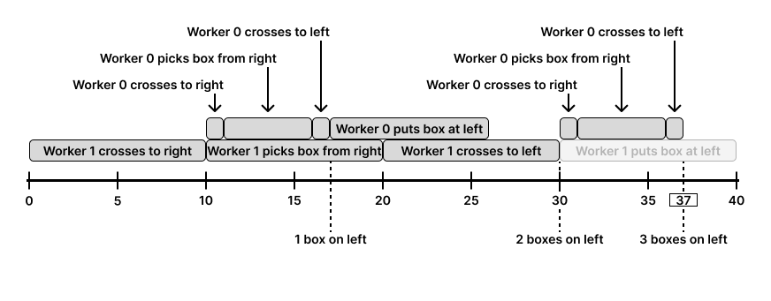

## Description

There are `k` workers who want to move `n` boxes from the right (old) warehouse to the left (new) warehouse. You are given the two integers `n` and `k`, and a 2D integer array `time` of size `k x 4` where $\text{time}[i] = [\text{right}_{i}, \text{pick}_{i}, \text{left}_{i}, \text{put}_{i}]$.

The warehouses are separated by a river and connected by a bridge. Initially, all `k` workers are waiting on the left side of the bridge. To move the boxes, the $$i^{\text{th}}$$ worker can do the following:

- Cross the bridge to the right side in $\text{right}_{i}$ minutes.

- Pick a box from the right warehouse in $\text{pick}_{i}$ minutes.

- Cross the bridge to the left side in $\text{left}_{i}$ minutes.

- Put the box into the left warehouse in $\text{put}_{i}$ minutes.

The $$i^{\text{th}}$$worker is **less efficient** than the j$^th$ worker if either condition is met:

- $\text{left}_{i} + \text{right}_{i} > \text{left}_{j} + \text{right}_{j}$

- $\text{left}_{i} + \text{right}_{i} = \text{left}_{j} + \text{right}_{j}$ and `i > j`

The following rules regulate the movement of the workers through the bridge:

- Only one worker can use the bridge at a time.

- When the bridge is unused prioritize the **least efficient** worker (who have picked up the box) on the right side to cross. If not, prioritize the **least efficient** worker on the left side to cross.

- If enough workers have already been dispatched from the left side to pick up all the remaining boxes, **no more** workers will be sent from the left side.

Return the **elapsed minutes** at which the last box reaches the **left side of the bridge**.
### Function Contract

- `n`: Input parameter.
- Returns expected result.

### Examples
#### Example 1

<div class="example-block">
**Input:** n = 1, k = 3, time = [[1,1,2,1],[1,1,3,1],[1,1,4,1]]

**Output:** 6

**Explanation:**

From 0 to 1 minutes: worker 2 crosses the bridge to the right.
From 1 to 2 minutes: worker 2 picks up a box from the right warehouse.
From 2 to 6 minutes: worker 2 crosses the bridge to the left.
From 6 to 7 minutes: worker 2 puts a box at the left warehouse.
The whole process ends after 7 minutes. We return 6 because the problem asks for the instance of time at which the last worker reaches the left side of the bridge.
```
</div>
#### Example 2
<div class="example-block">
- **Input:** `n = 3, k = 2, time = [[1,5,1,8],[10,10,10,10]]`
- **Output:** `37`
- **Explanation:**


```

The last box reaches the left side at 37 seconds. Notice, how we **do not** put the last boxes down, as that would take more time, and they are already on the left with the workers.

</div>
### Constraints

- $1 \le n, k \le 10^{4}$

- $\text{time.length} = k$

- $\text{time}[i].length = 4$

- $1 \le \text{left}_{i}, \text{pick}_{i}, \text{right}_{i}, \text{put}_{i} \le 1000$