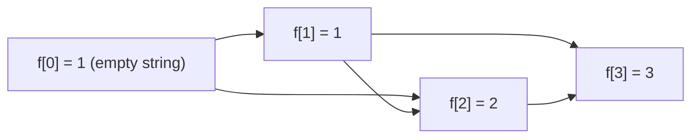

# Guided Example: Number of Good Binary Strings

## 1. The instance: length window $[2,3]$ with groups $1$ and $2$

Take `minLength = 2`, `maxLength = 3`, `oneGroup = 1`, `zeroGroup = 2` — the first
official instance, whose declared answer is $5$. A binary string drawn from this
window is **good** when both divisibility conditions hold:

- every maximal block of consecutive `1`'s has a size that is a multiple of
  `oneGroup` $= 1$;
- every maximal block of consecutive `0`'s has a size that is a multiple of
  `zeroGroup` $= 2$.

Because `oneGroup = 1`, the first condition is vacuous: every positive size is a
multiple of $1$. On this instance the entire constraint therefore sits in the
zero blocks, each of which must be even. The word *maximal* is the load-bearing
one: a block cannot be extended left or right without changing its character. So
`001` owns a single zero block of size $2$ and passes, while `010` owns two zero
blocks of size $1$ and fails. Reading `001` as "two zero characters" and
rejecting it is the first trap this instance exposes.

The convention that $0$ counts as a multiple of every group handles strings made
of one repeated character: `111` contains no zero block at all, and "zero zero
blocks, each of size a multiple of $2$" holds vacuously, so `111` is good.

## 2. Why string length is the correct state: the unique block decomposition

Every nonempty binary string splits uniquely into maximal blocks with
alternating characters:

$$
s = c_1^{b_1} c_2^{b_2} \cdots c_k^{b_k},
\qquad c_1 \neq c_2 \neq \cdots \neq c_k, \qquad b_j \ge 1 .
$$

This decomposition is forced by $s$, so it is not a choice we make. Goodness is
then a condition on each $b_j$ separately: $b_j$ must be a multiple of
`oneGroup` when $c_j$ is `1`, and a multiple of `zeroGroup` when $c_j$ is `0`.
Nothing in the definition couples two different blocks, so the sequence of block
sizes together with the first character describes a good string completely.

| String | Length | Sizes of `1`-blocks | Sizes of `0`-blocks | Good? | Reason |
|---|---|---|---|---|---|
| `11` | 2 | 2 | none | yes | $2$ is a multiple of $1$; no zero block to constrain |
| `00` | 2 | none | 2 | yes | $2$ is a multiple of $2$ |
| `001` | 3 | 1 | 2 | yes | the zero block is maximal and even |
| `010` | 3 | 1 | 1, 1 | no | two zero blocks, each of size $1$, and $1$ is not a multiple of $2$ |
| `110` | 3 | 2 | 1 | no | zero block of size $1$ |

Let $A = \texttt{oneGroup}$ and $B = \texttt{zeroGroup}$, and let $g(c)$ denote the
group governing a character $c$: $g(\texttt{1}) = A$ and $g(\texttt{0}) = B$. The
next section shows that the count of good strings of a given length depends on
nothing else.

## 3. The deletion bijection that validates the transition

**Claim.** For every $n \ge 1$, the good strings of length $n$ are in one-to-one
correspondence with the pairs $(c, t)$ where $c$ is a character with
$g(c) \le n$ and $t$ is a good string of length $n - g(c)$.

*From a good string to a pair.* Let $s$ be good of length $n$, let $c$ be its
first character, and let its first maximal block have size $b_1 = k\,g(c)$ with
integer $k \ge 1$, which goodness guarantees. Remove the first $g(c)$ characters
of $s$ and call the remainder $t$, of length $n - g(c)$.

- If $k = 1$, the removed characters were the whole first block, so $t$ is empty
  or begins with the opposite character. Every block of $t$ is then a block of
  $s$ that was already a multiple of its own group, so $t$ is good.
- If $k \ge 2$, the first block of $t$ has size $(k-1)g(c) \ge g(c) \ge 1$, still a
  multiple of $g(c)$, and every later block is unchanged. So $t$ is good.

*From a pair to a good string.* Given a character $c$ and a good $t$ of length
$n - g(c)$, prefix $g(c)$ copies of $c$. If $t$ is empty or begins with the
opposite character, the prefix is a maximal block of size $g(c)$, a multiple of
$g(c)$. If $t$ begins with $c$, the prefix merges with the first block of $t$ of
size $m$, producing a block of size $m + g(c)$; both summands are multiples of
$g(c)$, so the merged block is too, and all remaining blocks are untouched. In
both cases the result is good.

*The two directions are inverse.* The constructed string starts with $c$, since
$g(c) \ge 1$, so its first character reveals the prefix character $c$; deleting
the first $g(c)$ characters then recovers $t$. Hence distinct pairs give distinct
strings, and the correspondence is exact. Writing $f[n]$ for the number of good
strings of length $n$, with $f[0] = 1$ for the empty string and $f[n] = 0$ when
$n$ is negative, the bijection is precisely

$$
f[n] = f[n - \texttt{oneGroup}] + f[n - \texttt{zeroGroup}].
$$

Each term enumerates one first character: a `1`-led string is built from a
`1`-block of size `oneGroup`, a `0`-led string from a `0`-block of size
`zeroGroup`. When `oneGroup = zeroGroup` the two terms can pick the same
remainder $t$ and the same eventual block sizes, and they still describe
different strings because the prefixed characters differ — so the recurrence
counts each output once, with no collision.

## 4. Executing the recurrence on `minLength = 2, maxLength = 3, oneGroup = 1, zeroGroup = 2`

The dependency between states is one-directional and acyclic, which is what makes
a simple forward sweep over lengths sufficient.

| $n$ | Term $f[n - \texttt{oneGroup}] = f[n-1]$ | Term $f[n - \texttt{zeroGroup}] = f[n-2]$ | $f[n]$ | Good strings of length $n$, read off from the bijection |
|---|---|---|---|---|
| 0 | — | — | 1 | the empty string (base case only; it is not inside the window) |
| 1 | $f[0] = 1$ | absent, since $1 - 2 = -1$ | 1 | `1` |
| 2 | $f[1] = 1$ | $f[0] = 1$ | 2 | `11` from the one-block term, `00` from the zero-block term |
| 3 | $f[2] = 2$ | $f[1] = 1$ | 3 | `100`, `111` from the one-block term; `001` from the zero-block term |

Two details of this table deserve emphasis. First, `0` alone is *not* good at
length $1$: its zero block has size $1$, and $1$ is not a multiple of $2$, which
is exactly why $f[1] = 1$ rather than $2$. Second, the value $f[2] = 2$ is used
whole by the one-block term at $n = 3$: one remainder string, `00`, produces
`100`, and the other, `11`, produces `111`.

## 5. Reading the answer and checking it by direct enumeration

The window $[2,3]$ is a disjoint union of lengths, so the per-length counts add
without any risk of counting one string twice:

$$
\sum_{n=2}^{3} f[n] = f[2] + f[3] = 2 + 3 = 5 .
$$

The five strings can be listed explicitly, each paired with the term that
generated it, which double-checks the trace arithmetic.

| Good string | First character $c$ | $g(c)$ | Remainder $t$ after deleting $g(c)$ leading characters | Term that counts it |
|---|---|---|---|---|
| `00` | `0` | 2 | empty | $f[0] = 1$ |
| `11` | `1` | 1 | `1` | $f[1] = 1$ |
| `001` | `0` | 2 | `1` | $f[1] = 1$ |
| `100` | `1` | 1 | `00` | $f[2] = 2$ |
| `111` | `1` | 1 | `11` | $f[2] = 2$ |

Every length-2 and length-3 binary string is accounted for: the eight length-3
strings split into the three good ones above and the five rejected ones —
`000` (zero block of size $3$), `010`, `011`, `101`, `110` — each failing because
some maximal zero block has odd size.

## 6. The same recurrence with two genuine block types

The first instance is special because `oneGroup = 1` makes one condition vacuous.
Test the recurrence instead on `minLength = 5, maxLength = 7, oneGroup = 2,
zeroGroup = 3`, where both divisibility rules bite and strings need several
alternating blocks.

| $n$ | $f[n]$ | Good strings of length $n$ | Block sizes of those strings |
|---|---|---|---|
| 0 | 1 | empty string | — |
| 1 | 0 | none | a `1`-block of size $1$ is not a multiple of $2$ |
| 2 | 1 | `11` | `1`-block 2 |
| 3 | 1 | `000` | `0`-block 3 |
| 4 | 1 | `1111` | `1`-block 4 |
| 5 | 2 | `11000`, `00011` | $2+3$ and $3+2$ |
| 6 | 2 | `111111`, `000000` | single blocks of size $6$, a multiple of both $2$ and $3$ |
| 7 | 3 | `1111000`, `0001111`, `1100011` | $4+3$, $3+4$, and $2+3+2$ |

The transitions are $f[5] = f[3] + f[2] = 1 + 1 = 2$,
$f[6] = f[4] + f[3] = 1 + 1 = 2$, and
$f[7] = f[5] + f[4] = 2 + 1 = 3$, giving
$f[5] + f[6] + f[7] = 7$. This matches the authored expectation for that
instance, and it shows the recurrence handling alternating blocks of both kinds:
the string `1100011` of length $7$ is built by deleting its leading `11`
(one block of size `oneGroup` $= 2$) and recursing on `00011`, which is itself the
length-5 good string counted by $f[5]$.

## 7. The invariant and why the sweep is correct

The invariant carried by the forward sweep is: *after the state for length $m$ is
finalised, $f[m]$ equals the number of good binary strings of length exactly
$m$.* It holds at $m = 0$, where the empty string is the unique good string, and
it is preserved at every later $m$ by the deletion bijection of section 3, since
that bijection partitions the good strings of length $m$ into the two disjoint
families headed by `1` and by `0`. Every term the recurrence reads has a strictly
smaller length, $m - \texttt{oneGroup} < m$ and $m - \texttt{zeroGroup} < m$, so
the sweep never reads a state it has not finished; where a term is negative it
contributes nothing, because no string of negative length exists.

The final sum is correct for a second, independent reason: strings of different
lengths are different strings, so the window decomposes into disjoint classes and
the total count is their sum. Note in particular that the base state $f[0]$ must
not enter the sum, since the empty string has length $0$ and the window starts at
`minLength` $\ge 1$.

## 8. Traps and boundary behaviour

| Instance | Situation | What the recurrence does | Answer |
|---|---|---|---|
| `minLength = 1, maxLength = 1, oneGroup = 1, zeroGroup = 1` | the shortest possible window, groups of one | $f[1] = f[0] + f[0] = 2$ | 2 (`0` and `1`) |
| `minLength = 4, maxLength = 4, oneGroup = 4, zeroGroup = 3` | a group larger than the whole window for the zero term | $f[4] = f[0] + f[1] = 1 + 0$, and $f[1] = 0$ | 1 (only `1111`) |
| `minLength = 1, maxLength = 3, oneGroup = 2, zeroGroup = 2` | equal groups | $f[1] = f[3] = 0$, $f[2] = f[0] + f[0] = 2$ | 2 (`11` and `00`) |
| `minLength = 10, maxLength = 10, oneGroup = 3, zeroGroup = 4` | both groups in play at a single length | $f[10] = f[7] + f[6] = 2 + 1$ | 3 |
| `minLength = 2, maxLength = 1, oneGroup = 1, zeroGroup = 2` | an inverted window | every state up to $1$ is computed, then no length is selected | 0 |

Boundary conditions worth stating explicitly:

- **Maximal blocks, not character counts.** Treating `010` as one pool of two
  zero characters would count a forbidden arrangement as good; the divisibility
  test belongs to each maximal block separately.
- **A block of size zero does not exist.** The convention that $0$ is a multiple
  of every group applies to the *absence* of a block of a given character, as in
  `111` having no zero block; it never licenses an empty block inside a string.
- **The empty string is a base state, not an answer.** Forgetting to exclude it
  inflates every instance by exactly $1$.
- **Terms that fall below zero are dropped, not treated as one.** A missing
  `1`-block term at small $n$ contributes $0$; treating it as a base case would
  invent strings shorter than any real one.
- **Equal groups deserve no special case.** `oneGroup = zeroGroup` makes the two
  terms add the same size but different leading characters, so $f[2] = 2$ for
  groups of $2$ is the two constant strings, not a doubled single string.
- **Reduce modulo $10^9 + 7$ as the sweep proceeds.** The counts grow
  exponentially in `maxLength`; delaying the reduction until the end produces
  integers far beyond machine words even though the final answer is small.

## 9. Time and auxiliary space

Let $M = \texttt{maxLength}$. The sweep performs one constant-time transition per
length in $1 \dots M$, and the answer adds the $M - \texttt{minLength} + 1$
selected states, so the running time is $O(M)$; since every length must be visited
at least once to know which states feed the selected window, that is also the
matching lower bound, hence $\Theta(M)$.

Auxiliary space is $O(M)$ for the array of states $f[0 \dots M]$. It can be
tightened: a transition at length $n$ reads only $f[n - \texttt{oneGroup}]$ and
$f[n - \texttt{zeroGroup}]$, so a circular buffer of the most recent
$\max(\texttt{oneGroup}, \texttt{zeroGroup}) + 1$ states suffices, and the window
total can be accumulated on the fly instead of summed afterwards. That reduces
auxiliary space to $O(\max(\texttt{oneGroup}, \texttt{zeroGroup})) \subseteq O(M)$,
at the cost of a less direct correspondence between state indices and lengths.