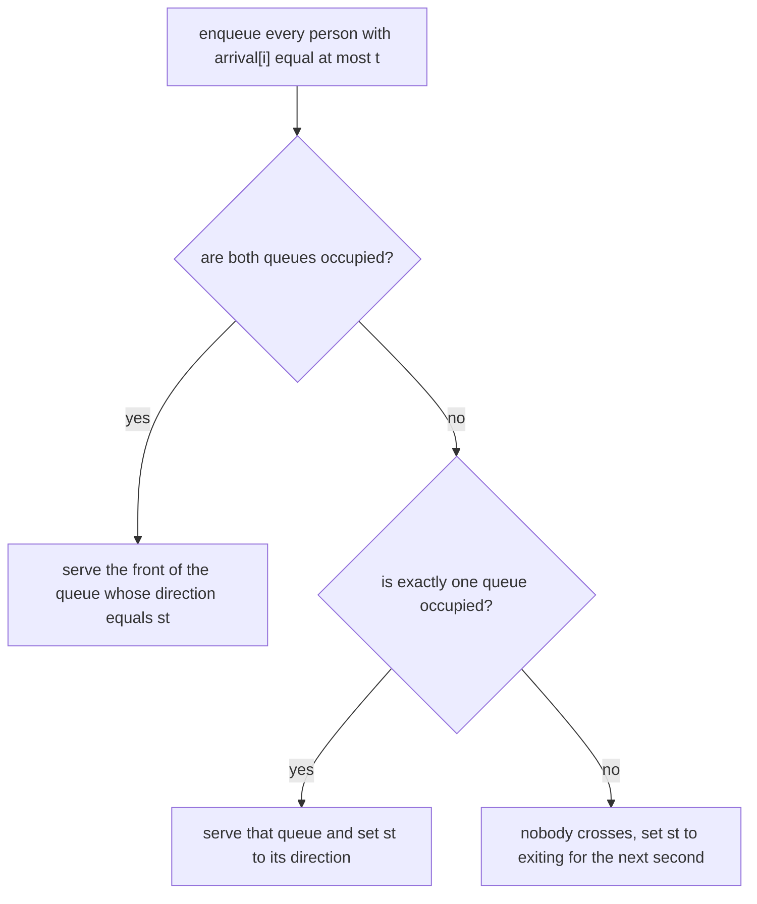

# Guided Example: Time Taken to Cross the Door

## 1. The instance, the rules, and the one fact the rules depend on

Take the first official instance: `arrival = [0,1,1,2,4]` and
`state = [0,1,0,0,1]`, where `0` means the person wants to enter and `1` means
they want to exit. Person `0` arrives at second $0$ and wants to enter, person
`1` arrives at second $1$ and wants to exit, person `2` arrives at second $1$ and
wants to enter, person `3` arrives at second $2$ and wants to enter, and person
`4` arrives at second $4$ and wants to exit. Exactly one person crosses per
second, and the declared answer is `[0,3,1,2,4]`.

The tie-breaking rules are the whole problem. When two or more people want the
door at the same moment:

- the door was **not** used in the previous second $\Rightarrow$ **exit** goes
  first;
- the previous second was used for **entering** $\Rightarrow$ **entering** goes
  first;
- the previous second was used for **exiting** $\Rightarrow$ **exiting** goes
  first;
- within one direction, the **smallest index** goes first.

Read those rules as a single question: *what did the door do in the immediately
preceding second?* The list is exhaustive over the three possible answers —
unused, entering, exiting — and for each answer the winner is determined. So the
priority of a second is a function of exactly one value, the previous second's
direction. That observation is what collapses the entire history into one state
variable, and it is the decisive design idea of this lesson.

| Previous second | Priority direction | Why nothing else is needed |
|---|---|---|
| unused, including "no previous second at all" | exiting | the rule names only the previous second, so the initial second behaves like any idle second |
| entering | entering | the direction that just crossed keeps the door |
| exiting | exiting | the direction that just crossed keeps the door |

## 2. The state: two FIFO queues plus the previous direction

Maintain `q[0]`, the queue of waiting people who want to enter, and `q[1]`, the
queue of waiting people who want to exit, both in index order, together with
`st`, the direction that used the door in the previous second, initially `1`
(exiting) because second $-1$ does not exist and counts as unused.

Two invariants make this representation sufficient:

1. **Arrival invariant.** The clock sweeps forward second by second; at the
   start of second $t$, every person with `arrival[i] <= t` has been appended to
   their direction's queue exactly once, and nobody with `arrival[i] > t` has
   been appended. Appending happens in increasing index order, and `arrival` is
   non-decreasing, so each queue is ordered by index.
2. **Priority invariant.** `st` equals the direction that used the door during
   second $t - 1$, or `1` if second $t - 1$ was unused.

The arrival invariant is what makes the queues FIFO-correct: the front of a queue
is always the waiting person of that direction with the smallest index, which is
precisely the required intra-direction tie-breaker. Note that a person can wait
for many seconds; the answer records the second they *cross*, not the second they
arrive.

## 3. Executing the decision rule second by second

At each second $t$ the same three-way branch runs, and it is worth seeing the
branch as a decision diagram before the arithmetic.

| Second $t$ | Arriving at $t$ (person: direction) | `q[0]` before the decision | `q[1]` before the decision | `st` before the decision | Branch taken | Person served | `answer` after |
|---|---|---|---|---|---|---|---|
| 0 | person 0: enter | `[0]` | empty | `1` (no previous second) | only one queue occupied, so it is served and `st` becomes `0` | person 0 | `answer[0] = 0` |
| 1 | person 1: exit, person 2: enter | `[2]` | `[1]` | `0` (second 0 entered) | both queues occupied, priority is entering | person 2 | `answer[2] = 1` |
| 2 | person 3: enter | `[3]` | `[1]` | `0` (second 1 entered) | both queues occupied, priority is entering | person 3 | `answer[3] = 2` |
| 3 | none (next arrival is at 4) | empty | `[1]` | `0` (second 2 entered) | only one queue occupied, so it is served and `st` becomes `1` | person 1 | `answer[1] = 3` |
| 4 | person 4: exit | empty | `[4]` | `1` (second 3 exited) | only one queue occupied, so it is served | person 4 | `answer[4] = 4` |

After second $4$ both queues are empty and the index pointer has passed all
people, so the simulation stops and the answer is `[0,3,1,2,4]`, matching the
declared output.

The interesting seconds are $1$ and $2$. At second $1$, persons `1` and `2`
arrive together with opposite directions; the local intuition "the one who
waited longest" or "the smaller index" would serve person `1`, and that choice is
wrong, because second $0$ was used for entering and the rule hands entering the
door. The wrong choice is not merely a wrong ordering: it delays person `2`
behind a stream of entering arrivals and changes several later timestamps. At
second $2$ the same retention repeats, and person `3`, who arrived *later* than
the waiting person `1`, still crosses first at second $2$. Only when the entering
queue empties at second $3$ does person `1` finally cross.

## 4. Why the branch is faithful to the rules

Consider the three cases of the branch in order.

- **Both queues occupied.** Somebody is waiting in each direction, so the
  previous-second rule decides, and `st` holds exactly that direction by the
  priority invariant. Serving the front of that queue respects both the
  direction rule and the index rule, since the queue front is the smallest index
  still waiting in that direction.
- **Exactly one queue occupied.** No tie exists: the only waiting person's
  direction is irrelevant because nobody competes with them. Serving that queue
  is forced, and it is also correct to update `st` to that direction, because the
  door *is* being used for that direction in second $t$ and the next second must
  see it as the previous second's direction. Skipping this update is a real bug:
  the door would keep a stale direction and a later tie would break the wrong way.
- **Neither queue occupied.** Nobody can cross in second $t$, so the second is
  unused. The next second's rule consults second $t$ and must therefore see
  "unused", which is encoded as `st = 1` (exit priority). The reset must be
  re-applied at every idle second, which the loop does naturally, so an
  arbitrarily long idle gap keeps the door in the unused state.

Two further checks confirm the timing semantics. A person with `arrival[i] = t`
is enqueued *before* second $t$ decides, so they compete at second $t$ itself, as
the problem requires. And a person is dequeued only when they actually cross, so
waiting people persist in their queue across idle seconds and across seconds won
by the other direction.

## 5. A second instance: idle seconds, reset, and an overtake

The ruled instance above has a busy door and never shows the reset. Take
`arrival = [0,5,6,6,7]` with `state = [1,0,0,1,0]`: person `0` exits at second
$0$, then the door sits unused for four seconds, and persons `1`, `2`, `3`, `4`
want to enter, enter, exit, enter at seconds $5$, $6$, $6$, $7$. The declared
answer is `[0,5,6,8,7]`.

| Second $t$ | Arriving at $t$ | `q[0]` | `q[1]` | `st` before the decision | Branch taken | Person served |
|---|---|---|---|---|---|---|
| 0 | person 0: exit | empty | `[0]` | `1` | one queue, served, `st` becomes `1` | person 0, `answer[0] = 0` |
| 1 – 4 | none | empty | empty | reset to `1` at each idle second | both empty: idle, no crossing | nobody |
| 5 | person 1: enter | `[1]` | empty | `1` (the reset value) | one queue, served, `st` becomes `0` | person 1, `answer[1] = 5` |
| 6 | person 2: enter, person 3: exit | `[2]` | `[3]` | `0` (second 5 entered) | both queues, priority entering | person 2, `answer[2] = 6` |
| 7 | person 4: enter | `[4]` | `[3]` | `0` (second 6 entered) | both queues, priority entering | person 4, `answer[4] = 7` |
| 8 | none | empty | `[3]` | `0` (second 7 entered) | one queue, served | person 3, `answer[3] = 8` |

Two lessons live in this table. First, the reset at seconds $1$ through $4$ is
invisible at second $5$ because only one queue was occupied — the value of `st`
mattered only later, when a genuine tie appeared. Remove the reset, however, and
the door would still believe it had exited at second $0$; if the entering queue
had been empty at second $5$ and a tie had occurred at second $6$, the stale
value would have broken the tie for exiting instead of for entering. Second,
person `4` arrives at second $7$ and crosses at second $7$, while person `3` has
been waiting since second $6$; the arrival-order intuition fails again, because
the door's previous direction outranks waiting time. Answers also need not be
sorted: `answer[4] = 7` precedes `answer[3] = 8`, since the output is indexed by
person, not by time.

## 6. Alternative designs and why the two-queue state wins

| Design | What it stores | Verdict |
|---|---|---|
| Two FIFO queues plus `st` | waiting people split by direction, each in index order, plus the previous direction | correct and linear; the front of each queue already encodes the smallest index |
| One FIFO queue of all waiting people | arrival order only | fails: the direction rule can pull a later-arriving person of the priority direction ahead of an earlier-arriving person of the other direction |
| One queue re-sorted at every second | waiting people plus a recomputed ordering | correct but pays $O(k \log k)$ per busy second for $k$ waiting people, which is worse than linear in the worst case |
| Two priority queues keyed by index | waiting people with an index ordering | correct, but heavier than FIFO because arrivals are already processed in index order, so appended order *is* index order |

The FIFO choice is not an approximation; it is exact, because `arrival` is
non-decreasing, so appending people as the index pointer advances inserts them in
increasing index order, and no insertion can ever need to jump the queue.

## 7. Traps and boundary behaviour

| Instance | Situation | Behaviour | Answer |
|---|---|---|---|
| `arrival = [0,0,0]`, `state = [0,0,0]` | unused door, one direction only | the direction rule never fires; index order is enough | `[0,1,2]` |
| `arrival = [0,0,0]`, `state = [1,0,1]` | unused door with both directions present | exiting wins the tie, then exiting retains the door | `[0,2,1]` |
| `arrival = [0,1,1]`, `state = [1,0,1]` | a busy door with no idle second | exiting at second $0$ retains priority at second $1$ | `[0,2,1]` |
| `arrival = [0,2]`, `state = [0,1]` | one idle second between arrivals | second $1$ is unused, so second $2$ resets to exit priority; person `1` is alone anyway | `[0,2]` |
| `arrival = [3,3,4,5,5,5]`, `state = [1,0,1,0,1,0]` | several people queue behind a losing direction | person `1` waits from second $3$ to second $5$ while exits cross | `[3,6,4,7,5,8]` |

Conditions worth stating explicitly:

- **The initial second has no previous second.** It must be treated as unused,
  which means exit priority; initialising `st` to "entering" reverses the first
  tie of every instance.
- **A stale `st` after a solo crossing is a defect.** When only one direction is
  waiting, the door really is used, and the next second must inherit that
  direction.
- **An idle second is not neutral.** It resets the priority to exiting, so a
  person arriving after a gap cannot assume the door's last busy direction.
- **`arrival[i] = t` competes at second $t$.** Enqueueing before the decision is
  what makes simultaneous arrivals share a tie.
- **Nobody is dropped while waiting.** A person who loses a tie stays at the
  front of their queue; losing a tie never reorders them behind later arrivals
  of the same direction.
- **Answers are per person and may decrease with index.** The output is a
  timestamp for each person, not a chronological log; the crossing seconds are
  distinct, but the array is not sorted.

## 8. Time and auxiliary space

Let $n$ be the number of people. The clock advances until the last person
crosses. Exactly $n$ seconds are used for crossings, because one person crosses
per used second. Every other second is idle, and an idle second can only occur
while the clock is below the largest arrival time, so there are at most
$\max_i \texttt{arrival}[i] \le n$ of them. The clock therefore advances at most
$2n$ times, each iteration does constant work besides the enqueue loop, and each
person is enqueued and dequeued once. The total running time is $O(n)$.

Auxiliary space is $O(n)$: the two queues together hold at most $n$ people, and
the answer array of length $n$ is the required output. The state `st` and the
index pointer are single values, so the simulation needs no time-indexed table —
the priority invariant guarantees that one direction value summarizes the entire
past.
