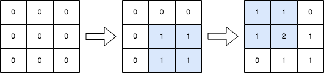
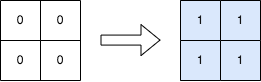

### 1. Description

You are given a positive integer `n`, indicating that we initially have an `n x n` **0-indexed** integer matrix `mat` filled with zeroes.

You are also given a 2D integer array `query`. For each $\text{query}[i] = [\text{row1}_{i}, \text{col1}_{i}, \text{row2}_{i}, \text{col2}_{i}]$, you should do the following operation:

- Add `1` to **every element** in the submatrix with the **top left** corner $(\text{row1}_{i}, \text{col1}_{i})$ and the **bottom right** corner $(\text{row2}_{i}, \text{col2}_{i})$. That is, add `1` to $\text{mat}[x][y]$ for all $\text{row1}_{i} \le x \le \text{row2}_{i}$ and $\text{col1}_{i} \le y \le \text{col2}_{i}$.

Return* the matrix* `mat`* after performing every query.*

### 2. Function Contract

**Inputs**

- `n`: Input parameter (`int`).
- `queries`: Input parameter (`List[List[int]]`).

**Return value**

- Returns `List[List[int]]`.

### 3. Examples

#### Example 1

- **Input:** $n = 3, queries = [[1,1,2,2],[0,0,1,1]]$
- **Output:** `[[1,1,0],[1,2,1],[0,1,1]]`
- **Explanation:** The diagram above shows the initial matrix, the matrix after the first query, and the matrix after the second query.
- In the first query, we add 1 to every element in the submatrix with the top left corner (1, 1) and bottom right corner (2, 2).
- In the second query, we add 1 to every element in the submatrix with the top left corner (0, 0) and bottom right corner (1, 1).

#### Example 2

- **Input:** $n = 2, queries = [[0,0,1,1]]$
- **Output:** `[[1,1],[1,1]]`
- **Explanation:** The diagram above shows the initial matrix and the matrix after the first query.
- In the first query we add 1 to every element in the matrix.

### 4. Constraints

- $1 \le n \le 500$

- $1 \le \text{queries.length} \le 10^{4}$

- $0 \le \text{row1}_{i} \le \text{row2}_{i} < n$

- $0 \le \text{col1}_{i} \le \text{col2}_{i} < n$
