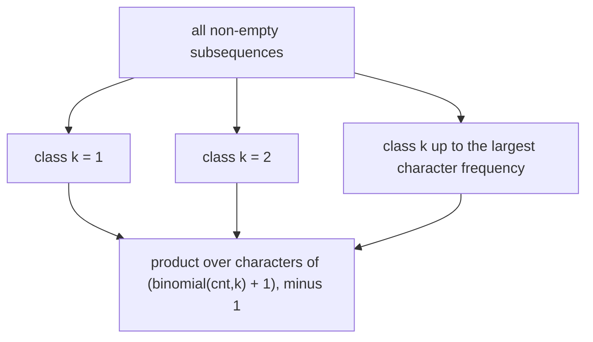

# Guided Example: Count the Number of Good Subsequences

## 1. The instance, and the first thing that must be pinned down

Take the first official instance, `s = "aabb"`, whose declared answer is $11$. A
subsequence is obtained by deleting some or no characters without changing the
order of the survivors, and it is **good** when it is non-empty and every
character that appears in it appears the same number of times. So `"ab"`,
`"aa"`, `"bb"`, and `"aabb"` are good, while `"aab"` is not, because there `a`
appears twice and `b` once.

Before any counting, the identity of the objects must be fixed. Write the string
with positions: index $0$ holds `a`, index $1$ holds `a`, index $2$ holds `b`,
index $3$ holds `b`. A subsequence **is a set of chosen indices**, not the text it
prints. Choosing index $0$ alone and choosing index $1$ alone both print `"a"`,
and they are two different subsequences for counting purposes. Every count below
follows that convention, and the declared total of $11$ confirms it, since
counting distinct printed strings would give fewer.

The frequency profile of the instance is

$$
\text{cnt}(\texttt{a}) = 2, \qquad \text{cnt}(\texttt{b}) = 2 .
$$

## 2. The signature of a subsequence, and why binomials multiply

For each distinct character $c$ of the input, let $k_c$ be the number of times
$c$ appears in a subsequence. The vector $(k_c)$ is the subsequence's *signature*.
Two facts make the signature the right state:

- **The signature determines goodness.** A non-empty subsequence is good exactly
  when all the values $k_c > 0$ are equal to one common value $k$.
- **The signature determines the count of index sets.** If a signature asks for
  $k_c$ copies of $c$, those copies may be any $k_c$ of the $\text{cnt}(c)$
  available positions, and the choices for different characters are independent,
  so the number of index sets with that signature is
  $\prod_c \binom{\text{cnt}(c)}{k_c}$.

Because every index set has exactly one signature, and every choice tuple inside
a signature yields a different index set, this description partitions the
subsequences with no overlap and no gap. That is the whole counting argument; the
rest is arithmetic.

## 3. Fixing one common frequency $k$

A good subsequence has a unique common frequency $k \ge 1$, so the good
subsequences split into disjoint classes indexed by $k$. Inside the class for a
fixed $k$, each character with $\text{cnt}(c) \ge k$ has exactly two
possibilities:

- stay out of the subsequence — $1$ way;
- contribute exactly $k$ copies, in any of $\binom{\text{cnt}(c)}{k}$ ways.

Characters with $\text{cnt}(c) < k$ cannot contribute $k$ copies, so they have
only the "stay out" possibility. Writing the product over all characters and
subtracting the single term in which *every* character stays out gives the size
of the class:

$$
G_k = \prod_{c} \left( \binom{\text{cnt}(c)}{k} + 1 \right) - 1,
\qquad
\text{answer} = \sum_{k=1}^{\max_c \text{cnt}(c)} G_k .
$$

The subtraction is not cosmetic: the product counts the empty subsequence once
for every $k$, and it must be removed in every class.

## 4. Executing the classes on `s = "aabb"`

| $k$ | Factor for `a`: $\binom{2}{k} + 1$ | Factor for `b`: $\binom{2}{k} + 1$ | Product | Class size $G_k$ |
|---|---|---|---|---|
| 1 | $\binom{2}{1} + 1 = 3$ | $\binom{2}{1} + 1 = 3$ | 9 | 8 |
| 2 | $\binom{2}{2} + 1 = 2$ | $\binom{2}{2} + 1 = 2$ | 4 | 3 |

The frequencies stop at $2$, so there is no $k = 3$ class. The two class sizes
add to $8 + 3 = 11$, the declared answer. The classes can also be listed by
signature, which shows where each count comes from and which index sets realize
it.

| Signature $(k_a, k_b)$ | Common $k$ | Index sets counted | Example index sets |
|---|---|---|---|
| $(1,0)$ | 1 | $\binom{2}{1} = 2$ | `{0}`, `{1}` — both print `"a"` |
| $(0,1)$ | 1 | $\binom{2}{1} = 2$ | `{2}`, `{3}` — both print `"b"` |
| $(1,1)$ | 1 | $\binom{2}{1}\binom{2}{1} = 4$ | `{0,2}`, `{0,3}`, `{1,2}`, `{1,3}` — all print `"ab"` |
| $(2,0)$ | 2 | $\binom{2}{2} = 1$ | `{0,1}` — prints `"aa"` |
| $(0,2)$ | 2 | $\binom{2}{2} = 1$ | `{2,3}` — prints `"bb"` |
| $(2,2)$ | 2 | $\binom{2}{2}\binom{2}{2} = 1$ | `{0,1,2,3}` — prints `"aabb"` |

The six signatures sum to $2 + 2 + 4 + 1 + 1 + 1 = 11$, matching the class
computation. Notice how the "$+1$" factor behaves: at $k = 1$ it is the option of
skipping a character, which is why the four signatures with a zero coordinate
appear; at $k = 2$ the same option produces the two single-character strings
`"aa"` and `"bb"`.

A useful sanity identity follows from the table: with $n = 4$ characters in the
input there are $2^4 = 16$ index sets in total, of which exactly $5$ are not
good — the empty set, `"aab"` in two index-set forms, `"abb"` in two forms — and
$16 - 5 = 11$.

## 5. A second instance with three distinct frequencies

Take `s = "aaabbc"`, so $\text{cnt}(\texttt{a}) = 3$, $\text{cnt}(\texttt{b}) = 2$,
$\text{cnt}(\texttt{c}) = 1$. Here the classes stop at $k = 3$, and the third
character is locked out for $k \ge 2$ because $\binom{1}{2} = 0$.

| $k$ | Factor for `a` | Factor for `b` | Factor for `c` | Product | Class size $G_k$ |
|---|---|---|---|---|---|
| 1 | $\binom{3}{1} + 1 = 4$ | $\binom{2}{1} + 1 = 3$ | $\binom{1}{1} + 1 = 2$ | 24 | 23 |
| 2 | $\binom{3}{2} + 1 = 4$ | $\binom{2}{2} + 1 = 2$ | $\binom{1}{2} + 1 = 1$ | 8 | 7 |
| 3 | $\binom{3}{3} + 1 = 2$ | $\binom{2}{3} + 1 = 1$ | $\binom{1}{3} + 1 = 1$ | 2 | 1 |

The total is $23 + 7 + 1 = 31$, the authored expectation for that instance. Two
details are visible here that the first instance could not show. First,
$\binom{1}{2} = 0$ is not an error: it says a character occurring once cannot
supply two copies, and the factor collapses to $1$, meaning "skip it". Second,
the class for $k = 3$ contains only the subsequence `"aaa"`, and all three
characters other than `a` are skipped, which is exactly the single non-skipped
choice left after the $-1$.

The same arithmetic reproduces every authored instance:

| `s` | Frequencies | Class sizes $G_k$ for $k = 1, 2, \dots$ | Total | Declared |
|---|---|---|---|---|
| `aabb` | a:2, b:2 | 8, 3 | 11 | 11 |
| `leet` | e:2, l:1, t:1 | 11, 1 | 12 | 12 |
| `abcd` | a:1, b:1, c:1, d:1 | 15, 0, 0, 0 | 15 | 15 |
| `a` | a:1 | 1 | 1 | 1 |
| `aab` | a:2, b:1 | 5, 1 | 6 | 6 |
| `aaabbc` | a:3, b:2, c:1 | 23, 7, 1 | 31 | 31 |
| `zzzzzzzzzz` | z:10 | 10, 45, 120, 210, 252, 210, 120, 45, 10, 1 | 1023 | 1023 |

The last row of that table is a special case worth reading: with a single distinct
character every non-empty index set is good, and the sum
$\sum_{k=1}^{10} \binom{10}{k} = 2^{10} - 1 = 1023$ is exactly what the class
formula produces, since $\binom{10}{k} + 1 - 1 = \binom{10}{k}$. For `abcd`, every
frequency is $1$, so the $k = 1$ class is the $2^4 - 1 = 15$ non-empty subsets and
every later class is empty.

## 6. Why the classes are disjoint, complete, and correctly sized

**Disjointness.** A good subsequence has one common frequency $k$ (it is
non-empty, so $k \ge 1$), and a subsequence belongs to the class of that single
$k$. Classes for different $k$ therefore share no object, so the class sizes may
simply be added.

**Completeness.** Conversely, any choice of one option per character — skip, or
take exactly $k$ copies when $\text{cnt}(c) \ge k$ — yields a subsequence whose
positive counts all equal $k$, hence a good subsequence. Every good subsequence
arises this way by taking its own counts as the choices.

**Size.** The options for different characters are independent, so the number of
choice tuples is the product of the per-character option counts. Exactly one
tuple skips every character, yielding the empty subsequence, and it is the only
tuple that is not good; subtracting it once per class completes the argument.

The invariant maintained while summing is therefore: *after processing
$k = 1, 2, \dots, K$, the accumulator equals the number of good subsequences
whose common frequency is at most $K$.* Since the classes are disjoint and
exhaustive, the accumulator at $K = \max_c \text{cnt}(c)$ is the answer.

## 7. Traps and boundary behaviour

| Situation | Symptom if mishandled | Correct behaviour |
|---|---|---|
| equal printed strings from different positions | counting `"a"` once for `aabb` gives $8$ instead of $11$ | subsequences are index sets; the binomial $\binom{\text{cnt}(c)}{k}$ counts the position choices |
| the empty subsequence | it appears once in every class, so forgetting the $-1$ adds one per class | subtract $1$ inside each class, before summing |
| a character with $\text{cnt}(c) = 1$ and $k = 2$ | treating $\binom{1}{2}$ as an error or as $1$ | it is $0$, so the factor becomes $0 + 1 = 1$, meaning the character is skipped |
| the range of $k$ | stopping at $k = 1$, or looping forever past the largest frequency | $k$ runs from $1$ to $\max_c \text{cnt}(c)$; larger $k$ contributes nothing because every factor is $1$ and the class size is $0$ |
| the common frequency counts only present characters | demanding that an absent character also appear $k$ times | only characters with $k_c > 0$ are constrained; skipped characters impose no condition |
| enormous intermediate counts | the answer overflows before the modulo is applied | reduce modulo $10^9 + 7$ at every multiplication and at every class addition |
| binomials for $n$ up to $10^4$ | recomputing them by repeated multiplication inside the inner loop adds avoidable work | precompute factorials and their modular inverses once, then read $\binom{v}{k}$ in constant time |
| a single-character input such as `a` | expecting more than one class | $\max_c \text{cnt}(c) = 1$, one class, one subsequence |

One more semantic trap: `s` contains only lowercase English letters, so the
number of distinct characters is at most $26$. That bound is a genuine part of the
cost analysis, and an implementation that assumes a larger alphabet only pays a
constant factor, while one that assumes fewer distinct characters than are present
silently drops contributions.

## 8. Time and auxiliary space

Let $n = \lvert s \rvert$, let $A$ be the number of distinct characters
($A \le 26$), and let $M = \max_c \text{cnt}(c) \le n$. Counting frequencies costs
$O(n)$. The outer loop runs once per $k$ from $1$ to $M$ and the inner loop runs
once per distinct character, so the class computation costs $O(A \cdot M)$, which
is $O(A \cdot n)$ and, with the alphabet bound, $O(n)$ up to a constant factor of
$26$. Precomputing factorials and inverse factorials up to $n$ costs $O(n)$,
after which each binomial is a constant-time product. The total running time is
$O(n + A \cdot M)$, that is $O(n)$ for a fixed alphabet.

Auxiliary space is $O(n)$ for the factorial and inverse-factorial tables plus
$O(A)$ for the frequency map. The class computation itself keeps only a running
product and the accumulator, so it adds $O(1)$ on top. If the binomials were
computed by a per-$k$ multiplicative recurrence instead of from factorial tables,
the auxiliary space would drop to $O(A)$ at the cost of a slightly more delicate
update order.