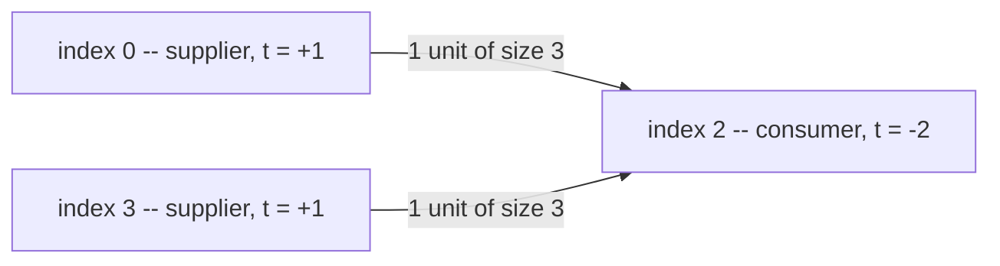

# Guided Example: Minimum Operations to Make Array Equal II

## 1. The Only Move Is a Transfer, So the Total Is Frozen

Two arrays of the same length $n$ are compared index by index, and the single legal move touches
two indices at once: one index gains exactly $k$ while another loses exactly $k$. The move creates
nothing and destroys nothing, because the gain and the loss have equal magnitude. Therefore the
grand total

$$\Sigma_1 = \sum_{i=0}^{n-1} \text{nums1}[i]$$

is an invariant of every configuration reachable from the starting array. A cheap necessary
condition appears before any matching or counting is attempted: if the two arrays hold different
totals, no sequence of moves can ever reconcile them.

The remaining work is described by the signed error at each index,

$$d_i = \text{nums1}[i] - \text{nums2}[i],$$

and "equal" means precisely that the vector $d = (d_0, d_1, \dots, d_{n-1})$ is the zero vector.
The reason the whole problem collapses to a single linear scan is that no index interacts with any
other index except through the shared quantum $k$.

## 2. Normalising the Errors into Transfer Units

Every move shifts a fixed quantum, so the natural unit of accounting is $k$ itself. For a nonzero
error define the integer unit count

$$t_i = \frac{d_i}{k}.$$

Its sign names the role index $i$ plays in the ledger.

| Sign of $t_i$ | Meaning for index $i$ | Role in a transfer plan |
|---|---|---|
| $t_i > 0$ | `nums1[i]` is too large by $t_i k$ | supplier: must surrender $t_i$ units |
| $t_i < 0$ | `nums1[i]` is too small by $\lvert t_i \rvert k$ | consumer: must receive $\lvert t_i \rvert$ units |
| $t_i = 0$ | index already agrees with `nums2` | inert: an optimal plan never touches it |

Let

$$S = \sum_{t_i > 0} t_i, \qquad C = -\sum_{t_i < 0} t_i$$

be the number of units offered and the number of units demanded. A single move retires exactly one
offered unit and satisfies exactly one demanded unit, so a plan that succeeds must spend one move
per unit. When $S = C$ the requested minimum is

$$\text{answer} = S = C,$$

and when $S \ne C$ the offers and the requests cannot be paired at all.

## 3. The Two Admission Tests and the Degenerate Step Size

Three questions decide reachability before any counting begins.

1. **Zero step.** If $k = 0$, the move adds and subtracts nothing; the arrays are frozen. The only
   solvable instance is one where every $d_i$ is already $0$, and its answer is $0$. No division by
   $k$ is meaningful here, so this case must be settled on its own before unit accounting starts.
2. **Divisibility.** With $k > 0$, each move changes every index it touches by a multiple of $k$,
   so every reachable value of index $i$ stays congruent to `nums1[i]` modulo $k$. Any nonzero
   $d_i$ with $d_i \bmod k \ne 0$ is unreachable forever, regardless of how the other indices are
   arranged.
3. **Conservation.** Once divisibility holds, the condition $S = C$ is equivalent to
   $\sum_i d_i = 0$, which is the frozen-total condition of section 1. A violation again forces the
   answer $-1$.

The order matters pedagogically: divisibility is a statement about each index alone, whereas
conservation is a statement about the array as a whole. An instance can pass either test and still
fail the other, which is exactly what the two worked instances below demonstrate.

## 4. Worked Instance: `nums1 = [4,3,1,4]`, `nums2 = [1,3,7,1]`, `k = 3`

Both arrays total $12$, so the invariant survives; the divisibility test is then applied index by
index.

| $i$ | `nums1[i]` | `nums2[i]` | $d_i$ | $d_i \bmod 3$ | $t_i = d_i / 3$ | role |
|---|---|---|---|---|---|---|
| 0 | 4 | 1 | 3 | 0 | 1 | supplier |
| 1 | 3 | 3 | 0 | 0 | 0 | inert |
| 2 | 1 | 7 | -6 | 0 | -2 | consumer |
| 3 | 4 | 1 | 3 | 0 | 1 | supplier |

Every nonzero error is a multiple of $3$, so the instance passes divisibility. Summing the roles
gives $S = 1 + 1 = 2$ and $C = 2$, so the ledger balances and two moves suffice. The pairing below
is one concrete minimum-length plan; index $1$ is never disturbed because its error is already
zero.

| Move | Supplier | Consumer | Units moved | Array after the move |
|---|---|---|---|---|
| 1 | index 0 | index 2 | 1 | `[1,3,4,4]` |
| 2 | index 3 | index 2 | 1 | `[1,3,7,1]` |

Move 1 lowers index $0$ to $4 - 3 = 1$ and raises index $2$ to $1 + 3 = 4$, leaving residual units
$t = (0, 0, -1, 1)$. Move 2 lowers index $3$ to $4 - 3 = 1$ and raises index $2$ to $4 + 3 = 7$,
leaving $t = (0,0,0,0)$. The plan is therefore complete in $2 = S$ moves.

## 5. Why the Surplus Total Is Both Necessary and Sufficient

**Lower bound.** Each move can retire at most one offered unit, because it decrements exactly one
index by exactly $k$. Retiring all $S$ units therefore needs at least $S$ moves, whatever pairing
is chosen.

**Upper bound.** Units of size $k$ are fungible: the consumer that receives a particular unit only
cares about the amount, never about which supplier sent it. So take any supplier with $t_i$ units
and any consumer with $\lvert t_j \rvert$ units and pair them greedily, splitting a supplier across
several consumers or a consumer across several suppliers whenever the counts differ. Because
$S = C$, every unit is consumed exactly once, and the total number of pairings constructed this way
is exactly $S$. Hence $S$ moves are achievable, and the lower bound is tight.

This is why the answer does not depend on the *locations* of the errors. Only the multiset of unit
counts matters, and the answer is a function of one aggregate number per side of the ledger.

## 6. A Rejected Instance: `nums1 = [3,8,5,2]`, `nums2 = [2,4,1,6]`, `k = 1`

Here $k = 1$, so divisibility is free and the conservation test alone decides the outcome.

| $i$ | `nums1[i]` | `nums2[i]` | $d_i$ | $t_i$ | role |
|---|---|---|---|---|---|
| 0 | 3 | 2 | 1 | 1 | supplier |
| 1 | 8 | 4 | 4 | 4 | supplier |
| 2 | 5 | 1 | 4 | 4 | supplier |
| 3 | 2 | 6 | -4 | -4 | consumer |

The offers total $S = 1 + 4 + 4 = 9$ while the requests total $C = 4$. The array has $9$ units of
excess and only $4$ units of shortfall, and since the grand totals differ ($18$ against $13$) the
excess can never be discharged. The pairing construction of section 5 would run out of consumers
after four moves while five offered units remain, so no plan exists and the verdict is $-1$. This
instance shows that divisibility alone is never enough: every single error here is a clean multiple
of $k$, and the answer is still $-1$.

## 7. Boundary Conditions and Material Traps

| Situation | What the ledger shows | Verdict |
|---|---|---|
| Every $d_i = 0$, any $k$ including $k = 0$ | $S = C = 0$; no division is ever attempted | `0` |
| $k = 0$ with some $d_i \ne 0$ | the move is inert, so no index can ever change | `-1` |
| Some nonzero $d_i$ with $d_i \bmod k \ne 0$ | index $i$ is stuck at a wrong residue class mod $k$ | `-1` |
| All errors divisible by $k$ but $S \ne C$ | offered units outnumber or fall short of requests | `-1` |
| Errors divisible by $k$ and $S = C$ | greedy pairing consumes every unit | `S` |
| One index with a huge error, many small ones | one supplier is split across several consumers | still `S` |

Three traps deserve explicit naming. First, the all-zero instance with $k = 0$ returns `0`, not
`-1`; the zero-step rule rejects *changes*, not already-correct arrays. Second, a balanced total is
not the only thing to check, and neither is divisibility: `nums1 = [2,0]` against
`nums2 = [0,2]` with $k = 3$ has perfectly balanced totals $2 = 2$ yet fails divisibility because
$2 \bmod 3 = 2$, while `nums1 = [3,8,5,2]` against `nums2 = [2,4,1,6]` with $k = 1$ passes
divisibility everywhere yet fails conservation. Third, the arithmetic in an implementation of this
scan can overflow a 32-bit accumulator on a generous instance: with $n$ up to $10^5$ and entries up
to $10^9$, an aggregate such as $\sum_i \lvert d_i \rvert$ reaches $10^{14}$, so the running totals
must be accumulated in a wider signed type than the array elements themselves.

## 8. Complexity of the Ledger Scan

Every index is inspected a constant number of times: one subtraction to form $d_i$, one congruence
test, one integer division, and one addition into either $S$ or $C$. No index is revisited and no
pairing is ever materialised, so the running time is

$$O(n)$$

with the instance's own length as the only growth parameter. The auxiliary space is

$$O(1),$$

because the two accumulators plus the scalar for the frozen total are all the memory the method
needs, independent of $n$. The terminal decision is the comparison $S = C$ together with the two
rejection flags gathered along the way.