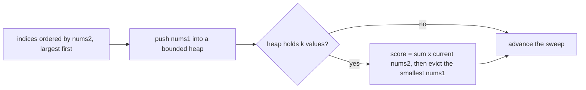

# Guided Example: Maximum Subsequence Score

## 1. The Objective Couples Two Preferences That Pull Apart

We must pick exactly $k$ indices from $\{0, 1, \dots, n-1\}$ and score the selection by

$$\text{score}(I) = \Bigl(\sum_{i \in I} \text{nums1}[i]\Bigr) \cdot \min_{i \in I} \text{nums2}[i].$$

Read the two factors separately and the difficulty becomes visible. The first factor improves when
every chosen index carries a large `nums1` value. The second factor improves when the chosen index
with the *smallest* `nums2` value is still large. These are two different rankings of the same
$n$ indices, and one index has to serve both roles, so the problem is not separable into "take the
largest `nums1`" or "take the largest `nums2`". The whole method below is a way of removing that
coupling with an exhaustive case split.

## 2. Anchoring on the Index That Supplies the Minimum

Let $I^{*}$ be an optimal selection and let $m = \min_{i \in I^{*}} \text{nums2}[i]$. Some chosen
index attains that minimum; call it the **anchor** $p$, so $\text{nums2}[p] = m$. Two facts follow
immediately from the definition of the minimum.

- Every other chosen index $i \in I^{*} \setminus \{p\}$ satisfies $\text{nums2}[i] \ge m$.
- The multiplier of the whole selection is exactly $m$, no matter how large those other
  `nums2` values are.

That gives a complete case split: enumerate every index $p$ as the anchor. Once $p$ is fixed, the
multiplier is pinned to $\text{nums2}[p]$, and the only remaining decision is which $k-1$ indices to
add from the *admissible pool*

$$A(p) = \{\, i \ne p \;:\; \text{nums2}[i] \ge \text{nums2}[p] \,\}.$$

Because the multiplier cannot change anymore, the best possible completion is simply the $k-1$
largest `nums1` values inside $A(p)$. Taking any smaller value instead would shrink the sum without
touching the multiplier, so no other completion can beat it. Enumerating all $n$ anchors is
therefore exhaustive and exact, and the answer is the largest score over the enumerated anchors.

## 3. From n Separate Pools to One Descending Sweep

Sorting the indices by `nums2` in non-increasing order makes the pools nested: once the sweep has
passed a position, every index behind it has a `nums2` value at least as large as the current one.
So instead of rebuilding the $k$ largest values for each anchor, maintain them incrementally.

| Sweep state | Definition | Update rule at each position |
|---|---|---|
| Order | indices sorted by `nums2` descending | built once, before the sweep |
| Current anchor | the index the sweep is standing on | the sweep pointer itself |
| Candidate pool | all positions already visited, including the anchor | grows by one index per step |
| Heap | the $k$ largest `nums1` values in the candidate pool | push the new value, then evict the smallest once the heap exceeds $k$ |
| Sum $s$ | sum of the values currently in the heap | add the new value, subtract any evicted value |
| Score | $s \cdot \text{nums2}[\text{anchor}]$ | evaluated only when the heap holds exactly $k$ values |

The multiplier at each evaluation is legitimate because the anchor is the *last* index added: every
heap member has `nums2` at least as large, so the anchor is the minimum of the selected set by
construction. Keeping only $k$ values in the heap is what makes the maintenance cheap, and evicting
the smallest is safe because the smallest `nums1` value contributes least to the sum and could
never be preferred over a larger value in the same pool.

## 4. Worked Instance: `nums1 = [1,3,3,2]`, `nums2 = [2,1,3,4]`, `k = 3`

Sort the paired values by `nums2` descending. The reordering is the only preprocessing step; the
original indices are carried along so the final selection can be read back.

| Sweep position | Original index | `nums2` (multiplier) | `nums1` (summand) |
|---|---|---|---|
| 1 | 3 | 4 | 2 |
| 2 | 2 | 3 | 3 |
| 3 | 0 | 2 | 1 |
| 4 | 1 | 1 | 3 |

Now sweep, maintaining the running sum of the heap and evaluating a score whenever the heap reaches
size $k = 3$.

| Step | Anchor index | `nums2` | pushed `nums1` | Sum $s$ | Heap after the push | Score at this anchor | Best so far |
|---|---|---|---|---|---|---|---|
| 1 | 3 | 4 | 2 | 2 | $\{2\}$ | not yet full | $0$ |
| 2 | 2 | 3 | 3 | 5 | $\{2,3\}$ | not yet full | $0$ |
| 3 | 0 | 2 | 1 | 6 | $\{1,2,3\}$ | $6 \cdot 2 = 12$ | $12$ |
| 4 | 1 | 1 | 3 | 8 | $\{2,3,3\}$ | $8 \cdot 1 = 8$ | $12$ |

At step 3 the heap becomes full for the first time; the anchor is index $0$ with `nums2[0] = 2`,
and the selected indices are $\{3, 2, 0\}$ with `nums1` sum $2 + 3 + 1 = 6$. Step 4 evicts the
smallest heap value, so the recorded sum $8$ already excludes the evicted $2$; the anchor is index
$1$ with `nums2[1] = 1` and the selection is $\{2, 3, 1\}$. The best recorded score is $12$.

Exhaustive verification confirms that no selection was missed. With $n = 4$ and $k = 3$ there are
only four selections to compare.

| Selection | $\sum \text{nums1}$ | $\min \text{nums2}$ | Score |
|---|---|---|---|
| $\{0,1,2\}$ | $1+3+3 = 7$ | $1$ | $7$ |
| $\{0,1,3\}$ | $1+3+2 = 6$ | $1$ | $6$ |
| $\{0,2,3\}$ | $1+3+2 = 6$ | $2$ | $12$ |
| $\{1,2,3\}$ | $3+3+2 = 8$ | $1$ | $8$ |

The maximum is $12$, matching the sweep. Notice that the selection with the largest sum, $\{1,2,3\}$
at $8$, is *not* the winner: its minimum `nums2` of $1$ drags the product down to $8$. This is the
coupling of section 1 in one line of arithmetic.

## 5. Why the Heap Discipline Cannot Discard a Better Selection

Two exchange arguments justify the maintenance rules.

**Keeping the largest `nums1` values.** Suppose the heap at some anchor held a value $u$ while a
larger pool value $v$ sat outside the heap. Swapping $v$ in for $u$ raises the sum by $v - u > 0$ and
leaves the anchor, hence the multiplier, unchanged, so the score strictly improves. Therefore an
optimal completion never excludes an available value in favour of a smaller one.

**Evicting the smallest.** When the heap would exceed $k$, exactly one value must go and the anchor
must stay (it defines the multiplier). Removing the smallest value loses the least sum, and any
value removed can never be selected again at this anchor or at a later anchor, because later anchors
admit only a subset of the current pool. The eviction is therefore never premature.

Together the two rules mean the heap always holds the $k$ largest pool values, so every score the
sweep evaluates is the exact optimum for that anchor, and the running maximum over all anchors is
the exact global optimum.

## 6. The Tempting Local Choice: A Lower Multiplier Can Still Win

Consider `nums1 = [2,1,14,12]`, `nums2 = [11,7,13,6]`, `k = 3`. Sorted by `nums2` descending the
pairs are $(13, 14)$, $(11, 2)$, $(7, 1)$, $(6, 12)$, where each pair is written as
(`nums2`, `nums1`).

| Step | Anchor index | `nums2` | pushed `nums1` | Sum $s$ | Heap after the push | Score at this anchor | Best so far |
|---|---|---|---|---|---|---|---|
| 1 | 2 | 13 | 14 | 14 | $\{14\}$ | not yet full | $0$ |
| 2 | 0 | 11 | 2 | 16 | $\{2,14\}$ | not yet full | $0$ |
| 3 | 1 | 7 | 1 | 17 | $\{1,2,14\}$ | $17 \cdot 7 = 119$ | $119$ |
| 4 | 3 | 6 | 12 | 28 | $\{2,12,14\}$ | $28 \cdot 6 = 168$ | $168$ |

An impatient method that stopped at the first full heap would return $119$ and be wrong. The winner
appears only at step 4, where a drop in the multiplier from $7$ to $6$ is more than repaid by
replacing the summand $1$ with $12$: the product gains $168 - 119 = 49$. This is exactly why the
sweep must evaluate *every* anchor instead of committing to the first, or to the largest,
multiplier.

## 7. Boundary Conditions and Material Traps

| Situation | What the sweep does | Outcome |
|---|---|---|
| $k = 1$ | the heap holds one value, so the score at each anchor is a single product `nums1[i] * nums2[i]` | the best direct product |
| $k = n$ | every index must be selected; only one full heap ever forms, at the last position | the sole feasible score |
| All `nums2` equal | the multiplier is constant, so the winner is the $k$ largest `nums1` values | selection ranks by `nums1` only |
| Repeated `nums2` values | ties do not break the nesting of the pools, since later equal values still satisfy the non-strict inequality | unaffected |
| Several indices share the minimum `nums2` | any of them may serve as the anchor; all are enumerated, so the maximum is still found | unaffected |
| `nums1` values equal to zero | a zero summand contributes nothing to the sum but still occupies a slot, so it can be preferable to a negative one, though none exist here | non-negative sums only |
| Large products | `nums1` up to $10^5$ and $n$ up to $10^5$ allow a sum near $10^{10}$ and a product near $10^{15}$ | needs a 64-bit accumulator |

Two further traps are worth stating. First, the multiplier is the minimum over the *selected* set,
not over the whole pool; the sweep is careful to evaluate only when the anchor is the smallest
`nums2` among the heap members. Second, the tie between equal `nums2` values matters for
correctness of the ordering argument only through the non-strict comparison, so a descending sort
with either tie order works.

## 8. Complexity of the Sweep

Sorting the $n$ paired values costs $O(n \log n)$. The sweep performs $n$ insertions and at most $n$
evictions on a heap whose size never exceeds $k$, so each heap operation costs $O(\log k)$ and the
sweep costs $O(n \log k)$. The total running time is therefore

$$O(n \log n + n \log k) = O(n \log n),$$

dominated by the sort. The auxiliary space is

$$O(n)$$

for the sorted pair sequence, of which the heap itself retains only $O(k)$ values at any moment; the
running sum, the best score, and the anchor pointer are $O(1)$ scalars.
