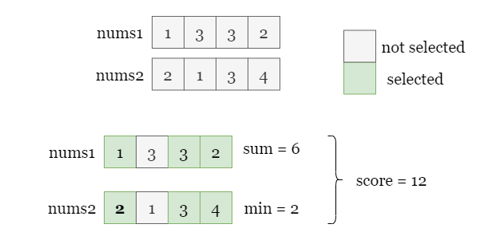
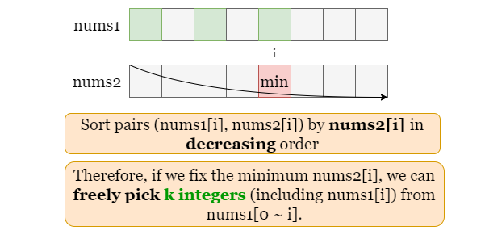
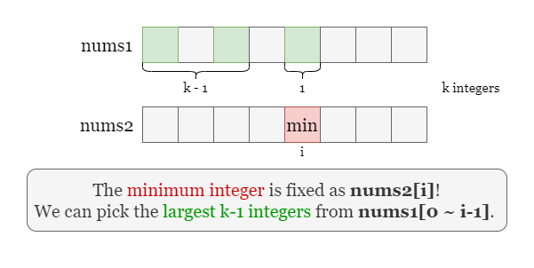
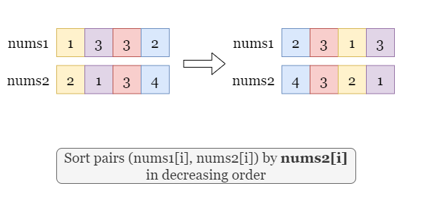
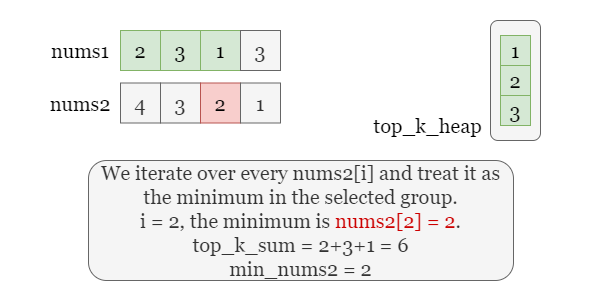
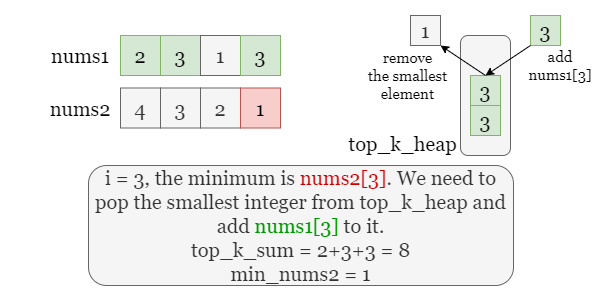

## Solution

---

### Overview

As shown in the picture below, if we select the index `0`, `2`, and `3`, the score is defined as **the product** of the following two terms:
- The sum of all selected $\text{nums1}[i]$, $sum = 1 + 3 + 2 = 6$.
- The minimum one from the selected $\text{nums2}[i]$, $min = min(2, 3, 4) = 2$.



Thus the score equals $6 * 2 = 12$. Our task is to find the maximum score if we pick `k` indexes.

---

### Approach: Priority Queue

#### Intuition

Start with a brute force approach, if we find the maximum score by checking all groups of indexes with size `k`, there are ${n \choose k} = {{n!}\over{k! (n - k)!}}$ possibilities. We can't afford to check them one by one.

Let's first focus on the minimum of the selected elements from `nums2`. If we pick $\text{nums2}[i]$ as the minimum, it means the other $k - 1$ selected elements from `nums2` are larger or equal to $\text{nums2}[i]$.

We can thus take advantage of this restriction on the selection by sorting `nums2`, which can reduce the time complexity. Assume that we have sorted `nums2` by decreasing order (Note that we can't change the relative order of  `nums1` and `nums2`, so its better to store each pair as $(\text{nums1}[i], \text{nums2}[i])$ and sort the collection of pairs according to $\text{nums2}[i]$).

As shown in the picture below, if we pick $\text{nums2}[i]$ (colored in red) as the minimum selected element from `nums2`, we can freely select the rest $k - 1$ indexes to the left of `i` without changing the second term: minimum of the selected elements from `nums2`.



Recall the definition of the score, the second term has been fixed as $\text{nums2}[i]$, so we can maximzie the total score by maximizing the first term, that is, by selecting the maximum `k` elements from `nums1` including $\text{nums1}[i]$.



This can be done efficiently by maintaining a min-heap that always contains the largest `k` elements we have seen. Whenever we pick a new $\text{nums2}[i]$ as the minimum from `nums2`, we shall remove one element from the heap (which represents removing a `nums1` number and add $\text{nums}[i]$ to it. Now the heap contains the largest `k` element including $\text{nums1}[i]$ again, the current score equals the sum of this heap times $\text{nums2}[i]$.

We can iterate over `nums2` and repeat the above process. At each step, we calculate the current score and update `answer` as the maximum score we have met.

Take the following slides as an example:







<br>

#### Algorithm

1) Store every pair $(\text{nums1}[i], \text{nums2}[i])$ in array `pairs`, and sort `pairs` by the second element ($\text{nums2}[i]$) in decreasing order.

2) Use a min-heap `top_k_heap` to store the first `k` $\text{nums1}[i]$ and a variable `top_k_sum` to store their sum.

3) Initialize `answer` as the sum of elements in `top_k_heap` (i.e. `top_k_sum`) times $pairs[k - 1][1]$.

4) Iterate over indices starting from `k`, at each index `i`:

- Remove the smallest element stored in `top_k_heap` and from `top_k_sum`.
- Add the current $\text{nums1}[i]$ to the heap and `top_k_sum`.
- Get the current score as the sum of `top_k_heap` (i.e. `top_k_sum`) times $\text{nums2}[i]$, and update `answer` as the maximum score we have met.

5) Return `answer`.

#### Implementation

```python
class Solution:
    def maxScore(self, nums1: List[int], nums2: List[int], k: int) -> int:
        # Sort pair (nums1[i], nums2[i]) by nums2[i] in decreasing order.
        pairs = [(a, b) for a, b in zip(nums1, nums2)]
        pairs.sort(key = lambda x: -x[1])

        # Use a min-heap to maintain the top k elements.
        top_k_heap = [x[0] for x in pairs[:k]]
        top_k_sum = sum(top_k_heap)
        heapq.heapify(top_k_heap)

        # The score of the first k pairs.
        answer = top_k_sum * pairs[k - 1][1]

        # Iterate over every nums2[i] as minimum from nums2.
        for i in range(k, len(nums1)):
            # Remove the smallest integer from the previous top k elements
            # then add nums1[i] to the top k elements.
            top_k_sum -= heapq.heappop(top_k_heap)
            top_k_sum += pairs[i][0]
            heapq.heappush(top_k_heap, pairs[i][0])

            # Update answer as the maximum score.
            answer = max(answer, top_k_sum * pairs[i][1])

        return answer

```

#### Complexity Analysis

Let $n$ be the length of the input array `nums1`.

* Time complexity: $O(n \cdot \log n)$

- We need to sort `nums2`, it takes $O(n \cdot \log n)$.
- Then we iterate over `pairs` of length `n`. At each iteration step `i`, we remove the smallest element from `top_k_heap` and add one element $\text{pairs}[i][0]$ to it. Both the inserting and removing operations to priority queue of size $k$ take $O(\log k)$ time.
- To sum up, the overall time complexity is $O(n \cdot \log n)$, because $k \leq n$.

* Space complexity: $O(n)$

- We store every pair $(\text{nums1}[i], \text{nums2}[i])$ in a 2-d array `pairs`, it takes $O(n)$ space.
- The in-place sorting method also uses some additional space, in Python, it uses $O(n)$ space and in Java, it uses $O(\log n)$ space.
- The priority queue contains at most $k$ elements thus it takes $O(k)$ space.

<br/>