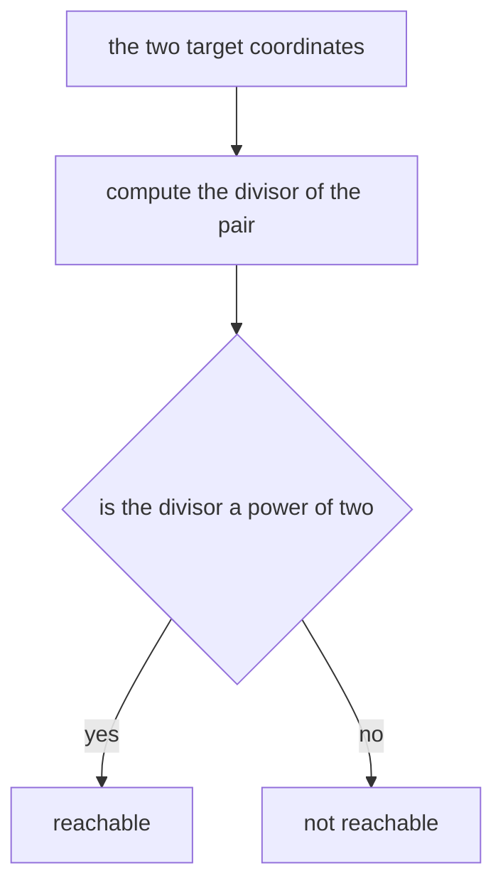

# Guided Example: Check if Point Is Reachable

A point moves on the positive integer grid, starting from $(1, 1)$. Four moves are available from a point $(x, y)$: replace the second coordinate by $y - x$, replace the first coordinate by $x - y$, double the first coordinate, or double the second. The task is to decide whether a given target $(targetX, targetY)$ can be reached by some finite sequence of those moves.

The representative instance is $(4, 7)$, which is reachable, and its contrast is $(6, 9)$, which is not. The two look alike: both have small coordinates, both are coprime to nothing in particular, and both have short descriptions. What separates them is a single number, the greatest common divisor, reduced to its odd part.

## 1. The Moves and What They Do to the Divisor

Write $\gcd(x, y)$ for the greatest common divisor of the two coordinates. Call the **odd part** of a positive integer the number that remains after every factor of $2$ is divided out: the odd part of $12$ is $3$, the odd part of $8$ is $1$, the odd part of $9$ is $9$.

The divisor is not merely a label attached to a point; each move acts on it in a controlled way.

| Move | New point | Divisor after the move | Odd part after the move |
|---|---|---|---|
| Subtract the second coordinate from the first | $(x - y,\ y)$ | $\gcd(x - y,\ y) = \gcd(x, y)$ | identical to before |
| Subtract the first coordinate from the second | $(x,\ y - x)$ | $\gcd(x,\ y - x) = \gcd(x, y)$ | identical to before |
| Double the first coordinate | $(2x,\ y)$ | $\gcd(2x,\ y)$ is $\gcd(x, y)$ or $2\gcd(x, y)$ | identical to before |
| Double the second coordinate | $(x,\ 2y)$ | $\gcd(x,\ 2y)$ is $\gcd(x, y)$ or $2\gcd(x, y)$ | identical to before |

The two subtraction moves preserve the divisor exactly, because subtracting one coordinate from the other is the central step of the Euclidean algorithm. The two doubling moves can multiply the divisor by $2$ and can do nothing else, because doubling a coordinate changes only the exponent of the prime $2$; for every odd prime $p$, the exponent of $p$ in $\gcd(2x, y)$ is the same as in $\gcd(x, y)$. So the odd part is untouched by all four moves, while the power of $2$ may grow.

That single observation already settles the negative direction. The starting point is $(1, 1)$, whose divisor is $1$ with odd part $1$. Since no move can introduce an odd prime into the divisor, every reachable point has a divisor whose odd part is $1$ — that is, a divisor that is a power of $2$.

## 2. The Representative Instance: Reaching $(4, 7)$

The target $(4, 7)$ has $\gcd(4, 7) = 1$, which is $2^{0}$, so the necessary condition is satisfied and the point should be reachable. Here is a six-move route, tracking the divisor after every move.

| Step | Point | Move applied | Divisor | Odd part |
|---|---|---|---|---|
| 0 | $(1,\ 1)$ | starting point | $1$ | $1$ |
| 1 | $(1,\ 2)$ | double the second coordinate | $1$ | $1$ |
| 2 | $(1,\ 4)$ | double the second coordinate | $1$ | $1$ |
| 3 | $(1,\ 8)$ | double the second coordinate | $1$ | $1$ |
| 4 | $(1,\ 7)$ | subtract the first coordinate from the second | $1$ | $1$ |
| 5 | $(2,\ 7)$ | double the first coordinate | $1$ | $1$ |
| 6 | $(4,\ 7)$ | double the first coordinate | $1$ | $1$ |

Both coordinates stay positive at every step, so every intermediate point is a legal position. Note where the work happens: doubling alone can only produce points whose coordinates are powers of two, because it never changes the ratio of the coordinates. The route escapes that family at step 4, where a subtraction changes $8$ into $7$ and makes the two coordinates coprime in a way no amount of doubling could.

## 3. The Descent Certificate: Why $(4, 7)$ Is Reachable

Exhibiting one route proves reachability for one target, but the same target can be approached from the other end. Reverse each move and the question becomes: can $(4, 7)$ be reduced to $(1, 1)$ using only the inverse moves, which are *halve an even coordinate* and *subtract the smaller coordinate from the larger*?

| State | Which coordinate is even | Reverse move applied | Next state | Sum of coordinates |
|---|---|---|---|---|
| $(4,\ 7)$ | the first | halve the first coordinate | $(2,\ 7)$ | $11 \to 9$ |
| $(2,\ 7)$ | the first | halve the first coordinate | $(1,\ 7)$ | $9 \to 8$ |
| $(1,\ 7)$ | neither, and $\gcd = 1$ | subtract the smaller from the larger | $(1,\ 6)$ | $8 \to 7$ |
| $(1,\ 6)$ | the second | halve the second coordinate | $(1,\ 3)$ | $7 \to 4$ |
| $(1,\ 3)$ | neither, and $\gcd = 1$ | subtract the smaller from the larger | $(1,\ 2)$ | $4 \to 3$ |
| $(1,\ 2)$ | the second | halve the second coordinate | $(1,\ 1)$ | $3 \to 2$ |

The sum of the coordinates falls at every step, so the descent cannot continue forever, and it can only stop at $(1, 1)$: a state with equal coordinates stops only when both are $1$, and a state with equal coordinates and a power-of-two divisor is reachable from $(1, 1)$ by doubling alone. Reversing the table gives a legal forward route, which is exactly the walk of Section 2 read from the bottom up.

The descent always makes progress, which is the part worth remembering. If a coordinate is even it can be halved, and halving an even coordinate strictly decreases the coordinate. If both coordinates are odd, then their divisor is odd; and since the odd part of that divisor is $1$, an odd divisor with odd part $1$ must be $1$ itself, so the two coordinates are coprime and subtracting the smaller from the larger keeps them coprime while producing an even difference and a strictly smaller sum. That is the sufficiency argument in full: **every** target whose divisor is a power of two descends to $(1, 1)$, and therefore every such target is reachable.

## 4. Why $(6, 9)$ Cannot Be Reached

The contrast instance has $\gcd(6, 9) = 3$, whose odd part is $3$ rather than $1$. The necessary condition fails, so no sequence of moves can succeed. The four moves confirm it directly.

| Move | Resulting point | Divisor | Odd part | Available here |
|---|---|---|---|---|
| Subtract the second coordinate from the first | $(-3,\ 9)$ | not defined | not defined | no, it leaves the positive grid |
| Subtract the first coordinate from the second | $(6,\ 3)$ | $3$ | $3$ | yes |
| Double the first coordinate | $(12,\ 9)$ | $3$ | $3$ | yes |
| Double the second coordinate | $(6,\ 18)$ | $6$ | $3$ | yes |

Every legal move keeps the odd part at $3$. Doubling the second coordinate even raises the divisor from $3$ to $6$, which looks like progress toward a power of two, but $6 = 2 \cdot 3$ still carries the factor $3$: raising the exponent of $2$ never removes an odd prime. From $(6, 9)$ the point can wander, and its coordinates can grow, but the factor $3$ travels with it forever.

## 5. Algorithmic Correctness of the Odd-Part Test

The decision rule is: compute $g = \gcd(targetX, targetY)$ and answer *reachable* exactly when $g$ is a power of two.

**Necessity.** The starting point has divisor $1$. By the move table of Section 1, no move can change the odd part of the divisor, so every reachable point has odd part $1$, meaning its divisor is $2^{k}$ for some $k \ge 0$. A target whose divisor contains an odd prime therefore cannot be reached, which is the case for $(6, 9)$ with its factor $3$.

**Sufficiency.** Let the target have divisor $2^{k}$. Run the descent of Section 3 from the target. Each step is one of two kinds, and each strictly decreases the sum of the coordinates:

- if either coordinate is even, halve it; the coordinate is at least $2$, so halving decreases it and the sum falls;
- if both coordinates are odd, then the divisor is odd, and an odd divisor whose odd part is $1$ equals $1$, so the coordinates are coprime; subtracting the smaller from the larger keeps the divisor at $1$, keeps both coordinates positive because they are unequal, and decreases the sum.

A strictly decreasing sequence of positive sums must terminate, and it can only terminate at a state where neither rule applies. That happens when both coordinates are odd, equal, and odd-part $1$: the only such positive value is $1$. So every target with a power-of-two divisor descends to $(1, 1)$, and reversing the descent yields a legal forward route. This is the binary Euclidean algorithm, so the descent needs $O(\log(targetX + targetY))$ steps.

Both directions together give the exact criterion: reachable if and only if the divisor is a power of two. The bit test $g \mathbin{\&} (g - 1) = 0$ recognises those values in one operation, since a positive integer is a power of two exactly when clearing its lowest set bit leaves nothing.

## 6. Boundary Instances and the Traps They Expose

| Target | Divisor | Odd part | Verdict | What the instance shows |
|---|---|---|---|---|
| $(1,\ 1)$ | $1$ | $1$ | reachable | the starting point needs no moves, and $1 = 2^{0}$ |
| $(4,\ 7)$ | $1$ | $1$ | reachable | coprime targets are reachable even when neither coordinate is a power of two |
| $(8,\ 12)$ | $4$ | $1$ | reachable | a shared factor is harmless when it is a power of two |
| $(6,\ 10)$ | $2$ | $1$ | reachable | both coordinates even, with the divisor exactly $2$ |
| $(536870912,\ 536870912)$ | $2^{29}$ | $1$ | reachable | equal coordinates at the top of the value range |
| $(6,\ 9)$ | $3$ | $3$ | not reachable | the smallest interesting failure |
| $(12,\ 18)$ | $6$ | $3$ | not reachable | both coordinates even, and still unreachable |
| $(9,\ 15)$ | $3$ | $3$ | not reachable | both coordinates odd with a shared odd factor |
| $(1000000000,\ 1000000000)$ | $10^{9}$ | $5^{9}$ | not reachable | an equal pair carrying the odd prime $5$ |

The row for $(12, 18)$ is the one to keep. It is the natural guess that a pair of even coordinates can always be halved down to something reachable, and the guess fails here: halving is not one of the forward moves at all, and the point $(12, 18)$ lies outside the reachable set for the same reason $(6, 9)$ does.

| Claim that looks plausible | Verdict | The instance that settles it |
|---|---|---|
| both coordinates even implies reachable | false | $(12,\ 18)$ has divisor $6$ and cannot be reached |
| reachable implies both coordinates are powers of two | false | $(4,\ 7)$ and $(6,\ 10)$ are reachable |
| coprime coordinates are always reachable | true | the divisor is $1 = 2^{0}$ for every such pair |
| doubling is enough by itself | false | doubling preserves the ratio, so it can never turn $(1,\ 1)$ into $(4,\ 7)$ |
| an even divisor is the test | false | $(12,\ 18)$ has the even divisor $6$ and fails; the odd part is the test |
| the two coordinates play symmetric roles | true | the four moves are symmetric under swapping the coordinates |

## 7. Cost of the Method

- **Time Complexity:** $O(\log \min(targetX, targetY))$, the cost of one Euclidean algorithm on values bounded by $10^{9}$, so at most about thirty subtraction-and-division rounds. The power-of-two test that follows is a single bit operation on the divisor, and no sequence of moves is ever constructed, so the answer does not depend on how long a reaching walk would be.
- **Auxiliary Space Complexity:** $O(1)$. The divisor and the two coordinates are the only values held, and the descent argument of Section 5 is a proof about the criterion rather than a simulation that the method performs.

The tempting alternative is to search the grid or to run the descent explicitly. A search has no bound to justify, because the coordinates may grow without limit along a route, and running the descent would cost more than the criterion it proves. Computing the divisor once and testing its odd part answers the question directly.
