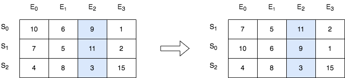
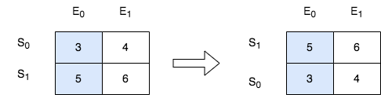

### 1. Description

There is a class with `m` students and `n` exams. You are given a **0-indexed** `m x n` integer matrix `score`, where each row represents one student and $\text{score}[i][j]$ denotes the score the $$i^{\text{th}}$$ student got in the $$j^{\text{th}}$$ exam. The matrix `score` contains **distinct** integers only.

You are also given an integer `k`. Sort the students (i.e., the rows of the matrix) by their scores in the $$k^{\text{th}}$$ (**0-indexed**) exam from the highest to the lowest.

Return *the matrix after sorting it.*

### 2. Function Contract

**Inputs**

- `score`: Input parameter (`List[List[int]]`).
- `k`: Input parameter (`int`).

**Return value**

- Returns `List[List[int]]`.

### 3. Examples

#### Example 1

- **Input:** $score = [[10,6,9,1],[7,5,11,2],[4,8,3,15]], k = 2$
- **Output:** `[[7,5,11,2],[10,6,9,1],[4,8,3,15]]`
- **Explanation:** In the above diagram, S denotes the student, while E denotes the exam.
- The student with index 1 scored 11 in exam 2, which is the highest score, so they got first place.
- The student with index 0 scored 9 in exam 2, which is the second highest score, so they got second place.
- The student with index 2 scored 3 in exam 2, which is the lowest score, so they got third place.

#### Example 2

- **Input:** $score = [[3,4],[5,6]], k = 0$
- **Output:** `[[5,6],[3,4]]`
- **Explanation:** In the above diagram, S denotes the student, while E denotes the exam.
- The student with index 1 scored 5 in exam 0, which is the highest score, so they got first place.
- The student with index 0 scored 3 in exam 0, which is the lowest score, so they got second place.

### 4. Constraints

- $m = \text{score.length}$

- $n = \text{score}[i].length$

- $1 \le m, n \le 250$

- $1 \le \text{score}[i][j] \le 10^{5}$

- `score` consists of **distinct** integers.

- $0 \le k < n$
