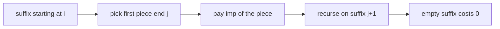

# Guided Example: Minimum Cost to Split an Array

## 1. The instance, and what a split is really paying for

Work through the first official sample: `nums = [1,2,1,2,1,3,3]` with `k = 2`. The required answer is `8`, and the goal of this lesson is to see exactly where that `8` comes from rather than to guess it.

A *split* cuts the array into consecutive, non-empty pieces. Two forces pull in opposite directions. Every piece pays a fixed toll $k$, so cutting often is expensive. But a piece also pays for its **trimmed** content, which keeps only those values that occur at least twice *inside that piece* and deletes everything occurring exactly once. Values that repeat somewhere else in the array are trimmed away unless the repeat lands in the same piece, so a careless cut can force you to pay for elements you could have deleted.

For a piece covering indices $l$ through $r$, let

$$
\text{one}(l,r) = \#\{\, x : x \text{ occurs exactly once in } nums[l..r] \,\},
$$

that is, the number of *distinct* values with multiplicity exactly one in the piece. Those are precisely the values `trimmed` deletes, so the piece's length after trimming is $(r - l + 1) - \text{one}(l,r)$, and its importance value is

$$
\text{imp}(l,r) = k + (r - l + 1) - \text{one}(l,r).
$$

This rewriting is the whole computational content of the problem: instead of building a trimmed array, it is enough to track how many distinct values currently sit at multiplicity exactly one. In the full array the multiplicities are $1 \mapsto 3$, $2 \mapsto 2$, $3 \mapsto 2$, so $\text{one}(0,6) = 0$ and the single piece $[1,2,1,2,1,3,3]$ would cost $2 + 7 - 0 = 9$ — one more than the optimum, which is why at least one cut is worth making.

## 2. The marginal price of appending one element

Suppose a piece already covers $nums[l..j-1]$ with multiplicities recorded, and we are deciding whether to extend it to index $j$. Let $c$ be the current multiplicity of the entering value $x = nums[j]$. Appending $x$ raises the length by one and changes the count of singly-occurring values by $\Delta \text{one}$; the only value whose category can change is $x$ itself, because every other value's multiplicity is untouched. There are exactly three cases.

| Prior multiplicity $c$ of $nums[j]$ | New multiplicity | $\Delta \text{one}$ | Marginal importance $\Delta(\text{length} - \text{one})$ | Reading |
|---|---|---|---|---|
| $c = 0$ (value is new to the piece) | 1 | $+1$ | $0$ | the element is free until it repeats |
| $c = 1$ (this is the second copy) | 2 | $-1$ | $+2$ | both copies stop being trimmed at once |
| $c \ge 2$ (third copy or later) | $c + 1$ | $0$ | $+1$ | plain per-element charge |

Two facts follow, and both matter later. First, a marginal price is never negative, so $\text{imp}(l,r)$ is non-decreasing as the piece grows: extending a piece can never lower what that piece costs. Second, the expensive step is the *second* copy, priced at $2$ because the first copy, previously free, becomes chargeable in the same move. A learner who reasons "another copy of an existing value costs one element" under-counts by one at exactly this transition; the arrays `[0,1,0]` with `k = 10` (answer `12`, not `11`) and the third column of the trace in Section 4 make that concrete.

Because the marginal price depends only on the entering value's multiplicity before the append, a left-to-right sweep can maintain the multiplicity map and the scalar `one` in constant amortized time per element, with no need to rebuild a piece's statistics from scratch.

## 3. Why suffix costs, not prefix costs, are the right state

A split is a strictly increasing sequence of cut positions $0 = i_0 < i_1 < \dots < i_m = n$, and its cost is the sum of the importance values of the pieces $nums[i_{t}..i_{t+1}-1]$. Fix the *first* cut of a split of the suffix $nums[i..n-1]$: it ends the first piece at some index $j$ with $i \le j \le n-1$, and everything after $j$ must itself be split optimally as a suffix starting at $j+1$. No information about the first piece constrains later pieces — the trimmed rule reads multiplicities that are local to each piece — so the suffix cost

$$
f(i) = \min_{i \le j \le n-1}\bigl(\text{imp}(i,j) + f(j+1)\bigr), \qquad f(n) = 0,
$$

is a valid dynamic program. The value we must return is $f(0)$.

The recurrence is exact in both directions, which is the correctness content of the state choice:

- **No split is missed.** Every split of $nums[i..n-1]$ has a well-defined first piece, so it is counted under exactly one $j$; its remaining pieces form a split of $nums[j+1..n-1]$ whose cost is at least $f(j+1)$ by definition of the minimum.
- **Every candidate is realizable.** Choosing any $j$ and then attaching any optimal split of the suffix starting at $j+1$ produces an ordinary split of $nums[i..n-1]$, so no candidate value in the minimum is a phantom.

Inducting on $n - i$ therefore gives $f(0) =$ the minimum possible cost. One structural caveat is worth naming early: the number of pieces is *not* fixed by the statement, and the objective mixes a per-piece toll with per-piece trimmed content. Neither "use as few pieces as possible" nor "cut whenever a value repeats" is a theorem, and the instance below breaks both instincts.

## 4. Growing every piece that starts at index 0

The first piece of the traced instance begins at index $0$. Extending it rightwards one element at a time, with the multiplicity map and `one` updated by the rules of Section 2, produces every candidate for the first term of $f(0)$.

| $j$ | $nums[j]$ | Multiplicities in $nums[0..j]$ | $\text{one}(0,j)$ | Length | $\text{imp}(0,j) = 2 + \text{length} - \text{one}$ | $f(j+1)$ | Candidate total |
|---|---|---|---|---|---|---|---|
| 0 | 1 | $1{:}1$ | 1 | 1 | $2 + 1 - 1 = 2$ | 6 | 8 |
| 1 | 2 | $1{:}1,\ 2{:}1$ | 2 | 2 | $2 + 2 - 2 = 2$ | 6 | 8 |
| 2 | 1 | $1{:}2,\ 2{:}1$ | 1 | 3 | $2 + 3 - 1 = 4$ | 4 | 8 |
| 3 | 2 | $1{:}2,\ 2{:}2$ | 0 | 4 | $2 + 4 - 0 = 6$ | 4 | 10 |
| 4 | 1 | $1{:}3,\ 2{:}2$ | 0 | 5 | $2 + 5 - 0 = 7$ | 4 | 11 |
| 5 | 3 | $1{:}3,\ 2{:}2,\ 3{:}1$ | 1 | 6 | $2 + 6 - 1 = 7$ | 2 | 9 |
| 6 | 3 | $1{:}3,\ 2{:}2,\ 3{:}2$ | 0 | 7 | $2 + 7 - 0 = 9$ | 0 | 9 |

Read the row transitions against Section 2. Step $j = 2$ re-enters value `1`, already present once, so its marginal price is $2$ and the importance jumps from $2$ to $4$. Step $j = 5$ introduces a brand-new value `3`, which is free, so the importance stays at $7$ even though the piece grew. Step $j = 6$ completes the second copy of `3`, so the price is $2$ again and the importance rises to $9$.

The smallest candidate is $8$, reached three different ways, at $j = 0$, $j = 1$, and $j = 2$. Note how little the row values resemble the answer: the cheapest-looking first piece is not the one that produces the optimum, and the row with the most expensive first piece, $j = 4$, is a strict loser at $11$.

## 5. The suffix-cost table and the optimal split it encodes

Every suffix is a smaller instance of the same problem, so the suffix costs are computed from right to left. The table lists, for each start $i$, the minimum cost $f(i)$, every first-piece end that attains it, and one cost chain that realizes it.

| $i$ | Suffix $nums[i..6]$ | $f(i)$ | Ends $j$ attaining the minimum | One attaining chain |
|---|---|---|---|---|
| 7 | empty | 0 | none | base case |
| 6 | `[3]` | 2 | 6 | `[3]` costs $2 + 1 - 1 = 2$, then the empty suffix |
| 5 | `[3,3]` | 4 | 5, 6 | `[3]` then `[3]` costs $2 + 2$; one piece `[3,3]` also costs $2 + 2 - 0$ |
| 4 | `[1,3,3]` | 4 | 5, 6 | `[1,3]` is all-distinct and costs $2$, plus $f(6) = 2$ |
| 3 | `[2,1,3,3]` | 4 | 5, 6 | `[2,1,3]` is all-distinct and costs $2$, plus $f(6) = 2$ |
| 2 | `[1,2,1,3,3]` | 6 | 2, 3, 5, 6 | one piece costs $2 + 5 - 1 = 6$, or `[1,2]` costs $2$ plus $f(4) = 4$ |
| 1 | `[2,1,2,1,3,3]` | 6 | 2 | `[2,1]` is all-distinct and costs $2$, plus $f(3) = 4$ |
| 0 | `[1,2,1,2,1,3,3]` | 8 | 0, 1, 2 | `[1,2]` costs $2$, plus $f(2) = 6$ |

Since $f(0) = 8$, the instance's minimum cost is `8`, matching the required output. The right-to-left order is forced by the dependency: $f(i)$ reads $f(j+1)$ with $j + 1 > i$, so every value a row needs is already final when that row is computed.

Following the chain $f(0) \to f(2) \to f(7)$ gives the split `[1,2]` and `[1,2,1,3,3]`, priced as

$$
\text{imp}(0,1) + \text{imp}(2,6) = \bigl(2 + 2 - 2\bigr) + \bigl(2 + 5 - 1\bigr) = 2 + 6 = 8 .
$$

The second piece holds three copies of `1` and two of `2`, so nothing in it is trimmed and it pays the toll plus all five positions. The first piece is all-distinct, so its entire length is trimmed away and it pays only the toll.

Because $f(0)$ has three optimal first cuts, other optimal splits exist and deserve to be named. Following $j = 0$ produces four pieces, `[1]`, `[2,1]`, `[2,1,3]`, `[3]`, each all-distinct except the last, so every piece pays the toll alone and the total is $2 + 2 + 2 + 2 = 8$. Following $j = 2$ produces `[1,2,1]` at $4$ plus the all-distinct `[2,1,3]` at $2$ plus `[3]` at $2$, again $8$. The optimum value is unique; the optimal split is not, and a lesson that presents "the" split as if it were forced would be describing an artifact of the tie-breaking rather than the algorithm.

## 6. Why the maintained counter and the recurrence are correct

The invariant carried by the sweep of Section 4 is: *after processing index $j$, the multiplicity map stores the exact multiplicity in $nums[i..j]$ for every value seen so far, and the scalar `one` equals the number of keys whose stored multiplicity is exactly $1$.* Before $j = i$ the map is empty and `one` is $0$, satisfying the invariant vacuously. The inductive step appends $x = nums[j]$ and updates only $x$'s entry; since every other value's multiplicity is untouched, and $x$'s new category is determined by its old multiplicity through the three cases of Section 2, the invariant is restored exactly, never approximately. A value absent from the map has multiplicity $0$ and therefore falls into the free first case rather than needing a special branch. Consequently each row of the trace states a fact about the piece, not an estimate.

That invariant is what makes $\text{imp}(i,j)$ computable in $O(1)$ amortized time per extension, and the recurrence of Section 3 then guarantees that the value returned is the global optimum rather than the best of one scanning order:

- **soundness:** every number entering a minimum corresponds to an actual split, so the computed value is attainable;
- **completeness:** every actual split appears as its first piece plus an optimal suffix split, so no split is cheaper than the computed value.

Two tempting shortcuts fail on exactly this instance. A greedy "extend while the next element is free" rule takes `[1,2]` and then stops at the repeat of `1`, which happens to be optimal here but is not a rule: it never compares the price of a repeat against the toll that a new piece would add. A greedy "cut whenever the marginal price reaches the toll" rule has no stopping condition at all when every marginal price is at most $k$, as it is for $k = 2$, and would keep the whole array for $9$. The same trap appears from the other side in the third official sample, where the identical array `[1,2,1,2,1]` costs `6` at $k = 2$ but `10` at $k = 5$: the toll, not the array, decides how many pieces are worth creating.

## 7. Traps this instance exposes

| Situation | Naive expectation | Actual behaviour | Where it bites |
|---|---|---|---|
| Second copy of a value enters a piece | costs $1$, like any element | costs $2$, because the first copy stops being trimmed | `[0,1,0]` with `k = 10` costs `12`, not `11` |
| Third and later copies | growing cost again | costs $1$ each; the value is already untrimmed | `[1,2,1,2,1]` pays for all five positions |
| All-distinct piece | trimmed content is large | trimmed content is empty, so the piece costs exactly $k$ | `[0,1,2,3,4]` with `k = 7` costs `7`; cutting only adds tolls |
| Value absent from the multiplicity map | needs a special case | absent means multiplicity $0$, the free case | an unneeded branch silently changes the answer |
| Piece boundaries | repeats anywhere in the array should still be trimmed | only repeats inside the same piece count | `[1,2]` pays $2$ while `[1,2,1,3,3]` pays $6$ |
| Ties in the minimum | exactly one optimal split | several splits can tie, as at $f(0)$ with $j = 0, 1, 2$ | reporting "the" optimal split misleads the reader |
| Magnitude of $k$ | a small integer | $k \le 10^9$ and up to $n$ pieces pay it | totals near $10^{12}$ overflow 32-bit accumulator types |

A last boundary worth checking by hand: with a single element, $f(0) = k + 1 - 1 = k$, so the answer is exactly `k` however large the toll grows — the lone value occurs once, is trimmed, and leaves only the fixed charge.

## 8. Time and auxiliary space

Every suffix start $i$ scans the ends $j = i, \dots, n-1$, so the number of $(i,j)$ candidates is

$$
\sum_{i=0}^{n-1} (n - i) = \frac{n(n+1)}{2} = \Theta(n^2),
$$

and each candidate costs $O(1)$ amortized for the multiplicity update and the importance arithmetic. The running time is therefore $\Theta(n^2)$ in the worst case, with $n \le 1000$ giving about $500{,}500$ extensions. No better general bound is available here: for a fixed start, any end $j$ can be the optimal cut, so a scan that skipped candidates on a monotonicity argument would be unsound — the importance sequence is non-decreasing in $j$, but the objective also contains the suffix cost $f(j+1)$, which is not monotone.

Auxiliary space is $O(n)$: one cell per suffix for the cost table, a multiplicity map holding at most $n$ distinct keys, and — in a top-down formulation of the same recurrence — a recursion stack of depth at most $n$. Precomputing $\text{imp}(i,j)$ for all pairs instead would store a triangular table of $\Theta(n^2)$ entries and buy nothing, because the incremental counter reproduces each entry in constant amortized time from the previous one. The trimmed array itself is never materialized; only its length is ever needed.