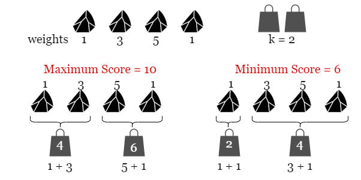
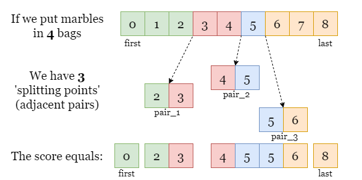
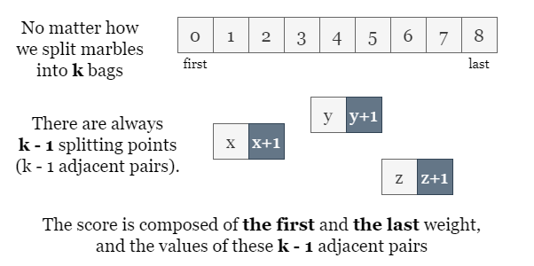
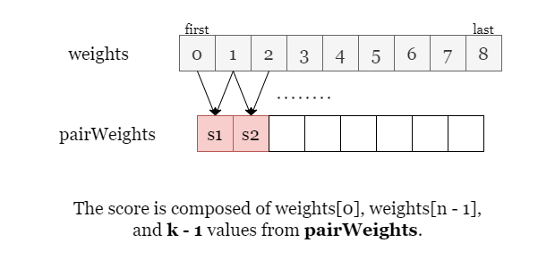

[TOC]

## Solution

---

### Overview

As shown in the picture below, we put `4` marbles in $k = 2$ bags.



There are several ways to split marbles into two bags, we have shown two of them that bring the maximum cost `10` and the minimum cost `6`. Therefore the difference between them is $10 - 6 = 4$.

---

### Approach: Sorting

#### Intuition

Let's start with a brute-force approach. Since we are looking for the maximum score and the minimum score, we shall try iterating over all possible splits. Splitting `n` marbles into `k` consecutive groups is a typical sticks-and-stones problem that has as many as ${n - 1 \choose k - 1} ={{(n - 1)!}  \over {(k - 1)!(n - k)!}}$ solutions, thus it is impractical to iterate over all possibilities.

We might also think of using dynamic programming to solve the subproblem `(x, y)`: splitting previous `x` marbles into `y` bags, then moving on to the next larger subproblem $(x + 1, y)$ or $(x, y + 1)$, until we reach the best solution of the entire problem `(n, k)`. However, given the size of the input array and the maximum value of `k`, dynamic programming brings at most $O(n ^ 2)$ time thus it won't pass the time limit.

<br>

Let's shift our thinking a bit. Instead of focusing on how to partition the array of marbles, let's now focus on the **boundary** of each subarray, the **splitting point** and try to find the relation between the score and these splitting points.

In the picture below, we split the array into 4 subarrays (shown in different colors) and resulting in 3 splitting points, each of which is made of 2 adjacent ends.

**What is the score of this split?**

Since the score of a subarray only matters with its two ends, we can tell that the total score equals the sum of the first element, the last element, and the sum of every pair (two adjacent ends at each split).



<br>

In general, if we partition the array into `k` groups, we always make $k - 1$ splitting points regardless of how the array is partitioned.



<br>

Now we know how to find the maximum score, by finding the sum of the largest $k - 1$ pairs. Similarly, we can get the minimum score by finding the sum of the smallest $k - 1$ pairs. This can be done by collecting every pair sum in an array `pairWeights` and sorting them.



$\text{MaxScore} = \text{weights}[0] + \text{weights}[n - 1] + \sum_{i = n - k}^{n - 1} {\text{pairWeights}[i]}$ (if sorted the array `pairWeights` in non-decreasing order)

$\text{MinScore} = \text{weights}[0] + \text{weights}[n - 1] + \sum_{i = 0}^{k-2} {\text{\text{pairWeights}[i]}}$

Then we have the difference between them as $$\text{answer} = \text{MaxScore - MinScore} \\
= \sum_{i = n - k}^{n - 1} {\text{pairWeights[i]}} - \sum_{i = 0}^{k-2} {\text{pairWeights[i]}}$$

<br>

#### Algorithm

- Initialize `n` as the size of the `weights` array.
- Create a array `pairWeights` of size $n - 1$ to store sums of adjacent pairs.
- Iterate over `weights`:
  - For each pair of adjacent elements, store their sum in `pairWeights`.
- Sort the `pairWeights` array in ascending order.
- Initialize `answer` as `0` to store the difference between max and min sums.
- Iterate over the first and last $k - 1$ elements of `pairWeights`:
  - Add the difference between the largest $k - 1$ sums and smallest $k - 1$ sums to `answer`.
- Return `answer` as the result.

#### Implementation

```python
class Solution:
    def putMarbles(self, weights: List[int], k: int) -> int:
        # We collect and sort the value of all n - 1 pairs.
        n = len(weights)
        pairWeights = [weights[i] + weights[i + 1] for i in range(n - 1)]

        # Since python's sort function sorts the whole list, we don't limit it to the first n-1 elements here.
        pairWeights.sort()

        # Get the difference between the largest k - 1 values and the smallest k - 1 values.
        answer = 0
        for i in range(k - 1):
            answer += pairWeights[n - 2 - i] - pairWeights[i]

        return answer
```

#### Complexity Analysis

Let $n$ be the size of the `weights` array.

- Time complexity: $O(n \log n)$

    The first loop iterates over the `weights` array to compute the `pairWeights` array, which takes $O(n)$ time. Sorting the `pairWeights` array takes $O(n \log n)$ time.

    The final loop iterates over the first $k-1$ elements of the sorted `pairWeights` array, which takes $O(k)$ time. Since $k$ can be at most $n$, this loop is $O(n)$ in the worst case.

    Therefore, the overall time complexity is dominated by the sorting step, resulting in $O(n \log n)$.

- Space complexity: $O(n + S) \approx O(n)$

    The `pairWeights` array stores $n-1$ elements, which requires $O(n)$ space.

    The space taken by the sorting algorithm ($S$) depends on the language of implementation:
- In Java, `Arrays.sort()` is implemented using a variant of the Quick Sort algorithm which has a space complexity of $O(\log n)$.
- In C++, the `sort()` function is implemented as a hybrid of Quick Sort, Heap Sort, and Insertion Sort, with a worst-case space complexity of $O(\log n)$.
- In Python, the `sort()` method sorts a list using the Timsort algorithm which is a combination of Merge Sort and Insertion Sort and has a space complexity of $O(n)$.

    All other variables used by the algorithm take constant space. Thus, the space complexity is $O(n + S) \approx O(n)$.

---