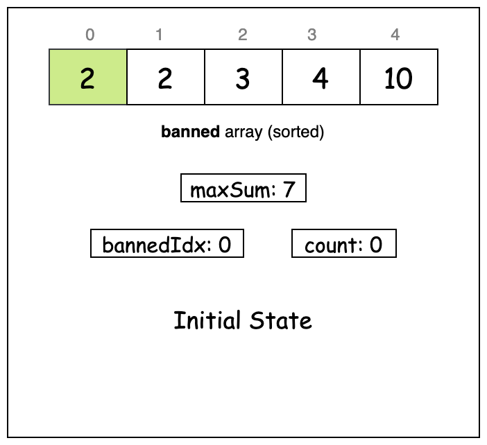
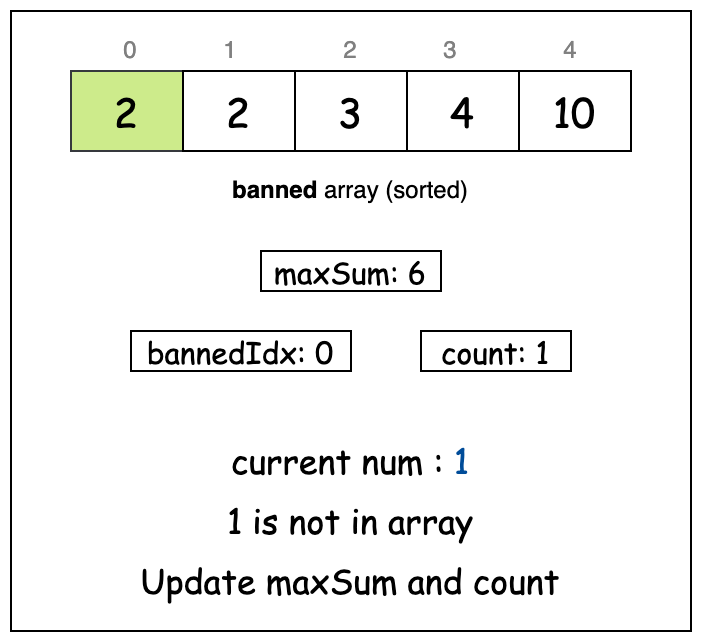
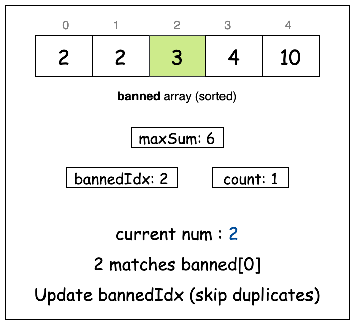
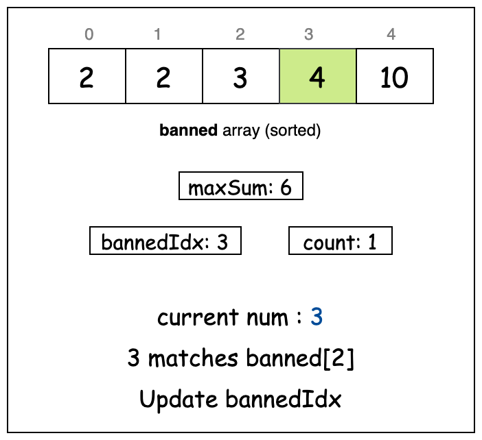
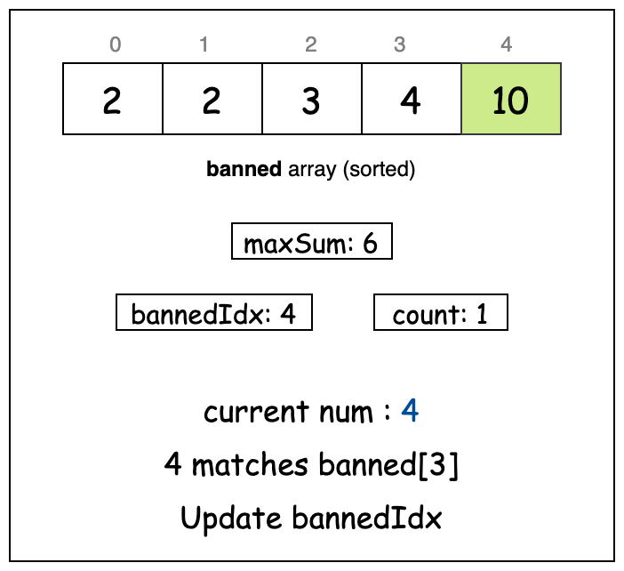
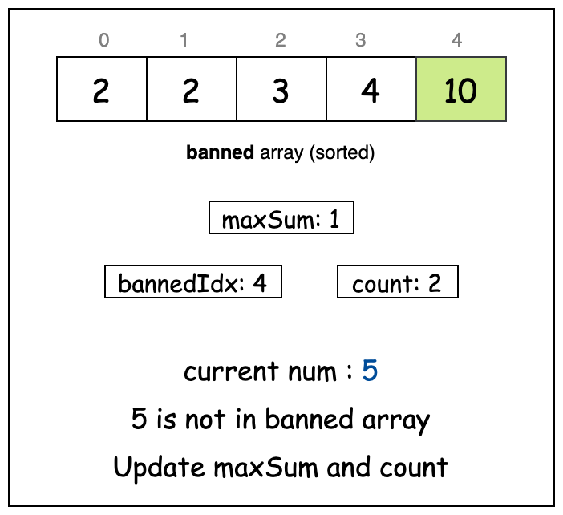
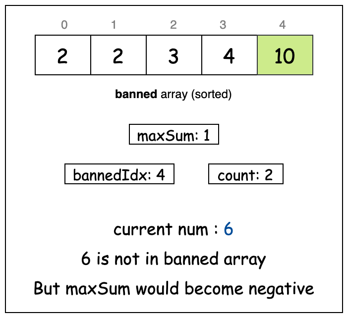
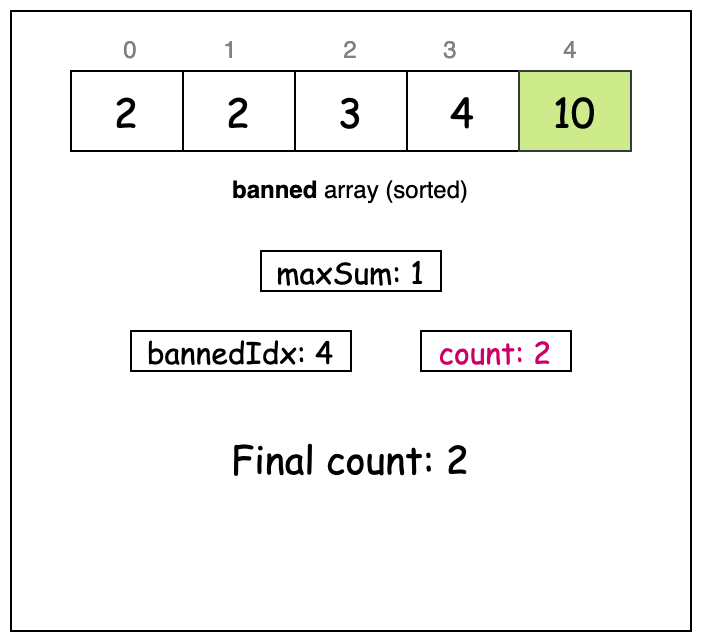

[TOC]

## Solution

---

### Overview

Our goal is to select the largest possible set of positive integers whose sum doesn't exceed `maxSum`. The selection must follow these constraints: we cannot use any numbers present in the `banned` array, each number in the selection must be unique, and we can only choose numbers between `1` and `n`.

Let's look at an example to understand this better. Say we have:
- $n = 10$
- $maxSum = 16$
- banned: `[1, 2, 3, 6, 10]`

Some valid answers would be:
1. 4, 8
2. 4, 5, 7
3. 9

All of these options have integers less than `n` and avoid numbers that are part of the `banned` array. Among these, we get the maximum number of integers with the set `(4, 5, 7)`. No matter what other combinations we try, we cannot select more than 3 numbers that satisfy all our conditions. So, our answer is 3.

---

### Approach 1: Binary Search

#### Intuition

Say we have a budget of `maxSum` and we want to buy as many items as possible from a list of numbers ranging from `1` to `n`. However, some items on this list are banned and can't be purchased. How do we maximize the number of items we can buy without exceeding our budget?

A straightforward approach would be to start with the smallest numbers first. By starting with the smallest numbers, we are ensuring that we are fitting as many items as possible into the budget. If we were to start with larger numbers, we would quickly exhaust our budget and be able to purchase fewer items. Starting with the smallest numbers maximizes the number of items we can include before reaching our budget limit.

To implement this, we would check each number from `1` to `n` in order and add it to our shopping list if it's not banned. For each number, we would need to scan through the `banned` array to verify if it's available. However, this method is slow because we have to check the entire `banned` array for each number we consider.

The most time-consuming part of this algorithm is the repeated checking of the `banned` array. To make this process faster, we need a more efficient search method. One such method is [Binary search 🔗](https://leetcode.com/explore/learn/card/binary-search/).

Before we can use binary search, we need to sort the `banned` array. Then, for each number, we perform a binary search: we initialize two pointers, `left` and `right`, to the start and end of the `banned` array, respectively. We repeatedly calculate the midpoint `mid` and compare the number with the midpoint value. If the number is found (equal to the midpoint value), it is banned and we skip it. If the number is less than the midpoint value, we move the `right` pointer to $mid - 1$; if greater, we move the `left` pointer to $mid + 1$.

This process continues until `left` exceeds `right`, indicating the number is not banned. If not banned, we subtract the number from `maxSum` and count it as included. If subtracting a number causes `maxSum` to drop to `0` or below, we return the count of included numbers as our answer.

#### Algorithm

> Note: Most programming languages already have binary search built into their standard libraries, which you can easily use. However, we've written our own binary search method here for the sake of clarity and completeness.

- Sort the `banned` array in ascending order to enable binary search on it.
- Initialize a variable `count` to `0` to keep track of how many numbers we select.
- Iterate through each number from `1` to `n`:
  - For each number, check if it exists in `banned` using binary search.
  - If the number exists, skip to the next iteration.
  - If the number is not banned, subtract it from `maxSum`.
  - If `maxSum` becomes negative, break the loop as we cannot add more numbers.
  - If `maxSum` is still non-negative, increment `count` by `1`.
- Return the final `count` as our answer.

Helper method `customBinarySearch(arr, target)`:

- Initialize two pointers `left` and `right` pointing to the start and end of `arr` respectively.
- While the `left` pointer is less than or equal to the `right` pointer:
  - Calculate `mid` as the midpoint between `left` and `right`.
  - If `mid` equals target, return `true`.
  - If `mid` is greater than `target`, move `right` to $mid - 1$.
  - If `mid` is less than `target`, move `left` to $mid + 1$.
- If the loop completes without finding `target`, return `false`.

#### Implementation

```python
class Solution:
    def maxCount(self, banned: List[int], n: int, maxSum: int) -> int:
        # Sort banned array to enable binary search
        banned.sort()
        count = 0

        # Try each number from 1 to n
        for num in range(1, n + 1):
            # Skip if number is in banned array
            if self._custom_binary_search(banned, num):
                continue

            maxSum -= num
            # Break if sum exceeds our limit
            if maxSum < 0:
                break

            count += 1

        return count

    def _custom_binary_search(self, arr: List[int], target: int) -> bool:
        left, right = 0, len(arr) - 1

        while left <= right:
            mid = (left + right) // 2
            if arr[mid] == target:
                return True
            if arr[mid] > target:
                right = mid - 1
            else:
                left = mid + 1

        return False
```

#### Complexity Analysis

Let $m$ be the length of the `banned` array.

- Time complexity: $O((m + n) \cdot \log m)$

    The algorithm iterates through numbers from $1$ to $n$, and for each number, performs a binary search on the `banned` array. The binary search takes $O(\log m)$ time, and we do this $n$ times. The initial sorting of `banned` takes $O(m \cdot \log m)$ time.

    Thus, the total time complexity of the algorithm is $O(n \cdot \log m) +$\mathcal{O}(m \cdot \\log m)$=$\mathcal{O}((m + n)$\cdot \log m)$.

- Space complexity: $O(S)$

    The space taken by the sorting algorithm ($S$) depends on the language of implementation:
- In Java, `Arrays.sort()` is implemented using a variant of the Quick Sort algorithm which has a space complexity of $O(\log m)$.
- In C++, the `sort()` function is implemented as a hybrid of Quick Sort, Heap Sort, and Insertion Sort, with a worst-case space complexity of $O(\log m)$.
- In Python, the `sort()` method sorts a list using the Timsort algorithm which is a combination of Merge Sort and Insertion Sort and has a space complexity of $O(m)$.

    The few other variables used only take constant space. Thus, the space complexity is $O(S)$.

---

### Approach 2: Sweep

#### Intuition

To optimize our solution, we can use the relationship between the numbers being checked and the `banned` array. Since we iterate through numbers from `1` to `n` in ascending order and the `banned` array is also sorted, we can take advantage of this ordering to streamline the process.

As we iterate through the numbers from `1` to `n`, we can maintain a pointer (let's call it `bannedIdx`) that tracks our current position in the `banned` array. This pointer allows us to efficiently determine whether the current number is banned by comparing it with the next unprocessed banned number, rather than scanning the entire `banned` array for each number.

Similar to the previous approach, we'll loop from `1` to `n` and progressively add integers to our series. For each number, we first check if it is banned by comparing it with the value at the current `bannedIdx`. If it is banned, we move to the next integer and also advance `bannedIdx` to the next value in `banned`. Otherwise, we subtract the current value from `maxSum` and increment our counter. If this reduction causes `maxSum` to drop below or equal to `0`, we have found the maximum number of integers, and we return the current count as our answer.

The slideshow below visualizes the algorithm:

















#### Algorithm

- Sort the `banned` array in ascending order.
- Initialize:
  - `bannedIdx` to `0` to track the current position in the `banned` array.
  - `count` to `0` to track the number of valid integers chosen.
- Iterate through each number from `1` to `n` while `maxSum` remains non-negative:
  - For each number, check if it matches the current banned number (using `bannedIdx`).
- If the current number is banned:
      - Skip all duplicate occurrences of this banned number by incrementing `bannedIdx`.
- If the current number is not banned:
      - Subtract the current number from `maxSum`.
- If `maxSum` remains non-negative:
      - Increment `count` by `1`.
- Return the final `count` as the answer.

#### Implementation

```python
class Solution:
    def maxCount(self, banned: list[int], n: int, maxSum: int) -> int:
        # Sort the banned list
        banned.sort()

        banned_idx = 0
        count = 0

        # Check each number from 1 to n while the sum is valid
        for num in range(1, n + 1):
            # Skip if the current number is in the banned list
            if banned_idx < len(banned) and banned[banned_idx] == num:
                # Handle duplicate banned numbers
                while banned_idx < len(banned) and banned[banned_idx] == num:
                    banned_idx += 1
            else:
                # Include the current number if possible
                maxSum -= num
                if maxSum >= 0:
                    count += 1
                else:
                    break

        return count
```

#### Complexity Analysis

Let $m$ be the length of the `banned` array.

- Time complexity: $O(n + m \cdot \log m)$

    The algorithm first sorts the `banned` array which takes $O(m \cdot \log m)$ time. Then it performs a single pass through numbers $1$ to $n$ and skips over banned numbers. Since each banned number is processed at most once and we only move forward in both sequences, the iteration part takes $O(n + m)$ time.

    The total time complexity is therefore $O(m \cdot \log m + n + m)$ which simplifies to $O(n + m \cdot \log m)$.

- Space complexity: $O(S)$

    The space complexity of the sorting algorithm ($S$) depends on the language of implementation:
- In Java, `Arrays.sort()` is implemented using a variant of the Quick Sort algorithm which has a space complexity of $O(\log m)$.
- In C++, the `sort()` function is implemented as a hybrid of Quick Sort, Heap Sort, and Insertion Sort, with a worst-case space complexity of $O(\log m)$.
- In Python, the `sort()` method sorts a list using the Timsort algorithm which is a combination of Merge Sort and Insertion Sort and has a space complexity of $O(m)$.

    The few other variables used by the algorithm take constant space. Thus, the space complexity is $O(S)$.

---

### Approach 3: Hash Set

#### Intuition

At each step of the loop, we are essentially checking whether a number exists in the `banned` array or not. A suitable data structure for efficiently performing the "find" operation is a hash set. Hash sets allow us to determine whether a number is in the collection in constant time.

First, we populate a hash set called `bannedSet` with the elements from the `banned` array. Then, we iterate from `1` to `n`. For each number, we check if it is present in `bannedSet`. If it is, we skip that number. Otherwise, we add the number to our series and update `maxSum` and our counter accordingly. If `maxSum` ever drops below `0`, we return the current count as the answer.

> For a more comprehensive understanding of hash set, explore the [Hash Set Explore Card 🔗](https://leetcode.com/explore/learn/card/hash-table/). This resource provides an in-depth look at hash sets, explaining their key concepts and applications with a variety of problems to solidify understanding of the pattern.

#### Algorithm

- Create an empty hash set `bannedSet` to store banned numbers.
- Iterate through the `banned` array, adding each number to `bannedSet`.
- Initialize a variable `count` to `0` to track the number of valid integers chosen.
- Iterate through each number from `1` to `n`:
  - Check if the current number is in `bannedSet`.
  - If it is, skip to the next iteration.
  - If subtracting the current number from `maxSum` would make it negative:
- Return the current `count` immediately.
  - Otherwise:
- Subtract the current number from `maxSum`.
- Increment `count` by `1`.
- Return the final `count` as the answer.

#### Implementation

```python
class Solution:
    def maxCount(self, banned: list[int], n: int, maxSum: int) -> int:
        # Store banned numbers in a set for quick lookup
        banned_set = set(banned)

        count = 0

        # Try each number from 1 to n
        for num in range(1, n + 1):
            # Skip banned numbers
            if num in banned_set:
                continue

            # Return if adding the current number exceeds maxSum
            if maxSum - num < 0:
                return count

            # Include current number
            maxSum -= num
            count += 1

        return count
```

#### Complexity Analysis

Let $m$ be the length of the `banned` array.

- Time complexity: $O(m + n)$

    The algorithm makes a single pass through the `banned` array to populate the hash set, taking $O(m)$ time. Then it iterates through numbers from $1$ to $n$, where for each number, we perform a constant time $O(1)$ lookup in the hash set. Therefore, the iteration takes $O(n)$ time.

    Thus, the overall time complexity of the algorithm is $O(m) +$\mathcal{O}(n)$= O(m + n)$.

- Space complexity: $O(m)$

    The algorithm uses a hash set to store all banned numbers. In the worst case, all numbers in the `banned` array are unique and within the valid range, requiring $O(m)$ space. Besides the hash set, only a constant amount of extra space is used for variables like `count` and `maxSum`.

    Thus, the total space complexity is $O(m)$.

---