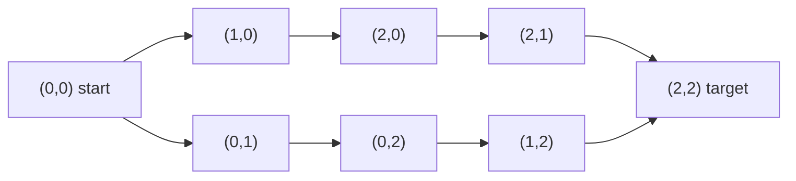

# Guided Example: Disconnect Path in a Binary Matrix by at Most One Flip

## 1. The Instance and the Question It Must Answer

A binary matrix `grid` has $m$ rows and $n$ columns. From a cell `(i, j)` holding a
`1` the only legal moves are down to `(i + 1, j)` or right to `(i, j + 1)`, again
holding a `1`; the matrix is *disconnected* when no such walk leads from `(0, 0)`
to `(m - 1, n - 1)`. At most one cell may change value, and the two endpoints
`(0, 0)` and `(m - 1, n - 1)` may never be changed. The answer is `true` exactly
when some choice of zero flips or one flip leaves the matrix disconnected.

The instance traced here is the authored duplicate-free case

```text
grid = [[1, 1, 1],
        [1, 0, 1],
        [1, 1, 1]]
```

whose required answer is `false`. It is the right instance to trace because the
grid *is* connected, so the easy zero-flip answer is unavailable, and yet no
single flip works. Understanding exactly why forces the central concept: two
paths that do not share any interior cell.

| Row \ Column | 0 | 1 | 2 |
|:---:|:---:|:---:|:---:|
| 0 | `1` start | `1` | `1` |
| 1 | `1` | `0` blocked | `1` |
| 2 | `1` | `1` | `1` target |

Because every move increases $i + j$ by one, every walk from `(0, 0)` to
`(2, 2)` uses exactly $m + n - 1 = 5$ cells: one cell on each anti-diagonal
$i + j = d$ for $d = 0, 1, \dots, 4$. The interior cells of such a walk are its
$m + n - 3 = 3$ cells other than the two endpoints.

## 2. What a Flip Can and Cannot Do

A flip changes one cell between `0` and `1`.

- Turning a `0` into a `1` only *adds* a traversable cell. Reachability is
  monotone in the set of `1`-cells, so this can never destroy a walk and can never
  produce a `true` answer on its own.
- Turning a `1` into a `0` deletes a cell. It disconnects the matrix precisely
  when that cell lies on **every** surviving walk from start to target.

So the question is not "is there one flip that helps" but "is there one cell whose
deletion is a cut". Equivalently, flipping is hopeless exactly when the walk set is
rich enough that deleting any single interior cell still leaves a walk.

That rich case has a sharp description. Call two walks *internally disjoint* when
they share only the two endpoints. Their interior cell sets are then disjoint.

- If two internally disjoint walks exist, a single deleted interior cell can
  belong to the interior of at most one of them, so the other survives: one flip
  cannot disconnect.
- If no such pair exists, then by Menger's theorem the minimum number of interior
  cells whose deletion destroys all walks is one, and that cell holds a `1`
  (it lies on a walk), so it may legally be flipped.

Hence: **the answer is `false` if and only if two internally disjoint monotone
walks from start to target exist.** In this instance the answer is `false`, so
the trace must exhibit such a pair; the next two sections find it without ever
enumerating walks.

## 3. First Search: Find Any Walk and Erase It

The first phase performs a depth-first search from `(0, 0)` that prefers the
downward move, marking every cell it enters as `0` so the search never re-enters a
cell. Marking is not just bookkeeping: the cells the search consumed become walls
for the next phase.

| Search step | Cell entered | Move that reached it | Still zeroed cells so far | Result of the recursive call |
|:---:|:---:|:---|:---|:---|
| 1 | `(0, 0)` | start | `(0, 0)` | not the target; explore downward first |
| 2 | `(1, 0)` | down from `(0, 0)` | `(0, 0)`, `(1, 0)` | not the target; explore downward first |
| 3 | `(2, 0)` | down from `(1, 0)` | `(0, 0)`, `(1, 0)`, `(2, 0)` | not the target; down is off-grid, try right |
| 4 | `(2, 1)` | right from `(2, 0)` | `(0, 0)`, `(1, 0)`, `(2, 0)`, `(2, 1)` | not the target; down is off-grid, try right |
| 5 | `(2, 2)` | right from `(2, 1)` | also `(2, 2)` | target reached, report success |

The successful chain is

$$
P_1 = (0,0) \to (1,0) \to (2,0) \to (2,1) \to (2,2),
$$

whose interior is $\{(1,0), (2,0), (2,1)\}$. Note that step 2 never explored
`(1, 1)` and step 1 never explored `(0, 1)`: the successful branch short-circuits
the alternative, so the untouched cells are exactly `(0, 1)`, `(1, 1)`, `(0, 2)`
and `(1, 2)`, and `(1, 1)` was a wall from the beginning.

## 4. Second Search: Is There a Walk That Survives the Erasure?

The two endpoints are restored to `1`, because they are protected from flipping and
must remain usable. Every other cell the first search touched stays at `0`. A
second depth-first search from `(0, 0)` now asks a sharper question than
"is the matrix connected": it asks whether a walk exists that avoids the consumed
cells, which includes the whole interior of $P_1$.

| Search step | Cell entered | Move that reached it | Outcome |
|:---:|:---:|:---|:---|
| 1 | `(0, 0)` | start | down neighbour `(1, 0)` is now `0`; try right |
| 2 | `(0, 1)` | right from `(0, 0)` | down neighbour `(1, 1)` is `0`; try right |
| 3 | `(0, 2)` | right from `(0, 1)` | down neighbour `(1, 2)` is `1`; descend |
| 4 | `(1, 2)` | down from `(0, 2)` | down neighbour `(2, 2)` is the target |
| 5 | `(2, 2)` | down from `(1, 2)` | target reached, report success |

The second search succeeds, producing

$$
P_2 = (0,0) \to (0,1) \to (0,2) \to (1,2) \to (2,2),
$$

with interior $\{(0,1), (0,2), (1,2)\}$. Since $P_2$'s cells were never consumed
by the first search, its interior is disjoint from $P_1$'s interior. The two walks
use the same start and the same target and nothing else in common:



| Walk | Interior cells | Candidate flip that would destroy it | Cells of that flip inside the other walk |
|:---|:---|:---|:---|
| $P_1$ (lower) | `(1, 0)`, `(2, 0)`, `(2, 1)` | any one of those three | none |
| $P_2$ (upper) | `(0, 1)`, `(0, 2)`, `(1, 2)` | any one of those three | none |

The last column is the whole argument: whichever interior cell is flipped, it
belongs to exactly one of the two interiors, and the other walk remains complete,
so the matrix stays connected. The answer for this instance is therefore `false`.

## 5. The Invariant Behind the Two Searches

**Erase-only invariant.** After the first search finishes and the endpoints are
restored, the set of remaining `1`-cells is contained in the set of cells the
search never entered, so the second search decides reachability in the graph of
untouched cells. The first search enters each cell at most once, because entering
a cell sets it to `0`; this is what makes the erasure set exactly the consumed
region rather than something that depends on the exploration order.

**Soundness of a `false` answer.** If the second search finds a walk, that walk
avoids every consumed cell, in particular every interior cell of $P_1$. The two
walks are internally disjoint, so at least two interior flips are needed, and the
reported `false` is correct. The argument never assumes anything about *which*
walk the first search returned: any first walk paired with a walk that avoids its
interior gives the same conclusion.

**Soundness of a `true` answer.** If the first search fails, no walk exists at all
and zero flips already suffice, so `true` is correct. If the second search fails,
no walk avoids the consumed region, so in particular no pair of internally
disjoint walks exists, and Menger's theorem supplies a single interior cell whose
deletion destroys every walk. That cell holds a `1` — it lies on the walk that the
first search exhibited — so flipping it is legal, and `true` is correct. Because
the endpoints are never candidates, a matrix whose only cells lie on a single
endpoint-to-endpoint step has no flippable cell at all.

The two phases are therefore complete and sound against the criterion of
Section 2, and the criterion itself is complete and sound against the definition
of the problem.

## 6. Where the Single Flip Becomes Possible Instead

The companion authored case

| Row \ Column | 0 | 1 | 2 |
|:---:|:---:|:---:|:---:|
| 0 | `1` start | `1` | `1` |
| 1 | `1` | `0` | `0` |
| 2 | `1` | `1` | `1` target |

returns `true`. The first search again finds $P_1 = (0,0) \to (1,0) \to (2,0) \to (2,1) \to (2,2)$,
but now the second search dies: from `(0, 0)` the downward move hits the erased
`(1, 0)`, the rightward move reaches `(0, 1)`, and from there both continuations
are walls — `(1, 1)` holds `0` and `(0, 2)` can only descend into `(1, 2)`, which
also holds `0`. No walk survives the erasure of $P_1$'s interior.

| Cell flipped | Remaining `1`-cells reachable from the start | Walk to the target? | Verdict |
|:---|:---|:---:|:---|
| `(1, 0)` | `(0, 1)`, `(0, 2)` only | no | disconnects |
| `(2, 0)` | `(0, 1)`, `(0, 2)` only | no | disconnects |
| `(2, 1)` | `(0, 1)`, `(0, 2)` only | no | disconnects |

All three interior cells of $P_1$ are genuine cuts here, which is exactly the
situation the criterion predicts once the walk set stops containing two
internally disjoint members.

## 7. Boundary Cases and the Traps They Expose

| Instance | Return | Why |
|:---|:---:|:---|
| `[[1]]` | `false` | The single cell is both endpoints; no cell may be flipped |
| `[[1, 1]]` | `false` | The walk is one step with no interior cell, and both cells are endpoints |
| `[[1, 1, 1]]` | `true` | The one walk has interior cell `(0, 1)`; flipping it disconnects |
| `[[1], [1], [1], [1]]` | `true` | Same reasoning along a single column |
| `[[1, 0], [0, 1]]` | `true` | Already disconnected; zero flips are allowed |
| `[[1, 1], [1, 1]]` | `false` | Interiors `{(1, 0)}` and `{(0, 1)}` are disjoint |

The traps worth naming:

- **Trying to prove connectivity after one flip.** Connectivity of a single
  modified grid says nothing; the answer quantifies over every legal flip, which
  is why the criterion is phrased in terms of internally disjoint walks.
- **Forgetting to restore the endpoints.** The first search zeroes `(0, 0)` and
  `(m - 1, n - 1)` along with everything else. Leaving them erased makes the
  second search fail always and turns every answer into `true`.
- **Flipping the endpoints.** They are explicitly excluded. On `[[1]]` and
  `[[1, 1]]` they are the only cells that exist, so those answers are `false` even
  though the interior-cell count $m + n - 3$ is negative or zero.
- **Assuming a `0` flip ever helps.** Increasing the number of `1`-cells cannot
  remove a walk, so only `1`-to-`0` flips need consideration.
- **Treating the first walk as canonical.** Which walk the first search returns
  depends on the move order; the conclusion depends only on whether a walk avoids
  its interior, and a second search answers exactly that.
- **Mutating the caller's matrix.** Both searches write into the grid itself
  instead of a separate visited structure, so the input is consumed; any caller
  that needs the original values must work on a copy.
- **Enumerating walks.** The number of monotone walks grows exponentially in
  $m + n$, so counting or listing them is not a method; the two searches decide
  the same question in linear time.

## 8. Time and Auxiliary Space

Each search enters a cell at most once, because a cell is set to `0` at the moment
it is entered and is never re-entered. Entering a cell costs one constant-time
check per outgoing move, of which there are two. Two searches therefore touch at
most $2mn$ cells in total.

- **Time:** $O(mn)$. The first search is $O(mn)$ and the second search is $O(mn)$
  in the worst case, and the final comparison of the two outcomes is constant.
- **Space:** $O(m + n)$ auxiliary space beyond the matrix itself. The recursion
  depth equals the length of the chain currently explored, and every recursive
  call moves down or right, so the depth is at most $m + n - 1$; with
  $m, n \le 1000$ this stays far below any practical stack limit. The erasures are
  written in place, so no visited array or queue is allocated; the only other
  storage is the two boolean outcomes.