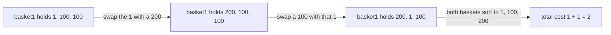

# Guided Example: Rearranging Fruits

## 1. What one swap is allowed to do

Two baskets hold the same number of fruits. Position never matters: the baskets count as equal when their fruits sorted by cost form identical multisets. The only legal move exchanges one chosen fruit of `basket1` with one chosen fruit of `basket2`, and that exchange costs $\min(\text{basket1}[i], \text{basket2}[j])$ — the *cheaper* of the two fruits travelling, not their sum.

That pricing rule is the whole difficulty. A swap always moves two fruits, one in each direction, but the bill is set by the smaller of the pair. So a swap is cheap when at least one of its two fruits is cheap, and the craft of the problem is arranging which fruits meet.

Because order is irrelevant, only the **frequency** of each cost value matters.

## 2. The balance map: how many copies must change baskets

Let $f_1(x)$ and $f_2(x)$ be the number of fruits of cost $x$ in `basket1` and `basket2`. If the baskets are to become equal, then for every value $x$ each basket must end up holding exactly

$$
t(x) = \frac{f_1(x) + f_2(x)}{2}
$$

copies of $x$ — no more and no less, because both baskets have the same size and together they must contain every copy that exists. The **balance**

$$
c(x) = f_1(x) - f_2(x)
$$

measures the discrepancy. When $c(x) > 0$, basket1 carries $c(x)$ copies beyond the shared target, so exactly $c(x)/2$ copies of $x$ must leave basket1. When $c(x) < 0$, exactly $\lvert c(x) \rvert / 2$ copies of $x$ must arrive in basket1. Values with $c(x) = 0$ are already settled and never move.

Collect every fruit that must change sides into one multiset $M$, the **movers**. Because the two directions must balance in total,

$$
\lvert M \rvert = \sum_{x} \frac{\lvert c(x) \rvert}{2} = 2m
$$

where $m$ is simultaneously the number of fruits that must leave basket1 and the number that must enter it. Since one swap moves exactly one fruit out of basket1 and one into it, at least $m$ swaps are needed, and the best possible outcome is a clean pairing of the $m$ surpluses with the $m$ deficits.

## 3. The impossibility test

If some value has odd total count $f_1(x) + f_2(x)$, the target $t(x)$ is not a whole number, and no sequence of swaps can make the baskets equal. Equivalently, every balance $c(x)$ must be even. The test is therefore a single parity check over the balance map, and it must be answered before any cost reasoning: when it fails, return `-1` regardless of how cheap the swaps look.

## 4. Worked instance: the official detour example

Take `basket1 = [1, 100, 100]` and `basket2 = [1, 200, 200]`, whose required cost is `2`.

Counting copies of each value:

| Value $x$ | $f_1(x)$ | $f_2(x)$ | Balance $c(x)$ | Shared target $t(x)$ | Movers contributed |
|---|---|---|---|---|---|
| 1 | 1 | 1 | 0 | 1 | none; the two copies already match |
| 100 | 2 | 0 | $+2$ | 1 | one copy of 100 leaves basket1 |
| 200 | 0 | 2 | $-2$ | 1 | one copy of 200 leaves basket2 |

All balances are even, so the instance is solvable. The mover multiset is $M = \{100, 200\}$, giving $2m = 2$ and therefore $m = 1$: a single swap must fix everything. The global minimum cost present in either basket is $mi = 1$ — note that this value is *not* a mover at all, because its balance is zero.

| Mover | Value | Starts in | Must finish in |
|---|---|---|---|
| surplus | 100 | basket1 | basket2 |
| deficit | 200 | basket2 | basket1 |

Two routes can accomplish this single exchange:

| Route | Swaps performed | Cost expression | Total |
|---|---|---|---|
| Direct exchange | swap the surplus 100 with the surplus-deficit partner 200 | $\min(100, 200)$ | 100 |
| Detour through the global minimum | swap the 1 in basket1 with the 200, then swap the 100 with the 1 that has just arrived | $\min(1, 200) + \min(100, 1) = 1 + 1$ | 2 |

The detour is dramatically cheaper, and the required answer `2` confirms it is the intended route. Tracing it basket by basket:

| Step | `basket1` | `basket2` | Swap performed | Cost | Running total |
|---|---|---|---|---|---|
| start | `[1, 100, 100]` | `[1, 200, 200]` | — | — | 0 |
| 1 | `[200, 100, 100]` | `[1, 1, 200]` | basket1's `1` with basket2's `200` | $\min(1, 200) = 1$ | 1 |
| 2 | `[200, 1, 100]` | `[100, 1, 200]` | basket1's `100` with basket2's `1` | $\min(100, 1) = 1$ | 2 |
| final | sorted `[1, 100, 200]` | sorted `[1, 100, 200]` | — | — | 2 |

The value `1` acts as a ferry: it leaves basket1 in step 1 and returns in step 2, having carried the transfer across in two hops. Its net effect on the multisets is nothing, which is exactly why this manoeuvre is legal — the ferry fruit is back where it started, while the 100 has replaced the 200 in basket1 and the 200 has replaced the 100 in basket2.

## 5. Why the detour generalises: the price of one transfer

The ferry trick is not specific to the value `1`. Let $mi$ be the smallest cost appearing in either basket, and let $x$ be any mover. If a copy of $mi$ is available on the side needed to start the manoeuvre, then exchanging $x$ with $mi$ costs $\min(x, mi) = mi$, because $mi \le x$ by definition of a minimum. Returning the ferry costs another $mi$. Hence **any single transfer can be completed for at most $2 \cdot mi$**, independently of how expensive the fruit being transferred is.

This gives every pair of movers two possible prices:

- a direct swap of a surplus $a$ with a deficit $b$, costing $\min(a, b)$;
- a ferry pair, costing $2 \cdot mi$.

So the price of handling a pair whose cheaper member is $z$ is $\min(z, 2 \cdot mi)$, and the total bill is the sum of that expression over the $m$ pairs. The instance above has $m = 1$, cheaper member $z_1 = 100$, and $2 \cdot mi = 2$, so the charge is $\min(100, 2) = 2$ — the cap is what makes the detour win.

## 6. A second instance where two pairs are needed

Now take `basket1 = [2, 2, 100, 100]` and `basket2 = [3, 3, 200, 200]`, whose required cost is `5`. Here the mover multiset is larger:

| Value $x$ | $f_1(x)$ | $f_2(x)$ | Balance $c(x)$ | Shared target $t(x)$ | Movers contributed |
|---|---|---|---|---|---|
| 2 | 2 | 0 | $+2$ | 1 | one copy of 2 leaves basket1 |
| 100 | 2 | 0 | $+2$ | 1 | one copy of 100 leaves basket1 |
| 3 | 0 | 2 | $-2$ | 1 | one copy of 3 leaves basket2 |
| 200 | 0 | 2 | $-2$ | 1 | one copy of 200 leaves basket2 |

The movers are $\{2, 100\}$ from basket1 and $\{3, 200\}$ from basket2, so $\lvert M \rvert = 4$ and $m = 2$ swaps are required. The global minimum is now $mi = 2$, hence $2 \cdot mi = 4$. Sorting the movers gives $2 \le 3 \le 100 \le 200$, and the two cheapest are $2$ and $3$.

| Pair | Cheaper member | Partner | Direct cost | Ferry price $2 \cdot mi$ | Charged |
|---|---|---|---|---|---|
| A | 2, waiting in basket1 | 200, waiting in basket2 | 2 | 4 | 2 |
| B | 3, waiting in basket2 | 100, waiting in basket1 | 3 | 4 | 3 |
| Total | — | — | 5 | — | 5 |

Both pairs are cross-side — one surplus with one deficit — so each row is a single legal swap. The sum $2 + 3 = 5$ matches the required output, and here the ferry prices are *worse* than the direct swaps, so the cap does not bind.

Contrast this with the natural but wasteful pairing:

| Pairing strategy | Pairs formed | Sum charged | Verdict |
|---|---|---|---|
| Keep the sorted order and pair neighbours | (2, 3) and (100, 200) | $2 + 100 = 102$ | legal, but the expensive pair is paid in full |
| Pair each cheap mover with an expensive partner | (2, 200) and (3, 100) | $2 + 3 = 5$ | optimal; matches the required output |

The lesson of the two instances is identical in shape: only the **cheapest half** of the movers is ever charged, and each of them is charged at most the ferry price.

## 7. Why charging the cheaper half is correct

Sort the movers $z_1 \le z_2 \le \dots \le z_{2m}$. The claim is that the minimum total cost is

$$
\sum_{i=1}^{m} \min(z_i, \; 2 \cdot mi).
$$

**The pairing is always feasible.** A solution consists of $m$ pairs of movers. In the bottom half $\{z_1, \dots, z_m\}$ there are $k$ surpluses and $m-k$ deficits for some $k$; the top half therefore contains $m-k$ surpluses and $k$ deficits. Pairing the bottom surpluses with top deficits and the bottom deficits with top surpluses pairs every one of the $m$ cheapest movers with a partner that is at least as expensive, and every pair is cross-side, so each pair is one legal swap. The bottom half can therefore be the set of cheaper members.

**No pairing can do better.** In any solution the $m$ pairs each contribute their cheaper member, and those $m$ cheaper members are $m$ distinct movers, so as a sorted list they dominate $z_1, \dots, z_m$ entry by entry. Since $w \mapsto \min(w, 2 \cdot mi)$ is non-decreasing, term-by-term capping preserves that domination, so the achieved charge is at least $\sum_{i \le m} \min(z_i, 2 \cdot mi)$. Together with the construction above, the bound is tight.

**The invariance that makes this an equality.** The quantity that must be preserved is the shared target $t(x)$: after the planned swaps each basket contains exactly $t(x)$ copies of every value $x$. Balance is conserved by every swap — a swap moves one fruit of value $a$ out of basket1 and one of value $b$ in, so $c(a)$ falls by 1 and $c(b)$ rises by 1 — which is precisely why counting movements per value, and not per index, is the correct model. When the $m$ surpluses are matched to the $m$ deficits, all balances reach zero simultaneously and the sorted baskets coincide; that is the correctness argument in full.

One consequence is worth stating: the ferry never changes any balance, because it returns to its own basket. That is why a ferry pair places exactly one surplus and one deficit, just as a direct swap does, and why both mechanisms can be priced per pair.

## 8. Boundary behaviour the examples do not show

| Situation | Instance | Balance verdict | Result | Why |
|---|---|---|---|---|
| Baskets already equal | `[3, 1, 2]` against `[2, 3, 1]` | every $c(x) = 0$ | 0 | The mover multiset is empty, $m = 0$, and no swap is performed |
| A single mismatched fruit | `[1]` against `[2]` | $c(1) = +1$, $c(2) = -1$ | -1 | Odd balances mean the shared target is fractional |
| Same values, counts differing by one | `[2, 3, 4, 1]` against `[3, 2, 5, 1]` | $c(4) = +1$, $c(5) = -1$ | -1 | Parity fails for two values; each basket would need half a fruit |
| One balance much larger than the others | `[4, 4, 4, 4]` against `[2, 2, 2, 2]` | $c(4) = +4$, $c(2) = -4$ | 4 | $+4$ yields two movers, so $m = 2$ and each is charged $\min(2, 4) = 2$ |
| Costs up to $10^9$ | `[1000000000, 1000000000]` against `[999999999, 999999999]` | one mover in each direction | 999999999 | A single charge of the cheaper mover, and the accumulator must hold values far beyond 32 bits |
| Global minimum is not a mover | `[1, 100, 100]` against `[1, 200, 200]` | $c(1) = 0$ | 2 | The ferry value has balance zero and is still usable as an intermediary |

## 9. Other strategies and their trade-offs

| Strategy | Idea | Cost | Assessment |
|---|---|---|---|
| Charge the cheaper half of the sorted movers | sort $M$, cap each of the first $m$ entries at $2 \cdot mi$ | $O(n \log n)$ time, $O(n)$ space | The derived method; one sort and one linear sum |
| Always swap directly, pairing sorted neighbours | ignore the ferry entirely | sum of the cheaper member of each adjacent pair | Overpays whenever the cap binds; instance 1 would cost 100 instead of 2 |
| Always route through the global minimum | never swap two movers directly | $2 \cdot mi \cdot m$ | Overpays in instance 2, where the direct charges 2 and 3 beat the ferry price 4 each |
| Greedy repair with two heaps | repeatedly swap the cheapest surplus with the cheapest deficit | $O(n \log n)$ | Correct in spirit but must still compare every candidate against the ferry price, with more bookkeeping and the same asymptotic bound |

## 10. Traps this instance exposes

- **Using the balance instead of half the balance.** A value with $c(x) = +4$ contributes **two** movers, not four. Counting all four doubles the mover multiset, doubles $m$, and doubles the answer.
- **Rounding odd balances instead of rejecting them.** A value with an odd balance means the shared target is fractional; the correct answer is `-1`, never a floor or ceiling of the surplus.
- **Taking $mi$ to be the smallest mover.** The ferry value must be the smallest cost present in *either basket*, including values with balance zero. In the first instance the ferry is the value `1`, which never moves.
- **Charging every mover.** Only the $m$ cheapest movers are charged; the remaining $m$ ride free as the expensive partners. Summing the whole sorted multiset doubles the answer.
- **Pairing two surpluses together.** A direct swap must exchange one fruit of basket1 with one fruit of basket2, so a valid pair is always one surplus with one deficit. Pairing within a side describes no legal move.
- **Assuming the ferry always wins, or always loses.** The cap $\min(z, 2 \cdot mi)$ binds in the first instance and not in the second. Both routes must be priced for every charged mover.
- **Overflowing a narrow accumulator.** With up to $10^5$ fruits and costs up to $10^9$, a total cost can reach roughly $5 \times 10^{13}$, which does not fit a 32-bit integer.

## 11. Time and auxiliary space

Let $n$ be the common length of the two baskets.

- **Balance construction.** One pass over the $n$ aligned index pairs, updating two counters per pair in a hash map: $O(n)$ expected time.
- **Parity check and mover collection.** One pass over the distinct values. Each value $x$ contributes $\lvert c(x) \rvert / 2$ movers, so the total size of $M$ is at most $n$: $O(n)$.
- **Sorting the movers.** $O(\lvert M \rvert \log \lvert M \rvert) \subseteq O(n \log n)$.
- **Summing the charges.** One pass over the first half of the sorted movers, each term a comparison against $2 \cdot mi$: $O(n)$.
- **Total time complexity.** $O(n \log n)$, dominated by the sort; every other stage is linear.
- **Auxiliary space complexity.** $O(n)$ for the balance map, the mover multiset, and the sorted view of it. Only one of these needs to exist at a time, and the returned value is a single integer, so the working memory stays linear in the input size.
