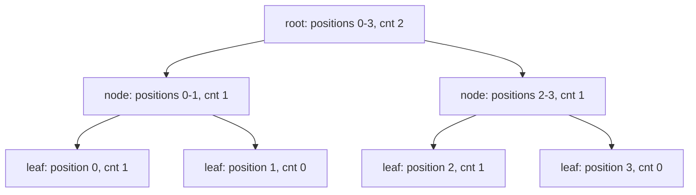

# Guided Example: Handling Sum Queries After Update

## 1. Three query types, but only two numbers matter

The three operations touch `nums1` and `nums2` in very different ways:

- **Type 1**, written `[1, l, r]`, flips every bit of `nums1` between indices $l$ and $r$ inclusive: a stored $0$ becomes $1$ and a stored $1$ becomes $0$.
- **Type 2**, written `[2, p, 0]`, adds `nums1[i] * p` to `nums2[i]` for **every** index $i$ — the first operand is the multiplier $p$, not a position.
- **Type 3**, written `[3, 0, 0]`, asks for the current total $\sum_i \texttt{nums2}[i]$ and contributes one entry to the returned list.

The distribution of values inside `nums2` never influences any future operation. Type 2 spreads a per-index addition, type 3 asks for the aggregate, and nothing else ever reads an individual `nums2[i]`. So the entire state we must track collapses to two numbers:

$$T = \sum_{i} \texttt{nums2}[i], \qquad S_1 = \sum_{i} \texttt{nums1}[i] = \text{number of ones in \texttt{nums1}}.$$

A type 2 query with multiplier $p$ adds $p\cdot\texttt{nums1}[i]$ to each entry, so the total moves by

$$\Delta T = \sum_i p\cdot\texttt{nums1}[i] = p\sum_i \texttt{nums1}[i] = p\,S_1 ,$$

which depends only on the *count* of ones, not on where they sit. A type 3 query simply reports $T$. A type 1 query leaves $T$ untouched and changes $S_1$. The whole problem is therefore: report a running total that receives occasional additions of $p\,S_1$, while $S_1$ itself is driven by range flips of a binary array.

## 2. What one range flip does to the count of ones

Let the flipped range have length $L = r - l + 1$ and suppose it currently holds $c$ ones and $L - c$ zeros. After the flip the zeros have become ones and the ones have become zeros, so the range holds

$$c' = (L - c)\cdot 1 + c\cdot 0 = L - c$$

ones, and the global count changes by $c' - c = L - 2c$. Taking `nums1 = [1,0,1,0]` as a concrete array:

| Flipped range | Length $L$ | Ones inside, $c$ | Ones after, $L-c$ | Change in $S_1$ |
|---|---|---|---|---|
| `[0,0]` | 1 | 1 | 0 | $-1$ |
| `[0,1]` | 2 | 1 | 1 | 0 |
| `[0,2]` | 3 | 2 | 1 | $-1$ |
| `[0,3]` | 4 | 2 | 2 | 0 |
| `[1,3]` | 3 | 1 | 2 | $+1$ |

Two structural facts follow. First, a flip is an involution: applying the same range twice restores the original bits, because each bit is toggled twice. Second, the effect on $S_1$ can be computed from the range's own count alone — but that count is exactly what a single global counter does not provide. Knowing $S_1 = 2$ before a flip of `[1,3]` does not reveal that the range contains one one; we need range-level information.

## 3. The official instance, traced through the aggregate state

For `nums1 = [1,0,1]`, `nums2 = [0,0,0]` and `queries = [[1,1,1],[2,1,0],[3,0,0]]`:

| Step | Query | What happens to `nums1` | $S_1$ | $T = \sum \texttt{nums2}[i]$ | Emitted |
|---|---|---|---|---|---|
| initial | — | `[1,0,1]` | 2 | 0 | — |
| 1 | `[1,1,1]` | flip index 1: `[1,1,1]` | 3 | 0 | — |
| 2 | `[2,1,0]` | unchanged; $T \mathrel{+}= 1 \cdot 3$ | 3 | 3 | — |
| 3 | `[3,0,0]` | unchanged | 3 | 3 | 3 |

The returned list is `[3]`. Note what the flip did *not* do: it did not add anything to `nums2` by itself; only the later type 2 query converted the enlarged count of ones into total mass, contributing $1 \times 3$ because all three positions were then active.

## 4. A lazy segment tree over `nums1`

The remaining work is a standard data-structure obligation: maintain the number of ones in a binary array under range flips. A segment tree over the $n$ positions stores for each node $u$:

| Stored field | Meaning | Initial value |
|---|---|---|
| interval | the contiguous index range $[L_u, R_u]$ the node covers | root covers the whole array |
| $len_u$ | $R_u - L_u + 1$, the number of positions covered | fixed for the build |
| $cnt_u$ | number of ones inside that interval, with all pending flips on the path to $u$ already applied to this node | leaf value, or the sum of the children |
| $lazy_u$ | whether a flip is pending for the whole interval of $u$ | 0, meaning no pending flip |

The tree is a complete binary partition of the index range:

**Flip on a fully covered node.** If the query range contains the node's whole interval, every position below it toggles. The count of ones in that interval becomes $len_u - cnt_u$, and we set $lazy_u \leftarrow lazy_u \oplus 1$ to record that the children are now stale. Descending is unnecessary — this is what makes the flip $O(\log n)$ instead of $O(n)$.

**Flip on a partially covered node.** Before recursing, a pending tag must be pushed to both children: each child updates $cnt \leftarrow len - cnt$ and toggles its own tag, then the parent's tag is cleared. After the children are updated, the parent recomputes $cnt_u = cnt_{left} + cnt_{right}$.

**Invariant of the representation.** At every moment, for each node $u$, if all pending flips stored at proper ancestors of $u$ are applied to $u$'s subtree, then $cnt_u$ is the true number of ones in $[L_u, R_u]$. The root's $cnt$ is therefore always the true global count $S_1$, which is the only value the query types need.

## 5. Tracing two overlapping flips node by node

Take `nums1 = [1,0,1,0]` so that the tree above holds `cnt` values $1, 0, 1, 0$ at the leaves. Apply the flip `[0,2]` and then the flip `[1,3]`, recording every node the recursion touches. `pushdown` means the node's pending tag is transferred to its children and cleared; `pushup` means the node's `cnt` is rebuilt from the two children.

| Flip | Node interval | Fully covered? | Action taken | $cnt$ before $\to$ after | $lazy$ before $\to$ after |
|---|---|---|---|---|---|
| `[0,2]` | `[0,3]` | no | descend, tag is 0 so nothing to push | 2 → 2 | 0 → 0 |
| `[0,2]` | `[0,1]` | yes | flip in place, do not descend | 1 → 1 | 0 → 1 |
| `[0,2]` | `[2,3]` | no | descend, tag is 0 so nothing to push | 1 → 1 | 0 → 0 |
| `[0,2]` | `[2,2]` | yes | flip in place | 1 → 0 | 0 → 1 |
| `[0,2]` | `[2,3]` | — | pushup from children | 1 → 0 | 0 → 0 |
| `[0,2]` | `[0,3]` | — | pushup: $1 + 0$ | 2 → 1 | 0 → 0 |
| `[1,3]` | `[0,3]` | no | descend | 1 → 1 | 0 → 0 |
| `[1,3]` | `[0,1]` | no | pushdown: children become 0 and 1, tag cleared | 1 → 1 | 1 → 0 |
| `[1,3]` | `[0,0]` | not visited (outside the range) | receives the pushdown anyway: count flipped, tag set | 1 → 0 | 0 → 1 |
| `[1,3]` | `[1,1]` | yes | receives the pushdown first: fresh count and tag | 0 → 1 | 0 → 1 |
| `[1,3]` | `[1,1]` | yes | then flips in place | 1 → 0 | 1 → 0 |
| `[1,3]` | `[0,1]` | — | pushup: $0 + 0$ | 1 → 0 | 0 → 0 |
| `[1,3]` | `[2,3]` | yes | flip in place, root of this subtree only | 0 → 2 | 0 → 1 |
| `[1,3]` | `[0,3]` | — | pushup: $0 + 2$ | 1 → 2 | 0 → 0 |

Reading the table bottom-up after the second flip: the array is `[0,0,1,1]`, which contains exactly $2$ ones, and the root reports $2$. After the first flip the array is `[0,1,0,0]` with one one, and the root reports $1$ — even though the node `[0,1]` never pushed its tag down, its own $cnt$ of $1$ already accounted for both positions. That is precisely what the invariant promises: stale children are invisible to the root until a future partial update forces a pushdown.

With the same input and the query sequence `[[3,0,0],[1,0,2],[2,5,0],[1,1,3],[2,2,0],[3,0,0]]`, the aggregate state evolves as follows.

| Step | Query | $S_1$ after | Change to $T$ | $T$ | Emitted |
|---|---|---|---|---|---|
| 0 | initial (`nums2 = [10,20,30,40]`) | 2 | — | 100 | — |
| 1 | `[3,0,0]` | 2 | — | 100 | 100 |
| 2 | `[1,0,2]` | 1 | — | 100 | — |
| 3 | `[2,5,0]` | 1 | $+5\cdot 1 = +5$ | 105 | — |
| 4 | `[1,1,3]` | 2 | — | 105 | — |
| 5 | `[2,2,0]` | 2 | $+2\cdot 2 = +4$ | 109 | — |
| 6 | `[3,0,0]` | 2 | — | 109 | 109 |

The output `[100,109]` matches the authored expectation, and the two $S_1$ values $1$ and $2$ are exactly the root counts computed in the node table above.

## 6. Why the reduction is correct

- **$T$ is a faithful summary.** Each type 2 query adds the same vector $p\cdot\texttt{nums1}$ componentwise to `nums2`; summation is linear, so the new total is the old total plus $p\,S_1$. No operation ever needs an individual entry, so discarding the vector loses nothing.
- **$S_1$ is exactly the root count.** The invariant in Section 4 states that the root's $cnt$ equals the number of ones in `nums1`; since the root interval is the whole array, `[3,0,0]` and `[2,p,0]` both read the correct $S_1$.
- **The in-place flip formula is sound.** For a fully covered node, toggling each of its $len_u$ positions yields $len_u - cnt_u$ ones regardless of their arrangement, so no descent is needed to obtain the new count. The toggle is idempotent in pairs, which makes the tag an XOR rather than a counter.
- **Pushdown preserves the invariant.** A pending tag at $u$ means every position below is logically toggled; applying $len - cnt$ and a tag toggle to each child reproduces exactly that logical state, and clearing the parent's tag removes the double description. Pushup then restores $cnt_u = cnt_{left} + cnt_{right}$ for the parent.
- **Query types 2 and 3 are $O(1)$.** Only the root count is read, so no traversal occurs on those queries at all.

## 7. Traps this instance exposes

| Tempting reasoning | Where it breaks | Correct view |
|---|---|---|
| "Type 2 must update every element of `nums2`." | `n, q \le 10^{5}` makes per-element work $O(nq)$. | Keep only the total $T$; type 2 costs $O(1)$. |
| "A flip's effect can be read off the global count." | global $S_1 = 2$ does not tell whether `[1,3]` holds one one or two. | The range's own count is required, which is why a segment tree is needed. |
| "The first operand of `[2, p, 0]` is an index." | `[2, 5, 0]` adds $5$ per active position, not to position 5. | Type 2's middle value is the multiplier $p$, and its last value is always 0. |
| "A flip is an assignment to 1." | applying `[1,1,2]` twice must restore the original bits. | A flip is a toggle; parity matters, and the lazy tag composes by XOR. |
| "The lazy tag can be overwritten by 1." | a second full-cover flip on a tagged node must undo the first. | The tag toggles: $lazy \leftarrow lazy \oplus 1$. |
| "Totals stay inside 32-bit integers." | `[2, 1000000, 0]` with two active positions and initial entries of $10^9$ yields 2002000000. | The sum can exceed $2^{31}-1$; plain integers of unbounded width are needed. |
| "Every call returns at least one answer." | a query list with no type 3 must return an empty list. | The result is the sequence of type 3 answers, possibly empty. |

## 8. Time and auxiliary space

Let $n = \texttt{nums1.length}$ and $q = \texttt{queries.length}$.

- **Time** $O(n + q\log n)$: building the tree takes $O(n)$; each type 1 query decomposes its range into $O(\log n)$ canonical nodes and performs constant work per node visited, with pushdowns touching $O(\log n)$ tags; each type 2 and type 3 query is $O(1)$ because it reads the root and does arithmetic.
- **Auxiliary space** $O(n)$: the segment tree stores four arrays of length about $4n$ (interval bounds, counts, tags), and the output list holds one entry per type 3 query.

The comparison that motivates these bounds is the direct simulation: applying a type 1 query to the stored array costs $O(n)$, and applying a type 2 query componentwise costs $O(n)$, giving $O(nq)$ overall — far beyond the limit for $n, q = 10^{5}$, while the lazy tree pays only a logarithm per update.