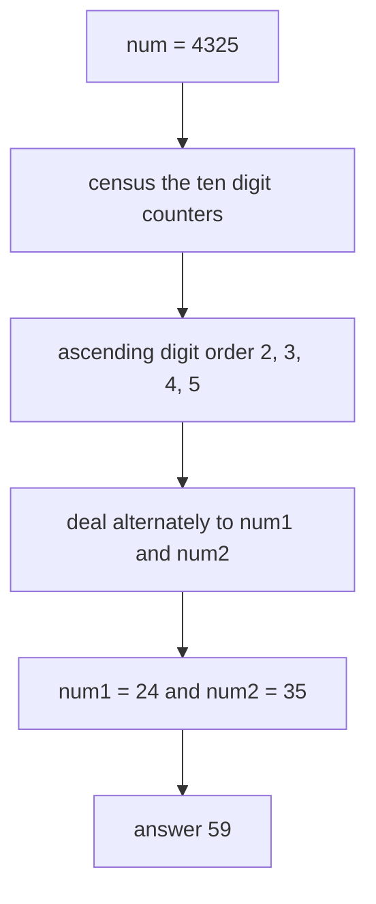

# Guided Example: Split With Minimum Sum

## 1. The instance and what a split actually decides

The first official input is `num = 4325`, and its required answer is `59`. A legal split reassigns the digit multiset $\{2, 3, 4, 5\}$ across two non-negative integers `num1` and `num2`: each digit of `num` must appear across the pair exactly as often as it occurs in `num`, either constructed number may begin with `0`, and the digits of a constructed number may be written in any order. The optimum for this input is `num1 = 24` together with `num2 = 35`.

The tempting reading of "minimum sum" is "make the two numbers as close in size as possible". This instance refutes that reading at once. The split `num1 = 42`, `num2 = 53` produces two numbers that differ by only `11`, yet it sums to `95`, while the lopsided optimum `24 + 35` sums to `59`. The objective is a sum, not a difference, so the two numbers are competing for cheap digit placements rather than for similar magnitudes.

The productive reframing is positional. A digit that ends up in a slot worth $10^{k}$ contributes exactly $d \cdot 10^{k}$ to the answer, so if the $n$ digits of `num` are $d_1, \dots, d_n$ and the digit $d_i$ occupies the slot of weight $10^{k_i}$, then

$$
\text{num1} + \text{num2} = \sum_{i=1}^{n} d_i \cdot 10^{k_i}.
$$

A split is therefore nothing more than a pairing between two finite inventories: the digits of `num`, and the positional slots that the two numbers jointly expose. The entire problem is the choice of that pairing.

## 2. The two inventories for `num = 4325`

**Digit inventory.** Reading `num` gives the following census. Only ten counters are ever needed, because a decimal digit has ten possible values.

| Digit $d$ | `0` | `1` | `2` | `3` | `4` | `5` | `6` | `7` | `8` | `9` |
|---|---|---|---|---|---|---|---|---|---|---|
| Occurrences in `num` | 0 | 0 | 1 | 1 | 1 | 1 | 0 | 0 | 0 | 0 |

**Slot inventory.** With four digits to place, the natural split gives two digits to each number. A two-digit number exposes one slot of weight $10^{1}$ and one of weight $10^{0}$, so the pair exposes exactly two slots of each weight.

| Slot weight | Copies exposed | Where the copies sit | What a digit $d$ costs there |
|---|---|---|---|
| $10^{1}$ | 2 | leading digit of `num1` and leading digit of `num2` | $10d$ |
| $10^{0}$ | 2 | trailing digit of `num1` and trailing digit of `num2` | $d$ |

Every digit must claim one slot, and no slot may hold two digits. The census and the slot table together contain all the information the answer depends on.

## 3. The exchange argument: large digits belong in cheap slots

Fix a split of the digit string into lengths, and fix which slots exist. Now ask only which digit should take which slot. Suppose two digits $a < b$ currently sit in slots of weight $q < p$, that is, the smaller digit $a$ occupies the more expensive slot $p$ and the larger digit $b$ occupies the cheaper slot $q$. The two assignments contribute

$$
a \cdot p + b \cdot q \quad \text{versus} \quad a \cdot q + b \cdot p .
$$

The first minus the second is $(b - a)(q - p)$ with $b - a > 0$ and $q - p < 0$, so the difference is strictly negative: swapping the two digits strictly decreases the total. Consequently **no arrangement in which a smaller digit sits in a more expensive slot than a larger digit can be optimal**, and the optimum must pair the sorted digits with the sorted slots in opposite order. On this instance the two competing pairings are visible directly.

| Digits in the two $10^{1}$ slots | Digits in the two $10^{0}$ slots | Constructed pair | Sum |
|---|---|---|---|
| `2` and `3` | `4` and `5` | `num1 = 24`, `num2 = 35` | $20 + 30 + 4 + 5 = 59$ |
| `4` and `5` | `2` and `3` | `num1 = 42`, `num2 = 53` | $40 + 50 + 2 + 3 = 95$ |

The exchange argument explains the `36` difference without enumerating any other split, and it also rules out every arrangement that keeps `num1` and `num2` close in magnitude.

## 4. The length split: why the two numbers stay within one digit of each other

The remaining freedom is how many digits each number receives. If `num1` takes $L_1$ digits and `num2` takes $L_2 = n - L_1$ digits, the slot multiset contains two copies of $10^{k}$ for every $k < \min(L_1, L_2)$ and one copy of $10^{k}$ for $\min(L_1, L_2) \le k < \max(L_1, L_2)$. Sorting that multiset from cheapest to most expensive and pairing the largest digits with the cheapest slots gives the best sum available to that split.

| Split of the 4 digits | Slot multiset, cheapest first | Best pairing for these digits | Best sum for that split |
|---|---|---|---|
| $2 + 2$ | $10^{0}, 10^{0}, 10^{1}, 10^{1}$ | `2`, `3` into $10^{1}$ and `4`, `5` into $10^{0}$ | `24 + 35 = 59` |
| $3 + 1$ | $10^{0}, 10^{0}, 10^{1}, 10^{2}$ | `4`, `5` into $10^{0}$, `3` into $10^{1}$, `2` into $10^{2}$ | `234 + 5 = 239` |
| $4 + 0$ | $10^{0}, 10^{1}, 10^{2}, 10^{3}$ | descending digits into ascending slots | `2345 + 0 = 2345` |

The balanced split wins term by term: its sorted slot vector is never larger than another split's at any position, because concentrating digits into one number replaces a cheap duplicated slot with a single much more expensive one. Since the optimal pairing weights every slot by a non-negative digit, a term-wise cheaper slot vector can only produce a smaller sum. The lengths $\lceil n/2 \rceil$ and $\lfloor n/2 \rfloor$ are therefore optimal, and this is exactly what dealing digits alternately between the two numbers produces.

## 5. Worked trace for `num = 4325`

Deal the digits into the two numbers in ascending order, alternating recipients, and append each digit to the right end of its recipient's string. Because the balanced split fixes the lengths up front, the final weight of every slot is known before the first deal: the first digit handed to a number of $m$ digits becomes its leading digit at $10^{m-1}$, and each later digit handed to the same number descends one power of ten.

| Deal | Smallest unused digit | Recipient | Final slot weight | Recipient string so far | Contribution to the sum |
|---|---|---|---|---|---|
| 1 | `2` | `num1` | $10^{1}$ | `2` | $2 \cdot 10 = 20$ |
| 2 | `3` | `num2` | $10^{1}$ | `3` | $3 \cdot 10 = 30$ |
| 3 | `4` | `num1` | $10^{0}$ | `24` | $4 \cdot 1 = 4$ |
| 4 | `5` | `num2` | $10^{0}$ | `35` | $5 \cdot 1 = 5$ |

After all four deals the constructed numbers are `num1 = 24` and `num2 = 35`, and the accumulated contributions give $20 + 30 + 4 + 5 = 59$, matching the required output.

## 6. When the digit count is odd: `num = 687`

The second official input has three digits, so the balanced lengths are $2$ and $1$. The slot multiset is $10^{0}, 10^{0}, 10^{1}$: the cheap units slot is duplicated but the tens slot exists only once, inside the longer number. That unpaired expensive slot is unavoidable, and the exchange argument says it must receive the smallest digit.

| Deal | Smallest unused digit | Recipient | Final slot weight | Recipient string so far |
|---|---|---|---|---|
| 1 | `6` | `num1` | $10^{1}$ | `6` |
| 2 | `7` | `num2` | $10^{0}$ | `7` |
| 3 | `8` | `num1` | $10^{0}$ | `68` |

The result is `num1 = 68`, `num2 = 7`, and $68 + 7 = 75$, the required output. The mechanism absorbs the odd count without a special case: the extra digit is simply the third deal, and because it is the largest digit it lands in the last remaining cheap slot. The same machinery distributes repeated digits, as in `num = 2932`, where the two `2`s are consumed by the first two deals into different numbers and the result is `23 + 29 = 52`.

## 7. Why the reasoning is correct: the greedy invariant

The method maintains one invariant across the deals:

> after the $k$-th deal, the digits already committed are precisely the $k$ smallest digits of `num`, and they occupy the $k$ most expensive slots of the balanced split, with the smallest committed digit in the most expensive occupied slot.

The invariant holds trivially before the first deal and is preserved by each step: the next deal takes the smallest uncommitted digit and hands it the most expensive unoccupied slot, so both halves of the statement extend by one. Two facts make the invariant sufficient.

- **Optimality within the balanced split.** Any arrangement of the balanced slot multiset that violates the pairing rule, meaning some smaller digit sits in a more expensive slot than a larger digit, can be strictly improved by the swap of Section 3. So an optimal arrangement obeys the rule, and the rule determines the arrangement completely once the slot multiset is fixed.
- **Optimality across splits.** Section 4 shows every alternative length split offers a term-wise more expensive slot vector, and the optimal pairing assigns non-negative digit weights to those slots, so no other split can beat the balanced one.

Together these two facts mean the invariant state is a global optimum, not merely a locally good one. The algorithm never needs to compare candidate splits, because the balancing argument eliminates them before any arithmetic happens.

## 8. Traps this instance exposes

| Input `num` | Digits ascending | Balanced lengths | Dealt construction | Required output | Lesson carried by the row |
|---|---|---|---|---|---|
| `10` | `0`, `1` | 1 and 1 | `num1 = 0`, `num2 = 1` | `1` | smallest legal input; a constructed number may be `0` |
| `1001` | `0`, `0`, `1`, `1` | 2 and 2 | `01` and `01`, that is `1` and `1` | `2` | zeroes may occupy leading slots and cost nothing |
| `2932` | `2`, `2`, `3`, `9` | 2 and 2 | `23` and `29` | `52` | duplicate digits are consumed one deal at a time |
| `687` | `6`, `7`, `8` | 2 and 1 | `68` and `7` | `75` | odd digit counts leave one unpaired expensive slot |
| `1000000000` | nine `0`s, then `1` | 5 and 5 | `0` and `1` | `1` | the single `1` is pushed down to the cheapest slot |
| `999999999` | nine `9`s | 5 and 4 | `99999` and `9999` | `109998` | with no cheap digits the extra slot is costly |

The zero rows deserve emphasis, because they show that leading zeros are not a defect to be repaired but a legitimate way to park a cheap digit in an expensive slot. In `1000000000` the nine zeroes absorb every slot above $10^{0}$, and the lone `1` is dealt last, ending at weight $10^{0}$ with value `1`. A method that refused leading zeros and forced a nonzero leading digit would produce a much larger answer here.

A second trap is treating the ascending order as the literal left-to-right order of a constructed number. It is not: ascending order is the order in which slots are *filled*, and each number receives its digits from its leading position downward. Reading the trace of Section 5 as "`num1` is written `2345` and then cut in half" gives `23 + 45 = 68`, which is neither the optimum nor even the slot pairing the deals produced.

## 9. Time and auxiliary space

Let $n$ be the number of digits of `num`, so $n \le 10$ because $10 \le \text{num} \le 10^{9}$.

| Resource | Bound | Derivation |
|---|---|---|
| Time | $O(n)$ | one pass over the digits to fill the census, then exactly $n$ deals |
| Auxiliary space | $O(1)$ | ten occurrence counters plus two running values; nothing grows with $n$ |

The only step that could look superlinear is finding the smallest digit that still has a nonzero counter. The search pointer only ever moves from a smaller digit to a larger one, never backwards, so across the whole run it advances at most nine times; the total scanning work is therefore $O(n + 10) = O(n)$, not $O(10n)$. Since $n$ is bounded by the constraint, the loop is effectively constant work, which is why the counting formulation is preferable to collecting the digits and sorting them: an explicit sort would cost $O(n \log n)$ time and $O(n)$ auxiliary space to obtain the identical order.
