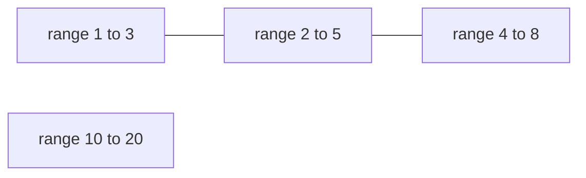

# Guided Example: Count Ways to Group Overlapping Ranges

## 1. The instance: which ranges are actually forced together

The second official input is $ranges = [[1,3], [10,20], [2,5], [4,8]]$, with required output `4`. Every range is a closed integer interval, two ranges overlap when they share at least one integer, and any two overlapping ranges must end up in the same group. The whole answer is decided by *which pairs are forced together*, so the first job is to record the overlaps directly.

| Pair of ranges | Shared integers | Overlapping | Forced into one group |
|---|---|---|---|
| `[1,3]` and `[10,20]` | none | no | no |
| `[1,3]` and `[2,5]` | `2`, `3` | yes | yes |
| `[1,3]` and `[4,8]` | none | no | not directly |
| `[10,20]` and `[2,5]` | none | no | no |
| `[10,20]` and `[4,8]` | none | no | no |
| `[2,5]` and `[4,8]` | `4`, `5` | yes | yes |

The third row is the interesting one. `[1,3]` and `[4,8]` share no integer at all, yet they still cannot be separated, because `[2,5]` overlaps both of them: the first group contains `[1,3]` and `[2,5]`, the second contains `[2,5]` and `[4,8]`, and transitivity of the "same group" relation drags `[4,8]` into the first group as well. Exactly four groupings survive, and they are the ones the statement lists: everything in group 1, everything in group 2, the chain of three in group 1 with `[10,20]` in group 2, and the chain of three in group 2 with `[10,20]` in group 1.

## 2. Overlap is transitive, so the input splits into components

Model the input as a graph: one vertex per range, one edge per overlapping pair. "Must belong to the same group" is the transitive closure of that edge relation, which is precisely connectivity in this graph. So the ranges fall into connected components, every component must be assigned wholly to one group, and components can be assigned independently of one another. For the traced instance the graph looks like this.

There are two components: the chain $\{[1,3], [2,5], [4,8]\}$ and the isolated range $\{[10,20]\}$. Two facts follow immediately and they drive the rest of the solution.

- The count depends only on the **number** of components, never on their sizes. A component of one range and a component of ninety ranges each contribute the same two possibilities.
- Building the overlap graph explicitly is unnecessary. Intervals have a total order, and a single sorted sweep is enough to identify the components.

## 3. The sorted sweep, and why `start > mx` is the exact boundary

Sort the ranges by their starting coordinate. In that order each connected component occupies a contiguous block, and the boundary between two blocks can be detected with one scalar: the largest end coordinate seen so far while building the current component, call it `mx`.

| Situation at a range `[start, end]` | What it means | Required action |
|---|---|---|
| `start <= mx` | some range already in the current component reaches at least `start`, and it begins no later than `start`, so the two share the integer `start` | the range joins the current component |
| `start > mx` | every processed range ends strictly before `start`, so no processed range shares an integer with it, and every unprocessed range starts no earlier | a new component begins |

The second row is a claim about *all* ranges, not just the immediately preceding one. If `start > mx`, then every earlier range has end at most `mx < start`, so it lies entirely to the left; and every later range has start at least `start` and so lies entirely to the right. That is what makes the test exact rather than merely a heuristic, and it is what allows the sweep to stop reasoning about pairs altogether.

One more detail matters for the bookkeeping. When a new component begins, the running maximum does not need to be reset explicitly, because the new range satisfies `end >= start > mx`, so taking the maximum with `end` installs exactly the new component's reach. The same update `mx = max(mx, end)` therefore serves both cases, and `mx` always equals the largest end among the ranges of the component currently being built.

**The sweep invariant.** After the sweep has processed the first $i$ ranges in sorted order, two statements hold together:

- the number of components accumulated so far equals the number of connected components of those $i$ ranges, and
- `mx` is the largest end coordinate among the ranges of the last of those components.

Each half survives the next range. If `start <= mx`, the new range shares the integer `start` with a range of the last component, so the component count is unchanged and the running maximum can only grow. If `start > mx`, the new range touches nothing processed, so the count rises by one and `mx` becomes `end`, which is exactly the reach of the component that has just opened. Since the invariant identifies the counter with the true number of connected components, the final value is `c`, and the correctness of the whole method rests on this one invariant.

## 4. Worked trace for the official chain instance

Sorting $[[1,3], [10,20], [2,5], [4,8]]$ by start gives $[[1,3], [2,5], [4,8], [10,20]]$. Sweeping with `mx` initialized below every legal start (the starts are non-negative, so `-1` is safe) gives the following.

| Step | Range | `mx` before | `start > mx` | Components after | `mx` after |
|---|---|---|---|---|---|
| 1 | `[1,3]` | `-1` | yes, so a new component starts | 1 | `3` |
| 2 | `[2,5]` | `3` | no, `2 <= 3` | 1 | `5` |
| 3 | `[4,8]` | `5` | no, `4 <= 5` | 1 | `8` |
| 4 | `[10,20]` | `8` | yes, `10 > 8` | 2 | `20` |

At step 2 the ranges `[1,3]` and `[2,5]` are confirmed to overlap through the integer `2`; at step 3 the same test confirms `[2,5]` and `[4,8]` overlap through `4` and `5`, even though the maximum end is what carries the information forward and `[1,3]` itself is never touched again. At step 4 the gap between coordinate `8` and coordinate `10` leaves no shared integer, so the component closes and a new one opens. The sweep ends with $c = 2$ components.

## 5. Counting the groupings: two choices per component

Each component is an indivisible block: all of its ranges go to group 1 or all of them go to group 2, and nothing in between is legal. Components do not constrain each other, so the total number of valid groupings is the product of the per-component choices:

$$
\text{ways} = \underbrace{2 \times 2 \times \dots \times 2}_{c \text{ factors}} = 2^{c}.
$$

| Components $c$ | Groupings $2^{c}$ | $2^{c} \bmod (10^{9}+7)$ | Instance |
|---|---|---|---|
| 1 | 2 | 2 | sample 1, $[[6,10],[5,15]]$ |
| 2 | 4 | 4 | the traced chain instance |
| 3 | 8 | 8 | $[[20,25],[1,4],[3,6],[10,12],[12,14]]$ |
| 35 | 34359738368 | 359738130 | thirty-five isolated point ranges `[0,0]`, `[2,2]`, ..., `[68,68]` |

The last row shows why the modulo is part of the problem and not a formality: with up to $10^{5}$ ranges the exponent can be $10^{5}$, and $2^{100000}$ has more than thirty thousand decimal digits. The power must be reduced at every squaring step rather than computed exactly and reduced afterwards. Since each squaring multiplies two residues below $10^{9}+7$, the intermediate products reach about $10^{18}$, which fits in a signed 64-bit integer but not in a 32-bit one.

## 6. Nested ranges, touching endpoints, and the running maximum

Three boundary behaviours of the sweep are worth separating, because each has a plausible wrong reading.

| Input | Plausible wrong handling | Correct handling | Required output |
|---|---|---|---|
| `[[0,100],[10,20],[30,40],[50,60]]` | comparing only with the previous range, whose end is `20`, so `[30,40]` looks disjoint and four components give `16` | the running maximum stays `100`, so every later range joins the same component, $c = 1$ | `2` |
| `[[1,2],[2,3]]` | treating a shared endpoint as a gap and opening a new component, giving `4` | closed intervals share the integer `2`, so `start > mx` is false and $c = 1$ | `2` |
| `[[1,2],[3,4]]` | merging any two sorted neighbours, giving `2` | `3 > 2` is true, so the ranges are disjoint and $c = 2$ | `4` |
| `[[7,7],[7,7],[7,7]]` | assuming a component needs at least two distinct ranges, giving `8` | all three point ranges share the integer `7`, so $c = 1$ | `2` |

The first row is the reason the sweep must track a maximum instead of the previous end: a long range can dominate several shorter ones that follow it, and only the maximum remembers that reach. The second and third rows together pin down the comparison: the boundary test is strict, `start > mx`, because sharing exactly one integer is already an overlap.

## 7. Traps this instance exposes

| Trap | Failure mode | Why it is wrong |
|---|---|---|
| Counting pairs instead of components | summing pairwise overlaps and exponentiating that number | ways depend on connectivity, not on how many edges the graph has |
| Splitting a component across the two groups | allowing `[1,3]` and `[2,5]` to sit in different groups because they are "different ranges" | the constraint applies to every overlapping pair, so the whole component moves together |
| Ignoring transitive obligations | grouping `[1,3]` with `[2,5]` and `[4,8]` with `[10,20]`, which leaves `[4,8]` separated from an overlapping partner | the transitive closure is what the components encode |
| An `mx` that starts at `0` | a first range beginning at coordinate `0` fails the `start > mx` test and no component is counted, so the answer collapses to `1` | `mx` must start strictly below every legal start |
| Resetting state per range | storing the previous range's end and forgetting the largest end seen | nested ranges such as `[0,100]` followed by `[10,20]` then `[30,40]` would be mis-split |
| Subtracting the empty-group cases | returning $2^{c} - 2$ on the theory that both groups must be non-empty | the statement allows either group to be empty, and both official examples count those groupings |
| Reducing the modulo too late | computing $2^{c}$ exactly before taking the remainder | the exact value has tens of thousands of digits and is needlessly expensive to build |

## 8. Time and auxiliary space

Let $n$ be the number of ranges, so $1 \le n \le 10^{5}$.

| Resource | Bound | Derivation |
|---|---|---|
| Time | $O(n \log n)$ | sorting the $n$ ranges dominates; the component sweep is one linear pass and the modular power costs $O(\log c) \subseteq O(\log n)$ multiplications |
| Auxiliary space | $O(1)$ | the sweep keeps only two scalars, the running maximum end and the component count |

Both quantities are independent of the coordinate values, which may be as large as $10^{9}$: the sweep never walks the integers inside a range, it only compares endpoints. That is the difference between this method and a coverage-marking approach that would need an array indexed by coordinate. The sorting step is what makes the linear pass sufficient, because it guarantees that a component's ranges appear consecutively and that a gap can be recognized from a single scalar.