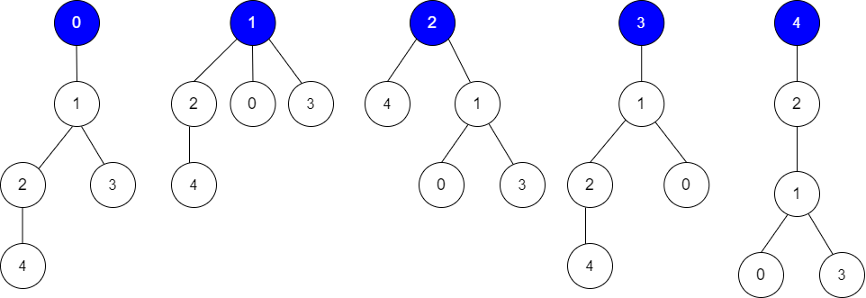
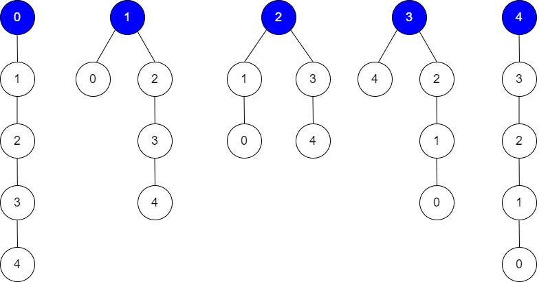

### 1. Description

Alice has an undirected tree with `n` nodes labeled from `0` to $n - 1$. The tree is represented as a 2D integer array `edges` of length $n - 1$ where $\text{edges}[i] = [a_{i}, b_{i}]$ indicates that there is an edge between nodes $a_{i}$ and $b_{i}$ in the tree.

Alice wants Bob to find the root of the tree. She allows Bob to make several **guesses** about her tree. In one guess, he does the following:

- Chooses two **distinct** integers `u` and `v` such that there exists an edge `[u, v]` in the tree.

- He tells Alice that `u` is the **parent** of `v` in the tree.

Bob's guesses are represented by a 2D integer array `guesses` where $\text{guesses}[j] = [u_{j}, v_{j}]$ indicates Bob guessed $u_{j}$ to be the parent of $v_{j}$.

Alice being lazy, does not reply to each of Bob's guesses, but just says that **at least** `k` of his guesses are `true`.

Given the 2D integer arrays `edges`, `guesses` and the integer `k`, return *the **number of possible nodes** that can be the root of Alice's tree*. If there is no such tree, return `0`.

### 2. Function Contract

- `n`: Input parameter.
- Returns expected result.

### 3. Examples

#### Example 1

- **Input:** $edges = [[0,1],[1,2],[1,3],[4,2]], guesses = [[1,3],[0,1],[1,0],[2,4]], k = 3$
- **Output:** `3`
- **Explanation:**
Root = 0, correct guesses = [1,3], [0,1], [2,4]
Root = 1, correct guesses = [1,3], [1,0], [2,4]
Root = 2, correct guesses = [1,3], [1,0], [2,4]
Root = 3, correct guesses = [1,0], [2,4]
Root = 4, correct guesses = [1,3], [1,0]
Considering 0, 1, or 2 as root node leads to 3 correct guesses.
#### Example 2

- **Input:** $edges = [[0,1],[1,2],[2,3],[3,4]], guesses = [[1,0],[3,4],[2,1],[3,2]], k = 1$
- **Output:** `5`
- **Explanation:**
Root = 0, correct guesses = [3,4]
Root = 1, correct guesses = [1,0], [3,4]
Root = 2, correct guesses = [1,0], [2,1], [3,4]
Root = 3, correct guesses = [1,0], [2,1], [3,2], [3,4]
Root = 4, correct guesses = [1,0], [2,1], [3,2]
Considering any node as root will give at least 1 correct guess.

### 4. Constraints

- $\text{edges.length} = n - 1$

- $2 \le n \le 10^{5}$

- $1 \le \text{guesses.length} \le 10^{5}$

- $0 \le a_{i}, b_{i}, u_{j}, v_{j} \le n - 1$

- $a_{i} \neq b_{i}$

- $u_{j} \neq v_{j}$

- `edges` represents a valid tree.

- $\text{guesses}[j]$ is an edge of the tree.

- `guesses` is unique.

- $0 \le k \le \text{guesses.length}$