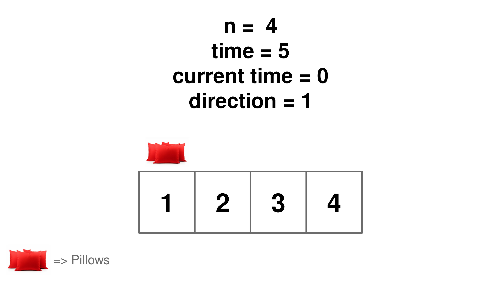
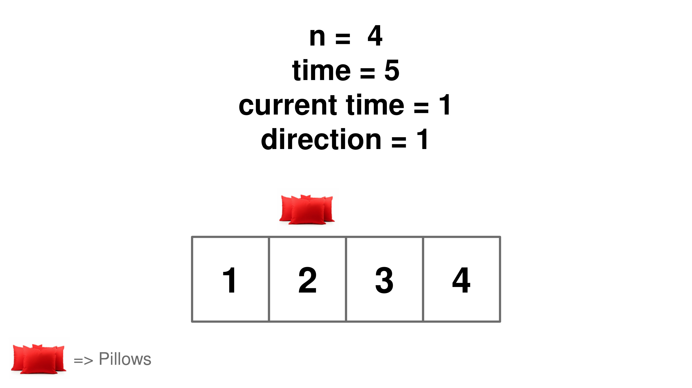
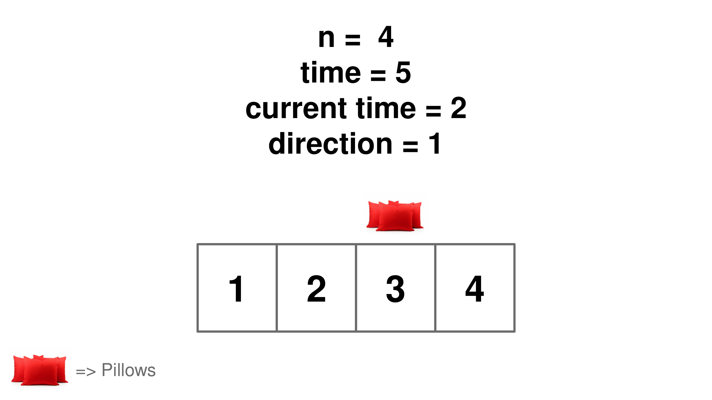
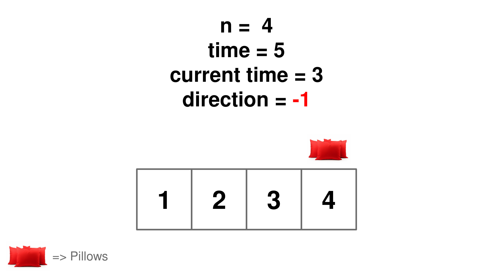
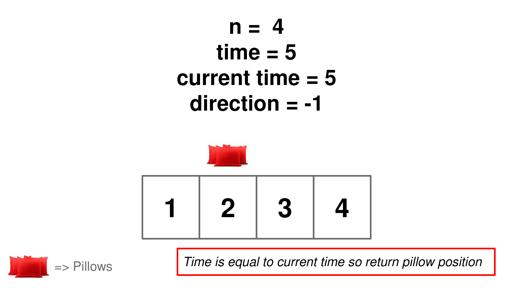

## Solution

---

### Overview

We are given the number of people in the line and the number of seconds it takes each person to pass the pillow, and we need to determine who will be holding the pillow after a certain amount of time has passed. Solving this challenge helps us understand how to model and solve problems involving cyclic or repetitive processes.

---

### Approach 1: Simulation

#### Intuition

The direction the pillow travels is determined by its current position and previous direction. If the pillow is with the first person, it can only move forward. If it is with the last person, it can only move backward. For all other positions, the movement direction follows the previous direction: it continues forward if it was moving forward, and continues backward if it was moving backward.

Let's simulate the pillow's movement, starting with the first person and moving it from left to right. We change direction if the pillow reaches the end of the line. The index of the person holding the pillow after the total time time has elapsed is the final answer.

> Note: $direction = 1$ indicates movement towards the right, along the positive x-axis, while $direction = -1$ indicates movement towards the left, along the negative x-axis.












#### Algorithm

  - Start with the pillow at the first person ($currentPillowPosition = 1$).
  - Begin counting time from `0` ($currentTime = 0$).
  - Set the initial direction of movement towards the end of the line ($direction = 1$).
  - Enter a loop that runs until `currentTime` is less than `time`.
  - Check if moving in the current direction (`direction`) will keep the pillow within the line boundaries (`1` to `n`):
- Move the pillow to the next position ($currentPillowPosition + direction$).
- Increment the current time (`currentTime++`) since one second has passed.
- Reverse the direction of movement (`direction *= -1`) if moving out of bounds.
  - After simulating for `time` seconds, return `currentPillowPosition`, which identifies the person holding the pillow after `time` seconds.

#### Implementation

```python
class Solution:
    def passThePillow(self, n: int, time: int) -> int:
        current_pillow_position = 1
        current_time = 0
        direction = 1
        while current_time < time:
            if 0 < current_pillow_position + direction <= n:
                current_pillow_position += direction
                current_time += 1
            else:
                # Reverse the direction if the next position is out of bounds
                direction *= -1
        return current_pillow_position
```

#### Complexity Analysis

Let $T$ be the amount of time given by the input.

* Time complexity: $O(T)$.

    The algorithm runs a loop `T` times, with each iteration representing one second. It continues until $\text{current}_{time}$ equals `time`, resulting in a time complexity of $O(T)$.

* Space complexity: $O(1)$.

    The algorithm only uses a fixed number of variables (`current_pillow_position`, $\text{current}_{time}$, and `direction`). These variables take up a constant amount of space, and no additional space is used. Therefore, the space complexity is constant, or $O(1)$.

---

### Approach 2: Math

#### Intuition

To understand how the pillow moves among the people in line, let's understand the pattern of its movement. The pillow completes a full round when it travels from the first person to the last or vice versa. Each complete round takes $n - 1$ seconds, where `n` is the total number of people.

To determine how many complete rounds the pillow makes within a given time `time`, we divide `time` by $n - 1$. This gives us `fullRounds`, representing the number of times the pillow moves from one end of the line to the other. The remainder of this division, $extraTime = time \% (n - 1)$, indicates the extra time left after completing these full rounds.

Now, let's consider the direction of the pillow's movement:
- If `fullRounds` is even, the pillow moves forward along the line.
- If `fullRounds` is odd, the pillow moves backward. This directional change occurs after each complete round.

In the case of forward movement (`fullRounds` is even), the person holding the pillow after the extra time will be positioned at $extraTime + 1$ (since we start counting positions from one). Conversely, during backward movement (`fullRounds` is odd), the person holding the pillow will be at position $n - extraTime$.

#### Algorithm

- $fullRounds = time / (n - 1)$ calculates how many complete rounds of passing occur.
- $extraTime = time \% (n - 1)$ calculates the remaining time after complete rounds.
- Check if $fullRounds \% 2 = 0$:
  - If true, calculate the position as $extraTime + 1$.
  - If false, calculate the position as $n - extraTime$.
- Return the position determined in the above step, which indicates the person holding the pillow after `time` seconds.

#### Implementation

```python
class Solution:
    def passThePillow(self, n, time):
        # Calculate the number of complete rounds of pillow passing
        full_rounds = time // (n - 1)

        # Calculate the remaining time after complete rounds
        extra_time = time % (n - 1)

        # Determine the position of the person holding the pillow
        # If full_rounds is even, the pillow is moving forward.
        # If full_rounds is odd, the pillow is moving backward.
        if full_rounds % 2 == 0:
            return extra_time + 1  # Position when moving forward
        else:
            return n - extra_time  # Position when moving backward
```

#### Complexity Analysis

* Time complexity: $O(1)$.

    Regardless of the size of the input, we always perform a fixed number of operations thus the time complexity is $O(1)$.

* Space complexity: $O(1)$.

    Regardless of the size of the input, we only use a fixed number of auxiliary variables ($\text{full}_{rounds}$ and $\text{extra}_{time}$), thus the space complexity is $O(1)$.

---