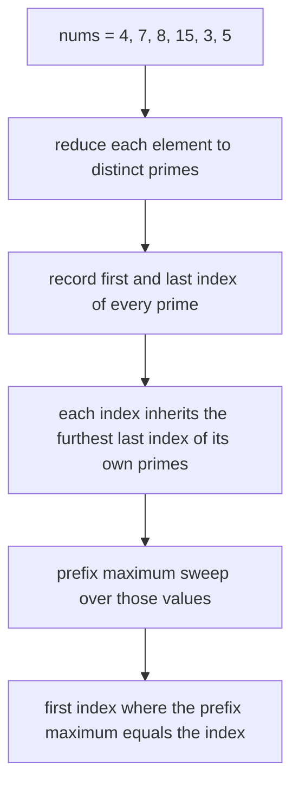

# Guided Example: Split the Array to Make Coprime Products

## 1. The instance and the smallest valid cut

A split at index $i$ with $0 \le i \le n-2$ is valid when the product of `nums[0..i]` and the product of `nums[i+1..n-1]` are coprime, and the task asks for the **smallest** such $i$, or `-1` when no cut works. The instance traced here is the first official input, `nums = [4, 7, 8, 15, 3, 5]`, whose required answer is `2`.

A cut is a boundary between two neighbouring elements, so there are $n-1$ candidates, numbered `0` through `n-2`. On this input the candidate boundaries sit between `4` and `7`, between `7` and `8`, between `8` and `15`, between `15` and `3`, and between `3` and `5`. Note what the answer `2` means: the split that keeps `4`, `7`, `8` on the left and `15`, `3`, `5` on the right. Cuts `0` and `1` are not merely worse, they are illegal, and the interesting question is why.

## 2. Products are the wrong object to compute

The obvious plan is to build the prefix product, build the suffix product, and test $\gcd(\text{prefix}, \text{suffix}) = 1$ at every cut. That plan is not implementable. With $n$ up to $10^{4}$ and values up to $10^{6}$, a prefix product can have tens of thousands of decimal digits; even two or three large elements overflow a signed 64-bit integer. The products in this problem are only a notational device for describing *which primes appear on each side*.

Coprimality is exactly a statement about prime sets. For positive integers $a$ and $b$,

$$
\gcd(a, b) = 1 \iff \text{no prime divides both } a \text{ and } b .
$$

A product of integers is divisible by a prime precisely when one of its factors is, so the split at $i$ is valid exactly when **no prime occurs among `nums[0..i]` and again among `nums[i+1..n-1]`**. Every value therefore collapses to its signature, the set of distinct primes dividing it: `4` becomes $\{2\}$, `15` becomes $\{3, 5\}$, `1` becomes the empty set, and a prime like `999983` becomes itself. The magnitudes disappear, and only membership matters.

## 3. One interval per prime

For every prime $p$ that occurs at all, let $\operatorname{first}(p)$ be the smallest index whose value is divisible by $p$ and $\operatorname{last}(p)$ the largest such index. These two numbers define the interval

$$
I_p = [\operatorname{first}(p),\ \operatorname{last}(p)]
$$

of positions that $p$ occupies. Because a prime's occurrences form a set of indices, the interval is the tight span of that set, and it is all the prefix or suffix test ever needs: a prime occurs on both sides of the cut at $c$ exactly when its interval contains positions on both sides.

| Prime $p$ | Where it divides | $\operatorname{first}(p)$ | $\operatorname{last}(p)$ | Interval $I_p$ | Cuts it blocks, $c$ with $\operatorname{first}(p) \le c < \operatorname{last}(p)$ |
|---|---|---|---|---|---|
| 2 | `4` at index 0, `8` at index 2 | 0 | 2 | $[0, 2]$ | 0 and 1 |
| 7 | `7` at index 1 | 1 | 1 | $[1, 1]$ | none |
| 3 | `15` at index 3, `3` at index 4 | 3 | 4 | $[3, 4]$ | 3 |
| 5 | `15` at index 3, `5` at index 5 | 3 | 5 | $[3, 5]$ | 3 and 4 |

Read the table as a covering problem: the cut at $c$ is valid exactly when **no interval covers it**. Two rows deserve attention. Prime `7` occurs once, so its interval is the degenerate $[1,1]$, which covers nothing — a prime confined to one element can never be the reason a split fails. Prime `5` occurs at the two ends of the window `15 ... 5` and blocks both cuts `3` and `4`, which is why the answer cannot be pushed to the right even though cut `2` already succeeds.

## 4. Reach values and the prefix-maximum sweep

Scanning all intervals at every cut would cost $O(n \cdot \pi)$ work. A single left-to-right pass replaces it. For each index $j$ define the *reach* of that index, the furthest index any prime dividing `nums[j]` is seen again:

$$
\operatorname{reach}_j = \max\{\operatorname{last}(p) : p \text{ prime},\ p \mid \texttt{nums[j]}\},
$$

with $\operatorname{reach}_j = j$ when `nums[j] = 1`, since the empty set of primes reaches nothing beyond its own position. Then maintain the prefix maximum

$$
P(c) = \max_{0 \le j \le c} \operatorname{reach}_j .
$$

$P(c)$ is the largest last-occurrence among every prime that occurs in `nums[0..c]`, so the cut at $c$ is valid exactly when no prime of the prefix recurs later, that is, exactly when $P(c) = c$. Two properties make the sweep simple to reason about: $P$ never decreases, and $P(c) \ge c$ always, because `reach[c]` is at least $c$. Hence scanning $c$ upward and stopping at the first equality returns the **smallest** valid cut rather than an arbitrary one.

| Index $j$ | Primes dividing `nums[j]` | $\operatorname{reach}_j$ | Prefix maximum $P(j)$ | $P(j) = j$ |
|---|---|---|---|---|
| 0 | 2 | 2 | 2 | no |
| 1 | 7 | 1 | 2 | no |
| 2 | 2 | 2 | 2 | yes, so the answer is `2` |

The remaining indices are never examined by the sweep because the search stops at the first equality, but the same recurrence would give $P(3) = 5$, $P(4) = 5$, and no further equality before the last legal cut.

## 5. Worked trace for `nums = [4, 7, 8, 15, 3, 5]`

The first table records the factorization pass. For each index it lists the distinct primes, whether each was seen before, and which earlier index had its last occurrence extended.

| Index | `nums[i]` | Distinct primes | Primes introduced here | Last occurrences extended to this index |
|---|---|---|---|---|
| 0 | `4` | 2 | 2 | none |
| 1 | `7` | 7 | 7 | none |
| 2 | `8` | 2 | none | 2, whose first index was 0 |
| 3 | `15` | 3, 5 | 3 and 5 | none |
| 4 | `3` | 3 | none | 3, whose first index was 3 |
| 5 | `5` | 5 | none | 5, whose first index was 3 |

The second table tests every legal cut directly, using the prime sets of the two sides. It is the brute-force view that the sweep of Section 4 reproduces in one pass.

| Cut $c$ | Prefix | Suffix | Prime on both sides | Valid |
|---|---|---|---|---|
| 0 | `4` | `7, 8, 15, 3, 5` | 2 | no |
| 1 | `4, 7` | `8, 15, 3, 5` | 2 | no |
| 2 | `4, 7, 8` | `15, 3, 5` | none | yes |
| 3 | `4, 7, 8, 15` | `3, 5` | 3 and 5 | no |
| 4 | `4, 7, 8, 15, 3` | `5` | 5 | no |

Cut `0` fails because `4` contributes the prime 2 and `8` contributes it again on the right; cut `1` fails for the same reason, since `8` still lies to the right of the boundary. At cut `2` the prime 2 is entirely on the left: its interval $[0,2]$ ends exactly at the cut. The two later cuts fail for a different reason, the paired occurrences of 3 and 5 across `15`, `3`, and `5`. The smallest valid cut is therefore `2`, matching the required output.

## 6. Why the first equality is the answer

The sweep rests on one invariant:

> after the prefix maximum has absorbed index $c$, the value $P(c)$ equals the largest index at which any prime occurring in `nums[0..c]` appears anywhere in the array.

The invariant is immediate from the definition of reach and from the fact that the union of the primes dividing `nums[0]`, ..., `nums[c]` is exactly the set of primes occurring in the prefix. Two consequences follow, and together they establish correctness.

- **Equality detects a valid cut.** If $P(c) = c$, every prime of the prefix has its last occurrence at or before $c$, so no prime is present on both sides and the two products are coprime. If $P(c) > c$, that strict excess is realized by some prime $p$ with $\operatorname{last}(p) > c$ whose first occurrence is at or before $c$; then $p$ divides both products and the cut is invalid. So valid cuts are exactly the indices with $P(c) = c$.
- **The scan order returns the smallest one.** Since $P(c) \ge \operatorname{reach}_c \ge c$ for every $c$, an equality is the only way the test can pass, and scanning $c$ from `0` upward reports the first index at which it passes. No later cut can be smaller.

The last legal cut is $n-2$; if no equality occurs by then, no split exists and the answer is `-1`.

## 7. Boundary cases and traps

| Input | Smallest valid cut | Required output | What the row demonstrates |
|---|---|---|---|
| `[2, 3, 3]` | 0 | `0` | cut 0 separates `2` from `9`; cut 1 fails because 3 appears on both sides |
| `[1, 1]` | 0 | `0` | a value with no prime factors never crosses a cut |
| `[1, 6, 10, 15, 7]` | 0 | `0` | a leading `1` makes the very first cut valid |
| `[7]` | none exists | `-1` | cuts stop at $n-2$, which is negative for a single element |
| `[4, 4]` | none exists | `-1` | prime 2 spans the only legal cut |
| `[6, 10, 7, 11]` | 1 | `1` | the shared prime 2 closes after index 1 |
| `[2, 4, 8, 3, 9]` | 2 | `2` | prime 2's interval ends at index 2, before 3 ever appears |
| `[6, 35, 10, 77]` | none exists | `-1` | intervals $[0,2]$, $[1,2]$, $[1,3]$ cover every candidate cut |
| `[1000000, 999983]` | 0 | `0` | $10^{6} = 2^{6} \cdot 5^{6}$ keeps primes 2 and 5 inside index 0, and the prime `999983` starts at index 1 |

| Trap | Failure mode | Correction |
|---|---|---|
| Computing the products | prefix products overflow even 64-bit integers after a few large elements | reduce each element to its distinct prime factors and compare sets instead |
| Comparing neighbours | testing $\gcd(\texttt{nums[i]}, \texttt{nums[i+1]})$ looks like a local overlap test but says nothing about the two products | the criterion is about positions relative to the cut, not about adjacent values |
| Treating a single occurrence as a crossing | a prime occurring once would be considered present "on one side and possibly the other", blocking every cut | an interval $[f, f]$ covers no cut because coverage needs $\operatorname{first} \le c < \operatorname{last}$ |
| Allowing the prime to sit at the cut | using $\operatorname{last}(p) \ge c$ as the blocking test would forbid a prime from lying entirely inside the prefix | the cut is the boundary after index $c$, so a prime at $c$ is on the left |
| Ignoring the cut ceiling | accepting $c = n-1$ would report the last index, but the split must leave a non-empty right side | legal cuts satisfy $0 \le c \le n-2$ |
| Reporting the first long reach | returning the first index whose reach exceeds the cut rather than the first index where the prefix maximum equals it | the answer is the first $c$ with $P(c) = c$ |
| Off-by-one in the answer | returning the number of elements on the left instead of the index of the last one | the contract asks for the index $i$, so a prefix of three elements is the answer `2` |
| Recomputing intervals per cut | rescanning all intervals at each candidate cut costs $O(n \cdot \pi)$ work | one reach array plus one prefix maximum reduces the search to a linear pass |

## 8. Time and auxiliary space

Let $n$ be the array length and $A = \max_i \texttt{nums[i]} \le 10^{6}$ the value ceiling.

| Resource | Bound | Derivation |
|---|---|---|
| Time | $O(n\sqrt{A})$ | each element is factored by trial division up to $\sqrt{A}$; the interval bookkeeping and the prefix-maximum sweep are each a single linear pass |
| Auxiliary space | $O(n + \pi)$ | a reach array of length $n$ plus one first and one last entry for each distinct prime that occurs, and $\pi$ counts those distinct primes |

Concretely, $n\sqrt{A} \le 10^{4} \cdot 10^{3} = 10^{7}$ trial divisions in the worst case, which is comfortable. The usual trade is available: precomputing a smallest-prime-factor table up to $A$ costs $O(A \log \log A)$ time and $O(A)$ space, after which each element factors in $O(\log A)$ divisions and the total becomes $O(A \log \log A + n \log A)$. Both variants are dominated by the same idea, and neither ever forms a product: the difficulty of this problem is recognizing that the giant prefix and suffix products are a red herring, and that the entire decision depends on the first and last position of each distinct prime.
