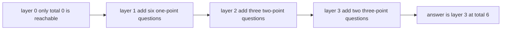

# Guided Example: Number of Ways to Earn Points

## 1. The instance and what a "way" actually is

The exam offers $n$ types of questions, where type $i$ supplies `count[i]` questions worth `marks[i]` points each, and the task is to count the selections that total exactly `target` points, reduced modulo $10^{9}+7$. The instance traced here is the first official input, `target = 6` with `types = [[6,1],[3,2],[2,3]]`: six one-point questions, three two-point questions, and two three-point questions. The required answer is `7`.

The note that decides the counting model is that questions of the same type are **indistinguishable**. Solving the first and second one-point question is the same outcome as solving the first and third, or the second and third. So a way is not a subset of individual questions but a vector of counts

$$
(k_0, k_1, \dots, k_{n-1}), \qquad 0 \le k_i \le \texttt{count}[i],
$$

subject to the single arithmetic condition

$$
\sum_{i=0}^{n-1} k_i \cdot \texttt{marks}[i] = \texttt{target}.
$$

For the traced input that makes a way a triple $(k_0, k_1, k_2)$ with $0 \le k_0 \le 6$, $0 \le k_1 \le 3$, $0 \le k_2 \le 2$, and $k_0 + 2k_1 + 3k_2 = 6$. Counting such triples is a bounded subset-sum count, and it is small enough to be counted by hand here; the difficulty is doing it without enumerating triples when there are fifty types and a target of a thousand.

## 2. The recurrence: one layer per question type

Introduce the state

$$
f[i][j] = \text{number of count vectors using only types } 0, \dots, i-1 \text{ whose points total exactly } j .
$$

Processing one type at a time turns the problem into a layered recurrence. When type $i-1$ is added to a solution that already totals $j - k \cdot \texttt{marks}[i-1]$ points, the new solution totals $j$ points, and $k$ ranges over every legal number of that type, so

$$
f[i][j] = \sum_{k=0}^{\texttt{count}[i-1]} f[i-1][j - k \cdot \texttt{marks}[i-1]],
$$

where a term is skipped whenever its index $j - k \cdot \texttt{marks}[i-1]$ is negative. The base layer contains a single nonzero entry, $f[0][0] = 1$, which is the empty selection earning nothing. The answer is $f[n][\texttt{target}]$ taken modulo $10^{9}+7$.

The type dimension matters for more than bookkeeping. Because the types are consumed in a fixed order, each vector $(k_0, \dots, k_{n-1})$ is produced along exactly one path through the layers, which is what keeps the count free of duplicates.

## 3. The full state table for the official instance

Filling the table row by row, where row $i$ uses the first $i$ types, gives the following values.

| Layer $i$ | Types used | $j = 0$ | $j = 1$ | $j = 2$ | $j = 3$ | $j = 4$ | $j = 5$ | $j = 6$ |
|---|---|---|---|---|---|---|---|---|
| 0 | none | 1 | 0 | 0 | 0 | 0 | 0 | 0 |
| 1 | `[6,1]` | 1 | 1 | 1 | 1 | 1 | 1 | 1 |
| 2 | `[3,2]` | 1 | 1 | 2 | 2 | 3 | 3 | 4 |
| 3 | `[2,3]` | 1 | 1 | 2 | 3 | 4 | 5 | 7 |

Three details in the table are worth checking against the recurrence.

- Row 1 has a `1` in every column up to $j = 6$, because six one-point questions can produce any total from 0 to 6 in exactly one way. Its cap of 6 is what stops the row from continuing past column 6.
- Row 2 grows unevenly. The entry `f[2][4] = 3` counts the pairs $(k_0, k_1)$ with $k_0 + 2k_1 = 4$, namely $(4,0)$, $(2,1)$, and $(0,2)$.
- Row 3's last entry is the answer: $f[3][6] = 7$.

## 4. Reading the transition for `f[3][6]` term by term

The final entry is assembled from three terms, one per legal number $k_2$ of three-point questions.

| $k_2$ | Points contributed by type 2 | Remaining total needed | Cells consulted | Ways contributed |
|---|---|---|---|---|
| 0 | 0 | 6 | `f[2][6]` | 4 |
| 1 | 3 | 3 | `f[2][3]` | 2 |
| 2 | 6 | 0 | `f[2][0]` | 1 |
| total | | | | 7 |

The sum $4 + 2 + 1 = 7$ is exactly the required output. This decomposition also exposes the cap: the value $k_2 = 3$ would need 9 points from type 2 alone, but only two such questions exist and the remaining total would be negative, so no fourth term appears. A cap of 2 is therefore a real constraint on the recurrence, not a formality.

## 5. The seven ways, and why no way is counted twice

Expanding the three groups of Section 4 into concrete count vectors shows the same seven outcomes the statement lists, and it shows that the seven are mutually distinct triples.

| Way | $k_0$ (1 point each) | $k_1$ (2 points each) | $k_2$ (3 points each) | Points | Grouped under |
|---|---|---|---|---|---|
| 1 | 6 | 0 | 0 | 6 | $k_2 = 0$, from `f[2][6]` |
| 2 | 4 | 1 | 0 | 6 | $k_2 = 0$, from `f[2][6]` |
| 3 | 2 | 2 | 0 | 6 | $k_2 = 0$, from `f[2][6]` |
| 4 | 0 | 3 | 0 | 6 | $k_2 = 0$, from `f[2][6]` |
| 5 | 3 | 0 | 1 | 6 | $k_2 = 1$, from `f[2][3]` |
| 6 | 1 | 1 | 1 | 6 | $k_2 = 1$, from `f[2][3]` |
| 7 | 0 | 0 | 2 | 6 | $k_2 = 2$, from `f[2][0]` |

The invariant that makes this enumeration exhaustive and duplicate-free is:

> $f[i][j]$ equals the number of distinct vectors $(k_0, \dots, k_{i-1})$ satisfying $0 \le k_t \le \texttt{count}[t]$ and $\sum_t k_t \cdot \texttt{marks}[t] = j$.

The inductive step is the recurrence itself. Every vector counted by $f[i][j]$ has a well-defined last coordinate $k_{i-1}$, which is unique, so it belongs to exactly one term of the sum; conversely every term of the sum counts vectors that extend to a valid vector for $f[i][j]$ by appending that coordinate. The mapping is a bijection between the vectors counted by $f[i][j]$ and the disjoint union of the vectors counted by the terms, which is exactly what correctness of the recurrence requires. Fixing the type order is what makes the decomposition unique — counting by total points alone, without the layer, would treat different type mixtures as interchangeable.

## 6. Boundary behaviour: caps, parity, and equal marks

| Input | Reachable totals | Required output | What the row demonstrates |
|---|---|---|---|
| `target = 1, types = [[1,1]]` | 1 | `1` | the smallest instance: one question, one way |
| `target = 1, types = [[1,1],[1,1]]` | 1 | `2` | two types with equal marks are still two distinct types |
| `target = 6, types = [[2,3]]` | 0 and 6 | `1` | the count cap is reached exactly, so only the full selection works |
| `target = 9, types = [[2,3]]` | 0, 3, 6 | `0` | two questions of 3 points cannot total 9 |
| `target = 7, types = [[2,2],[1,4]]` | 0, 2, 4, 6, 8 | `0` | the maximum total 8 is more than 7, yet 7 is unreachable because every mark is even |
| `target = 5, types = [[10,6],[1,5]]` | 0 and 5 | `1` | a type whose marks exceed the target can only be used with $k = 0$ |
| `target = 4, types = [[2,1],[2,2]]` | 0 to 4 | `2` | only $(2,1)$ and $(0,2)$ work; indistinguishable questions forbid counting $(2,1)$ twice |
| `target = 18, types = [[6,1],[3,2],[2,3]]` | 0 to 18 | `1` | total capacity equals the target, so the only way is to answer every question |
| `target = 10` with fifty types `[50,1]` | 0 to 10 | `828355871` | $62\,828\,356\,305$ selections reduce modulo $10^{9}+7$ |

The fifth row is the sharpest: reachability is not "everything up to the maximum", because the marks generate only multiples of their greatest common divisor, and the caps can remove further totals. The last row shows the arithmetic scale: the raw count is already more than sixty billion on a tiny target, so the modulus has to be applied while accumulating rather than at the end.

## 7. Traps this instance exposes

| Trap | Failure mode | Correction |
|---|---|---|
| Ignoring the count cap | treating every type as unlimited, which reports the $[[2,3]]$, `target = 9` instance as `1` | the inner sum runs from 0 to `count[i-1]`, and totals above the cap stay at zero |
| Counting individual questions | multiplying by binomial coefficients, which reports the `[[2,1],[2,2]]`, `target = 4` instance as `3` | questions of one type are indistinguishable, so only the number chosen matters |
| Reordering the type loop | iterating totals outside and types inside, which counts the same mixture once per ordering | types must be the outer layer so each vector is produced exactly once |
| Merging equal-mark types | deduplicating identical rows, which reports `target = 1` with two `[1,1]` types as `1` | type identity is part of the input; equal marks do not make two types the same |
| Missing the empty selection | starting the first layer with no reachable total, which leaves the whole table at zero | $f[0][0] = 1$ represents earning nothing with no types used |
| Exclusive caps | looping $k$ from 1 or stopping at $\texttt{count}-1$, which loses the rows that answer every question | the legal range is inclusive on both ends, $0 \le k \le \texttt{count}$ |
| Deferring the modulus | accumulating the exact count, which reaches $62\,828\,356\,305$ on a target of only 10 | reduce during accumulation, since only the residue is ever needed |
| Assuming all large targets fail | rejecting `target = 18` because the types look small, or accepting `target = 7` because the maximum total is 8 | reachability depends on the marks and the caps, not on a comparison with the maximum alone |
| Indexing the answer wrong | reading $f[n-1][\texttt{target}]$ and dropping the last type | the answer is the final layer $f[n][\texttt{target}]$ |

## 8. Time and auxiliary space

Let $n$ be the number of types, $T = \texttt{target}$, and $C = \max_i \texttt{count}[i]$.

| Resource | Bound | Derivation |
|---|---|---|
| Time | $O(n \cdot T \cdot C)$ | one layered pass, with up to $C+1$ terms summed for each of the $T+1$ totals in each of the $n$ layers |
| Auxiliary space | $O(n \cdot T)$ | the layered table of $n+1$ rows and $T+1$ columns; a rolling pair of rows reduces this to $O(T)$ |

With the stated limits, $n \cdot T \cdot C \le 50 \cdot 1000 \cdot 50 = 2.5 \times 10^{6}$ additions, so the straightforward triple loop is comfortably fast. Two refinements are available without changing the recurrence: keeping only the previous and current layers reduces the space to $O(T)$, and replacing the loop over $k$ by a sliding window over the residues modulo `marks[i-1]` reduces the time to $O(n \cdot T)$. Neither is needed within the constraints, but both follow from the same observation that each layer is a windowed sum of the layer below.