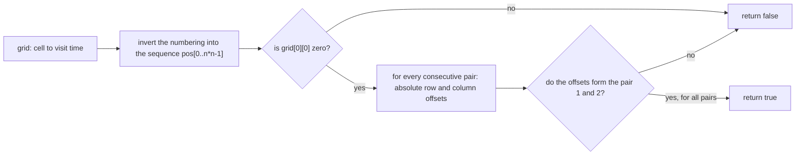

# Guided Example: Check Knight Tour Configuration

## 1. The grid stores visit times, not moves

Take the three-by-three configuration of official example 2, whose answer is `false`.

| Row \ Col | 0 | 1 | 2 |
|:---:|:---:|:---:|:---:|
| 0 | 0 | 3 | 6 |
| 1 | 5 | 8 | 1 |
| 2 | 2 | 7 | 4 |

Each entry is a time stamp: `grid[row][col]` is the step at which the knight stood on that cell, and the moves are 0-indexed. So the table above is not the knight's route in reading order; reading it left to right gives the sequence $(0,0) \to (0,1) \to (0,2) \to \dots$, which is a description of the board, not of the journey. The journey is recovered by inverting the numbering: the cell visited at time $t$ is wherever the value $t$ sits.

Because the constraints promise that the entries are distinct and lie in $[0, n^2-1]$, the numbering is a bijection from the $n^2$ cells onto the times $0, \dots, n^2-1$. Every time occurs exactly once, so the inverse map is total and well defined, and validity becomes a property of one concrete sequence of cells.

## 2. Inverting the numbering recovers the path

| Cell $(row, col)$ | (0,0) | (0,1) | (0,2) | (1,0) | (1,1) | (1,2) | (2,0) | (2,1) | (2,2) |
|:---:|:---:|:---:|:---:|:---:|:---:|:---:|:---:|:---:|:---:|
| Time stamp | 0 | 3 | 6 | 5 | 8 | 1 | 2 | 7 | 4 |

Reading the same data the other way round produces the knight's itinerary:

| Time $t$ | 0 | 1 | 2 | 3 | 4 | 5 | 6 | 7 | 8 |
|:---:|:---:|:---:|:---:|:---:|:---:|:---:|:---:|:---:|:---:|
| Cell `pos[t]` | (0,0) | (1,2) | (2,0) | (0,1) | (2,2) | (1,0) | (0,2) | (2,1) | (1,1) |

Two observations follow at once. Time 0 sits at the top-left cell, exactly as the contract demands. And the nine cells are all different, so if every consecutive pair of these positions is a legal knight move, the sequence is a genuine visit-every-cell-once route — a Hamiltonian path of the board's knight graph.

## 3. What counts as a knight move

A knight move changes the row by two and the column by one, or the row by one and the column by two, in either direction and with any signs. Signs are irrelevant to legality, so only the two absolute offsets matter, and they must form the unordered pair $\{1, 2\}$.

| Offset pair $(\lvert \Delta row\rvert, \lvert \Delta col\rvert)$ | (1, 2) | (2, 1) | (1, 1) | (1, 0) | (0, 1) | (2, 2) | (2, 0) | (3, 1) |
|:---:|:---:|:---:|:---:|:---:|:---:|:---:|:---:|:---:|
| Knight move? | yes | yes | no | no | no | no | no | no |
| Squared length of the offset vector | 5 | 5 | 2 | 1 | 1 | 8 | 4 | 10 |

The two legal shapes are mirror images of each other, and testing only one of them rejects half of all legal moves. The squared length 5 is a convenient equivalent signature for this particular problem, since the only integer vectors with $a^2 + b^2 = 5$ are the eight signed copies of $(1,2)$ and $(2,1)$.

## 4. Checking the path one transition at a time

Walk the itinerary and compare each cell with its predecessor.

| Step $t$ | `pos[t]` | `pos[t-1]` | $\lvert \Delta row\rvert$ | $\lvert \Delta col\rvert$ | Shape | Legal knight move? |
|:---:|:---:|:---:|:---:|:---:|:---:|:---:|
| 1 | (1,2) | (0,0) | 1 | 2 | 1 by 2 | yes |
| 2 | (2,0) | (1,2) | 1 | 2 | 1 by 2 | yes |
| 3 | (0,1) | (2,0) | 2 | 1 | 2 by 1 | yes |
| 4 | (2,2) | (0,1) | 2 | 1 | 2 by 1 | yes |
| 5 | (1,0) | (2,2) | 1 | 2 | 1 by 2 | yes |
| 6 | (0,2) | (1,0) | 1 | 2 | 1 by 2 | yes |
| 7 | (2,1) | (0,2) | 2 | 1 | 2 by 1 | yes |
| 8 | (1,1) | (2,1) | 1 | 0 | 1 by 0 | **no** |

The first seven transitions are impeccable, and the configuration still fails, because the eighth move slides one square down the column from (2,1) to (1,1). The answer is `false`, and the failing transition is the last one, which is precisely why a checker cannot sample transitions or give up after the first few successes: the verdict is a conjunction over all $n^2 - 1$ moves, and this instance hides its only defect in the final conjunct.

## 5. Invariant and correctness of the pairwise check

**Model.** Let $C$ be the $n^2$ cells and let $\tau(c)$ be the time stamp of cell $c$. The constraints make $\tau$ a bijection, so the inverse sequence `pos[0], pos[1], …, pos[n²−1]` lists every cell exactly once. A configuration is valid exactly when that sequence is a walk in the knight graph $K_n$ — the graph on $C$ whose edges join cells whose absolute offsets are $\{1,2\}$ — that begins at the top-left cell and covers every vertex. Valid configurations are therefore Hamiltonian paths starting at a fixed vertex.

**Invariant.** After examining transitions $1$ through $t$, the accumulated verdict is positive exactly when $\text{pos}[0]$ is the top-left cell, $\text{pos}[0], \dots, \text{pos}[t]$ are distinct, and each of those $t$ transitions is an edge of $K_n$. Because the numbering is a bijection, the distinctness part is inherited from the input and never has to be re-established; the only obligation is the edge test on each consecutive pair.

**Completeness.** Every transition is examined, so no illegal move can slip through; the instance above shows that a single unchecked transition is enough to turn `false` into `true`. **Soundness.** Each accepted transition is verified against the exact offset pair, so a chain of accepted transitions really is a legal knight walk, and since the walk visits $n^2$ distinct cells it visits all of them — no cell is skipped and none is visited twice. **The start condition is separate.** The transition test can only speak about differences of positions; it is blind to which absolute cell carries time 0. Only a direct check that the top-left entry is 0 enforces the requirement that the knight begins there, and a configuration whose numbering is a perfect knight path but shifted in time would otherwise pass while violating the contract.

## 6. Which rules survive this instance

| Candidate rule applied to the grid of section 1 | First transition rejected | Verdict |
|:---|:---:|:---|
| Offsets form the unordered pair $\{1, 2\}$ | none, so the grid is accepted as far as the moves go, and the answer is `false` on the final transition | correct |
| Offsets equal $(1, 2)$ in that fixed order | transition 3, which is a legitimate move | wrong: rejects half of all legal knight moves |
| Chebyshev distance 1, the king's step | none, so the invalid grid would be accepted | wrong: the (2,1) to (1,1) slide is a king move, not a knight move |
| Cells merely adjacent in the grid, sharing a side or corner | none | wrong: it would accept the broken final move |
| Squared offset length equal to 5 | none until transition 8 | equivalent on integer offsets, and it is the same test in disguise |
| Only the first and last cells of the itinerary | none | wrong: interior moves are the substance of the check |

## 7. Boundary instances

| Instance | $n$ | Feature | Answer |
|:---|:---:|:---|:---:|
| Official five-by-five tour | 5 | all 24 transitions are knight moves and time 0 is at (0,0) | `true` |
| Alternate five-by-five tour | 5 | tours are far from unique; validity is a property of the numbering, not of one pattern | `true` |
| Values in reading order `0 1 2` in the first row | 3 | the offset from (0,0) to (0,1) is (0,1), so it fails on move 1 | `false` |
| `[[1,0,2],[3,4,5],[6,7,8]]` | 3 | time 0 is not at the top-left cell, so the start condition alone decides | `false` |
| The grid of section 1 | 3 | distinct values in range, and yet the last move is illegal | `false` |
| Official seven-by-seven tour | 7 | the largest dimension, 48 transitions, and the tightest test of the bound | `true` |

A subtle point appears in the smallest case: with $n = 3$ the knight graph has eight edges and no Hamiltonian path starting at a corner at all, so every valid-looking three-by-three numbering must fail somewhere, and the useful skill is locating the failure rather than patching it.

## 8. Time and auxiliary space complexity

Let $n$ be the side length, so the board has $N = n^2$ cells and there are $N - 1$ transitions.

- **Building the inverse map** reads each of the $N$ entries once and writes one position per time: $O(N) = O(n^2)$.
- **Scanning the transitions** compares each consecutive pair exactly once, using constant work for the two absolute offsets: $O(N)$.
- **The total running time** is therefore $O(n^2)$, which is optimal in the comparison model because every entry of the grid can influence the answer; with $3 \le n \le 7$ this is at most 49 entries and 48 transitions.
- **Auxiliary space** is $O(n^2)$ for the inverse map, which is what allows each transition to be examined in constant time. A checker that repeatedly scanned the grid for the next time stamp instead would still use $O(1)$ extra space but would pay $O(n^4)$ time, a real regression at $n = 7$.