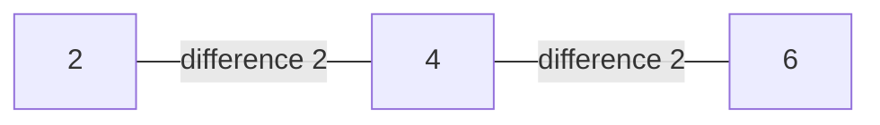

# Guided Example: The Number of Beautiful Subsets

## 1. The instance and the forbidden difference

Take `nums = [2,4,6]` with `k = 2`. A subset is beautiful when no two of its elements differ by exactly $k$; since the three values sit at indices 0, 1, 2, the subsets to count are the non-empty index choices. Writing a conflict edge between two values whose difference is exactly 2 gives the whole structure at a glance.

The conflict graph is a path $2 - 4 - 6$. Beautiful subsets are exactly the vertex subsets that contain no edge of this graph, that is, its independent sets: $\emptyset$, the three singletons, and $\{2, 6\}$. Excluding the empty subset leaves four, so the expected answer is 4.

Two properties of the graph drive every method below. A conflict requires a difference of **exactly** $k$, so $2$ and $6$ are compatible even though they straddle the conflicted middle value. And every conflict edge joins two values with the same remainder modulo $k$, because $a - b = k$ implies $a \equiv b \pmod{k}$; the conflict graph therefore splits into independent pieces, one per residue class, a fact used in section 6.

## 2. Subsets live on indices, not on values

A subset of `nums` is defined by which indices are deleted, so two subsets are different whenever the deleted index sets differ — even if the surviving values are equal. The guard that detects conflicts, however, must reason about values, because beauty is a property of the multiset of chosen values. The two views must be kept apart:

| View | Object | Used for |
|:---|:---|:---|
| Index view | which of the $n$ positions are included | deciding what is enumerated; two choices are distinct even when the values coincide |
| Value view | the multiset of values already chosen | deciding whether a new value is compatible |

For `nums = [1,1,1]` with `k = 1` this distinction is the whole problem: the three copies are three distinct choices, all $\binom{3}{1} + \binom{3}{2} + \binom{3}{3} = 7$ non-empty subsets are beautiful because equal values differ by 0, while a method that deduplicated values by identity would answer 1. For the chosen instance the values are distinct, so index subsets and value subsets coincide and the count can be read off the graph directly.

## 3. Enumerating with an include-or-exclude guard

Process the indices in order and, at each one, branch twice: leave the index out, or take it in when the chosen multiset contains neither `nums[i] - k` nor `nums[i] + k`. The chosen multiset is beautiful at every call, so the guard only has to compare the candidate against the two values that could possibly clash with it.

| Order | Chosen multiset | Index decided | Value | Verdict | Reason |
|:---:|:---:|:---:|:---:|:---|:---|
| 1 | $\emptyset$ | 0 | 2 | leave out | the exclude branch is always available |
| 2 | $\emptyset$ | 1 | 4 | leave out | exclude branch |
| 3 | $\emptyset$ | 2 | 6 | leave out | reaches a leaf holding $\emptyset$ |
| 4 | $\emptyset$ | 2 | 6 | take | `6 - 2 = 4` and `6 + 2 = 8` are both absent |
| 5 | $\emptyset$ | 1 | 4 | take | `4 - 2 = 2` and `4 + 2 = 6` are both absent |
| 6 | {4} | 2 | 6 | leave out | reaches a leaf holding {4} |
| 7 | {4} | 2 | 6 | **blocked** | `6 - 2 = 4` is already chosen |
| 8 | $\emptyset$ | 0 | 2 | take | `2 - 2 = 0` and `2 + 2 = 4` are both absent |
| 9 | {2} | 1 | 4 | leave out | exclude branch |
| 10 | {2} | 2 | 6 | leave out | reaches a leaf holding {2} |
| 11 | {2} | 2 | 6 | take | `6 - 2 = 4` is absent and `6 + 2 = 8` is absent |
| 12 | {2} | 1 | 4 | **blocked** | `4 - 2 = 2` is already chosen |

Two blocks appear, and both are rejected for the same reason: the value they would add is exactly $k$ away from a value already in hand. The blocks also prune everything beneath them, so the four subtrees that would have extended {4, 6} and {2, 4} are never explored at all.

## 4. The leaves of the recursion

The recursion terminates after deciding the last index, and each terminal call records one index subset.

| Leaf | Index subset | Surviving values | Beautiful? | Counted? |
|:---:|:---:|:---:|:---:|:---:|
| 1 | {} | — | yes, vacuously | no: the empty subset is not counted |
| 2 | {2} | 6 | yes | yes |
| 3 | {1} | 4 | yes | yes |
| 4 | {0} | 2 | yes | yes |
| 5 | {0, 2} | 2, 6 | yes, they differ by 4 | yes |

Five leaves are reached, all of them beautiful, and subtracting the empty one gives $5 - 1 = 4$, the required answer. The two blocked branches of section 3 removals correspond exactly to leaves 6 and 7 that would otherwise have existed; the enumeration is exhaustive before pruning, and sound after pruning.

## 5. Invariant and correctness

**Invariant.** At the start of every call, the chosen multiset is beautiful: no two of its values differ by exactly $k$. The invariant holds at the root, where the multiset is empty and the condition is vacuous.

**The guard preserves it.** A new value $v$ can violate the condition only by pairing with a chosen $u$ such that $\lvert u - v \rvert = k$, and that means $u = v - k$ or $u = v + k$ exactly. The guard asks precisely those two questions, so an accepted value is compatible with every chosen value and the invariant is restored. Rejecting the branch is safe because the multiply-counted case cannot arise: the guard tests membership of two specific values, and a pair differing by $k$ is caught on whichever side it appears.

**The enumeration is complete and sound.** Every index is decided once, on the exclude branch and then on the include branch, so the leaves are in bijection with all $2^n$ index subsets; the pruning removes exactly those that are not beautiful. To see that no beautiful subset is lost, take any non-beautiful subset $S$ and let $i$ be its smallest index that conflicts with an earlier element of $S$. Every earlier index of $S$ was accepted, because indices are decided in increasing order and none of them had an earlier conflict; at index $i$ the multiset already contains the partner value `nums[i] ± k`, so the include branch is blocked and $S$ is never completed. Conversely, every leaf that is reached survived every guard, so by the invariant its value multiset is beautiful. The leaves therefore count the beautiful subsets *including* the empty one, and the answer is that count minus one, because the problem asks for non-empty subsets only.

## 6. The residue-class structure and an exact counting alternative

Because a conflict forces equal remainders modulo $k$, the values can be grouped by `value mod k` and the groups never interact: only values inside one group can differ by exactly $k$. Inside a group, sort the distinct values; two distinct values conflict only when they are consecutive in that order *and* their gap is exactly $k$. Counting beautiful subsets of one group is then counting independent sets of a path of blocks, where a block holding $c$ equal copies offers `2^c - 1` non-empty ways to participate and each block may also be skipped. With $f$ denoting the running count, the recurrence is

$$f_i = f_{i-1} + (2^{c_i} - 1)\cdot \bigl(f_{i-2}\ \text{if the gap to the previous block is } k,\ \text{else}\ f_{i-1}\bigr),$$

and the total is the product over residue classes, minus one for the empty subset.

| Block $i$ | Value | Copies $c_i$ | Gap to previous | $f_{i-1}$ | $f_i$ |
|:---:|:---:|:---:|:---:|:---:|:---:|
| 1 | 2 | 1 | — | 1 | 2 |
| 2 | 4 | 1 | 2, equal to $k$ | 2 | 3 |
| 3 | 6 | 1 | 2, equal to $k$ | 3 | 5 |

One residue class, final value $f_3 = 5$, so the answer is $5 - 1 = 4$, agreeing with the enumeration. The same recurrence on `[1,1,2]` with `k = 1` gives $f_1 = 1 + 3\cdot 1 = 4$ for the block of two copies of 1, then $f_2 = 4 + 1\cdot f_0 = 5$, hence $4$; on `[1,3,5,2,4]` with `k = 2` the odd class is a three-block path with $5$ independent sets, the even class a two-block path with $3$, and $5 \cdot 3 - 1 = 14$. Both agree with the expected results.

| Method | Idea | Cost | Trade-off |
|:---|:---|:---|:---|
| Include/exclude recursion with a membership guard | branch on each index, reject a value whose $\pm k$ partner is chosen | $O(2^n)$ time, $O(n)$ auxiliary space | Direct and exact; the intended route for $n \le 18$, but exponential |
| Residue-class block recurrence | group by `value mod k`, count independent sets per chain, multiply | $O(n \log n)$ time, $O(n)$ space | Polynomial and exact; needs the structural observation of this section |
| Enumerate all $2^n$ bitmasks and test each subset | test every pair inside a mask | $O(2^n \cdot n)$ | Simple to write, but repeats work the guard prunes away |
| Deduplicate values before counting | treat equal values as one choice | — | Wrong: subsets are distinguished by index, so equal values are separate choices |

## 7. Traps and boundary instances

| Instance | Answer | What it teaches |
|:---|:---:|:---|
| `nums = [1]`, `k = 1` | 1 | The empty subset is beautiful too, so the final count must be reduced by one |
| `nums = [2,4,6]`, `k = 2` | 4 | A middle value can conflict with both neighbours; only the outer pair survives together |
| `nums = [1,1,1]`, `k = 1` | 7 | Equal values never conflict, since their difference is 0, and they are distinct index choices |
| `nums = [1,1,2]`, `k = 1` | 4 | A block of duplicates behaves as one value for conflicts but multiplies the count of choices |
| `nums = [1,2,3,4]`, `k = 1` | 7 | A four-block chain has 8 independent sets, so 7 non-empty beautiful subsets |
| `nums = [2,4,8,16,32]`, `k = 1000` | 31 | When $k$ exceeds every gap there is no conflict at all, and all $2^5 - 1$ subsets are beautiful |
| `nums = [1,3,5,2,4]`, `k = 2` | 14 | Two residue classes count independently and their totals multiply |

Three further traps deserve naming. First, the condition is a difference of exactly $k$, not "at most $k$" and not "a multiple of $k$": with $k = 2$ the pair 2 and 6 differs by 4 and is perfectly legal. Second, the guard must test both `v - k` and `v + k`; testing only one direction misses every conflict in which the larger value is chosen first, which is how the pair {4, 6} would slip in. Third, a value already chosen twice never conflicts with itself, so the guard must count occurrences rather than merely recording presence — with `k = 1` and two chosen copies of 1, the values `1 - 1 = 0` and `1 + 1 = 2` are absent and a third copy of 1 is still a legal addition.

## 8. Time and auxiliary space complexity

Let $n = \texttt{nums.length}$, with $1 \le n \le 18$ and $1 \le k \le 1000$.

- **Time.** Each index spawns an exclude branch and, when permitted, an include branch, so the recursion tree has at most $2^{n+1} - 1$ calls and each call performs constant work plus two membership lookups in a hash-based count. Pruning only removes branches, so the running time is $O(2^n)$ — at most $2^{18} = 262{,}144$ leaves at $n = 18$.
- **Auxiliary space.** The recursion depth is $n$, and the counter never holds more than $n$ distinct values, so the working space is $O(n)$; no table proportional to the value range is needed even though `nums[i]` can reach 1000.
- **The alternative.** The residue-class recurrence of section 6 sorts the values and runs one linear pass per class, giving $O(n \log n)$ time and $O(n)$ space. It is asymptotically far better but rests on the structural observation that conflicts only ever occur inside a residue class modulo $k$; the include/exclude recursion needs no such insight, which is why it remains the natural choice at this input size.