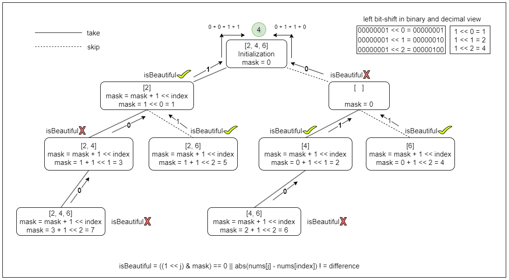

## Solution

---

### Overview

We are given an array of positive integers `nums` and a positive integer `k`; the task is to find the number of non-empty beautiful subsets of `nums`.

**Key Observations:**
1. A subset is defined as a set of elements taken from the original array `nums`.
2. If a subset contains two integers `a` and `b` such that $|a - b| = k$, then it's not beautiful.
3. We need to count the number of possible beautiful subsets of `nums`.

The solutions in this editorial utilize the following concepts:

- Recursion: [Recursion Explore Card](https://leetcode.com/explore/learn/card/recursion-ii/)
- Dynamic Programming: [Dynamic Programming](https://leetcode.com/explore/learn/card/dynamic-programming/)
- **XOR** and **OR** bitwise operations: [Bitwise Operator Explore Card](https://leetcode.com/explore/learn/card/bit-manipulation/669/bit-manipulation-concepts/4496/)

If you are not familiar with a topic, we recommend you read the corresponding linked explore card.

---

### Approach 1: Using Bitset

#### Intuition

The size of the `nums` array is very small ($\le 20$). This means that the number of possible subsets is also relatively small, as there are at most $2^{20}$ subsets. We can take advantage of this fact and use a bitset to represent the subsets.

A bitset is a compact way of representing a set of elements, where each bit corresponds to a single element. If the bit is set (1), it means the element is included in the set; otherwise, it is not included (0).

Example: nums = [1,2,3,4,5,6], subset: [1,3,4]

This subset includes the elements at indices 0, 2, and 3, so the corresponding mask is `001101`. The least significant bit corresponds to the element at index zero.

We traverse the elements of the array `nums`. For each element $\text{nums}[i]$, we check if including it in the current subset would make the subset ugly (i.e., if there exists a pair of elements with a difference of `k`). We can do this by checking all previously included elements in the bitset.

If the current element $\text{nums}[i]$ does not make the subset ugly, we include it in the bitset by setting the corresponding bit. Otherwise, we skip it and move to the next element.

The process is visualized below:



#### Algorithm

`beautifulSubsets` Method:
- Call `countBeautifulSubsets` with initial parameters `nums`, `k`, `0`, and `0` to calculate the number of beautiful subsets of an array `nums` with a given difference `k`.
- Return the result.

`countBeautifulSubsets` Method:
- It takes four parameters: `nums` (the array of integers), `difference` (`k`), `index` (the index of the current element being considered), and `mask` (an integer representing the current subset).
- Base case: When we process the last index of `nums` (i.e., the index equals the size of `nums`), if `mask` is greater than `0` (i.e., indicating a non-empty subset), then return `1`; otherwise, return `0`.
- Initialize a boolean variable `isBeautiful` to true.
- Iterate through the elements before the current index to check if the current number forms a beautiful pair with any previous number in the subset.
- Recursively calculate beautiful subsets including and excluding the current number.
  - `skip`: Call `countBeautifulSubsets` with the next index and the same `mask`.
  - `take`: If the current subset is beautiful, call `countBeautifulSubsets` with the next index and the updated `mask` (adding the current index to the `mask`); otherwise, set `take` to `0`.
- Return the sum of `skip` and `take`.

#### Implementation

```python
class Solution:
    def beautifulSubsets(self, nums, k):
        return self._count_beautiful_subsets(nums, k, 0, 0)

    def _count_beautiful_subsets(self, nums, difference, index, mask):
        # Base case: Return 1 if mask is greater than 0 (non-empty subset)
        if index == len(nums):
            return 1 if mask > 0 else 0

        # Flag to check if the current subset is beautiful
        is_beautiful = True

        # Check if the current number forms a beautiful pair with any
        # previous number in the subset
        for j in range(index):
            if ((1 << j) & mask) == 0 or abs(
                nums[j] - nums[index]
            ) != difference:
                continue
            else:
                is_beautiful = False
                break

        # Recursively calculate beautiful subsets including and excluding
        # the current number
        skip = self._count_beautiful_subsets(nums, difference, index + 1, mask)
        take = (
            self._count_beautiful_subsets(
                nums, difference, index + 1, mask + (1 << index)
            )
            if is_beautiful
            else 0
        )

        return skip + take
```

#### Complexity Analysis

Let $n$ be the size of the `nums` array.

* Time complexity: $O(n \cdot 2^n)$

    Each number in the input array `nums` can be either included or excluded in a subset, resulting in $2^n$ possible subsets.

    Work done within each recursive call: The function iterates over the previous elements in the current subset to check if any pair satisfies the difference constraint. In the worst case, when all elements are included in the subset, the iteration takes $O(n)$ time.

    Combining the number of recursive calls and the work done within each call, the overall time complexity will be $O(n \cdot 2^n)$.

* Space complexity: $O(n)$

    The space complexity is dominated by the recursive call stack, which can grow up to the depth of the input array `nums`. Hence, the space complexity is $O(n)$.

---

### Approach 2: Recursion with Backtracking

#### Intuition

To build subsets, we decide for each number in `nums` whether to include it in the subset or not. This creates two paths: one where we add the number to the subset and one where we don't.

For an array of size `n`, there can be up to $2^n$ subsets, as each element can either be included or excluded. At index `i`, we make two subsets: one with it and one without it. One of the subsets we create will be the empty subset, so we subtract 1 at the end to exclude it.

To ensure a "beautiful" subset, we need to check if neither $\text{nums}[i] + k$ nor $\text{nums}[i] - k$ has been used before. We can use a frequency map that will keep track of seen numbers. Before adding $\text{nums}[i]$, we check if neither $\text{nums}[i] + k$ nor $\text{nums}[i] - k$ is in the map. If both are absent, we add $\text{nums}[i]$ to the subset.

But what if we know that before the current index `i`, there were no larger elements in the array? Then we only need to check for the existence of $\text{nums}[i] - k$. We don't even need to check for $\text{nums}[i] + k$ because any element larger than $\text{nums}[i]$ would not have been processed yet due to the sorted order. Therefore, we sort the array before starting the recursion.

This way, we only need to check for $\text{nums}[i] - k$, leading to fewer operations.

#### Algorithm

`beautifulSubsets` Method:
- Initialize a `map` called `freqMap` to keep track of the frequency of elements.
- Sort the `nums` array.
- Call the `countBeautifulSubsets` method with parameters `nums`, `k`, `freqMap`, and `0`.
- Subtract `1` from the result and return it.

`countBeautifulSubsets` Method:
- It takes four parameters: `nums` (given array), `difference` (given as `k`), `freqMap` (a map to keep track of element frequencies), and `i` (the index of the current element being considered).
- Base case: If `i` is equal to the length of the array `nums`, return 1 (representing a subset of size 1).
- Recursively call `countBeautifulSubsets` with $i + 1$ to count subsets without including the current element.
- Check if it's possible to include the current element $\text{nums}[i]$ without violating the condition.
  - If $\text{nums}[i] - k$ is not present in `freqMap`, it means the difference condition is satisfied.
  - Mark $\text{nums}[i]$ as taken in `freqMap`.
  - Recursively call `countBeautifulSubsets` with $i + 1$ to count subsets including the current element.
  - Backtrack: Mark $\text{nums}[i]$ as not taken in `freqMap`.
  - Remove $\text{nums}[i]$ from `freqMap` if its count becomes 0.
- Return the total count of beautiful subsets.

#### Implementation

```python
class Solution:
    def beautifulSubsets(self, nums, k):
        # Frequency map to track elements
        freq_map = defaultdict(int)
        # Sort nums array
        nums.sort()
        return self._count_beautiful_subsets(nums, k, freq_map, 0) - 1

    def _count_beautiful_subsets(self, nums, difference, freq_map, i):
        # Base case: Return 1 for a subset of size 1
        if i == len(nums):
            return 1

        # Count subsets where nums[i] is not taken
        total_count = self._count_beautiful_subsets(
            nums, difference, freq_map, i + 1
        )

        # If nums[i] can be taken without violating the condition
        if nums[i] - difference not in freq_map:
            freq_map[nums[i]] += 1  # Mark nums[i] as taken

            # Recursively count subsets where nums[i] is taken
            total_count += self._count_beautiful_subsets(
                nums, difference, freq_map, i + 1
            )
            freq_map[nums[i]] -= 1  # Backtrack: mark nums[i] as not taken

            # Remove nums[i] from freq_map if its count becomes 0
            if freq_map[nums[i]] == 0:
                del freq_map[nums[i]]

        return total_count
```

#### Complexity Analysis

Let $n$ be the size of `nums` array.

- Time complexity: $O(2^n)$

     The time complexity of the solution is primarily determined by the number of subsets generated. Since the algorithm explores all possible subsets of the input array, the maximum number of subsets that can be generated from an array of size $n$ is $2^n$

    Additionally, sorting `nums` takes $O(n \log n)$ time.

    Therefore, the overall time complexity is $O(2^n)$, because it is dominated by the subset generation.

- Space complexity: $O(n)$

    Note that some extra space is used when we sort an array in place. The space complexity of the sorting algorithm depends on the programming language.
- In Python, the `sort` method sorts a list using the Tim Sort algorithm which is a combination of Merge Sort and Insertion Sort and has $O(n)$ additional space. Additionally, Tim Sort is designed to be a stable algorithm.
- In Java, `Arrays.sort()` is implemented using a variant of the Quick Sort algorithm which has a space complexity of $O( \log n)$ for sorting an array.
- In C++, the `sort()` function is implemented as a hybrid of Quick Sort, Heap Sort, and Insertion Sort, with a worse-case space complexity of $O( \log n)$.

    The recursion stack space and the frequency map each use $O(n)$ space. Thus, the total space complexity is $O(n)$.

---

### Approach 3: Optimised Recursion (Deriving Recurrence Relation)

#### Intuition

In the previous approach, we generated all possible subsets and checked each one to find the beautiful subsets. This lead to an exponential time complexity. However, we can optimize this approach by identifying certain cases where we can directly calculate the number of beautiful subsets without generating all subsets. What if there are no elements with a difference of `k` in the array?

Let's understand this with a few examples:

##### Direct Calculation of Beautiful Subsets:

**Example 1: No Elements with Difference k**
- Suppose `nums = [1, 3, 5, 7]` and $k = 1$. We observe that there are no pairs of elements in the array with a difference of `k` (i.e., 1). This means that every subset of this array is a beautiful subset. Therefore, we can directly return $2^n - 1$ (subtracting 1 for the empty subset) as the number of beautiful subsets, without checking every subset.

**Example 2: Handling Elements with Difference k**
- Now, consider `nums = [1, 2, 3, 4]` and $k = 2$. Here, we notice that the difference of 2 can be achieved by pairs like (4, 2) and (3, 1). This means that if we include both elements of such a pair in the same subset, it will not be a beautiful subset. To handle this, we can separate the array into groups, where each group contains elements that cannot form a pair with a difference of `k` with any element from another group.

##### Subsets Separation and Calculation:

In this example, we can separate the array into two groups: $s1 = [1, 3]$ and $s2 = [2, 4]$. We can calculate the number of beautiful subsets for $s_1$ and $s_2$ separately, denoted as $f(s_1)$ and $f(s_2)$, because the choices in $s_1$ are independent of $s_2$ and vice versa.

For final answer, we can multiply $f(s_1)$ and $f(s_2)$ because there is no pair $(x_1, x_2)$ such that $x_1 ∈ s_1$ , $x_2 ∈ s_2$ and $∣x_1 − x_2∣ = k$

##### Takeaway

The final answer would be $f(nums) = f(s_1) \times f(s_2) - 1$ (subtracting 1 for the empty subset).

In general, we can separate the given array into groups such that there is no pair `(x1, x2)` with `x1` and `x2` belonging to different groups and $|x1 - x2| = k$. We can create these groups based on the remainder when each element is divided by `k`. For instance, if `nums = [1, 2, 3, 4, 5, 6]` and $k = 2$, we can create the groups: $s1: [2, 4, 6]$ (where $\text{nums}[i] \% k = 0$) and $s2: [1, 3, 5]$ (where $\text{nums}[i] \% k = 1$).

Now consider `nums = [5, 5, 5, 7, 7, 11, 11]` and $k = 2$. We can't include `[5, 7]` in the same subset due to the restriction. We represent $s_1$ as `[5: 3, 7: 2, 11: 2]` (indicating the frequency of each value).

##### Developing the Recurrence Relation:

Now, let's derive the mathematical proof and recurrence relation for calculating the number of beautiful subsets.

Let `f(i)` be the number of beautiful subsets in $s_1$ starting from index `i`. We want to calculate `f(0)`.

When i = 0, the element is 5. There are two options: skip it or take it. There are $2^3$ ways we can include the three occurrences of `5` in subsets. $2^3 - 1 = 7$ of these take at least one 5, and one that skips 5.

$take_{5} = 7$, $skip_{5} = 1$

Now, the next element at i + 1 is 7 = 5 + 2 = 5 + k, so we can't take it if we took 5. Therefore, the number of ways of taking 5 will be $take_{5} \times f(i + 2)$.

The number of ways of skipping 5 will be $skip_{5} \times f(i + 1)$.

$take_{s[i]} = 2 ^ {frequency(s[i])} - 1$

$skip_{s[i]} = 1$

$f(i) = take_{s[i]} \times f(i + 2) + skip_{s[i]} \times f(i + 1)$

$f(0) = 7 \times f(2) + 1 \times f(1)$

When i = 1, the value is 7. There are two options: $take_{7} = $2^{2}$ - 1 = 3$ and $skip_{7} = 1$. The next element is 11 = 7 + 4 = 7 + 2k, so we can take it even if we took 7.

$f(i) = take_{s[i]} \times f(i + 1) + skip_{s[i]} \times f(i + 1)$

$f(1) = 3 \times f(2) + 1 \times f(2)$

When i = 2, the value is 11. There are two options: $take_{11} = $2^{2}$ - 1 = 3$ and $skip_{11} = 1$. There is not a next element. So, we will denote this as a base case $f(n) = 1$.

$f(i) = take_{s[i]} \times f(i + 1) + skip_{s[i]} \times f(i + 1)$

$f(2) = 3 \times f(3) + 1 \times f(3) = 3 \times 1 + 1 \times 1 = 4$

$f(1) = 3 \times f(2) + 1 \times f(2) = 3 \times 4 + 1 \times 4 = 16$

$f(0) = 7 \times f(2) + 1 \times f(1) = 7 \times 4 + 1 \times 16 = 44$

$answer = f(0) - 1 = 43$

The general recurrence relation for `f(i)` will be:

$f(i) = \text{skip}_{s[i]} \times f(i + 1) + \text{take}_{s[i]} \times \begin{cases} f(i + 2) \& \text{if } s[i + 1] - s[i] = k \\ f(i + 1) \& \text{otherwise} \end{cases}$

If we follow these steps, the final answer will be as listed below:
1. Split the array into different groups, denoted $s_i$, based on their remainder when divided by $k$.
2. Sort the groups and represent in {value:frequency} form.

$\text{answer} = \left(\prod_i f_{s_i}(0)\right) - 1$

This approach optimizes the naive approach by avoiding the generation of all subsets and directly calculating the number of beautiful subsets based on the properties of the array and the value of `k`.

#### Algorithm

`beautifulSubsets` Method:
- Initialize `totalCount` to 1.
- Initialize a `map` called `freqMap` to track the frequency of elements based on their remainder when divided by `k`.
- Calculate frequencies for each element in `nums` and update `freqMap`.
- Iterate over each remainder group in `freqMap`.
  - Convert the frequency map of each remainder group into an array of pairs (`subsets`) containing the element and its frequency.
  - Call the `countBeautifulSubsets` method with parameters `subsets`, `subsets.size()`, `k`, and `0`.
  - Multiply `totalCount` with the result of `countBeautifulSubsets` for each remainder group.
- Return $totalCount - 1$.

`countBeautifulSubsets` Method:
- It takes four parameters: `subsets` (the array of pairs containing element frequencies), `numSubsets` (the number of subsets), `difference` (the given difference), and `i` (the index of the current subset being considered).
- Base case: If `i` is equal to `numSubsets`, return 1 (representing a subset of size 1).
- Calculate subsets where the current subset is not taken by recursively calling `countBeautifulSubsets` with $i + 1$.
- Calculate subsets where the current subset is taken by multiplying $(1 << \text{subsets}[i].second) - 1$ (which represents all possible combinations of taking elements from the current subset).
- If the next number has a `difference`, calculate subsets recursively; otherwise, move to the next subset.
- Return the sum of subsets where the current subset is taken and not taken.

#### Implementation

```python
class Solution:
    def beautifulSubsets(self, nums: List[int], k: int) -> int:
        total_count = 1
        freq_map = defaultdict(lambda: defaultdict(int))

        # Calculate frequencies based on remainder
        for x in nums:
            freq_map[x % k][x] += 1

        # Calculate subsets for each remainder group
        for fr in freq_map.values():
            subsets = sorted(fr.items())
            total_count *= self._count_beautiful_subsets(
                subsets, len(subsets), k, 0
            )

        return total_count - 1  # Subtract 1 for the empty subset

    def _count_beautiful_subsets(self, subsets, num_subsets, difference, i):
        # Base case: Return 1 for a subset of size 1
        if i == num_subsets:
            return 1

        # Calculate subsets where the current subset is not taken
        skip = self._count_beautiful_subsets(
            subsets, num_subsets, difference, i + 1
        )

        # Calculate subsets where the current subset is taken
        take = (1 << subsets[i][1]) - 1

        # If next number has a 'difference', calculate subsets; otherwise, move to next
        if (
            i + 1 < num_subsets
            and subsets[i + 1][0] - subsets[i][0] == difference
        ):
            take *= self._count_beautiful_subsets(
                subsets, num_subsets, difference, i + 2
            )
        else:
            take *= self._count_beautiful_subsets(
                subsets, num_subsets, difference, i + 1
            )

        return skip + take  # Return total count of subsets
```

#### Complexity Analysis

Let $n$ be the size of the nums array.

- Time complexity: $O(n \log n + 2^n) = O(2^n)$

    Since the map is sorted and implemented using a Self-Balancing Binary Search Tree (BST), the insert operation is $O(\log n)$. Thus, constructing the map takes $O(n \log n)$. With a maximum of $k$ different remainders, there can be up to $k$ subset splits. In the worst-case scenario, where all numbers have the same remainder, and none are repeated (frequency = 1), this approach still results in a time complexity of $O(2^n)$.

   > In Python3 we use a `defaultdict`. Inserting a key-value pair into a dictionary takes $O(1)$ on average, resulting in a construction time of $O(n)$. Still, the overall time complexity remains $O(2^n)$.

- Space complexity: $O(n)$

    The frequency map stores the count of elements based on their remainders when divided by `k`. In the worst case, this requires $O(n)$ space, as it needs to store counts for each element.

    The depth of the recursive call stack can grow up to the number of unique elements in the subset list, which is at most $n$. Thus, the space used by the call stack is $O(n)$.

    For the `counts` array, which is used for memoization, its size is equal to the number of unique elements in each subset list, which again can be up to $n$. This results in $O(n)$ space complexity for the `counts` array.

    The `subsets` list, derived from the frequency map, stores pairs of element values and their counts. In the worst case, there could be $n$ such pairs, resulting in a space complexity of $O(n)$.

    So, overall, the space complexity is $O(n)$.

---

### Approach 4: Dynamic Programming - Memoization

#### Intuition

In the previous approach we developed the recurrence relation for calculating the number of beautiful subsets.

The function `f(i)` calculates the number of beautiful subsets in the array `s` starting from index `i`. Now, instead of recomputing `f(i)` for the same index multiple times during recursion, we can memoize the function `f(i)` in a data structure, such as an array.

> Memoization is a technique used to optimize recursive solutions by storing the results of expensive function calls and reusing them instead of recomputing them every time.

So whenever we need to compute `f(i)`, we first check if the result is already stored in the memoized array. If it is, we return the stored result; otherwise, we compute `f(i)`, store the result in the memoized array, and return the computed value.

By memoizing `f(i)`, we avoid redundant calculations and improve the overall time complexity of the solution.

#### Algorithm

`beautifulSubsets` Method:
- Initialize `totalCount` to 1.
- Initialize a `map` called `freqMap` to track the frequency of elements based on their remainder when divided by `k`.
- Calculate frequencies for each element in `nums` and update `freqMap`.
- Iterate over each remainder group in `freqMap`.
  - Convert the frequency map of each remainder group into an array of pairs (`subsets`) containing the element and its frequency.
  - Initialize an array called `counts` with size equal to the number of distinct elements in the current remainder group, filled with `-1` for memoization purposes.
  - Call the `countBeautifulSubsets` method with parameters `subsets`, `subsets.size()`, `k`, `0`, and `counts`.
  - Multipy `totalCount` with the result of `countBeautifulSubsets` for each remainder group.
- Return $totalCount - 1$.

`countBeautifulSubsets` Method:
- It takes five parameters: `subsets` (the array of pairs containing element frequencies), `numSubsets` (the number of subsets), `difference` (the given difference), `i` (the index of the current subset being considered), and `counts` (an array to store counts of subsets for memoization).
- Base case: If `i` is equal to `numSubsets`, return 1 (representing a subset of size 1).
- If the count for the current subset has already been calculated (stored in $\text{counts}[i]$), return it.
- Calculate subsets where the current subset is not taken by recursively calling `countBeautifulSubsets` with $i + 1$.
- Calculate subsets where the current subset is taken by multiplying $(1 << \text{subsets}[i].second) - 1$ (which represents all possible combinations of taking elements from the current subset).
- If the next number has a difference of 'difference', calculate subsets accordingly by recursively calling `countBeautifulSubsets`; otherwise, move to the next subset.
- Store the calculated count in $\text{counts}[i]$ for memoization.
- Return the sum of subsets where the current subset is taken and not taken.

#### Implementation

```python
class Solution:
    def beautifulSubsets(self, nums: List[int], k) -> int:
        total_count = 1
        freq_map = defaultdict(lambda: defaultdict(int))

        # Calculate frequencies based on remainder
        for x in nums:
            freq_map[x % k][x] += 1

        # Calculate subsets for each remainder group
        for fr in freq_map.values():
            s = sorted(fr.items())
            counts = [-1] * len(s)  # Store counts of subsets for memoization
            total_count *= self._count_beautiful_subsets(s, k, 0, counts)

        return total_count - 1  # Subtract 1 for the empty subset

    def _count_beautiful_subsets(
        self,
        subsets: List[List[int]],
        difference: int,
        i: int,
        counts: List[int],
    ) -> int:
        # Base case: Return 1 for a subset of size 1
        if i == len(subsets):
            return 1

        # If the count is already calculated, return it
        if counts[i] != -1:
            return counts[i]

        # Calculate subsets where the current subset is not taken
        skip = self._count_beautiful_subsets(subsets, difference, i + 1, counts)

        # Calculate subsets where the current subset is taken
        take = (1 << subsets[i][1]) - 1

        # If the next number has a difference of 'difference',
        # calculate subsets accordingly
        if (
            i + 1 < len(subsets)
            and subsets[i + 1][0] - subsets[i][0] == difference
        ):
            take *= self._count_beautiful_subsets(
                subsets, difference, i + 2, counts
            )
        else:
            take *= self._count_beautiful_subsets(
                subsets, difference, i + 1, counts
            )

        counts[i] = skip + take  # Store and return total count of subsets
        return counts[i]
```

#### Complexity Analysis

Let $n$ be the size of the nums array.

- Time complexity: $O(n \log n + n) = O(n \log n)$

    We first group the numbers by their remainder modulo $k$, which takes $O(n)$ time. For each group, we sort its unique numbers, which takes $O(g \log g)$ per group, where $g$ is the number of unique elements in that group. Across all $k$ remainder groups, this totals to $O(n \log n)$ since the sum of all group sizes is at most $n$.

    Then, for each group, we use memoized recursion to count all valid subsets. Each group of size $g$ contributes at most $O(g)$ recursive calls thanks to memoization (each index visited once). Across all groups, this step is bounded by $O(n)$.

    Thus, the total time complexity is: $O(n + n \log n + n) = O(n \log n)$

    > In Python3, `defaultdict` provides average-case $O(1)$ insertion time, so grouping the numbers by their remainder is $O(n)$, not $O(n \log n)$ as would be the case in a language using a self-balancing BST (e.g., `TreeMap` in Java or `map` in C++).

- Space complexity: $O(n)$

    The frequency map stores the count of elements based on their remainders when divided by `k`. In the worst case, this requires $O(n)$ space, as it needs to store counts for each element.

    The depth of the recursive call stack can grow up to the number of unique elements in the subset list, which is at most $n$. Thus, the space used by the call stack is $O(n)$.

    For the `counts` array, which is used for memoization, its size is equal to the number of unique elements in each subset list, which again can be up to $n$. This results in $O(n)$ space complexity for the `counts` array.

    The `subsets` list, derived from the frequency map, stores pairs of element values and their counts. In the worst case, there could be $n$ such pairs, resulting in a space complexity of $O(n)$.

    So, overall, the space complexity is $O(n)$.

---

### Approach 5: Dynamic Programming - Iterative

#### Intuition

We can reduce the overhead needed to solve the problem by changing the recursive approach to an iterative one using Dynamic Programming (DP). Instead of making recursive calls, which require space on the call stack, we can use an array to store the values of `f(i)` for different indices `i`.

To calculate `f(i)`, we need to know the values of $f(i + 1)$ and $f(i + 2)$. This is because when we include the element at index `i` in the subset, we need to check if the next element $nums[i + 1]$ satisfies the condition $|nums[i + 1] - \text{nums}[i]| \neq k$. If it does, we can include it in the subset, and the number of beautiful subsets starting from $i + 1$ is $f(i + 1)$. Otherwise, we need to skip $nums[i + 1]$ and consider the number of beautiful subsets starting from $i + 2$, which is $f(i + 2)$.

Since we need to know the values of $f(i + 1)$ and $f(i + 2)$ to compute `f(i)`, we need to fill the DP array from right to left, starting from the end of the array.

#### Algorithm

- Initialize `totalCount` to 1.
- Initialize a `map` called `freqMap` to track the frequency of elements based on their remainder when divided by `k`.
- Calculate frequencies for each element in `nums` and update `freqMap`.
- Iterate over each remainder group in `freqMap`.
  - Calculate the number of elements `n` in the current group.
  - Convert the frequency map of each remainder group into an array of pairs (`subsets`) containing the element and its frequency.
  - Initialize an array called `counts` with size $n + 1$ to store counts of subsets.
  - Initialize $\text{counts}[n]$ to 1, representing the count of the last subset.
  - Iterate from the second-to-last subset to the first one.
- Calculate subsets where the current subset is not taken (`skip`) by using the count of the next subset ($counts[i + 1]$).
- Calculate subsets where the current subset is taken (`take`) by multiplying $(1 << \text{subsets}[i].second) - 1$ (representing all possible combinations of taking elements from the current subset) and the count of the next subset ($counts[i + 1]$ or $count[i + 2]$ depending on the difference condition).
- Store the total count for the current subset in $\text{counts}[i]$.
  - Multiply `totalCount` with the count of the first subset (stored in $\text{counts}[0]$).
- Return $totalCount - 1$.

The algorithm is visualized below:

!?!../Documents/2597/approach5.json:960,333!?!

#### Implementation

```python
class Solution:
    def beautifulSubsets(self, nums: List[int], k: int) -> int:
        total_count = 1

        freq_map = defaultdict(dict)

        # Calculate frequencies based on remainder
        for num in nums:
            remainder = num % k
            freq_map[remainder][num] = freq_map[remainder].get(num, 0) + 1

        # Iterate through each remainder group
        for fr in freq_map.values():
            n = len(fr)  # Number of elements in the current group

            subsets = sorted(fr.items())
            counts = [0] * (n + 1)  # Array to store counts of subsets
            counts[n] = 1  # Initialize count for the last subset

            # Calculate counts for each subset starting from the second last
            for i in range(n - 1, -1, -1):

                # Count of subsets skipping the current subset
                skip = counts[i + 1]
                # Count of subsets including the current subset
                take = 2 ** subsets[i][1] - 1

                # If next number has a 'difference',
                # calculate subsets; otherwise, move to next
                if i + 1 < n and subsets[i + 1][0] - subsets[i][0] == k:
                    take *= counts[i + 2]
                else:
                    take *= counts[i + 1]

                # Store the total count for the current subset
                counts[i] = skip + take

            total_count *= counts[0]

        return total_count - 1
```

#### Complexity Analysis

Let $n$ be the size of the nums arrays.

- Time complexity: $O(n \log n)$

    Since the map is sorted and implemented using a Self-Balancing Binary Search Tree (BST), the insert operation is $O(\log n)$. Thus, constructing the map takes $O(n \log n)$.

    Then, iterating through each remainder group and its associated numbers involves nested loops. In the worst-case scenario, each remainder group contains $n/k$ elements. The time complexity of iterating through each remainder group is $O(k \cdot (n/k) \log (n/k))$. The number of groups is limited to $n$, and so is the group size. Therefore, we can we can simplify this to $O(n \log n)$.

- Space complexity: $O(n)$

    The frequency map stores a remainder group for each unique remainder. Each remainder group stores an entry for each unique element in the group. In the worst case, when each element in `nums` is unique, $n$ elements will be stored across all of the remainder groups.

    For the `counts` array, which is used for memoization, its size is equal to the number of unique elements in each subset list, which again can be up to $n$. This results in $O(n)$ space complexity for the `counts` array.

    The `subsets` list, derived from the frequency map, stores pairs of element values and their counts. In the worst case, there could be $n$ such pairs, resulting in a space complexity of $O(n)$.

    Therefore, the total space complexity is $O(n)$.

---

### Approach 6: Dynamic Programming - Optimized Iterative

#### Intuition

In the previous iterative DP approach, we calculated the DP array in the reverse direction (right to left) of the array `s`. This was necessary because we needed to know the values of $f(i + 1)$ and $f(i + 2)$ to compute `f(i)`. However, the above approach required us to convert the sorted map (which represents the frequency of each element in the array) into an array (named `subsets`) first.

This conversion step can be avoided if we traverse the array(`s`) from left to right instead of right to left.

By traversing from left to right, we can directly use the sorted map and update the values of `f(i)` accordingly. This approach eliminates the need for the conversion step, thereby optimizing the time complexity.

We can also optimize space usage by observing that to calculate `f(i)`, we only need $f(i + 1)$ and $f(i + 2)$. Storing $f(i + 3)$ onwards is unnecessary, as those values are not required for further calculations.

Instead of using an array to store all the values of `f(i)`, we will use three variables `curr`, `prev1`, and `prev2` to store the values of `f(i)`, $f(i + 1)$, and $f(i + 2)$, respectively. We can update these variables in each iteration, effectively reusing the same space instead of allocating new space for each index.

The core idea is that, when we traverse from left to right, we can keep track of the elements we have processed so far. For each new element, we can check if it satisfies the condition $|\text{nums}[i] - \text{nums}[j]| \neq k$ for all previously processed elements `j`. If the condition is satisfied, we can include the current element in the subset and update the value of `f(i)` accordingly.

#### Algorithm

- Initialize `totalCount` to 1.
- Initialize a `map` called `freqMap` to track the frequency of elements based on their remainder when divided by `k`.
- Calculate frequencies for each element in `nums` and update `freqMap`.
- Iterate over each remainder group in `freqMap`.
  - Initialize variables `prevNum`, `prev1`, and `prev2`.
  - Iterate through each number in the current remainder group.
- Calculate subsets where the current number is not taken (`skip`) by using the count of the previous number (`prev1`).
- Calculate subsets where the current number is taken (`take`) by multiplying $(1 << freq) - 1$ (representing all possible combinations of taking elements with the current frequency) and the count of the previous number (`prev1` or `prev2` depending on whether the current number and the previous number form a beautiful pair).
- Store the total count for the current number in `curr`.
- Update `prev2` with the value of `prev1`, `prev1` with the value of `curr`, and `prevNum` with the current number.
  - Multiply `totalCount` with the count of the last calculated number (stored in `curr`).
- Return $totalCount - 1$.

#### Implementation

```python
class Solution:
    def beautifulSubsets(self, nums: List[int], k: int) -> int:
        total_count = 1
        freq_map = defaultdict(dict)

        # Calculate frequencies based on remainder
        for num in nums:
            freq_map[num % k][num] = freq_map[num % k].get(num, 0) + 1

        # Iterate through each remainder group
        for fr in freq_map.values():
            prev_num, curr, prev1, prev2 = -k, 1, 1, 0

            # Iterate through each number in the current remainder group
            for num, freq in sorted(fr.items()):
                # Count of subsets skipping the current number
                skip = prev1

                # Count of subsets including the current number
                # Check if the current number and the previous number
                # form a beautiful pair
                if num - prev_num == k:
                    take = ((1 << freq) - 1) * prev2
                else:
                    take = ((1 << freq) - 1) * prev1

                # Store the total count for the current number
                curr = skip + take
                prev2, prev1 = prev1, curr
                prev_num = num
            total_count *= curr
        return total_count - 1
```

#### Complexity Analysis

Let $n$ be the size of the nums array.

- Time complexity: $O(n \log n)$

    The time complexity of this approach primarily arises from the operations on the map data structure. Since up to $n$ values are added to the frequency map, the sorting operation on the frequency map takes $O(n \log n)$ time.

    Then, iterating through each remainder group and its associated numbers involves nested loops. In the worst-case scenario, each remainder group contains $n/k$ elements, where $n/k$ is a positive integer. The time complexity of iterating through each remainder group is $O(k \cdot (n/k) \log (n/k))$, which we can simplify to $O(n \log n)$.

    > The $(\log n)$ term arises from the usage of the map data structure in the code. map/TreeMap is implemented as a self-balancing binary search tree (such as Red-Black Tree) in C++/Java, which provides logarithmic time complexity for operations such as insertion, deletion, and retrieval.

- Space complexity: $O(n)$

    The frequency map stores a remainder group for each unique remainder. Each remainder group stores an entry for each unique element in the group. In the worst case, when each element in `nums` is unique, $n$ elements will be stored across all of the remainder groups. Therefore, the total space complexity is $O(n)$.

---