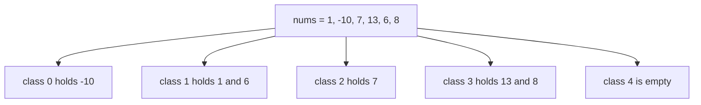

# Guided Example: Smallest Missing Non-negative Integer After Operations

## 1. What the operation can and cannot change

Take `nums = [1,-10,7,13,6,8]` with `value = 5`. One operation adds or subtracts 5 from a single element, and it may be applied any number of times to any element. Every element therefore moves along the arithmetic progression of its own residue class: an element equal to $x$ can become any integer $y$ with $y \equiv x \pmod{\text{value}}$, and it can never become anything else, because adding or subtracting `value` repeatedly changes the element by a multiple of `value`.

| Residue class $r$ | 0 | 1 | 2 | 3 | 4 |
|:---:|:---:|:---:|:---:|:---:|:---:|
| Elements of `nums` in the class | -10 | 1, 6 | 7 | 13, 8 | none |
| Supply $c_r$ | 1 | 2 | 1 | 2 | 0 |
| Non-negative numbers the class can produce | 0, 5, 10, … | 1, 6, 11, … | 2, 7, 12, … | 3, 8, 13, … | 4, 9, 14, … |

The classes are sealed off from each other, and they are the true resource of the problem: a target number $i$ can only be produced by an element whose class is `i mod value`, and each element can be turned into exactly one final number.

## 2. What a MEX of $m$ demands

A MEX of at least $m$ means that every number $0, 1, \dots, m-1$ is present in the final array. Producing those $m$ numbers consumes exactly one element per number, and each consumed element must come from the class of its target. So the demand is per class:

$$D_r(m) = \bigl\lvert \{\, i : 0 \le i < m \ \text{and}\ i \equiv r \pmod{\text{value}} \,\} \bigr\rvert = \max\Bigl(0,\ \Bigl\lfloor \tfrac{m - 1 - r}{\text{value}} \Bigr\rfloor + 1\Bigr).$$

Since the classes cannot borrow from one another, $m$ is attainable exactly when $D_r(m) \le c_r$ for every class $r$. Extra elements are harmless: an unused element can be parked on any number in its own class, so surplus never lowers a MEX. That is why the answer is limited by scarcity, never by abundance.

## 3. Spending the classes from zero upward

The numbers $0, 1, 2, \dots$ visit the classes in a fixed rotation $0, 1, \dots, \text{value}-1, 0, 1, \dots$. Walk that rotation, spending one element of the addressed class per target, and stop at the first target whose class has run dry.

| Target $i$ | Class `i mod 5` | Supply before | Available? | Assignment chosen | Supply after | Numbers secured |
|:---:|:---:|:---:|:---:|:---|:---:|:---|
| 0 | 0 | 1 | yes | `-10` becomes 0 by adding `value` twice | 0 | {0} |
| 1 | 1 | 2 | yes | `1` is already 1 | 1 | {0, 1} |
| 2 | 2 | 1 | yes | `7` becomes 2 by subtracting `value` once | 0 | {0, 1, 2} |
| 3 | 3 | 2 | yes | `13` becomes 3 by subtracting `value` twice | 1 | {0, 1, 2, 3} |
| 4 | 4 | 0 | **no** | nothing can produce 4 | 0 | — |

The walk stops at $i = 4$ and the answer is 4. Reaching the target array is exactly the assignment the official explanation describes: after the four moves the array is `[1,0,2,3,6,8]` — the remaining elements 6 and 8 stay in their own classes and never interfere — and its smallest missing non-negative integer is 4.

Notice that the walk automatically respects the operation limits. Every element of a class can reach every non-negative number of that class, so no target inside the spent range is blocked by distance: the value `-10` reaches 0 by adding 5 twice, and `13` reaches 3 by subtracting 5 twice.

## 4. The same array under a different modulus

Change only `value`, from 5 to 7, and the classes are re-cut, so the answer changes on identical input.

| Class $r$ modulo 7 | 0 | 1 | 2 | 3 | 4 | 5 | 6 |
|:---:|:---:|:---:|:---:|:---:|:---:|:---:|:---:|
| Elements | 7 | 1, 8 | none | none | -10 | none | 13, 6 |
| Supply $c_r$ | 1 | 2 | 0 | 0 | 1 | 0 | 2 |
| Reach $r + c_r \cdot \text{value}$ | 7 | 15 | 2 | 3 | 11 | 5 | 20 |

Classes 2, 3 and 5 are empty, so the numbers 2, 3 and 5 can never appear in the array; the smallest such number is 2, and the walk confirms it: target 0 is served by `7`, target 1 by `1`, and target 2 fails immediately. The answer is 2, as the official second example requires.

## 5. Invariant and correctness

**Invariant of the operation.** After any number of operations, every element satisfies $x \equiv x_0 \pmod{\text{value}}$ for its original value $x_0$. Each operation changes one element by $\pm \text{value}$, a multiple of `value`, and the residue modulo `value` is unchanged by multiples of `value`. The converse also holds: for any $y \ge 0$ with $y \equiv x_0 \pmod{\text{value}}$, the difference $y - x_0$ is a multiple of `value`, so $y$ is reached by adding that multiple (subtracting, when the multiple is negative) and the operation count is never a constraint.

**Invariant of the walk.** After the walk has handled targets $0, \dots, i$, the remaining supply of class $r$ is $c_r - D_r(i+1)$, and it is non-negative throughout. Each target charges exactly one element of its own class, which is why the walk's per-class spending is precisely the demand of section 2.

**Upper bound.** Suppose the walk stops at target $i$ because class $r = i \bmod \text{value}$ has no supply left. Class $r$ began with $c_r$ elements, and the targets with residue $r$ below $i$ number exactly $c_r$, so every element of the class is already committed to a smaller target. Any final array with MEX at least $i + 1$ would have to contain $i$ itself, whose class is $r$, and that would need a $(c_r + 1)$-th element of class $r$ — one that does not exist, because an element of another class can never change its residue. Hence no arrangement reaches MEX $i+1$, and the answer is at most $i$.

**Achievability.** Assign each class's elements in increasing order to its own targets $r, r + \text{value}, \dots$ below $i$, which is legal by the converse invariant, and park every surplus element anywhere in its own class. Then every number $0, \dots, i-1$ is present. The number $i$ is absent for two reasons at once: all $c_r$ elements of class $r$ are consumed by targets below $i$, so no element of class $r$ remains, and no element of any other class can ever take a value congruent to $r$ modulo `value`. The MEX is therefore exactly $i$, so the walk's stopping point is both attainable and maximal.

**A closed form for the same answer.** The counting condition $D_r(m) \le c_r$ is tight at $m = r + c_r \cdot \text{value}$, where the numbers $r, r + \text{value}, \dots, r + (c_r - 1)\cdot \text{value}$ number exactly $c_r$. The largest feasible $m$ is thus

$$m^{*} = \min_{0 \le r < \text{value}} \bigl(r + c_r \cdot \text{value}\bigr),$$

and an empty class contributes $r$ alone, which is exactly the "you can never produce $r$" obstruction. For the sample with `value = 5` the values are $5, 11, 7, 13, 4$, whose minimum is 4; for `value = 7` they are $7, 15, 2, 3, 11, 5, 20$, whose minimum is 2. Both agree with the walk.

## 6. Traps the instance exposes

| Trap | Instance | Consequence |
|:---|:---|:---|
| Assuming an element can be moved into any class | `nums = [1,6,11]`, `value = 5` | The answer is 0, because class 0 is empty and nothing can ever become 0 |
| Using a sign-preserving remainder | `-1` with `value = 2` | In languages where `-1 % 2` is `-1`, the class index is negative; residues must be normalized into $[0, \text{value})$ |
| Believing duplicates in a class are useless | `[3,0,3,2,4,2,1,1,0,4]`, `value = 5` | Repeated elements cover $0, 5, 10, \dots$ in turn; two complete rotations give the answer 10 |
| Assuming the answer equals the array length | `[1,6,11]`, `value = 5` | Three elements yield 0 when the first class is missing |
| Believing elements must stay non-negative | any negative element | Subtracting without limit is allowed; only the presence of $0, 1, 2, \dots$ matters, and elements may be driven far below zero |
| Searching for a MEX beyond $n$ | any input | Covering $0, \dots, m-1$ needs $m$ distinct elements, so $m \le n$ and a walk of $n+1$ targets always terminates |

| Instance | Answer | What it teaches |
|:---|:---:|:---|
| `[0,1,2]`, `value = 4` | 3 | Classes 0, 1, 2 each supply one number; class 3 is empty and caps the answer at 3 |
| `[-1,-2,-3]`, `value = 2` | 2 | Negative inputs normalize into classes; class 0 has one element, which is consumed by the target 0 |
| `[-1000000000,7,19,1000000000]`, `value = 1` | 4 | With `value = 1` every element shares class 0, so all $n$ elements can serve $0, \dots, n-1$ |
| `[1,6,11]`, `value = 5` | 0 | A missing class 0 makes the answer 0 regardless of how many elements exist |
| `[0,3,6,1,4,2]`, `value = 3` | 5 | Uneven supply: class 2 holds one element, so the rotation starves at target 5 |
| The sample with `value = 5` | 4 | The walk stops at the first empty class in rotation order |
| The sample with `value = 7` | 2 | The modulus decides which classes exist, so the answer changes on identical input |

## 7. Time and auxiliary space complexity

Let $n = \texttt{nums.length}$ and let `value` be the modulus, with $1 \le n, \text{value} \le 10^{5}$.

- **Census.** One pass over `nums` computes `x mod value` for every element and increments a counter: $O(n)$ time with a hash map, or $O(n)$ with an array of `value` slots.
- **Walk.** The targets are visited in increasing order and each visit either spends one unit of supply or stops the search, so there are at most $n + 1$ visits: $O(n)$ time. The total running time is $O(n)$, and it does not depend on the magnitude of the elements, which may reach $10^{9}$ in absolute value.
- **Auxiliary space.** The census costs $O(\min(n, \text{value}))$ entries, since at most $n$ classes can be occupied; the walk itself keeps one running index. No rearrangement of `nums` is needed, so the input is untouched.
- **The closed form.** Evaluating $m^{*} = \min_r (r + c_r \cdot \text{value})$ requires touching each of the `value` classes, so it is $O(\text{value})$ after the census — the same order under the constraints, and a useful independent check on the walk.
