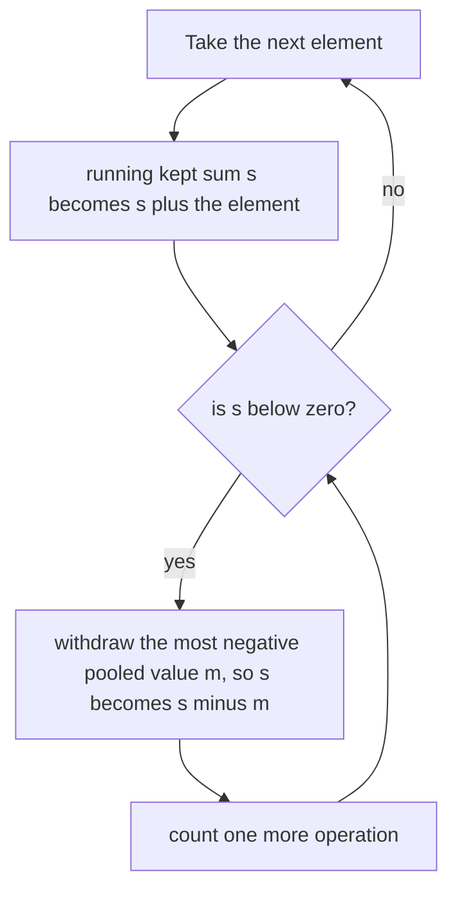

# Guided Example: Make the Prefix Sum Non-negative

## 1. The instance and the deficits it contains

This lesson follows one instance from beginning to end:

$$\texttt{nums} = [\,8,\ -7,\ -5,\ -2,\ 10\,]$$

The only permitted operation lifts a single element out of the array and appends
it at the very end. Every other element keeps its relative order. The target is an
array whose prefix sums are all non-negative, reached with as few lifts as
possible.

Let $P_i = \sum_{j=0}^{i} \texttt{nums}[j]$, the prefix sum of the untouched
array.

| index $i$ | 0 | 1 | 2 | 3 | 4 |
|---|---|---|---|---|---|
| `nums[i]` | `8` | `-7` | `-5` | `-2` | `10` |
| original prefix $P_i$ | `8` | `1` | `-4` | `-6` | `4` |
| prefix is non-negative? | yes | yes | **no** | **no** | yes |

Two prefixes are negative, so zero lifts cannot work, and the instance needs at
least one operation. The real question is which value must leave its position:
the element sitting at the first violated index is `-5`, but the element that
repairs the most ground is `-7`. Getting that choice right is the whole lesson.

Notice also that the total $P_4 = 4 \ge 0$. That matters: the full array's prefix
sum is $P_4$ whatever we move, because lifting elements never changes the total.
A negative total would make the requirement unsatisfiable, and the problem
guarantees the test inputs avoid that case.

## 2. Deferring a value: the constraint the final array must satisfy

Lifting an element is best understood as **deferring** it: the value leaves the
interior of the array and reappears after everything else. Split the original
array into

- $R$, the elements that stay, in their original relative order, and
- $D$, the multiset of deferred values, which will occupy the tail of the final
  array.

Write $v_d$ for the value of a deferred element $d$ and $\mathrm{pos}(d)$ for its
original index. Consider a kept position $i$, that is, an index whose element
belongs to $R$. Every deferred element originally at or before $i$ is no longer
inside the window $[0, i]$, while every deferred element originally after $i$ was
never inside it. Hence the prefix sum that the final array shows at this position
is

$$P_i \;-\; \sum_{d \in D,\ \mathrm{pos}(d) \le i} v_d \;\ge\; 0 .$$

That single inequality is the whole problem. Read it carefully:

1. A deferred **negative** value contributes a positive amount $\lvert v_d \rvert$
   to the window, so it repairs a deficit.
2. A deferred **non-negative** value *subtracts* from the window and damages a
   deficit; deferring such a value can never do useful work, because the only
   positions that need help are the ones where the window sum is too small.
3. Only deferred elements at or before a violated position count. A large
   negative value that appears too late cannot repair an early deficit, while a
   large negative value that appears early repairs *every* later deficit at once.

So the task becomes: choose a minimum-size set $D$ of negative values such that
the inequality holds at every kept position.

The tail itself never needs separate care. Every deferred value is negative, and
a partial sum of negative values is never smaller than their total sum, so a tail
prefix evaluates to

$$\underbrace{\textstyle\sum_{r \in R} r}_{\ge\, 0} \;+\; \bigl(\text{partial sum of } D\bigr) \;\ge\; \sum_{r \in R} r + \sum_{d \in D} v_d = P_4 \;\ge\; 0 .$$

The kept sequence ends with a non-negative running sum, and the appended
negatives can only push that value down toward the total $P_4$, which is still
non-negative. The order in which the deferred values are appended is therefore
irrelevant, and no extra bookkeeping is needed for the tail.

## 3. The greedy rule: withdraw the most negative candidate

Scan the array once from left to right and maintain two things:

- $s$, the running sum of the elements that are currently **kept**, and
- $H$, the pool of negative values seen so far that are still kept and could
  still be deferred.

The transition is mechanical. Add the incoming element to $s$; if it is negative,
register it in $H$. If $s$ is still non-negative, move on. If $s$ has fallen below
zero, some deferred value must leave the window, and the best possible choice is
the most negative one in $H$: withdrawing $m$ replaces $s$ by `s - m`, which is
$s + \lvert m \rvert$, the largest single repair available. Count one operation and
repeat until $s \ge 0$.

The pool is never empty when it is needed. If every kept element so far were
non-negative, $s$ could not be negative; a negative $s$ therefore proves that at
least one negative value is present in the pool.

## 4. Step-by-step trace of the instance

| step | element $x$ | $s$ after adding $x$ | pool $H$ after inserting $x$ | withdrawn $m$ | $s$ after withdrawal | operations |
|---|---|---|---|---|---|---|
| 1 | `8` | `8` | empty | none | `8` | 0 |
| 2 | `-7` | `1` | $\{-7\}$ | none | `1` | 0 |
| 3 | `-5` | `-4` | $\{-7, -5\}$ | `-7` | `3` | 1 |
| 4 | `-2` | `1` | $\{-5, -2\}$ | none | `1` | 1 |
| 5 | `10` | `11` | $\{-5, -2\}$ | none | `11` | 1 |

Step 3 is the decisive one. Adding `-5` drove the kept sum to `-4`, and the pool
held two candidates: the newcomer `-5` and the earlier `-7`. Withdrawing the
newcomer would have restored $s$ only to `1`; withdrawing `-7` restores it to
`3` and, more importantly, banks two extra units of headroom for the rest of the
scan. That headroom is exactly what absorbs `-2` at step 4 without a second
operation. Had the newcomer been withdrawn instead, step 4 would have pushed the
kept sum back to `-1` and a second withdrawal would have been unavoidable.

The final array therefore keeps `8, -5, -2, 10` in order and appends the single
deferred value `-7`.

| position | 0 | 1 | 2 | 3 | 4 |
|---|---|---|---|---|---|
| final value | `8` | `-5` | `-2` | `10` | `-7` |
| final prefix sum | `8` | `3` | `1` | `11` | `4` |
| non-negative? | yes | yes | yes | yes | yes |

Every prefix is non-negative, the total is still `4`, and the count is `1`.

## 5. Invariant and correctness of the greedy choice

Two statements are maintained together while the scan runs.

**Prefix invariant.** After each transition, $s$ equals the sum of the kept
elements among the first $i$ positions, and $s \ge 0$. Adding a non-negative
element preserves the inequality; if adding an element makes $s$ negative, that
element must itself be negative (otherwise the previous $s$ was already
negative, contradicting the invariant), so the pool is non-empty and a
withdrawal is always available. Each withdrawal raises $s$ by $\lvert m \rvert > 0$
and the loop stops the moment $s \ge 0$ again.

**Maximal-repair invariant.** Among all ways of repairing the first $i$
positions with the same number of deferrals, greedy's kept sum $s$ is the largest
possible. This is what makes the choice at step 3 safe: the two candidate
withdrawals both cost exactly one operation, and the more negative one dominates,
so no alternative with one deferral can leave more headroom.

**Why no solution can do better.** Let $j$ be the first index at which greedy is
forced to withdraw. Before $j$ greedy has deferred nothing, so the original
window sum $P_j$ is negative; by the inequality of section 2, *every* valid
solution must defer at least one value inside the window $[0, j]$, and by point 2
of that section those deferred values must be negative. Take any valid solution
and let $f$ be one of its deferred values in that window, with $\lvert f \rvert \le \lvert g \rvert$
where $g$ is the most negative value in the window that greedy selects. Replace
$f$ by $g$: every window that contained $f$ but not $g$ gains $\lvert g \rvert - \lvert f \rvert \ge 0$,
so all constraints stay satisfied, and the number of operations is unchanged.
Hence some optimal solution also defers $g$ first, exactly as greedy does. After
that exchange the state $(s, H)$ is identical to greedy's, so the argument repeats
on the remaining suffix by induction. Greedy therefore uses the minimum number of
operations.

The tail argument of section 2 closes the proof from the other side: once every
kept prefix is non-negative and the deferred values are all negative, the
appended tail is non-negative too, because the total $P_4 = 4$ is non-negative.
Feasibility of the interior and validity of the tail are separate obligations,
and greedy discharges both.

## 6. Alternatives rejected by this instance, and material traps

| Alternative strategy | What it does on `[8, -7, -5, -2, 10]` | Operations | Verdict |
|---|---|---|---|
| Defer the element that caused the deficit | Withdraw `-5` at step 3, leaving $s = 1$; step 4 pushes $s$ to `-1`, forcing a second withdrawal | 2 | Valid but not minimal |
| Defer the least negative candidate | Same trace as above: withdrawing `-5` instead of `-7` banks no headroom | 2 | Valid but not minimal |
| Defer the first negative seen | Withdraw `-7` immediately at index 1, before any deficit exists; the rest of the scan happens to survive | 1 | Coincidentally optimal here, but it spends a move before knowing one is needed |
| Defer every negative element up front | Tail becomes `-7, -5, -2` and the kept sequence is `8, 10` | 3 | Valid but wasteful |
| Defer a non-negative element | Deferring `8` leaves the kept sequence starting `-7, -5, -2`, whose first prefix is negative | at least one useless move | Cannot be minimal: a deferred non-negative damages every window it leaves |
| Sort or reorder the array freely | Not an available operation; only extraction-and-append is permitted | not applicable | Outside the contract |

| Boundary situation | Authored instance | Outcome | Rule it exposes |
|---|---|---|---|
| Single non-negative element | `[2]` | `0` | The pool stays empty and the withdrawal loop never runs; an empty pool is harmless while $s$ never dips |
| Deficit at the very first position | `[-1, 1]` | `1` | The first element can itself be the forced withdrawal, restoring $s$ from `-1` to `0` |
| Zeros in the array | `[0, 0, 3, -4, 0, 1]` | `1` | Zero is never registered as a candidate and changes no deficit; it neither helps nor hurts |
| Repeated equal deficits | `[2, -3, -3, 4]` | `2` | Each violation is repaired independently; one withdrawal cannot cover two separate dips of the same size |
| One withdrawal funding a long tail | `[4, -10, 1, 1, 1, 1, 1, 1]` | `1` | A single large withdrawal raises every later window, so the count tracks moves, never deficit units |
| Values near the stated limits | `[1000000000, 1000000000, -1000000000, -1000000000]` | `0` | Prefix sums reach $2 \cdot 10^{9}$, past the 32-bit signed range; the running sum needs wide arithmetic |
| Values whose total is negative | excluded by the guarantee | unsatisfiable in principle | The final prefix always equals the total, so a negative total admits no valid arrangement at all |

## 7. Complexity of the method

Time. The scan touches each element once: one addition to $s$, plus at most one
insertion of a negative value into the candidate pool. Every withdrawal removes
one pooled value permanently, so across the whole scan there are at most $n$
insertions and at most $n$ withdrawals. Keeping the pool organized so that its
most negative member is available in $O(\log n)$ makes the total

$$O(n) + O(n \log n) = O(n \log n).$$

Space. The pool holds at most one entry per negative element, so the auxiliary
space is $O(n)$ beyond the input; nothing else is stored. The input array is never
reordered, and the algorithm never needs the deferred values in a particular
order, so no tail is ever materialized.

| Phase | Work per element | Total over $n$ elements |
|---|---|---|
| Extend the kept running sum | $O(1)$ | $O(n)$ |
| Register a negative candidate | $O(\log n)$ | $O(n \log n)$ |
| Withdraw the most negative candidate | $O(\log n)$ per withdrawal, at most $n$ withdrawals | $O(n \log n)$ |
| Emit the answer | $O(1)$ | $O(1)$ |

The pool is what turns a strategy that is merely valid into one that is minimal:
always withdrawing the extreme element makes each operation repair as much of the
remaining scan as any single operation can.