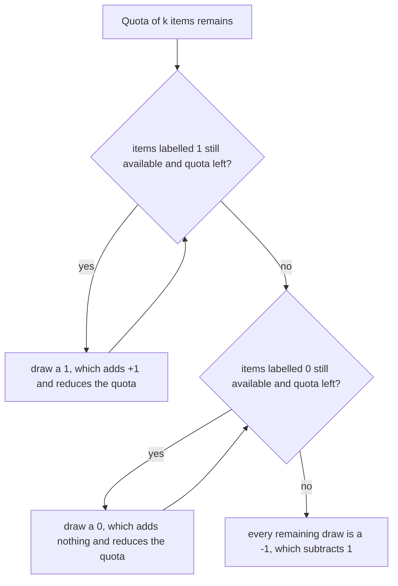

# Guided Example: K Items With the Maximum Sum

## 1. The bag and the instance

A bag holds items labelled `1`, `0`, or `-1`. The bag is described only by how
many items of each label it contains, and we must draw **exactly** $k$ items and
maximize the sum of their labels. This lesson follows

$$numOnes = 2,\qquad numZeros = 1,\qquad numNegOnes = 4,\qquad k = 5 .$$

The bag therefore holds five items labelled `1`, one item labelled `0`, and four
items labelled `-1`, for ten items in total, so drawing exactly five of them is
possible.

| label | count available | value contributed per item |
|---|---|---|
| `1` | `2` | `+1` |
| `0` | `1` | `0` |
| `-1` | `4` | `-1` |
| total | `7` | — |

The tempting first answer is to grab the two `1` items, stop, and report `2`. That
answer is wrong twice over: it draws only two items instead of five, and it
ignores the otherwise harmless `0` item. The instance is chosen precisely because
the exact count forces negative items into the selection, and the maximum sum
comes out as `0` even though the bag does contain positive items.

## 2. What a selection actually is

Let a selection take $a$ items labelled `1`, $b$ items labelled `0`, and $c$ items
labelled `-1`. It is a valid draw exactly when

$$a + b + c = k,\qquad 0 \le a \le numOnes,\qquad 0 \le b \le numZeros,\qquad 0 \le c \le numNegOnes .$$

The quantity being maximized is the label sum

$$a \cdot (+1) + b \cdot 0 + c \cdot (-1) = a - c .$$

Eliminating $c$ with the exact-count constraint turns the objective into

$$a - c = a - \bigl(k - a - b\bigr) = 2a + b - k .$$

The term $k$ is fixed for the instance, so maximizing the sum is exactly the same
as maximizing $2a + b$: every item labelled `1` is worth two units of this
surrogate objective, every item labelled `0` is worth one, and items labelled
`-1` are worth nothing. Any item labelled `1` that is left in the bag while a
`0` or a `-1` is drawn is therefore a strictly losing exchange, and any `0` left
in the bag while a `-1` is drawn is worth one unit that was left on the table.

This surrogate is the entire structure of the problem, and it immediately orders
the three categories by desirability: draw `1`s first, then `0`s, then `-1`s.

## 3. Stage-by-stage trace of the instance

The draw is organized as three stages, each of which consumes as much of the
remaining quota as its category can supply.

| stage | category | available | quota remaining before the stage | items drawn | quota remaining after | running sum |
|---|---|---|---|---|---|---|
| 1 | labelled `1` | `2` | `5` | `2` | `3` | `2` |
| 2 | labelled `0` | `1` | `3` | `1` | `2` | `2` |
| 3 | labelled `-1` | `4` | `2` | `2` | `0` | `0` |

Stage 1 takes $\min(k, numOnes) = \min(5, 2) = 2$ positive items, because the bag
runs out of them before the quota runs out. Stage 2 takes
$\min(3, numZeros) = \min(3, 1) = 1$ neutral item, because the quota survives the
ones but the zeros do not survive the quota. Stage 3 is forced: two items are
still owed, and the only remaining label is `-1`, so the draw takes exactly two of
them and each subtracts one from the sum. The final sum is
`2 + 0 - 2 = 0`.

The same trace expressed through the selection variables gives $a = 2$, $b = 1$,
$c = 2$, and the check $a + b + c = 2 + 1 + 2 = k$ holds.

| selected label multiset | count of items | label sum | valid draw? | optimal? |
|---|---|---|---|---|
| `{1, 1, 0, -1, -1}` | `5` | `0` | yes | yes |
| `{1, 1}` | `2` | `2` | no, only 2 items drawn | no |
| `{1, 1, 0, -1}` | `4` | `1` | no, only 4 items drawn | no |
| `{1, 1, -1, -1, -1}` | `5` | `-1` | yes | no, the `0` item was skipped |
| `{1, 1, 0, 0, -1}` | `5` | `1` | no, only one `0` exists | no |

The last row is the most instructive invalid attempt: its arithmetic is right but
it draws a zero item that the bag does not contain. Availability is a hard bound
on every category, not a suggestion.

## 4. Invariant and correctness of the priority order

The greedy draw maintains one invariant: **after each of the three stages, the
selection uses the largest number of `1` labels the quota permits, then the
largest number of `0` labels the remaining quota permits, and the quota is filled
only by labels that are actually available.** Because stage 1 draws
$\min(k, numOnes)$ positives, no more `1` labels can be added; because stage 2
draws $\min(\text{remaining}, numZeros)$ zeros, no more `0` labels can be added
without displacing a `1`; and stage 3 therefore draws the forced remainder.

**Correctness by exchange.** Take any valid selection that is not the greedy one,
and consider the first category in the priority order where it differs. If it
leaves an available `1` undrawn while holding a `0` or a `-1`, swap that held item
for the `1`: the count stays $k$, all upper bounds stay satisfied, and the sum
rises by $1$ or $2$, so the original selection was not optimal. If it leaves an
available `0` undrawn while holding a `-1`, the same swap raises the sum by $1$.
Repeating these exchanges turns any valid selection into the greedy selection
without ever lowering the sum, so the greedy selection is at least as good as
every valid selection. That proves maximality, and the greedy selection is itself
valid because the problem guarantees $k \le numOnes + numZeros + numNegOnes$, so
the forced third stage never asks for more `-1` items than exist.

**Closed form.** The trace collapses into a single expression. With
$a^{\star} = \min(k, numOnes)$ positive items and
$c^{\star} = \max(0,\, k - numOnes - numZeros)$ forced negative items, the answer
is

$$a^{\star} - c^{\star} = \min(k, numOnes) - \max\bigl(0,\ k - numOnes - numZeros\bigr).$$

For the traced instance this is $\min(5, 2) - \max(0, 5 - 2 - 1) = 2 - 2 = 0$.

| authored instance | $a^{\star} = \min(k, numOnes)$ | $c^{\star} = \max(0, k - numOnes - numZeros)$ | formula result | expected output |
|---|---|---|---|---|
| `numOnes = 3, numZeros = 2, numNegOnes = 0, k = 2` | `2` | `0` | `2` | `2` |
| `numOnes = 3, numZeros = 2, numNegOnes = 0, k = 4` | `3` | `0` | `3` | `3` |
| `numOnes = 2, numZeros = 1, numNegOnes = 4, k = 5` | `2` | `2` | `0` | `0` |
| `numOnes = 4, numZeros = 3, numNegOnes = 2, k = 9` | `4` | `2` | `2` | `2` |
| `numOnes = 50, numZeros = 50, numNegOnes = 50, k = 125` | `50` | `25` | `25` | `25` |
| `numOnes = 0, numZeros = 0, numNegOnes = 7, k = 4` | `0` | `4` | `-4` | `-4` |

Every row agrees with the authored expectation, which is the empirical check that
the cascade and the closed form describe the same draw.

## 5. Traps this instance exposes

| Trap | What it looks like on the instance | Correction |
|---|---|---|
| Answering with the sum of all available `1`s | Reporting `2` because there are two of them | The draw must contain exactly $k = 5$ items |
| Forgetting the `0` items when sizing the forced stage | Computing $5 - 2 = 3$ negatives, giving `-1` | Subtract both $numOnes$ and $numZeros$: $5 - 2 - 1 = 2$ |
| Treating `0` items as if they were unavailable | Drawing five items as `{1, 1, -1, -1, -1}` for `-1` | A `0` item fills quota without lowering the sum, so it is always preferable to a `-1` |
| Assuming the maximum sum must be positive | The true optimum here is `0` | The best achievable sum depends on how many neutral and negative items the quota forces |
| Reading `numZeros` availability as unlimited | Drawing two `0` items in the row `{1, 1, 0, 0, -1}` | Each category has its own upper bound |
| Letting the forced stage exceed the `-1` supply | Impossible under the constraints, but easy to assume in code | The guarantee $k \le numOnes + numZeros + numNegOnes$ makes $\max(0, k - numOnes - numZeros) \le numNegOnes$ |

Two boundary regimes are worth separating, because they make the third stage
disappear for different reasons. If $k \le numOnes$ the draw is entirely positive
and the answer is simply $k$; the whole bag of zeros and negatives is irrelevant.
If $numOnes < k \le numOnes + numZeros$ the draw is positive items plus neutral
items and the answer is exactly $numOnes$; the quota is filled without ever
touching a negative label. Only when $k$ exceeds $numOnes + numZeros$ does the
answer drop below the number of positive items, and each unit of that excess
costs exactly one unit of sum.

| boundary regime | authored instance | output | why |
|---|---|---|---|
| $k = 0$ | `numOnes = 5, numZeros = 5, numNegOnes = 5, k = 0` | `0` | The empty draw is the only valid draw and sums to `0` |
| $k \le numOnes$ | `numOnes = 3, numZeros = 1, numNegOnes = 0, k = 2` | `2` | Both draws come from the positive category |
| $numOnes < k \le numOnes + numZeros$ | `numOnes = 3, numZeros = 2, numNegOnes = 0, k = 4` | `3` | Zeros complete the quota at no cost |
| bag holds only `0` labels | `numOnes = 0, numZeros = 8, numNegOnes = 0, k = 8` | `0` | Neutral items are the only available labels |
| bag holds only `-1` labels | `numOnes = 0, numZeros = 0, numNegOnes = 7, k = 4` | `-4` | Every drawn item subtracts one |
| $k$ equals the whole bag | `numOnes = 4, numZeros = 3, numNegOnes = 2, k = 9` | `2` | The draw is forced to consume everything, so the answer is the total bag sum |

## 6. Complexity of the method

The cascade performs a constant number of operations regardless of the four
inputs: one comparison for the positive stage, one subtraction and one comparison
for the neutral stage, and one subtraction and one comparison for the forced
stage. Nothing is iterated, sorted, or stored, so the running time is $O(1)$ and
the auxiliary space is $O(1)$. The bag is described by three counters rather than
by an explicit list of items, which is exactly why the exact-count constraint can
be resolved by arithmetic instead of by enumerating
$\binom{numOnes + numZeros + numNegOnes}{k}$ candidate draws.

| Quantity | Cost | Reason |
|---|---|---|
| Time | $O(1)$ | A fixed number of comparisons and subtractions, independent of the counts and of $k$ |
| Auxiliary space | $O(1)$ | Only the three running quantities `a = min(k, numOnes)`, the remainder, and the forced negative count |
| Compared with enumeration | $\Theta\!\left(\binom{n}{k}\right)$ | Listing draws would be exponential in the worst case and is never necessary |

The lesson to carry away is that the surrogate objective $2a + b - k$ converts a
combinatorial choice into a fixed priority order, and once the order is fixed the
only work left is deciding how far each category can supply the quota.