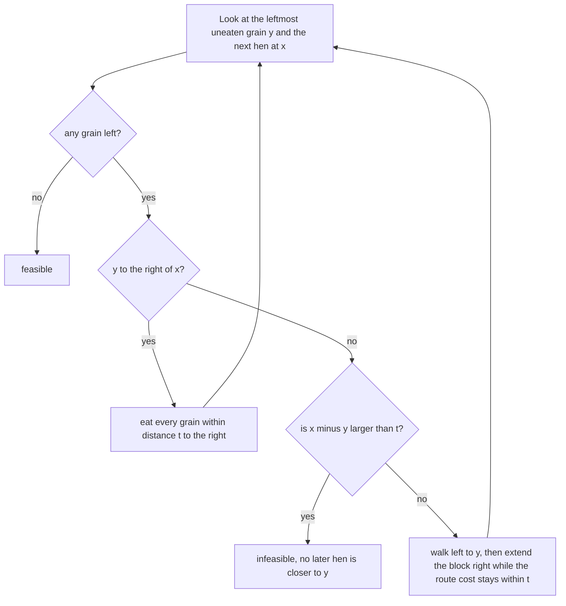

# Guided Example: Minimum Time to Eat All Grains

## 1. The instance: two hens, four grains, one shared deadline

Hens and grains live on a line. A hen standing exactly on a grain eats it
instantly, a hen covers one unit of distance per second, and all hens move
simultaneously and independently. The question is the smallest deadline $t$ by
which every grain can be eaten.

This lesson works the instance

$$hens = [100, 0], \qquad grains = [80, 20, 60, 40],$$

whose optimal deadline is `40`. Position order is the only structure the line
provides, so the first act of any method is to sort both lists.

| sorted hens (position) | role in the line |
|---|---|
| `0` | left hen |
| `100` | right hen |

| sorted grains (position) | 0 | 1 | 2 | 3 |
|---|---|---|---|---|
| position | `20` | `40` | `60` | `80` |

The tempting shortcut is to hand the left hen everything, since it starts at `0`
and the grains run to its right. That hen would need `80` seconds to reach the
far grain. The right hen sits at `100`, only `20` units from the grain at `80`,
so a much better split exists. Finding that split is the substance of the
problem, and the answer is not the largest single-hen distance but the smallest
achievable maximum over a whole assignment.

## 2. From a deadline to a geometric route cost

Fix a candidate deadline $t$ and ask a yes-or-no question: can every grain be
eaten within $t$ seconds? This is the decision form of the problem, and it is much
easier than the optimization form because each hen can be examined on its own
once the grains are divided among the hens.

A useful fact about the line is that a hen which covers the interval between two
extreme grains picks up everything in between at no extra cost. So a hen covers a
**contiguous block** of the sorted grain list, and the only question is what that
block costs.

Suppose a hen stands at $x$ and must cover every grain in the interval $[y, g]$
with $y \le g$. Either it walks left first to $y$ and then right to $g$, or it
walks right first to $g$ and then left to $y$. One of the two extremes is visited
first, and the hen must then traverse the full span between them, so the minimum
time is

$$\operatorname{cost}(x, y, g) = \min\bigl(x - y,\ g - x\bigr) + \bigl(g - y\bigr),$$

where a negative value of $x - y$ or $g - x$ simply means that extreme lies on the
other side and the corresponding order is unavailable; only orders that visit
both extremes are meaningful.

The single-hen instance $hens = [10]$, $grains = [6, 20]$ isolates the formula.
The span between the extremes is $20 - 6 = 14$, and the hen at `10` is `4` units
from the near grain and `10` units from the far one.

| order of visiting the extremes | travel to the first extreme | span between extremes | total time |
|---|---|---|---|
| walk left to `6` first, then right to `20` | `10 - 6 = 4` | `20 - 6 = 14` | `18` |
| walk right to `20` first, then left to `6` | `20 - 10 = 10` | `20 - 6 = 14` | `24` |
| minimum over both orders | `4` | `14` | `18` |

So `t = 17` fails for that hen while `t = 18` succeeds, and `18` is the answer for
that instance. The formula also explains a case that looks asymmetric at first
glance: when the hen stands outside the interval entirely, only one order exists
and the cost degenerates to the far end's distance, which is the distance to the
extreme it must ultimately reach.

## 3. The greedy decision rule for a fixed deadline

Process the sorted hens from left to right, always looking at $y$, the position of
the leftmost grain that nobody has eaten yet. Four situations can arise.

1. Every grain is already eaten. The deadline is feasible.
2. The grain is **to the right** of the hen ($y > x$). The hen can only walk
   right, so it eats every uneaten grain whose distance from it is at most $t$:
   all grains with $g - x \le t$. Nothing to the left needs attention, because no
   uneaten grain is to the left.
3. The grain is **at or to the left** of the hen ($y \le x$) and $x - y > t$. This
   hen cannot reach the leftmost uneaten grain, and no hen later in the order can
   either, since every later hen stands at a position $\ge x$ and is therefore
   even farther from $y$. The deadline is infeasible.
4. The grain is at or to the left of the hen and reachable. The hen walks left to
   $y$, and on the way it collects every grain in $[y, x]$ for free. It may then
   extend its block to the right, absorbing grain $g > x$ whenever
   $\operatorname{cost}(x, y, g) \le t$. It stops at the first grain that does not
   fit, because $\operatorname{cost}(x, y, g)$ is non-decreasing in $g$; every
   later grain is even more expensive.

The whole decision is a single sweep: the pointer to the leftmost uneaten grain
only ever moves right, and each hen is examined once.

## 4. Trace of the decision at the optimal deadline

The instance needs `t = 40`. Running the sweep at exactly that deadline:

| hen $x$ | leftmost uneaten $y$ | situation | reach test | block eaten | grains consumed | leftmost uneaten after |
|---|---|---|---|---|---|---|
| `0` | `20` | grain to the right | `20 - 0 = 20 \le 40`, then extend while `g - 0 \le 40`; `60 - 0 = 60 > 40` stops the extension | `{20, 40}` | 2 | `60` |
| `100` | `60` | grain to the left | `100 - 60 = 40 \le 40`, then every grain at or left of `100` is collected on the way | `{60, 80}` | 2 | none |

Both blocks are consumed, the pointer reaches the end of the grain list, and the
deadline is accepted. Note how differently the two hens behave: the left hen
sweeps rightward and stops as soon as the next grain is more than `40` units away,
while the right hen sweeps leftward and collects the entire remaining suffix
because both remaining grains lie at or left of it.

| deadline $t$ | block for hen at `0` | block for hen at `100` | all grains eaten? | verdict |
|---|---|---|---|---|
| `20` | `{20}` | cannot take `40`, which is `60` units away | no | infeasible |
| `30` | `{20}` | cannot take `40`, which is `60` units away | no | infeasible |
| `39` | `{20}` | cannot take `40`, which is `60` units away | no | infeasible |
| `40` | `{20, 40}` | `{60, 80}` at cost `min(40, 20) + 20 = 40` | yes | feasible |
| `60` | `{20, 40, 60}` | `{80}` at cost `20` | yes | feasible |
| `80` | `{20, 40, 60, 80}` | nothing left to eat | yes | feasible |

The row for `39` is the whole difficulty of the instance in one line: the left hen
runs out of reach exactly one unit short, and the right hen is still `60` units
from the grain at `40`, so the deadline collapses.

A direct lower-bound argument confirms that nothing below `40` can work without
trusting the sweep. The grain at `80` cannot be reached by the hen at `0` in fewer
than `80` seconds, so the hen at `100` must eat it, which already costs `20`.
That same hen must also deal with the grain at `60` if the left hen cannot: taking
both costs $\min(100 - 60,\ \lvert 80 - 100 \rvert) + (80 - 60) = \min(40, 20) + 20 = 40$.
If instead the left hen takes `60`, it must also take `20` and `40` on the way, and
$\min(0 - 20 \text{ unavailable}, 60 - 0) = 60$ exceeds `40`. Every route that
covers all four grains therefore costs at least `40`, and the split
`{20, 40}` to the left hen with `{60, 80}` to the right hen attains exactly `40`.

## 5. Invariant and correctness of the feasibility sweep

The sweep maintains a single invariant: **at the moment a hen at position $x$ is
examined, the pointer names the leftmost grain that no earlier hen has eaten, and
every grain strictly left of that pointer has been assigned to an earlier hen
whose route cost is at most $t$.** The pointer never moves backwards, so the
invariant is preserved by construction, and the sweep reports feasibility exactly
when the pointer has passed the last grain.

**Sorted assignment is without loss of generality.** Hens and grains are points on
a line, and the travel cost of pairing hen $x$ with grain $g$ is $\lvert g - x \rvert$.
For two hens $x_1 \le x_2$ and two grains $g_1 \le g_2$, the pairing that sends the
left hen to the left grain and the right hen to the right grain satisfies the
Monge inequality

$$\lvert g_1 - x_1 \rvert + \lvert g_2 - x_2 \rvert \;\le\; \lvert g_2 - x_1 \rvert + \lvert g_1 - x_2 \rvert ,$$

so uncrossing a crossed pair never increases the larger of the two route costs.
Repeating the uncrossing removes every crossing, which leaves each hen with a
contiguous block of the sorted grain list and leaves the blocks ordered like the
hens. The sweep therefore never has to consider a non-contiguous assignment.

**The maximal block is the safe block.** Take any feasible assignment in
non-crossing form and look at its first block, owned by some hen at position $x$.
The sweep gives that same hen the largest block it can cover within $t$, starting
at the same leftmost grain. Every extra grain the sweep adds to the block was
owned by a later hen in the considered assignment, and removing a prefix of a
later hen's block leaves that hen with a sub-interval, which never costs more than
the block it replaced. The first hen can cover its enlarged block within $t$ by
construction. So enlarging the block preserves feasibility, and by induction the
sweep consumes at least as much of the sorted grain list as any feasible
assignment at every step.

**Feasibility implies the sweep succeeds.** The induction above shows that after
each hen, the sweep's pointer is at least as far right as the pointer of any
feasible assignment; a feasible assignment ends with the pointer past the last
grain, so the sweep must end there too. **The sweep's success implies
feasibility**, because the blocks it produces are an explicit valid assignment:
each hen's block is covered within $t$ by the reach tests, and the blocks partition
the grain list.

The failure branch is equally sound. When the leftmost uneaten grain $y$ sits left
of hen $x$ with $x - y > t$, no *later* hen can eat $y$ either, because later hens
stand at positions $\ge x$ and are at least $x - y$ away from $y$; and all earlier
hens have already had their turn, so $y$ would remain uneaten forever. Reporting
infeasibility is therefore justified rather than a premature give-up.

## 6. Binary search on the deadline

Feasibility is monotone in $t$: if a plan finishes every grain within $t$ seconds,
the identical plan finishes within $t + 1$ seconds, because the reach tests are
all of the form "distance $\le$ deadline". The set of feasible deadlines is
therefore a suffix $[t^{\star}, \infty)$ of the non-negative integers, and the
smallest feasible value can be found by bisecting an interval.

The interval must be guaranteed to contain a feasible value. For this instance,
one hen alone can always finish: sending the hen at `0` to the grain at `20` and
then sweeping right to `80` takes
$\lvert 0 - 20 \rvert + (80 - 20) = 20 + 60 = 80$ seconds. Searching
$t \in [0, 80]$ is therefore safe, and the sweep is invoked on the probe values
below.

| probe | interval before | probe value | sweep verdict | interval after |
|---|---|---|---|---|
| 1 | `[0, 81)` | `40` | feasible | `[0, 40)` |
| 2 | `[0, 40)` | `20` | infeasible | `[21, 40)` |
| 3 | `[21, 40)` | `30` | infeasible | `[31, 40)` |
| 4 | `[31, 40)` | `35` | infeasible | `[36, 40)` |
| 5 | `[36, 40)` | `38` | infeasible | `[39, 40)` |
| 6 | `[39, 40)` | `39` | infeasible | `[40, 40)` |
| 7 | `[40, 40)` | — | interval empty | answer `40` |

Each probe costs one full sweep, and the interval halves every time, so the
answer is reached in a logarithmic number of sweeps rather than by trying every
deadline from zero upwards.

## 7. Traps and boundary conditions

| Trap | Why it is tempting | What the instance shows |
|---|---|---|
| Answering with the largest single-hen distance | The left hen reaching `80` alone costs `80`, which looks like a pessimistic answer | The split answer is `40`; hens work in parallel, and no single hen must cover everything |
| Assuming the leftmost hen should take every grain it can reach | More grains for the left hen feels like progress | At `t = 60` the left hen does take `{20, 40, 60}`, but that is a consequence of the deadline, not a goal; the check maximizes blocks to make the remaining suffix easier, not to minimize the number of hens used |
| Ignoring the walk back when a hen covers both sides | Visiting the far grain directly looks sufficient | Covering `[6, 20]` from `10` costs `18`, not `10`; the span between extremes is always paid unless the hen starts between them and ends at one extreme |
| Handing the leftmost grain to a far-right hen | The right hen is closer to `80` | The grain at `60` is `60` units from the left hen and `40` from the right hen, but the *leftmost* uneaten grain must be taken by the leftmost available hen in a sorted assignment; crossing assignments are never needed |
| Treating coincident grains as one grain | Three grains at the same spot look redundant | Coincident grains are separate grains and must all be eaten, though one visit covers them; a hen passing through the position eats them all at once |
| Using a fixed small probing range | The coordinates reach $10^{9}$, so a linear scan of deadlines is hopeless | The probe interval must be derived from the coordinates, and the answer can be as large as $10^{9}$ |
| Forgetting that a hen may eat nothing | Every hen feels obliged to move | The row `t = 80` leaves the right hen idle; unused hens are always allowed |

| Boundary situation | Authored instance | Answer | Reason |
|---|---|---|---|
| every grain already under a hen | `hens = [2, 5, 8]`, `grains = [8, 2, 5]` | `0` | Every grain is eaten at time zero, and the sweep succeeds at `t = 0` |
| a single hen must cover both sides | `hens = [10]`, `grains = [6, 20]` | `18` | $\min(10 - 6,\ 20 - 10) + (20 - 6) = 4 + 14 = 18$ |
| coincident grains | `hens = [2, 8]`, `grains = [5, 5, 5]` | `3` | One visit to position `5` eats all three grains; the cheapest route from `2` or `8` costs `3` |
| an early hen must leave later grains | `hens = [100, 0]`, `grains = [80, 20, 60, 40]` | `40` | The left hen stops after `{20, 40}` and the right hen takes `{60, 80}` |
| extreme coordinates | `hens = [0]`, `grains = [1000000000]` | `1000000000` | The single hen must cross the whole line, and the answer equals the coordinate gap |
| several hens, one grain each | `hens = [4, 6, 109, 111, 213, 215]`, `grains = [5, 110, 214]` | `1` | Every grain sits one unit from a distinct hen, so the deadline is `1` and the remaining hens stay put |

## 8. Complexity of the method

Sorting dominates the preprocessing: $O(n \log n)$ for the $n$ hens and
$O(m \log m)$ for the $m$ grains. A single feasibility sweep walks the grain
pointer forward only, so it costs $O(n + m)$: each hen is examined once and each
grain leaves the uneaten list once. If the probe interval has width $R$, the
binary search performs $O(\log R)$ sweeps, giving a total of

$$O\bigl(n \log n + m \log m + (n + m)\log R\bigr)$$

with $R$ bounded by the coordinate spread plus the initial gap between the first
hen and the first grain, so $\log R \le 32$ under the stated limits. The auxiliary
space is $O(n + m)$ for the sorted copies of the two lists, and $O(1)$ beyond them,
since the sweep stores only the grain pointer and the current block endpoints.

| Component | Cost | Why |
|---|---|---|
| Sorting hens and grains | $O(n \log n + m \log m)$ | Order is the only structure the line offers |
| One feasibility sweep | $O(n + m)$ | The grain pointer advances monotonically and each hen is visited once |
| Binary search over deadlines | $O(\log R)$ sweeps | Feasibility is monotone, so a bisection finds the threshold |
| Total time | $O(n \log n + m \log m + (n + m)\log R)$ | Preprocessing plus the product of sweeps and sweep cost |
| Auxiliary space | $O(n + m)$ | Two sorted copies; the sweep itself is constant-space |

The pattern worth remembering is the two-layer structure: a geometric decision
problem that is easy when the deadline is fixed, wrapped in a bisection over the
deadline itself. The monotonicity of the reach tests is what licenses the second
layer, and the uncrossing argument is what makes the first layer a single sweep.