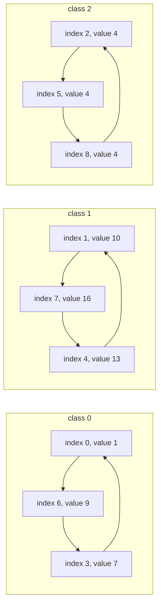

# Guided Example: Make K-Subarray Sums Equal

## 1. The instance and its sliding windows

One operation changes a single element of the circular array by exactly `1`, up or
down. All subarrays of length $k$ must end up with the same sum, and the number of
unit changes must be as small as possible.

This lesson works the instance

$$arr = [1, 10, 4, 7, 13, 4, 9, 16, 4], \qquad k = 6,$$

so $n = 9$ elements and $9$ circular windows of length $6$. The answer is `14`.

| position | 0 | 1 | 2 | 3 | 4 | 5 | 6 | 7 | 8 |
|---|---|---|---|---|---|---|---|---|---|
| `arr` value | `1` | `10` | `4` | `7` | `13` | `4` | `9` | `16` | `4` |

The window sums are far from equal, and their pattern is not random: each window
differs from the previous one by exactly one exchanged element.

| window start $i$ | 0 | 1 | 2 | 3 | 4 | 5 | 6 | 7 | 8 |
|---|---|---|---|---|---|---|---|---|---|
| window sum | `39` | `47` | `53` | `53` | `47` | `44` | `44` | `42` | `39` |
| change from previous window | — | `+8` | `+6` | `0` | `-6` | `-3` | `0` | `-2` | `-3` |

Every window is obtained from its predecessor by dropping the element at the
window's left end and appending the element $k$ positions later, wrapping around
the circular array. That observation is the lever for the whole solution, and the
next sections turn it into three reductions.

## 2. Reduction one: equal sums become pairwise equalities

Let $S_i$ denote the sum of the window that starts at position $i$, with all
indices taken modulo $n$. Sliding the window one step to the right removes
$arr[i]$ and adds $arr[(i + k) \bmod n]$, so

$$S_{i+1} - S_i = arr[(i+k) \bmod n] - arr[i] \qquad \text{for every } i .$$

The goal is that all $S_i$ agree, which happens exactly when every consecutive
difference vanishes, that is, when

$$arr[(i+k) \bmod n] = arr[i] \qquad \text{for every position } i .$$

This equivalence runs in both directions. If all windows are equal then each
difference is zero and every equality holds; conversely, if every equality holds
then every consecutive difference is zero, so all $n$ window sums are equal
because they form a cycle of equal neighbours. The table above shows the same fact
numerically: the change at step $i$ is precisely the difference of the two
positions it swaps, for instance
$S_1 - S_0 = arr[6] - arr[0] = 9 - 1 = 8$.

The problem has now become a statement about individual positions rather than
about windows: positions whose indices differ by $k$ modulo $n$ must hold equal
values.

| step $i$ | element leaving the window | element entering the window | required equality | numerical check |
|---|---|---|---|---|
| 0 | `arr[0] = 1` | `arr[6] = 9` | `arr[0] = arr[6]` | `47 - 39 = 8 = 9 - 1` |
| 1 | `arr[1] = 10` | `arr[7] = 16` | `arr[1] = arr[7]` | `53 - 47 = 6 = 16 - 10` |
| 2 | `arr[2] = 4` | `arr[8] = 4` | `arr[2] = arr[8]` | `53 - 53 = 0 = 4 - 4` |
| 3 | `arr[3] = 7` | `arr[0] = 1` | `arr[3] = arr[0]` | `47 - 53 = -6 = 1 - 7` |
| 4 | `arr[4] = 13` | `arr[1] = 10` | `arr[4] = arr[1]` | `44 - 47 = -3 = 10 - 13` |
| 5 | `arr[5] = 4` | `arr[2] = 4` | `arr[5] = arr[2]` | `44 - 44 = 0 = 4 - 4` |
| 6 | `arr[6] = 9` | `arr[3] = 7` | `arr[6] = arr[3]` | `42 - 44 = -2 = 7 - 9` |
| 7 | `arr[7] = 16` | `arr[4] = 13` | `arr[7] = arr[4]` | `39 - 42 = -3 = 13 - 16` |
| 8 | `arr[8] = 4` | `arr[5] = 4` | `arr[8] = arr[5]` | `39 - 39 = 0 = 4 - 4` |

## 3. Reduction two: the equalities split into gcd cycles

The equalities say that the value at any position must be copied $k$ steps ahead,
modulo $n$. Following those steps from a position $i$ visits

$$i,\quad i + k,\quad i + 2k,\quad i + 3k,\ \ldots \pmod n,$$

so the positions linked to $i$ are exactly the coset $i + \langle k \rangle$
inside the cyclic group $\mathbb{Z}_n$ generated by $k$. The subgroup generated by
$k$ consists of the multiples of $g = \gcd(n, k)$, so each linked set is a residue
class modulo $g$, and there are exactly $g$ of them.

For the instance, $g = \gcd(9, 6) = 3$, so there are three classes, each of size
$9 / 3 = 3$:

| class (residue mod $3$) | positions | values before | values after |
|---|---|---|---|
| 0 | `0, 3, 6` | `1, 7, 9` | `7, 7, 7` |
| 1 | `1, 4, 7` | `10, 13, 16` | `13, 13, 13` |
| 2 | `2, 5, 8` | `4, 4, 4` | `4, 4, 4` |

Reading the equalities of section 2 as edges shows the same three cycles:
$0 \to 6 \to 3 \to 0$, then $1 \to 7 \to 4 \to 1$, then $2 \to 8 \to 5 \to 2$. Each
cycle closes after three steps because $3k = 18$ is a multiple of $9$ and no
smaller positive multiple of $6$ is.

Every operation touches one element, which belongs to exactly one class, so the
three classes are completely independent: no operation can help two of them at
once, and the total cost is the sum of three separate costs. The task has become
making each class constant at the cheapest possible common value.

## 4. Reduction three: the cheapest common value is a median

Consider one class with values $x_1, \ldots, x_m$ and suppose the class is to be
made constant at the value $c$. Every element $x_j$ needs $\lvert x_j - c \rvert$
unit changes, so the class costs

$$F(c) = \sum_{j=1}^{m} \lvert x_j - c \rvert .$$

Moving the target from $c$ to $c + 1$ makes every element below or equal to $c$
one step cheaper and every element above $c$ one step dearer, so

$$F(c+1) - F(c) = \#\{j : x_j \le c\} - \#\{j : x_j > c\}.$$

While fewer than half of the values are at or below $c$, this difference is
negative and raising the target lowers the cost; once at least half the values are
at or below $c$, the difference is non-negative, so raising the target no longer
helps. The cost is therefore minimized at a **median** of the class, and the slope
argument also shows the cost is convex: it falls, flattens at a median, then
rises.

For class 0 with values `1, 7, 9`, the whole cost curve is short enough to write
out, and it has exactly that shape.

| common value $c$ | 1 | 2 | 3 | 4 | 5 | 6 | 7 | 8 | 9 |
|---|---|---|---|---|---|---|---|---|---|
| cost $F(c)$ | `14` | `13` | `12` | `11` | `10` | `9` | `8` | `9` | `10` |
| slope $F(c) - F(c-1)$ | — | `-1` | `-1` | `-1` | `-1` | `-1` | `-1` | `+1` | `+1` |

The slope is `-1` while only one of the three values lies at or below the target
and `+1` afterwards, so the single minimum sits at the median `7`, with cost `8`.
Class 1 behaves identically with values `10, 13, 16`: the minimum is at the median
`13`, and the cost is `3 + 0 + 3 = 6`. Class 2 is already constant at `4`, so its
median is `4` and its cost is `0`.

## 5. Full trace of the instance

Assembling the three reductions:

| class | values, sorted | median chosen | deviations | class cost |
|---|---|---|---|---|
| 0 | `1, 7, 9` | `7` | `6, 0, 2` | `8` |
| 1 | `10, 13, 16` | `13` | `3, 0, 3` | `6` |
| 2 | `4, 4, 4` | `4` | `0, 0, 0` | `0` |
| total | — | — | — | `14` |

The final array is therefore `[7, 13, 4, 7, 13, 4, 7, 13, 4]`, which is periodic
with period `3`. Every length-`6` window contains exactly two full periods, so all
window sums must coincide, and they do.

| window start $i$ | 0 | 1 | 2 | 3 | 4 | 5 | 6 | 7 | 8 |
|---|---|---|---|---|---|---|---|---|---|
| elements of the window | `7,13,4,7,13,4` | `13,4,7,13,4,7` | `4,7,13,4,7,13` | `7,13,4,7,13,4` | `13,4,7,13,4,7` | `4,7,13,4,7,13` | `7,13,4,7,13,4` | `13,4,7,13,4,7` | `4,7,13,4,7,13` |
| window sum | `48` | `48` | `48` | `48` | `48` | `48` | `48` | `48` | `48` |

The number of operations is `8 + 6 + 0 = 14`, matching the authored expectation for
this instance.

| authored instance | $n$ | $k$ | $g = \gcd(n,k)$ | class values | class costs | total | expected |
|---|---|---|---|---|---|---|---|
| `arr = [1, 4, 1, 3]`, `k = 2` | 4 | 2 | 2 | `1, 1` and `4, 3` | `0` and `1` | `1` | `1` |
| `arr = [2, 5, 5, 7]`, `k = 3` | 4 | 3 | 1 | `2, 5, 5, 7` | `5` | `5` | `5` |
| `arr = [4, 3, 2, 1]`, `k = 4` | 4 | 4 | 4 | four singletons | `0` each | `0` | `0` |
| `arr = [1, 2, 3, 4, 5]`, `k = 1` | 5 | 1 | 1 | `1, 2, 3, 4, 5` | `6` | `6` | `6` |
| `arr = [1, 10, 4, 7, 13, 4, 9, 16, 4]`, `k = 6` | 9 | 6 | 3 | the three classes above | `8`, `6`, `0` | `14` | `14` |
| `arr = [1, 10^9, 1, 10^9, 1]`, `k = 2` | 5 | 2 | 1 | `1, 1, 1, 10^9, 10^9` | `1999999998` | `1999999998` | `1999999998` |

The last row is a warning about arithmetic rather than about logic: two values
differing by $10^9 - 1$ contribute about $2 \cdot 10^9$ operations, which exceeds
32-bit signed range, so the running total must use wide arithmetic.

## 6. Invariant and correctness of the three reductions

Each reduction is an equivalence or an exact minimization, not an approximation,
and together they prove that the computed total is both achievable and minimal.

**Reduction one is exact.** All window sums are equal if and only if every
$S_{i+1} - S_i$ is zero, and $S_{i+1} - S_i = arr[(i+k) \bmod n] - arr[i]$. Hence
the final array satisfies the requirement precisely when it satisfies the system
$arr[(i+k) \bmod n] = arr[i]$ for all $i$. Two arrays that both satisfy the system
are compared on equal footing, and an array that violates it always leaves two
neighbouring windows unequal, so there is no valid final array outside this
system.

**Reduction two partitions the constraints.** The positions reachable from $i$ by
repeatedly adding $k$ modulo $n$ form the coset $i + \langle k \rangle$ of the
cyclic group $\mathbb{Z}_n$. The subgroup generated by $k$ is generated by
$g = \gcd(n, k)$, so those cosets are exactly the $g$ residue classes modulo $g$,
each of size $n/g$, and they partition all $n$ positions. Within a class every
value must equal every other, because the equalities chain the positions together;
across classes there is no constraint, because no equality links two different
classes. Because an operation modifies exactly one position and therefore one
class, the minimum total is the sum of the per-class minima.

**Reduction three gives the exact per-class minimum.** A class made constant at
$c$ costs $F(c) = \sum \lvert x_j - c \rvert$ unit operations, since each unit of
change is one operation and no operation is wasted. The difference
$F(c+1) - F(c)$ is negative for every $c$ below a median and non-negative from a
median onward, as the counting argument of section 4 shows. The function is
therefore minimized at a median, and the value at that median is the class's
minimum cost. Choosing the element at index $\lfloor m/2 \rfloor$ of the sorted
class is such a median, and for even class sizes either central element yields the
same minimum, so no tie-breaking rule is needed.

**The total is attainable.** Performing exactly $\lvert x_j - c_r \rvert$ unit
changes on each element toward its class median $c_r$ costs exactly the computed
total and produces an array satisfying the system of reduction one, whose window
sums are therefore all equal. Since every valid final array satisfies the system
and every class cost is at least its median cost, no smaller number of operations
can succeed.

## 7. Traps and boundary conditions

| Trap | What it looks like | Correction |
|---|---|---|
| Forgetting that the array is circular | Treating the last window as if it had no successor, so only $S_1, \ldots, S_{n-1}$ are compared | The wrap-around equality `arr[(8+6) mod 9] = arr[5]` is one of the nine constraints and must be enforced |
| Using $k$ instead of $\gcd(n,k)$ for the number of classes | Assuming nine classes of one element each, so that the cost would be `0` | The classes are the residue classes modulo $\gcd(n,k) = 3$, each holding three positions |
| Minimizing each class at its mean instead of its median | Class 0 has mean $17/3 \approx 5.67$; the nearest integer target `6` costs `9` | Absolute deviations are minimized by a median, and the median `7` costs `8`; the mean minimizes squared deviations instead |
| Targeting one global common value for every class | Using `7` everywhere gives class 1 a cost of `3 + 6 + 9 = 18` | Each class is independent and takes its own median, here `13` for class 1 |
| Assuming a periodic array is required rather than implied | Expecting the answer to produce period $k$ instead of period $g$ | The final array here has period `3`, and any period dividing the final structure is a consequence of the equalities, not a separate requirement |
| Ignoring overflow | Class costs near $2 \cdot 10^9$ on the wide-value instance | Accumulate in 64-bit arithmetic; the answer can exceed the 32-bit signed range |
| Believing that a shorter class needs no work | Class 2 is constant and costs `0`, which is correct | The point is to check every class, not to assume a nonzero cost |

| Boundary situation | Authored instance | Answer | Why |
|---|---|---|---|
| $k = n$ | `arr = [4, 3, 2, 1]`, `k = 4` | `0` | $\gcd(4,4) = 4$, so every class is a singleton and the single window sum is unique by definition |
| $k = 1$ | `arr = [1, 2, 3, 4, 5]`, `k = 1` | `6` | Every length-`1` window is a single element, so the entire array must become constant at its median `3` |
| $\gcd(n,k) = 1$ | `arr = [2, 5, 5, 7]`, `k = 3` | `5` | One class holds all four positions, whose median is `5` |
| a class already constant | `arr = [1, 10, 4, 7, 13, 4, 9, 16, 4]`, `k = 6`, class 2 | `0` for that class | Deviations from the median are all zero |
| two elements per class with a gap | `arr = [1, 4, 1, 3]`, `k = 2`, class 1 | `1` | Values `4` and `3` are one unit apart, and either value serves as the median |
| values spread over $10^9$ | `arr = [1, 10^9, 1, 10^9, 1]`, `k = 2` | `1999999998` | The median is `1`, and both extreme values must descend by $10^9 - 1$ |

## 8. Complexity of the method

The work is concentrated in sorting the classes. There are $g = \gcd(n,k)$
classes of size $n/g$ each, so the sorting costs

$$O\!\left(g \cdot \frac{n}{g} \log \frac{n}{g}\right) = O\!\left(n \log \frac{n}{g}\right) \le O(n \log n),$$

and summing the deviations afterwards is linear in $n$. The gcd itself is
computed in $O(\log \min(n,k))$.

| Component | Cost | Why |
|---|---|---|
| Computing $g = \gcd(n,k)$ | $O(\log \min(n,k))$ | Euclidean algorithm |
| Gathering each class | $O(n)$ total | Every position belongs to exactly one class |
| Sorting the classes | $O(n \log(n/g))$ | Each class of size $n/g$ is sorted independently |
| Summing deviations from the medians | $O(n)$ | One pass over the gathered values |
| Total time | $O(n \log n)$ in the worst case | Dominated by sorting, with $g = 1$ the worst case |
| Auxiliary space | $O(n)$ | The gathered class values and their sorted copy |

The pattern to remember is the reduction chain: a condition about sliding window
sums becomes a system of equalities between individual positions, that system
splits into $\gcd(n,k)$ independent cycles, and each cycle is resolved by a median.
Nothing in the method inspects windows directly, which is what keeps it far from
the quadratic cost of comparing all $n$ window sums against each other.