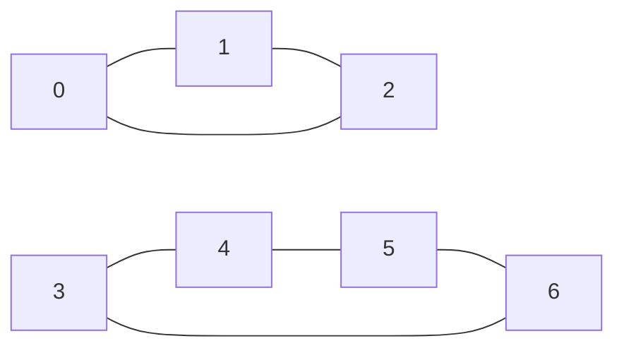

# Guided Example: Shortest Cycle in a Graph

## 1. The instance, its two components, and the required outcome

This instance fixes $n = 7$ vertices, labelled $0$ through $6$, connected by seven undirected edges.

| Index $i$ | Edge $\text{edges}[i]$ | Component |
|---|---|---|
| 0 | `[0, 1]` | $\{0, 1, 2\}$ |
| 1 | `[1, 2]` | $\{0, 1, 2\}$ |
| 2 | `[2, 0]` | $\{0, 1, 2\}$ |
| 3 | `[3, 4]` | $\{3, 4, 5, 6\}$ |
| 4 | `[4, 5]` | $\{3, 4, 5, 6\}$ |
| 5 | `[5, 6]` | $\{3, 4, 5, 6\}$ |
| 6 | `[6, 3]` | $\{3, 4, 5, 6\}$ |

The graph falls into two connected components. Vertices $0, 1, 2$ form a triangle; vertices $3, 4, 5, 6$ form a chordless four-cycle. Nothing else is present, so the instance contains exactly two simple cycles.

A **cycle** is a path that starts and ends at the same vertex while using each edge at most once. Because the contract forbids self-loops and repeated vertex pairs, the shortest conceivable cycle needs three distinct vertices, and the triangle `0 -> 1 -> 2 -> 0` attains it. The required outcome for this instance is therefore:

$$\text{answer} = 3.$$

Two features of the instance carry the whole lesson. First, the graph is disconnected, so any method that explores from a single starting vertex can silently report "no cycle" while a cycle sits in the other component. Second, one cycle is shorter than the other, so the method must compare candidate cycles instead of returning the first one it happens to close.

## 2. Why the tempting searches do not answer the question

Several natural ideas produce *a* cycle while saying nothing about the *shortest* one.

- **Walk until a vertex repeats.** The first repetition depends on the arbitrary order in which neighbours are visited, so the length reported is an artifact of the walk, not a minimum.
- **Depth-first search with parent pointers.** A back edge closes a cycle along the current DFS stack. Its length depends on traversal order as well; the same graph can yield a long cycle first and a triangle later.
- **One breadth-first search from a fixed root.** Distances from the root only bound cycles that pass *through* the root. The four-cycle is invisible to a search rooted at vertex `0`, and the triangle is invisible to a search rooted at vertex `3`.
- **Enumerating all simple cycles.** Complete and hopeless: the number of simple cycles can grow exponentially in $n$, and $n$ may reach $1000$.

The obstacle is that a cycle is a *global* object, while a graph search naturally reports local distances. The next section removes that mismatch by rewriting "find a cycle" as "find a path".

## 3. The edge-removal reduction

Pick any edge $e = \{u, v\}$ of the graph and delete it, obtaining the graph $G - e$. Every cycle that uses $e$ must get from $u$ to $v$ through the remaining edges, so it is exactly $e$ together with a $u$–$v$ path that avoids $e$. Conversely, the edge together with any simple $u$–$v$ path that avoids the edge is a cycle. Consequently the shortest cycle using $e$ has length

$$L(e) = 1 + d_{G-e}(u, v),$$

where $d_{G-e}(u, v)$ is the length (number of edges) of a shortest $u$–$v$ path inside $G - e$. Since the graph is unweighted, that distance is exactly what a breadth-first search from $u$ computes: the search expands vertices in non-decreasing distance, so the moment $v$ receives a distance label, no shorter route to $v$ can remain.

Every cycle contains at least one edge, and no cycle can be shorter than the shortest cycle through one of its own edges. Therefore

$$\text{answer} = \min_{e \in E} L(e),$$

with one convention: if $v$ is unreachable from $u$ after deleting $e$, then $e$ is a **bridge** and lies on no cycle at all. Such an edge contributes $+\infty$ and drops out of the minimum on its own. If every edge is a bridge the graph is a forest, every candidate is infinite, and the required output is `-1`.

This reduction also explains why the two structural facts from Section 1 stop being dangerous: disconnection is irrelevant because each edge is examined independently, and competing cycle lengths are compared by an explicit minimum.

## 4. Executing the reduction on all seven edges

Start with the triangle. Deleting `[0, 1]` and searching outward from vertex `0`, the only usable neighbour of `0` is `2`, and `2` leads back to `1` without ever touching the deleted edge.

| Removed edge | Expansion round | Vertex dequeued | Distance label | Newly labelled vertices |
|---|---|---|---|---|
| `[0, 1]` | 1 | `0` | 0 | `2` at distance 1 |
| `[0, 1]` | 2 | `2` | 1 | `1` at distance 2 |
| `[0, 1]` | 3 | `1` | 2 | none; queue exhausted |
| `[3, 4]` | 1 | `3` | 0 | `6` at distance 1 |
| `[3, 4]` | 2 | `6` | 1 | `5` at distance 2 |
| `[3, 4]` | 3 | `5` | 2 | `4` at distance 3 |
| `[3, 4]` | 4 | `4` | 3 | none; queue exhausted |

The two halved traces show both regimes. Removing a triangle edge leaves a two-edge detour, so the candidate cycle has length $1 + 2 = 3$. Removing an edge of the four-cycle forces the search to travel the long way around, so the candidate has length $1 + 3 = 4$. The second trace also shows why the search must ignore distances it has already assigned: vertex `6` is adjacent to `3`, `5` and nothing else after the deletion, and `6` is labelled once, at distance 1.

Repeating the same procedure for every edge gives the complete candidate set.

| Removed edge $\{u, v\}$ | Shortest $u \to v$ route avoiding it | $d_{G-e}(u, v)$ | Candidate $L(e) = 1 + d_{G-e}(u, v)$ |
|---|---|---|---|
| `[0, 1]` | `0 -> 2 -> 1` | 2 | 3 |
| `[1, 2]` | `1 -> 0 -> 2` | 2 | 3 |
| `[2, 0]` | `2 -> 1 -> 0` | 2 | 3 |
| `[3, 4]` | `3 -> 6 -> 5 -> 4` | 3 | 4 |
| `[4, 5]` | `4 -> 3 -> 6 -> 5` | 3 | 4 |
| `[5, 6]` | `5 -> 4 -> 3 -> 6` | 3 | 4 |
| `[6, 3]` | `6 -> 5 -> 4 -> 3` | 3 | 4 |

The minimum over the seven candidates is $3$, produced by all three triangle edges, and it matches the required outcome. Notice that the removal is symmetric in $u$ and $v$: the graph is undirected, so deleting `[3, 4]` also removes the traversal `4 -> 3`, and searching from either endpoint of the pair yields the same distance.

## 5. Invariant and correctness of the reduction

Two claims carry the argument. The first is a property of breadth-first search in an unweighted graph; the second converts that property into a statement about cycles.

**Frontier invariant.** At any moment during the search, let $F$ be the set of labelled but not yet expanded vertices. Every vertex in $F$ has a final distance label, all labels in $F$ lie within one of at most two consecutive integers, and expanding a vertex of distance $d$ can only create labels of distance $d+1$ or smaller. Because each edge costs exactly $1$, labels are assigned in non-decreasing order, which is precisely the condition that makes the first label assigned to $v$ equal to $d_{G-e}(u, v)$. Had the edges carried different weights, this argument would fail and a priority-queue search would be required.

**Cycle correspondence.** Let $e = \{u, v\}$. If the search reports a finite distance $d$, then there is a path of $d$ edges from $u$ to $v$ in $G - e$. A shortest path never repeats a vertex, so this path is simple, and appending the deleted edge $e$ closes a closed walk in which no edge is repeated: a cycle of length $d + 1$. That value is attainable, so $L(e)$ is never an underestimate. Conversely, take any cycle $C$ containing $e$; deleting $e$ from $C$ leaves a $u$–$v$ path inside $G - e$ of length $\lvert C \rvert - 1$, so $d_{G-e}(u, v) \le \lvert C \rvert - 1$ and $L(e) \le \lvert C \rvert$. The candidate is therefore also never an overestimate of the shortest cycle through $e$.

**Global minimality.** Let $C^{*}$ be a shortest cycle and let $e^{*}$ be any edge of it. The two inequalities above give $L(e^{*}) = \lvert C^{*} \rvert$, and every other edge $e$ satisfies $L(e) \le \lvert C^{*} \rvert$ only if a cycle of that length exists, so no $L(e)$ can fall below $\lvert C^{*} \rvert$. Hence $\min_{e \in E} L(e) = \lvert C^{*} \rvert$: the reduction is both sound and complete. In particular, whenever the graph contains a cycle, the answer is at least $3$, and the answer is exactly $-1$ if and only if every edge turns out to be a bridge, which happens if and only if the graph is a forest.

## 6. Boundary behaviour and traps exposed by this instance

| Situation | What the reduction reports | Correct verdict |
|---|---|---|
| The deleted edge is a bridge | the far endpoint stays unlabelled, distance $+\infty$ | the edge lies on no cycle; contribute nothing |
| Every edge is a bridge | all candidates infinite | the graph is a forest, so the answer is `-1` |
| Self-loop at a vertex | not present in this contract | a self-loop alone would already be a cycle of length $1$ |
| Two parallel edges between the same pair | not present in this contract | those two edges alone form a cycle of length $2$ |
| Edges read as directed | the reverse traversal survives the deletion | wrong: both orientations must be removed for an undirected edge |
| Several cycles of equal minimum length | the minimum is reported once | a length is requested, not a cycle, so multiplicity is not reported |

The acyclic official instance makes the bridge case concrete. With $n = 4$ and edges `[0, 1]`, `[0, 2]`, deleting `[0, 1]` isolates vertex `1` completely, so the search from `0` labels only `2` and never reaches `1`; deleting `[0, 2]` isolates `2` in the same way. Both candidates are infinite, the minimum over a non-empty edge set is empty of finite values, and the required output is `-1`. No special-case branch is needed to detect the forest; the reachability test already encodes it.

Three authored instances confirm that the same formula reproduces their expected values without adjustment.

| Instance | Edges | Expected outcome | Minimum of $1 + d_{G-e}(u, v)$ over all edges |
|---|---|---|---|
| Triangle beside a four-cycle | 7 | 3 | 3 |
| Acyclic three-vertex star | 2 | `-1` | $+\infty$, reported as `-1` |
| Square with a diagonal chord | 5 | 3 | 3 |
| Chordless five-cycle | 5 | 5 | 5 |

The last row is the instructive one. In a chordless cycle nothing shortens the detour: deleting any one of the five edges leaves a four-edge path, so every candidate equals $5$ and the answer is the whole cycle. A method that assumed a candidate is always smaller than the cycle it came from would break here.

Finally, it is worth naming the alternatives that were eliminated and why.

| Method | Searches performed | Always returns the minimum | Weakness |
|---|---|---|---|
| Delete each edge, then search between its endpoints | one per edge | yes | repeats work on dense graphs |
| BFS from every vertex, watching for frontier collisions | one per vertex | yes | cycle bookkeeping when two frontiers meet is delicate |
| DFS with parent pointers | one | no | returns whichever cycle the traversal order closes first |
| Enumerate all simple cycles | exponential | yes | infeasible once $n$ reaches the constraint ceiling |

## 7. Complexity: time and auxiliary space

Let $n$ be the number of vertices and $m$ the number of edges, with $m \le 1000$ and $n \le 1000$. The reduction performs exactly one breadth-first search per edge. A single search touches each vertex at most once and scans each adjacency list at most once, in the graph with that edge removed, so it costs $O(n + m)$ time. The total is therefore

$$O\bigl(m \cdot (n + m)\bigr),$$

which is $O(mn + m^{2})$; at the constraint ceiling this is on the order of a few million adjacency inspections, comfortably inside a typical time limit. The factor $m$ is unavoidable in this formulation because each edge defines its own subproblem, and that is exactly the trade the method makes for its simple correctness argument.

Auxiliary space is $O(n + m)$: the adjacency structure needs $O(n + m)$ cells, and each search allocates a distance array of $n$ entries plus a queue holding at most $n$ vertices. Because the searches run one after another and each starts from a freshly initialised distance array, the peak is a single search's footprint rather than $m$ times it. The input edge list is not counted as auxiliary space.
