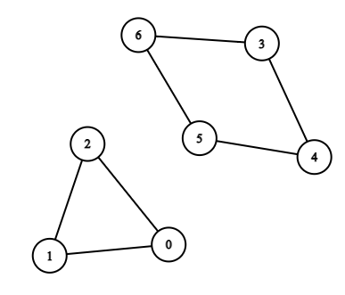
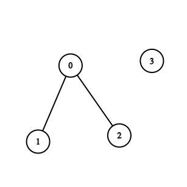

### 1. Description

There is a **bi-directional **graph with `n` vertices, where each vertex is labeled from `0` to $n - 1$. The edges in the graph are represented by a given 2D integer array `edges`, where $\text{edges}[i] = [u_{i}, v_{i}]$ denotes an edge between vertex $u_{i}$ and vertex $v_{i}$. Every vertex pair is connected by at most one edge, and no vertex has an edge to itself.

Return *the length of the **shortest **cycle in the graph*. If no cycle exists, return `-1`.

A cycle is a path that starts and ends at the same node, and each edge in the path is used only once.

### 2. Function Contract

- `n`: Input parameter.
- Returns expected result.

### 3. Examples

#### Example 1

- **Input:** $n = 7, edges = [[0,1],[1,2],[2,0],[3,4],[4,5],[5,6],[6,3]]$
- **Output:** `3`
- **Explanation:** The cycle with the smallest length is : 0 -> 1 -> 2 -> 0
#### Example 2

- **Input:** $n = 4, edges = [[0,1],[0,2]]$
- **Output:** `-1`
- **Explanation:** There are no cycles in this graph.

### 4. Constraints

- $2 \le n \le 1000$

- $1 \le \text{edges.length} \le 1000$

- $\text{edges}[i].length = 2$

- $0 \le u_{i}, v_{i} < n$

- $u_{i} \neq v_{i}$

- There are no repeated edges.