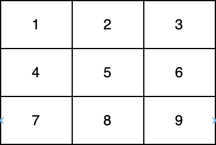

### 1. Description

You are given a 0-indexed two-dimensional integer array `nums`.

Return *the largest **prime** number that lies on at least one of the **diagonals** of *`nums`. In case, no prime is present on any of the diagonals, return* 0.*

Note that:

- An integer is **prime** if it is greater than `1` and has no positive integer divisors other than `1` and itself.

- An integer `val` is on one of the **diagonals** of `nums` if there exists an integer `i` for which $\text{nums}[i][i] = val$ or an `i` for which $\text{nums}[i][\text{nums.length} - i - 1] = val$.

In the above diagram, one diagonal is **[1,5,9]** and another diagonal is** [3,5,7]**.

### 2. Function Contract

**Inputs**

- `nums`: Input parameter (`List[List[int]]`).

**Return value**

- Returns `int`.

### 3. Examples

#### Example 1

- **Input:** `nums = [[1,2,3],[5,6,7],[9,10,11]]`
- **Output:** `11`
- **Explanation:** The numbers 1, 3, 6, 9, and 11 are the only numbers present on at least one of the diagonals. Since 11 is the largest prime, we return 11.

#### Example 2

- **Input:** `nums = [[1,2,3],[5,17,7],[9,11,10]]`
- **Output:** `17`
- **Explanation:** The numbers 1, 3, 9, 10, and 17 are all present on at least one of the diagonals. 17 is the largest prime, so we return 17.

### 4. Constraints

- $1 \le \text{nums.length} \le 300$

- $\text{nums.length} = \text{nums}_{i}.length$

- $1 \le \text{nums}[i][j] \le 4*10^{6}$
