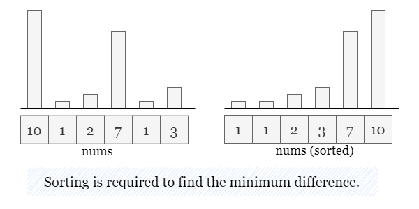
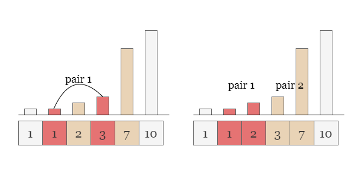
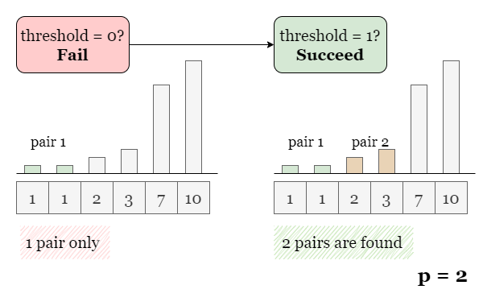
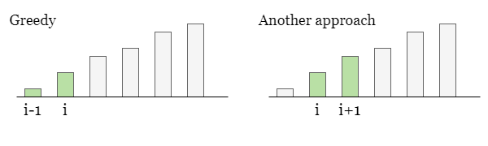
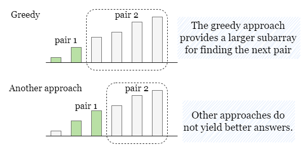

[TOC]

## Solution

---

### Overview

Since this problem involves minimizing the "maximum difference," it is necessary to sort the array beforehand. This way, we can narrow down the selection of pairs to only adjacent numbers, and avoid wasting time on incorrect choices.



As shown in the diagram below, without sorting, we might inadvertently select pairs with larger differences. By sorting the array, we eliminate such scenarios.



---

### Approach: Greedy + Binary Search

#### Intuition

> If you are not familiar with binary search, please refer to our explore cards [Binary Search Explore Card](https://leetcode.com/explore/learn/card/binary-search/). We will focus on the usage in this article and not the underlying principles or implementation details.

Since we are looking to **minimize** the maximum difference, one brute force approach is to start from a **threshold** (a maximum difference) of `0` and incrementally try all possible thresholds:

- try to find `p` pairs with a difference less than or equal to `0`.

- if not possible, try to find `p` pairs with a difference less than or equal to `1`.

- and so on, until we find a threshold that succeeds.



However, as you may have noticed, this approach requires trying a linear number of thresholds, which is inefficient.

We observe that:

- If we can find `p` pairs with a threshold of `x`, then we can certainly find `p` pairs with a threshold of $x + 1$. A trivial example would be to just use the exact same `p` pairs. As their differences are less than `x`, they must also be less than $x + 1$.

- If we cannot find `p` pairs with a threshold of `x`, then we certainly cannot find `p` pairs with a threshold of $x - 1$.

This splits the number line into two sections: one section where the task is possible, and one where the task is impossible. Therefore, we can use binary search to quickly narrow down the search space until we find the dividing point, which is the minimum threshold.

<br>

Now let's address the second question: given `threshold`, how do we determine if there exist at least `p` valid pairs?

We can solve this using a greedy approach, by iterating through the sorted `nums` and checking the difference between $\text{nums}[i]$ and $nums[i + 1]$. If the difference is less than or equal to the threshold, it means that $\text{nums}[i]$ and $nums[i + 1]$ form a valid pair, and we can directly move to $i + 2$ to find the next pair.

However, you might wonder why the greedy approach works. Is there a possibility that the greedy approach fails while another approach succeeds?



**The answer is No! Greedy approach always brings the most number of valid pairs.**

Here we provide a brief explanation: Recall that in the greedy approach, we traverse the array in ascending order. Suppose there is another alternative approach that yields more valid pairs compared to the greedy approach. We can align the arrays of these two approaches side by side and traverse them together in ascending order until the first point of divergence.

Since the greedy approach always selects the "leftmost" pair, when a divergence occurs, the pair from the alternative approach must be "to the right." Let's assume these pairs as $(i - 1, i)$ and $(i, i + 1)$ respectively. As shown in the picture above.

So far, both approaches have selected an equal number of valid pairs in subarrays `nums[0 ~ i]` and $nums[0 ~ i + 1]$, respectively. However, the remaining subarray of the greedy approach (`nums[i+1 ~ n-1]`) is longer, providing more choices. Thus the valid pairs (if exist) selected from this remaining subarray are guaranteed to be greater than or equal to the pairs from the remaining portion of the alternative approach (`nums[i+2 ~ n-1]`).



This implies that even if we do not use the greedy approach, the number of valid pairs we can select will not exceed the number of pairs selected using the greedy approach. **The greedy approach will always yield the maximum number of valid pairs.**

<br>

#### Algorithm

> Note: the typical way to calculate mid is (left + right) / 2. However, a safer way is left + (right - left) / 2. The two equations are equivalent, but the second one is safer because it guarantees no number larger than right is ever stored. In the first equation, if left + right is huge, then it could end up overflowing.

1) Define `countValidPairs(threshold)` to find the number of pairs having a threshold of `threshold` in `nums`. Let `n` be the size of `nums`.
- Set $count = 0$.
- Iterate over `nums` from $index = 0$ to $index = n - 2$. If $nums[index + 1] - \text{nums}[index] \le threshold$, increment `count` by `1`, and skip both indices. Otherwise, skip the current index.
- Return `count`.

2) Sort `nums`.

3) Initialize the searching space as $left = 0$ and $right = nums[n - 1] - \text{nums}[0]$, the maximum difference in the array.

4) While `left < right`, do the following:

5) Get the middle value as $mid = left + (right - left) // 2$.

6) Calculate the number of valid pairs with a threshold of `mid` using `countValidPairs(mid)`.

7) If $countValidPairs(mid) \ge p$, continue with the left half by setting $right = mid$. Otherwise, continue with the right half by setting $left = mid - 1$. Repeat from step 4.

8) Return `left` when the binary search is complete.

#### Implementation

```python
class Solution:
    def minimizeMax(self, nums: List[int], p: int) -> int:
        nums.sort()
        n = len(nums)

        # Find the number of valid pairs by greedy approach
        def countValidPairs(threshold):
            index, count = 0, 0
            while index < n - 1:
                # If a valid pair is found, skip both numbers.
                if nums[index + 1] - nums[index] <= threshold:
                    count += 1
                    index += 1
                index += 1
            return count

        left, right = 0, nums[-1] - nums[0]
        while left < right:
            mid = left + (right - left) // 2

            # If there are enough pairs, look for a smaller threshold.
            # Otherwise, look for a larger threshold.
            if countValidPairs(mid) >= p:
                right = mid
            else:
                left = mid + 1
        return left
```

#### Complexity Analysis

Let $n$ be the size of `nums` and `V` be the maximum value in `nums`.

* Time complexity: $O(n \cdot\log V + n \cdot\log n)$

- Sorting `nums` takes $O(n \cdot\log n)$ time.
- The right boundary of the searching space is defined as $nums[n - 1] - \text{nums}[0]$, the maximum value minus the minimum value, which is $O(V)$. Thus the binary search takes $O(\log V)$ steps.
- At each step, we need to iterate over `nums` to determine if there are at least `p` pairs, which takes $O(n)$ time. Therefore the binary search takes $O(n \cdot\log V)$ time.

* Space complexity: $O(n)$

- We only need to update several parameters, `left`, `right`, `index`, and `count`, which takes $O(1)$ space.
- Some extra space is used when we sort $\text{nums}$ in place. The space complexity of the sorting algorithm depends on the programming language.
- In python, the `sort` method sorts a list using the Timsort algorithm, which is a combination of Merge Sort and Insertion Sort and uses $O(n)$ additional space.
- In C++, the sort() function is implemented as a hybrid of Quick Sort, Heap Sort, and Insertion Sort, with worst-case space complexity of $O(\log n)$.
- In Java, Arrays.sort() is implemented using a variant of the Quick Sort algorithm which has a space complexity of $O(\log n)$.
- To sum up, the overall space complexity is $O(n)$ for Python and $O(\log n)$ for C++ and Java.

<br/>