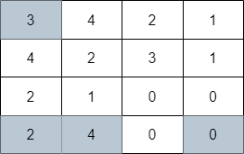
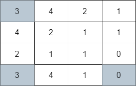
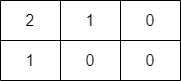

## Description

You are given a **0-indexed** `m x n` integer matrix `grid`. Your initial position is at the **top-left** cell `(0, 0)`.

Starting from the cell `(i, j)`, you can move to one of the following cells:

- Cells `(i, k)` with $j < k \le \text{grid}[i][j] + j$ (rightward movement), or

- Cells `(k, j)` with $i < k \le \text{grid}[i][j] + i$ (downward movement).

Return *the minimum number of cells you need to visit to reach the **bottom-right** cell* $(m - 1, n - 1)$. If there is no valid path, return `-1`.
### Function Contract

- `n`: Input parameter.
- Returns expected result.

### Examples
#### Example 1

- **Input:** `grid = [[3,4,2,1],[4,2,3,1],[2,1,0,0],[2,4,0,0]]`
- **Output:** `4`
- **Explanation:** The image above shows one of the paths that visits exactly 4 cells.
#### Example 2

- **Input:** `grid = [[3,4,2,1],[4,2,1,1],[2,1,1,0],[3,4,1,0]]`
- **Output:** `3`
- **Explanation:** The image above shows one of the paths that visits exactly 3 cells.
#### Example 3

- **Input:** `grid = [[2,1,0],[1,0,0]]`
- **Output:** `-1`
- **Explanation:** It can be proven that no path exists.
### Constraints

- $m = \text{grid.length}$

- $n = \text{grid}[i].length$

- $1 \le m, n \le 10^{5}$

- $1 \le m * n \le 10^{5}$

- $0 \le \text{grid}[i][j] < m * n$

- $grid[m - 1][n - 1] = 0$