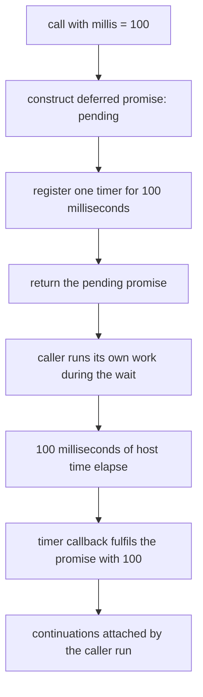

# Guided Example: Sleep

## 1. The Instance and the Outcome It Must Produce

The task asks for an asynchronous function that accepts a positive integer `millis` and stays asleep for that many milliseconds before resolving. The verified contract fixes the legal domain as $1 \le millis \le 1000$, and it explicitly notes that a *minor* deviation from `millis` in the actual sleeping duration is acceptable. "Asynchronous" is the load-bearing word: the function must hand control back to its caller immediately rather than hold the program still for the requested duration.

The representative instance for this lesson is the first authored sample, `millis = 100`, together with the two domain boundaries `millis = 1` and `millis = 1000`, which are what separate a real timer from a hardcoded pause. The authored cases expect the observed result to equal the requested duration for every value in the domain, so the delivered payload and the requested delay are the same number here.

| Element of the instance | Value | Obligation it creates |
|---|---|---|
| Requested delay `millis` | `100` | The caller must not observe completion before the delay elapses |
| Returned object | a promise | The caller attaches a continuation instead of blocking |
| State at return time | pending | No continuation may have run yet |
| Settled value | `100` | The delivered payload equals the requested duration |
| Minimum legal delay | `1` | Milliseconds are the unit; there is no whole-second rounding |
| Maximum legal delay | `1000` | The delay is finite and far below the host timer ceiling |

## 2. The Two Obligations, and the State They Force

A correct answer satisfies two obligations at once, and each one alone is easy to fake:

1. **Latency obligation.** The completion signal must not be delivered before the requested duration has elapsed on the host's monotonic clock. Delivering it instantly satisfies every type check and fails the problem.
2. **Non-blocking obligation.** The caller must regain control of its own instruction stream immediately, so that other work scheduled on the same event loop can proceed during the wait.

Only one arrangement satisfies both: a *deferred* promise — a promise whose settlement capability is captured separately from the promise object — plus a host timer that later invokes that captured capability. The promise gives non-blocking behavior, and the timer gives the delay.

| Symbol | Meaning | Value for this instance |
|---|---|---|
| $t_0$ | Instant the function is called | some monotonic reading |
| $d$ | Requested delay `millis` | $100$ |
| $t_r$ | Instant the promise settles | $t_0 + d + \epsilon$, with $\epsilon \ge 0$ small |
| $\epsilon$ | Tolerated scheduling overshoot | nonzero but minor |
| $p$ | The returned promise | pending at $t_0$, fulfilled at $t_r$ |

The promise itself is a two-state object as far as this task is concerned: it begins *pending*, and it ends *fulfilled with the delay value*. It never rejects inside the legal domain, because nothing in the contract asks for a failure path for a delay between $1$ and $1000$ milliseconds.

## 3. Step-by-Step Execution of `millis = 100`

The trace below follows one call from the instant it is made to the instant the caller's continuation observes the result. "Loop time" is the event loop's own progress; "host time" is the elapsed monotonic reading.

| Step | Event-loop action | Promise state | Host time elapsed | Caller's position |
|---|---|---|---|---|
| 1 | Function entered with `millis = 100` | not yet created | $0$ ms | inside the call |
| 2 | Deferred promise constructed; settlement capability retained | pending | $\approx 0$ ms | inside the call |
| 3 | One timer registered for $100$ ms against the timer queue | pending | $\approx 0$ ms | inside the call |
| 4 | Promise returned to the caller | pending | $\approx 0$ ms | receives the promise |
| 5 | Caller attaches a continuation and continues its own work | pending | $\approx 0$ ms | running other tasks |
| 6 | Event loop drains other ready callbacks | pending | varying | suspended |
| 7 | $100$ ms of host time elapse; the timer entry becomes due | pending | $\ge 100$ ms | suspended |
| 8 | Timer callback runs; the retained capability is invoked with `100` | fulfilled with `100` | $\ge 100$ ms | suspended |
| 9 | Continuations attached to the promise are queued and run | fulfilled with `100` | $\ge 100$ ms | observes `100` |

Two details in the trace are easy to miss.

First, steps 4 and 5 happen in the same synchronous stretch. A caller that checks the promise's state on the very next line of its own code always sees *pending*, because the timer cannot fire inside that stretch — the event loop has not regained control.

Second, steps 8 and 9 are two different queues. The timer callback is a *macrotask*; the continuations attached to the promise are *microtasks* that are drained after the currently running macrotask completes. So a chain of two continuations registered on the promise runs in order, before the loop proceeds to the next macrotask, but never before the timer callback itself.

## 4. The Deadline Invariant and Why the Reasoning Is Correct

**Invariant (no early settlement).** For every call with delay $d$ in the legal domain, the returned promise is still pending at the moment the call returns, and it cannot become fulfilled before at least $d$ milliseconds of host time have elapsed since the call, up to the tolerated minor deviation.

The argument has three parts.

- **The promise cannot settle early through the caller's code.** The only settlement capability in existence is the one captured in step 2, and it lives inside the timer callback's closure. Nothing the caller receives exposes it: the caller holds the promise, not the capability. So the caller has no way to force settlement, and the honest answer to "can it complete instantly?" is no.

- **The timer cannot fire early.** The host guarantees that a timer registered with delay $d$ is not dispatched before $d$ milliseconds of monotonic time have passed, and that wall-clock adjustments do not move that deadline backwards. This is exactly the guarantee the problem's note acknowledges when it tolerates a minor *overshoot*: $\epsilon \ge 0$ is permitted, $\epsilon < 0$ is not. Because the delay is measured against a monotonic source, the invariant survives a system clock correction occurring during the wait.

- **The promise cannot stay pending forever.** The delay is finite and inside the legal domain, and the domain ceiling of $1000$ milliseconds is many orders of magnitude below the host timer ceiling of $2^{31} - 1$ milliseconds (roughly $24.8$ days), so the registered delay is never clamped into an unintended longer wait or dropped. Eventual dispatch therefore follows, making the method *complete*: every legal input produces a settlement, not merely a promise that happens never to be broken.

The delivered payload closes the last gap. The value handed to the retained capability is the requested duration itself, so the observable result of the call equals `millis` for every case the package authors — `1`, `10`, `37`, `100`, `200`, and `1000` all come back unchanged.

There is one place where a careless reading of the contract could bite. The statement permits resolving with *any* value, so a correct-but-different payload would still satisfy the prose; the authored cases nevertheless compare the observed result against the requested duration, which is why the duration is the payload that reproduces every expected output. Correctness here means matching the authored evidence, not merely matching the loosest reading of the sentence.

## 5. Boundary and Domain Analysis

The legal domain is narrow, and every boundary in it probes a distinct failure mode.

| Input | What it probes | Required behavior | Why it matters |
|---|---|---|---|
| `millis = 1` | The minimum legal delay | Fulfils after at least $1$ ms with value `1` | Proves the wait is driven by the argument and not by a constant |
| `millis = 10` | A short delay | Fulfils with `10` | Short waits still yield to the loop rather than resolving inline |
| `millis = 37` | An odd duration | Fulfils with `37` | No rounding to tens or to whole seconds |
| `millis = 100` | The representative instance | Fulfils with `100` | The sample the lesson traces |
| `millis = 200` | A second sample with a different duration | Fulfils with `200` | Guards against reusing another call's cached settlement |
| `millis = 1000` | The maximum legal delay | Fulfils with `1000` | The ceiling is still far below the host timer ceiling, so no clamping |
| `millis = 0` | Outside the domain | Undefined by the contract | A zero delay is the one value whose "no early settlement" reading is vacuous, so it is excluded rather than special-cased |
| `millis > 1000` | Outside the domain | Undefined by the contract | No behavior should be invented for it |

The important consequence: since the domain excludes both $0$ and any negative value, the method needs no guard clause, no rejection path, and no branch for a "degenerate" delay. Adding one would be inventing semantics the problem never requested.

## 6. Traps, Rejected Alternatives, and Material Edge Cases

| Tempting shortcut | Why it fails |
|---|---|
| Return an already-fulfilled promise with the delay as the payload | Passes type checks and every payload comparison, yet the caller observes the result at $\approx 0$ ms, which violates the latency obligation entirely |
| Block the thread, spinning on a clock reading until $d$ milliseconds pass | The result arrives late by whatever the loop stalled, blocks every other pending callback, and defeats the concurrency the method exists to provide |
| Sleep for a fixed constant and ignore the argument | Collapses on `millis = 1` and `millis = 1000`; endpoints of a legal domain are exactly where constants are detected |
| Keep one settlement promise at module scope and return it to every caller | The first call settles it; later calls with different durations receive an already-settled promise and observe the first duration |
| Resolve with the wall-clock timestamp of the timer firing instead of the duration | The clock reading is a large ever-changing number, not `100`, so the payload comparison fails |
| Use a polling interval that repeatedly checks whether the deadline has passed | Adds wakeups, overshoots by up to one polling period, and turns a constant-cost wait into a loop whose iteration count grows with $d$ |
| Reject when the delay is invalid | The domain contains no invalid delay, and the judged cases never expect a rejection |
| Round the delay to a whole second | Destroys the meaning of the millisecond unit that the whole problem is stated in |

**Material edge cases.** A zero delay and a negative delay are outside the contract, so they are not edge cases to handle but inputs to exclude. An enormous delay is likewise outside the contract, which is why timer-range clamping is a fact worth knowing rather than a branch worth writing. Finally, note what the invariant does *not* claim: it does not promise the timer fires at exactly $t_0 + d$. It promises it does not fire *before* that instant, and the problem's own note confirms that a minor overshoot is acceptable. An implementation that tried to guarantee an exact instant would be solving a stricter problem than the one posed.

## 7. Time and Auxiliary Space Complexity

**Scheduling work: $O(1)$ time.** The call performs a constant amount of work — construct one deferred promise, register one timer, return. None of that work depends on the value of `millis`, so scheduling `millis = 1000` costs exactly as much computation as scheduling `millis = 1`.

**Elapsed latency: $\Theta(d)$ wall-clock time, $O(1)$ processor time.** The delay is *waiting*, not computation. The interval between the call and settlement grows linearly in $d$, because the host is obliged to respect the registered deadline; the processor cost during that interval is zero, since the event loop is free to run other work. This distinction is the whole point of the asynchronous form: an implementation that made the processor cost $\Theta(d)$ — a spin loop of roughly $d$ iterations — would be strictly worse and would also break the non-blocking obligation.

**Auxiliary space: $O(1)$ per call.** One pending promise record and one timer registration are live at a time, independent of `millis`. No buffer, table, or schedule of length $d$ is allocated, and no recursion depth is created. If $k$ sleep calls are outstanding simultaneously, the live registrations number $k$, i.e. $O(k)$ in that count rather than in the delay — the space depends on how many waits overlap, never on how long each one lasts.

The temptation to make the wait "proportional to the delay" is therefore the exact opposite of what the problem rewards: the required behavior is a constant-cost registration that hands a linear amount of wall-clock latency to the host timer subsystem.
