# Guided Example: Cache With Time Limit

## 1. The Instance: An Overwrite That Must Outlive Its Predecessor's Deadline

The task asks for a class named `TimeLimitedCache` that stores key-value pairs where every key privately owns a *time until expiration*, plus the three operations `set`, `get`, and `count`. The contract's limits are $0 \le key, value \le 10^{9}$, $0 \le duration \le 1000$, at most $100$ actions, and time delays bounded by $1450$ milliseconds, with the first action always being the construction of the cache at $t = 0$.

The representative instance is the package's overwrite sample, because it contains the exact hazard the problem is built around: a first write with a *short* lifetime is replaced by a second write with a *long* lifetime, and the replacement must survive the original deadline.

| Step | $t$ (ms) | Action | Arguments | Required result |
|---|---|---|---|---|
| 1 | 0 | construct | — | `null` |
| 2 | 0 | `set` | `key = 1`, `value = 42`, `duration = 50` | `false` |
| 3 | 40 | `set` | `key = 1`, `value = 50`, `duration = 100` | `true` |
| 4 | 50 | `get` | `key = 1` | `50` |
| 5 | 120 | `get` | `key = 1` | `50` |
| 6 | 200 | `get` | `key = 1` | `-1` |
| 7 | 250 | `count` | — | `0` |

The decisive moment is step 4. At $t = 50$ the *original* write reaches its deadline, yet the answer the caller must receive is `50` — the second write's value — not `-1`. Step 5 then confirms the second write is still alive at $t = 120$, five milliseconds before its own deadline at $t = 140$. A cache that expires key 1 at $t = 50$ produces `-1` at both steps 4 and 5 and fails the sample.

## 2. The Two Facts Every Entry Owns

A correct cache stores two distinct facts per key, and they are not interchangeable:

| Fact | What it answers | What breaks if it is missing |
|---|---|---|
| The payload `value` | What `get` must return while the entry is alive | `get` cannot answer at all |
| The expiration registration | When the entry must stop being reachable | The key lives forever; `count` drifts upward and never returns to `0` |

The value alone gives a permanent dictionary, and the registration alone gives an eviction schedule with nothing to return. The design that satisfies the contract keeps both together in one record per key, with the *key* itself as the identity of the record. Crucially, the registration is per key and never shared: two keys with equal values, or a single key rewritten twice, must never share one expiration.

Let $k$ denote the number of keys that are currently alive. The state of the cache is then the map of live records together with at most one pending expiration per live key — a claim that section 4 proves rather than assumes.

## 3. Step-by-Step Trace of the Chosen Instance

The trace records, after each action, what the structure holds for key $1$, when its pending expiration is due, and what the caller receives.

| Step | $t$ | Action | Value stored for key 1 | Pending expiration for key 1 | Live keys after the step | Returned |
|---|---|---|---|---|---|---|
| 1 | 0 | construct | no record | none | 0 | `null` |
| 2 | 0 | `set(1, 42, 50)` | `42` | registration $A$ due at $t = 50$ | 1 | `false` |
| 3 | 40 | `set(1, 50, 100)` | `50` (replaces `42`) | $A$ cancelled; registration $B$ due at $t = 140$ | 1 | `true` |
| 4 | 50 | `get(1)` | `50` | $B$ still pending | 1 | `50` |
| 5 | 120 | `get(1)` | `50` | $B$ still pending | 1 | `50` |
| 6 | 140 | (expiration $B$ fires) | record for key 1 removed | none | 0 | — |
| 7 | 200 | `get(1)` | no record | none | 0 | `-1` |
| 8 | 250 | `count()` | no record | none | 0 | `0` |

```mermaid
flowchart LR
    accTitle: Expiration replacement on an overwrite
    accDescr: A first write registers an expiration due at time 50 milliseconds, the overwrite at time 40 cancels that registration and installs a second one due at time 140 milliseconds, and only the surviving registration removes the key.
    A["t = 0: store key 1 with value 42 for 50 ms"] --> B["registration A pending, due at t = 50"]
    B --> C["t = 40: store key 1 with value 50 for 100 ms"]
    C --> D["cancel registration A"]
    D --> E["registration B pending, due at t = 140"]
    E --> F["t = 140: key 1 removed"]
```

Three observations from the trace carry the lesson.

- **The overwrite is a replacement, not an accumulation.** Step 3 does not create a second record for key 1; the payload is overwritten in place, so `count` stays at `1` rather than becoming `2`. The map key is the identity of the record, which is why the contract can say both the value and the duration are overwritten together.
- **The flag is sampled at the instant of the call.** At step 3 the previous record is still alive, so the answer is `true`; at step 2 there was no previous record, so the answer is `false`. Sampling membership *before* installing the new record is the only way to obtain those two different answers, because after installation the key is present in both cases.
- **The expiration at step 6 is invisible to the caller.** Nothing in the required output reports the eviction; it shows up only as `-1` at step 7 and `0` at step 8. Eviction is an internal obligation that the observable answers must already reflect.

## 4. Invariants and Why the Reasoning Is Correct

Three invariants together make the trace above the *only* possible behavior of a correct cache.

**Invariant 1 (liveness).** At every point where no expiration callback is pending execution, a key is present in the map exactly when its deadline lies in the future. Consequently `get` answers with the stored value for a live key and with the sentinel `-1` otherwise, and `count` equals the number of live keys — not the number of keys ever inserted.

**Invariant 2 (at most one pending expiration per key).** For any key, the number of registered expirations that have not yet fired and have not been cancelled is at most one. The proof is a direct induction over the actions: initially no key has a registration. A `set` on a key with no live registration installs exactly one, so the count becomes one. A `set` on a key with a live registration cancels it before installing its own, so the count returns to one. No other action installs registrations. The invariant therefore holds after every `set`, which is the only way registrations come into existence.

**Invariant 3 (each key expires on its own last deadline).** By Invariant 2, the sole surviving registration for a key is the one installed by the most recent `set` for that key, and its delay was measured from that `set`. The key is therefore removed at exactly the deadline of the last write. For the instance above: the removal at $t = 140$ comes from registration $B$, whose $100$ milliseconds were measured from $t = 40$, so key 1 remains reachable for the full duration the second write requested. The requirement that a key become inaccessible *once the duration has elapsed* is met without any clock comparison at query time.

The correctness argument is completed by the return value. `set` must return `true` exactly when the same unexpired key already exists. By Invariant 1, "unexpired key exists" is equivalent to "the key is currently in the map", because an expired key has already been removed by its own registration. Evaluating that membership before the write, as the trace shows at steps 2 and 3, yields `false` then `true`.

That same equivalence disposes of a case worth naming explicitly: reinserting a key that already expired must return `false`, not `true`. The authored trial `trial-reinsert-expired-key` writes key 4 with a duration of $20$ ms at $t = 0$, then writes it again at $t = 35$ with a duration of $40$ ms, and expects `false`. The first registration fired at $t = 20$ and removed the record, so at $t = 35$ there is no unexpired predecessor to report — the second write is an insertion, not an overwrite, even though the same key was written before.

## 5. The Hazard This Instance Exposes: A Stale Expiration

Suppose the payload is overwritten but the previous expiration is left pending. Step 4 of the trace then fails, and the failure is silent — the values look plausible, they are simply the wrong ones.

| Variant | At $t = 40$ | `get(1)` at $t = 50$ | `get(1)` at $t = 120$ | `count()` at $t = 250$ | Verdict |
|---|---|---|---|---|---|
| Overwrite without cancelling the earlier expiration | value replaced, two registrations pending | `-1` | `-1` or `50` depending on ordering | `0` by accident | Wrong: the second write is destroyed by the first write's deadline |
| Overwrite with the earlier expiration cancelled | value replaced, one registration pending | `50` | `50` | `0` | Correct |

The same hazard appears in the authored trial `trial-stale-timer-cancelled` with a different timing: key 5 is written with value `10` and a duration of $30$ ms at $t = 0$, then rewritten with value `11` and a duration of $80$ ms at $t = 20$. The abandoned registration becomes due at $t = 30$ and would remove the record that the second write installed at $t = 20$. The expected answers are `11` at $t = 40$ and `-1` at $t = 110$: the record must live from $t = 20$ to $t = 100$, exactly the lifetime the second write asked for.

The general statement is worth keeping: an eviction is only sound when the eviction belongs to the write it was created for. Cancelling the predecessor restores that one-to-one correspondence between the surviving registration and the current record.

## 6. Boundary Conditions and Material Traps

| Input or situation | What it probes | Required behavior | Why it is easy to get wrong |
|---|---|---|---|
| `duration = 0` | A deadline at the current instant | The entry is still readable during the turn that created it, and gone afterwards | A zero delay is queued, not executed inline, so the record is momentarily alive past its nominal deadline |
| The same key written twice inside one turn | Value and duration overwritten together | One record, second value, second deadline | Leaving the first deadline in place expires the second value too early |
| `key = 0` | The lower bound of the key domain | Treated as an ordinary key | A truthiness test on the key would misclassify it as absent |
| `value = 0` | The lower bound of the value domain | Stored and returned as `0` | Using a falsy test to decide "no entry" would report `-1` for a legitimate zero |
| Reinserting a key after its expiration | Insertion versus overwrite | `set` returns `false` | The key name is familiar, but no unexpired record exists |
| `count()` with every record expired | Empty-state reporting | `0`, never a missing value | Counting keys ever inserted instead of live records drifts upward |
| `duration = 1000`, the domain ceiling | The longest legal lifetime | Held for the full duration | Safe on any host, since the delay is far below the timer ceiling |
| Expiration firing while the event loop is busy | Late callback delivery | No stale answer may be returned | A record can outlive its deadline in wall-clock terms if only the callback decides liveness |

| Tempting shortcut | Why it fails |
|---|---|
| Store only values and delete a key from inside its expiration callback without ever cancelling one | The first write's callback removes the second write's record — the failure traced in section 5 |
| Delete by comparing stored values to find the record to evict | Two keys may legitimately hold equal values; an eviction by value can remove a different, still-live key |
| Test membership after installing the record to compute the return value | The key is present immediately after installation, so the answer becomes `true` for a first write at $t = 0$ |
| Keep a deadline per key and check it lazily but never register expirations | Queries stay correct, yet `count` can no longer be answered by counting records, and expired records accumulate in memory without bound |
| Trust the callback alone, without recording the deadline | A delayed callback leaves an expired record visible, so `get` can answer with a value that the contract already considers inaccessible |
| Store one shared expiration for the whole cache | Per-key lifetimes are the entire specification; a shared deadline cannot express them |
| Return the stored record or the registration from `set` | The contract asks for `true` or `false`, which the harness compares directly |

The zero-duration row deserves a second look, because it is where Invariant 1 appears to strain. The authored trial `trial-zero-duration` writes key 7 with value `9` and a duration of $0$ at $t = 0$, and then, still at $t = 0$, expects `get` to return `9` and `count()` to return `1`; at $t = 10$ it expects `-1`. Nothing is inconsistent: the expiration is *queued* against the event loop rather than executed inline, so during the current turn the record is still present, and by the next turn it is gone. Invariant 1 is stated at the granularity of turns for exactly this reason — a deadline that coincides with the present instant is settled by the end of the turn, not inside it.

## 7. Time and Auxiliary Space Complexity

| Operation | Time | Why |
|---|---|---|
| Construction | $O(1)$ | One empty map is created |
| `set` | $O(1)$ expected | One membership probe, at most one cancellation, one registration, one insertion — all independent of how many keys are alive |
| `get` | $O(1)$ expected | One membership probe plus one value read; no scan over other keys |
| `count` | $O(1)$ | The number of live records is maintained as the size of the map, so no sweep is needed |

**Time.** With $n$ actions in total, the expected running time is $O(n)$: each action performs a constant number of hash-map operations and at most one host-timer operation, all of which are $O(1)$ expected. The word *expected* matters — the constant-factor behavior of the underlying hash map is amortized, while the timer registry operations are constant-time bookkeeping. No operation's cost depends on the number of live keys $k$, which is what keeps `count` cheap: the cache maintains liveness as a maintained quantity rather than recomputing it.

**Auxiliary space.** The cache holds $O(k)$ live records for $k$ simultaneously alive keys, and by Invariant 2 it holds at most one pending expiration per live key. Space is therefore $O(k)$ in the live state, plus $O(1)$ bookkeeping for the map itself. The cancellation performed on every overwrite is what keeps this bound tight in the presence of churn: without it, abandoned registrations would accumulate across writes to the same key, so a sequence of $n$ writes to a single key would leave $O(n)$ dead registrations behind even though only one record is ever visible. Cancelling on overwrite makes the number of pending expirations track the number of live keys rather than the number of writes, so both the memory footprint and the timer queue stay proportional to the live state.
