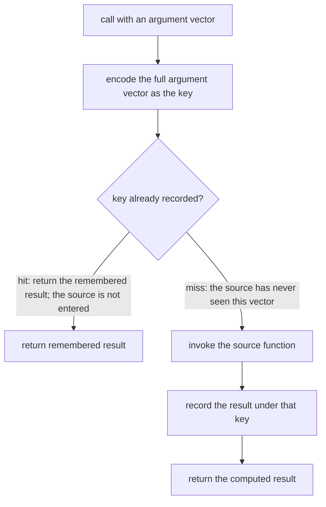

# Guided Example: Memoize

## 1. The Instance: A Repeated Argument Vector That Must Not Reach the Source Again

Given a function, the task is to produce a memoized version of it: a function that is never allowed to call the original function twice with the same inputs, returning the remembered value instead. Only three source functions can appear — a two-integer `sum`, a `fib` defined by `fib(n) = 1` for $n \le 1$ and `fib(n - 1) + fib(n - 2)` otherwise, and a `factorial` defined by $n! = 1$ for $n \le 1$ and $(n - 1)! \cdot n$ otherwise. The contract fixes $0 \le a, b \le 10^{5}$ for the two-argument source, $1 \le n \le 10$ for the single-argument sources, and up to $10^{5}$ actions, each either a `call` or a `getCallCount` query.

The representative instance is the first authored sample, which drives `sum` through a repeat, a call-count query, a fresh argument vector, and a second call-count query.

| Step | Action | Arguments | Required result | Why it is in the instance |
|---|---|---|---|---|
| 1 | `call` | `(2, 2)` | `4` | First sighting of this argument vector |
| 2 | `call` | `(2, 2)` | `4` | The repeat that must not reach the source |
| 3 | `getCallCount` | — | `1` | Proves the repeat was served from memory |
| 4 | `call` | `(1, 2)` | `3` | A genuinely new argument vector |
| 5 | `getCallCount` | — | `2` | Proves only the new vector reached the source |

The observable evidence lives entirely in steps 3 and 5. Steps 1, 2 and 4 return the same numbers whether or not anything is remembered, so the count is the only channel through which the required behavior is visible. That is why `getCallCount` is an action of the problem rather than a debugging convenience.

## 2. The State a Memoized Function Must Maintain

A memoized function is a wrapper around the source function, and the whole of its state is one association from an argument vector to a remembered result.

| Component | What it holds | Why it must exist |
|---|---|---|
| The source function | The original computation | On a miss, the wrapper has no way to produce a value without it |
| A private cache | Remembered results, indexed by argument vector | This is the only thing that prevents the second source call |
| The lookup key | A canonical encoding of the full argument vector | Two calls match exactly when their encodings match; the encoding defines the notion of "same inputs" |

Two properties of the key are load-bearing, and both are decided by the statement rather than by taste.

**The key must be injective on argument vectors.** Memorizing the arguments `(1, 2)` and the arguments `(12)` must not collide, so a key built by gluing the arguments together without structure is unsound. The canonical encoding of the entire argument list — including its separators and its length — removes that ambiguity.

**The key must preserve order.** The contract states directly that a value cached for `(b, a)` with $a \neq b$ cannot be reused for `(a, b)`: the vectors `(3, 2)` and `(2, 3)` are two separate keys even though `sum` returns the same number for both. Argument order is part of the identity of an input, and a key that sorts or otherwise normalizes the arguments is unsound.

The cache belongs to one application of the memoization to one source function. Two independently memoized functions must not share a cache, or a value computed by one source could be returned for a call routed to the other.

## 3. Step-by-Step Trace of the Chosen Instance

Let the cache map an encoding to a remembered result. The trace shows the cache after each step, whether the source function was entered, and what the reported count becomes.

| Step | Action | Encoding probed | Cache before the step | Outcome | Source entered | Count after | Returned |
|---|---|---|---|---|---|---|---|
| 1 | `call(2, 2)` | encoding of `(2, 2)` | empty | miss | yes, with `(2, 2)` | 1 | `4` |
| 2 | `call(2, 2)` | encoding of `(2, 2)` | holds `4` for that encoding | hit | no | 1 | `4` |
| 3 | `getCallCount` | — | unchanged | query | no | 1 | `1` |
| 4 | `call(1, 2)` | encoding of `(1, 2)` | holds only the `(2, 2)` entry | miss | yes, with `(1, 2)` | 2 | `3` |
| 5 | `getCallCount` | — | two entries | query | no | 2 | `2` |

The trace makes three structural facts visible.

- **Only step 4 grows the state.** The cache gains an entry exactly on a miss, and a miss happens exactly when the encoding is absent. The cache is therefore a complete record of every distinct argument vector the wrapper has been asked about.
- **A hit is indistinguishable from a recomputation to the caller.** Step 2 returns `4` with the same shape and value as step 1; the difference between the two paths is only the counter, which is what the problem instrumented.
- **The two `sum` vectors are distinct entries even though the values coincide.** Encoding `(2, 2)` and `(1, 2)` separately is not redundancy: the identity being tracked is the argument vector, not the answer. This is precisely the distinction the contract draws for `(3, 2)` versus `(2, 3)`.

## 4. Invariants and Why the Reasoning Is Correct

**Invariant (cache completeness).** After every action, the cache contains an entry for exactly those argument vectors that the wrapper has already forwarded to the source function, and the remembered value equals what the source returned for that vector. The invariant holds initially (the cache is empty and no vector has been forwarded), and each miss adds exactly the vector that was just forwarded together with the value the source produced, while hits and count queries change nothing.

From that invariant, both directions of the specification follow without further argument.

**Soundness — a hit is safe.** If the encoding is present, the invariant says the source was already entered with this very argument vector and produced the remembered value. The source functions here are pure: `sum` depends only on its two integers, and `fib` and `factorial` are ordinary mathematical functions of their single argument, so a second entry with the same vector would return the same value. Returning the remembered value therefore agrees with the source on every hit. Purity is exactly what makes reuse valid; if the source could consult or mutate outside state, remembering a result would change the answer rather than only its cost.

**Minimality — a miss is necessary.** If the encoding is absent, the invariant says this vector has never been forwarded, so the wrapper has no remembered value and must enter the source to obtain one. No call is forwarded more than once per distinct argument vector, so the count reported by `getCallCount` equals the number of distinct argument vectors seen so far, which is exactly the number the samples require: one after steps 1–3, two after step 4.

**Determinism of the decision.** Encoding is a function of the argument vector alone, so the same vector always produces the same key and the same hit-or-miss outcome, independent of the order in which earlier vectors arrived. The argument-order sample illustrates both halves at once: the vectors `(3, 2)`, `(2, 3)` and `(3, 2)` produce values `5`, `5`, `5` but a final count of `2`, because the third call is a hit on the first vector's entry while the second call, with the same two numbers in the other order, is a genuine miss.

One further consequence deserves emphasis because it is where most incorrect attempts fail. The wrapper must decide by *membership*, not by the truthiness of the remembered value. The authored trial `trial-zero-result` calls `sum` twice with `(0, 0)`, expects `0` both times, and expects a count of `1`. Since $0 \le a, b \le 10^{5}$, the argument `0` and the result `0` are both legal, and a remembered `0` is a perfectly good remembered value that happens to be falsy. Testing whether the remembered value is truthy would treat that entry as missing, enter the source a second time, and report a count of `2`.

## 5. Boundary Conditions and Domain Analysis

| Situation | What it probes | Required behavior | Reasoning |
|---|---|---|---|
| `sum` with `(2, 2)` twice | Identical vector | Second call is a hit | Sample 1, traced above |
| `sum` with `(3, 2)`, `(2, 3)`, `(3, 2)` | Order sensitivity | Count ends at `2` | The first and third calls share a vector; the second does not |
| `sum` with `(0, 0)`, `(0, 0)` | Falsy argument and falsy result | Count is `1`, both calls return `0` | Membership, not truthiness, identifies a hit |
| `factorial` with `(2)`, `(3)`, `(2)` | Independent single-argument vectors | Count is `2` after the third call | Each distinct argument is its own key |
| `factorial` with `(1)`, `(10)`, `(1)`, `(10)` | A boundary argument and a larger one | Count is `2`; results `1` and `3628800` | The base case $n \le 1$ is an ordinary cached input, not a reason to skip caching |
| `fib` with `(5)` alone | First sighting | Returns `8`, count `1` | One forwarded call for one new vector, regardless of the recursion inside the source |
| `fib` with `(10)`, `(9)`, `(10)` | A repeat around a different argument | Returns `89`, `55`, `89`; count `2` | Repeats are hits even when interleaved with other vectors |
| Shorter argument vector on the two-argument source | Arity | A one-element vector is its own key | Argument count is part of the vector's identity |
| Up to $10^{5}$ actions | Sustained lookups | Each miss and hit is expected constant time | A linear scan per call would make the total work quadratic |

The last row is the reason the task is worth stating as a problem: with up to $10^{5}$ actions, the difference between a constant-time membership probe and a scan over remembered vectors is the difference between a linear and a quadratic total cost.

## 6. Traps and Rejected Alternatives

| Tempting shortcut | Why it fails |
|---|---|
| Decide a hit by whether the remembered value is truthy | A remembered `0` — legal because arguments and results may be `0` — is treated as absent, so `(0, 0)` is forwarded twice and the count becomes `2` instead of `1` |
| Glue arguments into a key without separators or length | The vectors `(1, 2)` and `(12)` collide, so a value computed for one is returned for the other |
| Sort or otherwise normalize the arguments in the key | The contract explicitly requires `(3, 2)` and `(2, 3)` to be separate calls; normalization merges them and the count drops to `1` |
| Cache inside the source function instead of the wrapper | The source may be shared or replaced between wrappers; the contract's guarantee is about the returned function's behavior |
| Share one cache across every memoized function | A result from one source can be returned for a call that belongs to another |
| Record the entry before computing the value | If the source throws, an entry exists for a value that was never produced, and later calls report a remembered result that the source never returned |
| Forget to record on a miss | Every call becomes a miss, and the reported count equals the number of calls rather than the number of distinct vectors |
| Trim or bound the cache to save memory | Every distinct vector must stay memoized; evicting an entry causes a repeat to reach the source and breaks the guarantee, not merely the performance |
| Count wrapper invocations instead of source invocations | The count would include hits, so step 3 of the trace would report `2` instead of `1` |

**Material edge cases.** The two scalar arguments are allowed to be `0`, so neither a zero argument nor a zero result may be used as an absence marker. The single-argument sources have $1 \le n \le 10$, so the recursion terminates quickly and every distinct argument in that range is cacheable. Nothing in the statement allows the cache to be cleared or to grow a limit, which is why an eviction policy is not a permitted optimization here — the guarantee is about *never* calling the source twice for the same inputs.

## 7. Time and Auxiliary Space Complexity

Let $n$ be the number of actions and $d$ the number of distinct argument vectors observed.

| Aspect | Cost | Derivation |
|---|---|---|
| Encoding one argument vector | $O(1)$ | The sources take at most two scalars, so the encoding is built from a fixed-size argument list |
| Probing the cache | $O(1)$ expected | One hash-map membership test on the encoding |
| A hit | $O(1)$ expected | The remembered value is returned without entering the source |
| A miss | $O(1)$ expected plus the cost of the source itself | The source is entered exactly once for that vector; for `fib` that cost is whatever the source's own recursion requires |
| Total over $n$ actions | $O(n)$ expected, plus the distinct source computations | At most $n$ probes and at most $d \le n$ forwarded calls |
| Auxiliary space | $O(d)$ | One entry per distinct argument vector, each of constant size |

**Time.** Each action costs an expected constant amount of bookkeeping work, so the memoized layer never becomes the bottleneck: the cache reduces the number of source computations from "one per call" to "one per distinct argument vector", and the sample's counts are precisely that quantity. Whether the saving is large depends on the source, which is the point of memoization — for a source with an expensive recurrence, replacing repeated evaluation with a constant-time probe is the difference between exponential and linear behavior in the number of calls; for a source as cheap as `sum`, the wrapper is roughly cost-neutral per call and the observable effect is the reported count.

**Auxiliary space.** The cache holds one entry per distinct argument vector, so its size is $O(d)$, bounded by the number of actions and therefore by $10^{5}$ entries in the worst case. Each entry is a constant-size pair of a key and a value, and no other state is retained: the wrapper needs no history, no ordering, and no counters of its own. The count that `getCallCount` reports is not maintained by the wrapper at all — it is a property of the source, which the wrapper affects only by choosing not to enter it.
